软工考试范围
选择题20分10题
名词解释12分4题
简答题30分4题
分析设计题38分

简答题和分析设计题范围: 

- [x] 过程模型
- [x] uml图
- [x] 数据字典
- [x] [判定表](# 三. 判定表)
- [ ] 软件测试策略
- [ ] 软件体系结构
- [ ] 基本路径测试
- [ ] 评审技术
- [ ] 挣值分析
- [ ] 风险管理

[TOC]

# 简答&分析题

## 一. 过程模型

> 一些概念
>
> 1. 过程框架：过程框架是一个广泛的概念，指的是一个通用的、可适应多个领域的过程的结构化框架。它为开发者提供了在不同领域或项目中构建过程的通用框架。
> 2. 过程模型：过程模型是软件工程中用于表示和描述软件开发过程的抽象化的、结构化的框架。过程模型是一个具体的软件开发方法论或流程，如瀑布模型、迭代模型、敏捷模型等。
> 3. 过程模式：通用的、在多个软件项目中可重复应用的软件开发过程的通用化描述

### 1.1 通用过程模型

通用过程框架定义了5种框架活动: 沟通, 策划, 建模, 构建, 部署

软件过程示意图: 从外到内: 软件过程, 过程框架, 普适性活动, 框架活动, 动作, 任务集

- 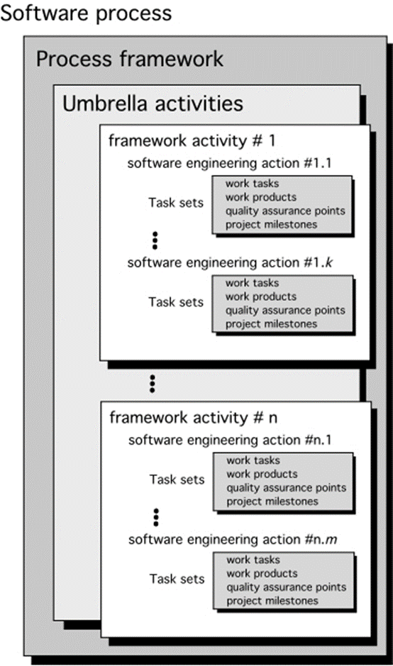 

#### 过程流

==过程流==: 描述了在执行顺序和执行时间上如何组织框架中的活动、动作和任务

分为: 

1. 线性: 字如其名
   - 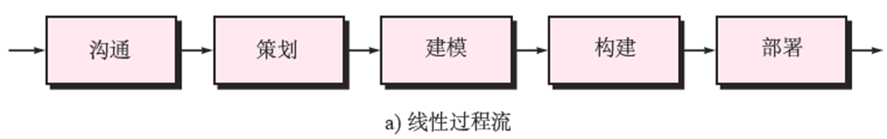 
2. 迭代: 在执行下一个活动前重复执行之前的一个或多个活动
   -  
3. 演化: 采用循环的方式执行各个活动，每次循环都能产生更为完善的软件版本（增量交付）
   -  
4. 并行: 将一个或者多个活动与其他活动并行执行
   -  

### 1.2 惯用过程模型

> ==惯用过程模型== (==软件生存周期模型==)
>
> - **目标**: 使软件开发更加有序
> - 所有的软件过程模型都支持通用框架活动，但是每一个**模型都对框架活动有不同的侧重**
> - 瀑布，增量，演化，并发

#### 1.2.1 瀑布模型&V模型

##### 模型概述

1. ==瀑布模型==又称==经典生命周期==，它提出了一个传统的、顺序的软件开发方法，即从用户需求规格说明开始，顺序地通过沟通、策划、建模、构建和部署过程，最终提供完整软件和持续技术支持。
   - 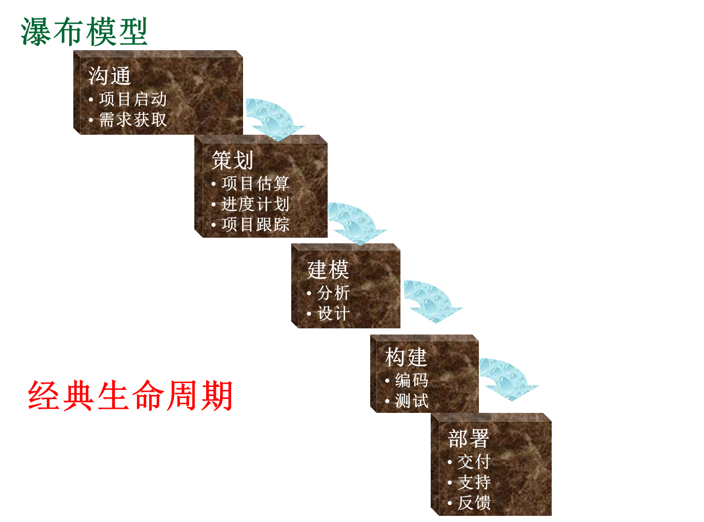

2. 变体: V模型

   - 软件团队沿着V模型左侧步骤向下推进，编码结束后，团队沿着V模型右侧的步骤向上推进，其本质是增加了一系列测试（质量保证动作）
   - 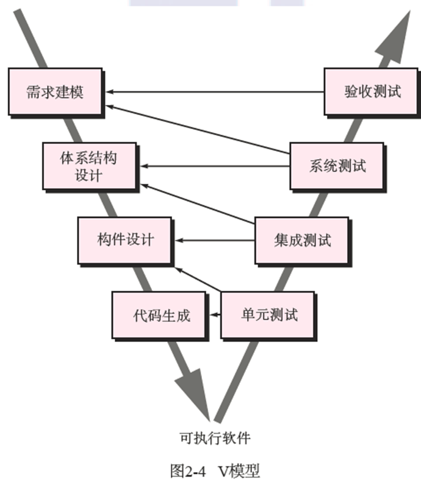 

3. 对比: 两者没有本质区别，V模型提供了一种将验证确认动作应用于早期软件工程工作中的方法

##### 特点 ※

1. 阶段间具有**顺序性**和**依赖性**

     - 顺序性: 只有等前一阶段的工作完成以后，后一阶段的工作才能开始；前一阶段的输出文档，就是后一阶段的输入文档。

     - 依赖性: 只有前一阶段有正确的输出时，后一阶段才可能有正确的结果

2. **推迟实现**的观点: 前面步骤完成后才考虑实现。
   - 把逻辑设计和物理设计清楚的划分开来，尽可能推迟程序的物理实现，这是瀑布型软件开发的一条重要的指导思想
3. **质量保证**的观点: 每一阶段都需要有文档以及经过评审。
     - 为了保证质量，瀑布型软件开发在各个阶段坚持了两个重要的做法
       - 每一阶段都要完成规定的文档。没有完成文档，就认为没有完成该阶段的任务。
       - 每一阶段都要对完成的文档进行复审，以便尽早发现问题，消除隐患。

##### **问题**

- 不适应需求经常发生变更的环境
- 客户只能到项目开发的晚期才能得到程序的可运行版本，大的错误如果到这时才被发现，会造成灾难性后果
- 工作中会发生阻塞状态

##### 总结

所以，在**需求已确定**的情况下，且工作采用**线性的方式**完成的时候，瀑布模型是一个很有有用的过程模型

#### 1.2.2 增量过程模型

#### 1.2.3 演化过程模型

### 1.3 专用过程模型

> 应该略

### 1.4 统一过程

1. ==统一过程==(UP, Unified Process)
   - 注重于客户沟通以及从用户的角度描述系统，强调软件体系结构的重要性
   - **特点**: 用例驱动，以架构为核心，迭代并且增量
   - 统一过程认识到与客户沟通以及从用户的角度描述系统并保持该描述的一致性的重要性

2. 统一过程的**五个阶段**

   - **起始阶段**: 识别基本的业务需求，并用用例初步描述每一类用户所需要的主要特性和功能

   - **细化阶段**: 沟通和通用过程模型的建模活动

   - **构建阶段**: 采用体系结构模型作为输入，开发或是获取软件构建，使得最终用户能够操作用例

   - **转换阶段**: 通用构建活动的后期阶段以及通用部署活动的第一部分

   - **生产阶段**: 对持续使用的软件进行监控，提供运行环境的支持，提交并评估缺陷报告和变更请求

   -  

## 二. UML图

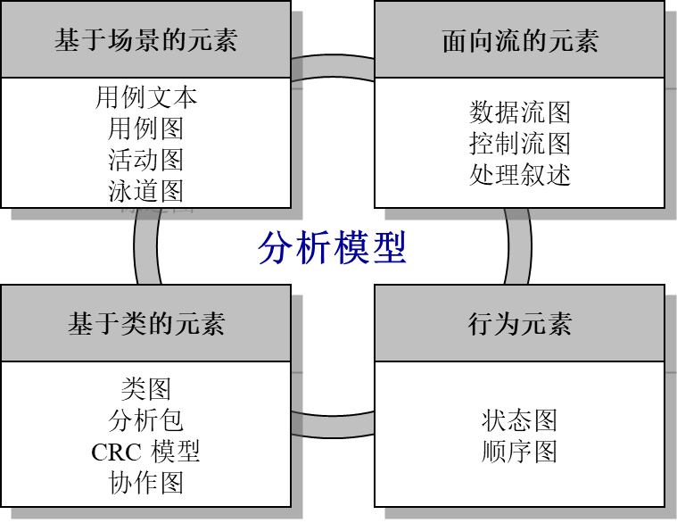

> [软件工程 UML 10种图_uml图-CSDN博客](https://blog.csdn.net/mid_Faker/article/details/106086605) 
>
> [九种常用的UML图总结_uml常见的十种图-CSDN博客](https://blog.csdn.net/qq_43530773/article/details/118250152) 

统一建模语言（Unified Modeling Language，UML）又称标准建模语言

分类

- 静态结构图Static Structure Diagram
  - **类图Class Diagram**
  - 对象图Object Diagram
  - **用例图Use Case Diagram**
- 交互图Interaction Diagram
  - 顺序图Sequence Diagram
  - 协作图Collaboration Diagram
  - 状态图State chart Diagrams
- 活动图Activity Diagrams
  - 实现图Implementation Diagrams
  - 构件图Component Diagram
  - 部署图Deployment Diagram

###  2.1 基于场景的建模

#### 2.1.1 用例图

1. 用例图: 用例图是从用户（角色）的角度出发，描述角色和用例之间的关系。

   - 即：谁，可以用此系统做什么。

2. 参与者: 在系统外部与系统直接交互的人或事物。需要注意以下两点：

   - 参与者是角色而不是具体的人（可以是外部系统），它代表了参与者在与系统打交道的过程中所扮演的角色。所以在系统的实际运作中，一个实际用户可能对应系统的多个参与者。不同的用户也可以只对应于一个参与者，从而代表同一参与者的不同实例。

   - 参与者作为外部用户（而不是内部）与系统发生交互作用，是它的主要特征。

   - 在UML中，参与者使用如图所示的一个小人表示：

      

3. 用例（Use Case）用况

   - 系统外部可见的一个系统功能单元。系统的功能由系统单元所提供，并通过一系列系统单元与一个或多个参与者之间交换的消息所表达。
   - 用椭圆表示，椭圆中的文字简述系统的功能：

4. 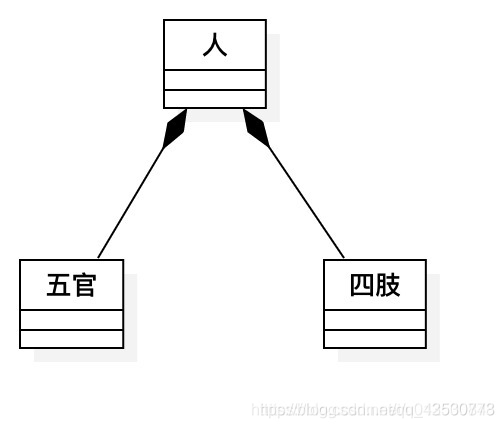 

### 2.2 基于类的建模

#### 2.2.1 类图

==类图==是描述系统中的类，以及各个类之间的关系的静态视图。是面向对象系统建模中最常用和最重要的图，是定义其他图的基础。

在UML类图中，常见的有以下几种关系: 泛化（Generalization）, 实现（Realization），关联（Association），聚合（Aggregation），组合（Composition），依赖（Dependency）。

各种关系的强弱顺序： 泛化 = 实现 > 组合 > 聚合 > 关联 > 依赖

##### ①泛化（Generalization）

泛化是一种**继承(Extend)**关系，表示一般与特殊的关系，它指定了子类如何继承父类的所有特征和行为

##### ②实现（Realization)

实现是一种类与**接口**的关系，表示类是接口所有特征和行为的实现(implement)。

##### ③关联（Association)

关联是一种拥有的关系，它使一个类知道另一个类的属性和方法；关联可以是双向的，也可以是单向的。双向的关联可以有两个箭头或者没有箭头，单向的关联有一个箭头。
　　　　

##### ④聚合（Aggregation)

聚合是整体与部分的关系，且部分**可以离开整体而单独存在**。如车和轮胎是整体和部分的关系，轮胎离开车仍然可以存在。

聚合关系是关联关系的一种，是强的关联关系；关联和聚合在语法上无法区分，必须考察具体的逻辑关系。

##### ⑤组合（Composition）

组合是整体与部分的关系，但**部分不能离开整体而单独存在**。如公司和部门是整体和部分的关系，没有公司就不存在部门。

组合关系是关联关系的一种，是比聚合关系还要强的关系，它要求普通的聚合关系中代表整体的对象负责代表部分的对象的生命周期。

##### ⑥依赖（Dependency）

依赖是一种使用的关系，即一个类的实现需要另一个类的协助，所以要尽量不使用双向的互相依赖

~~不要循环依赖~~

### 2.3 基于流程的需求建模

#### 2.3.1 数据流图DFD

1. 符号: 
   -  

2. 例子: 
   -  
   - 外部实体：储户、日历 
   - 处理(数据变换)：检验、登录、付款
   - 数据存储：帐卡、存折

#### 2.3.2 数据字典

1. **数据字典**（Data Dictionary，DD）是对数据流图中包含的所有元素的定义的集合。它是数据流条目、数据存储条目、数据项条目和基本加工条目的汇集。用来定义数据流图中各个成分的具体含义。

2. 管理各种关系模型中的信息，具体信息包括: 

   - 一般信息: 名字、别名、描述等；

   - 定义信息: 数据类型、长度、结构；

   - 使用特点: 值的范围、使用频率、使用方式；

   - 控制信息: 来源、使用它的程序；

   - 分组信息: 父结构、从属结构、物理位置等；

2. 数据元素组成数据对象的方式: 

   - 顺序: 两个或多个分量以确定次序进行连接；

   - 选择: 从两个或多个可能的元素中选取一个；

   - 重复: 把指定的分量重复零次或多次。

3. 符号: 

   - `=  `等价于

   - `+`和

   - `[]`或 (选择一个，用|隔开分量)
     - 例: 字母或数字 =  [字母字符 | 数字字符]

   - `{ }` 重复 ，(左右的数字分别为重复次数的上、下界)
     - 例: 字母数字串 = 0{字母或数字}7   (可重复0-7次)

   - `( ) `可选 (即从括号从中任选一项，也可一项都不选) 

4. 例

   - 

   - 

### 2.4 基于行为和模式的需求建模

#### 2.4.1 状态图

状态图描述类的**对象**所有可能的状态，以及事件发生时状态的转移条件。他们可以告知一个对象可以拥有的状态，并且事件会怎么随着时间的推移来影响这些状态。

状态图是对类图的补充。

##### 类的状态

类状态有主动/被动之分

- **被动状态**——某个对象**所有属性**的**当前状态**

- **主动状态**——对象进行**连续变换和处理**时的当前状态
  - 必然存在**前后不同状态**。比如，移动、休息、受伤、疗伤、被捕、失踪等；
  - 必然发生事件（触发器）才能迫使对象做出从一个主动状态到另一个主动状态的迁移

==状态图==：为每个类呈现了主动状态和导致这些主动状态变化的事件

-  每个箭头表示某个对象从一个主动状态转移到另一个主动状态。
- 每个箭头上的标注都体现了触发状态转移的事件。

#### 2.4.2 协作图

> 

#### 2.4.3 顺序图(时序图)

> 协作图→时序图

==顺序图==是将交互关系表示为一个二维图：

- 用时间函数表明事件如何引发从一个**对象**到另一个**对象**的转移。
- 每个箭头代表了一个事件；
- 时间纵向向下度量；消息的顺序是从左到右排列；
- 窄的纵向矩形表示处理某个活动所用的时间。

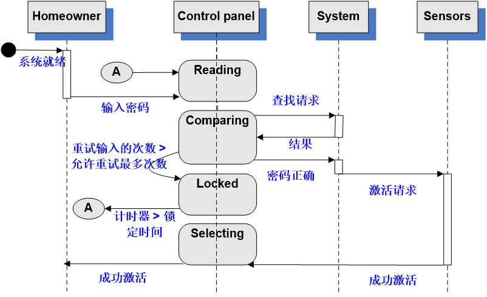

#### 2.4.4 活动图

==活动图==描述用例要求所要进行的活动，以及活动间的约束关系，有利于识别并行活动。能够演示出系统中哪些地方存在功能，以及这些功能和系统中其他组件的功能如何共同满足前面使用用例图的业务需求。

活动图是状态图的一种特殊情况，这些状态大都处于活动状态。本质是一种**流程图**，它描述了活动到活动的控制流。

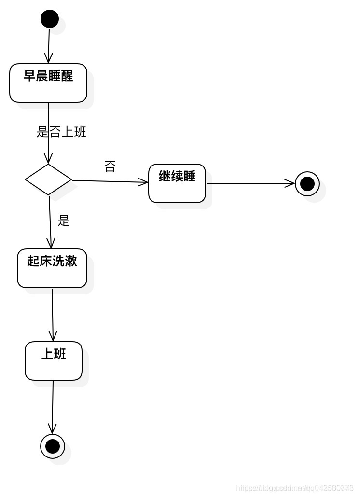

UML活动图在特定场景内通过提供迭代流的图形化表示来补充用例。

- 两端为半圆形的矩形表示一个特定的系统功能
- **箭头**表示通过系统的流
- **判定菱形**表示判定分支
- **实心水平线**意味着并行发生的活动。(见后面的案例)

#### 2.4.x 泳道图 ※

==泳道图==：

- 活动图的一种有用的变形。
- 指示了**参与者或分析类负责的活动**。
- 职责由纵向分割图的并列条形部分表示，就像游泳池中的泳道。
- 确定哪几个分析类 (如下图的中房主、摄像机和接口)对活动图中的情景有直接或间接的责任，并**重新排列活动图**。

1. 小孩存取钱的案例
   - 
   - 细化: 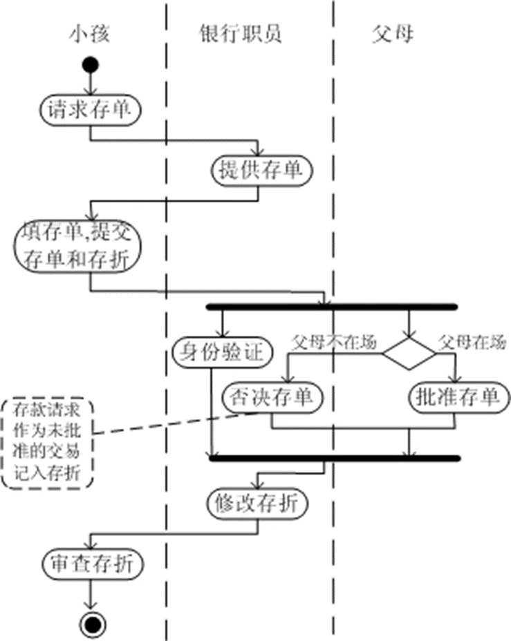

### 2.5 活动图

> 怎么真有9种图 不会全都考吧

#### 2.5.1 UML构件图

- 构件图也称组件图。
  - 描述了软件的各种构件和它们之间的依赖关系。
  - 通常包括三个元素：构件、接口和依赖。
-  
-  
- 

#### 2.5.2 部署图

部署级设计元素指明软件功能和子系统将如何在物理计算环境内分布。

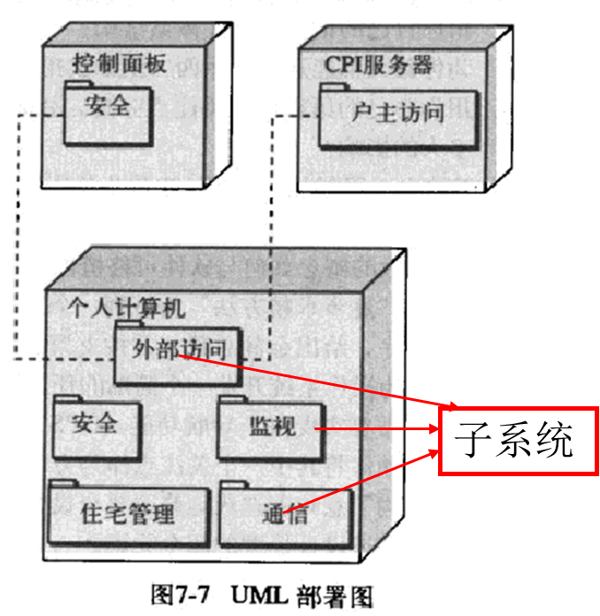

### 2.5 一些例题

#### 出卷系统案例

##### 数据流图

1. 顶层数据流图：

   

2. 一层数据流图: 
   
3. 二层数据流图: (自动出卷部分)
   

##### ER图

出卷功能初步ER图
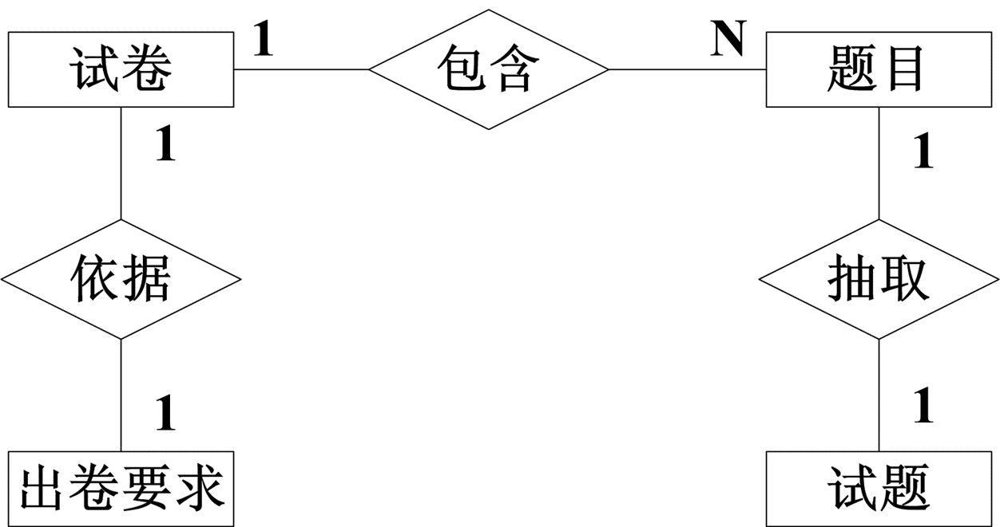

##### 数据字典

1. 试卷的数据字典

2. 出卷要求的数据字典

   

#### 短信系统案例

##### 用例场景

1. 发送短信的场景描述：
   - 用户输入短信内容；
   - 用户选择若干个发送人员；
   - 系统将明文短消息编码成格式化的短消息串；
   - 系统以串行方式将短信串传入无线移动终端。
2. 接收短信的场景描述：
   - 用户向串口发送指令从无线移动终端读取一组短消息串；
   - 系统将一组短信串解码成明文的短消息；
   - 系统将短消息写入数据库，并显示给用户。
3. 人员维护的场景描述：
   - 管理员添加一个新成员；
   - 管理员更新一个成员的信息；
   - 管理员删除一个成员。
4. 系统设置的场景描述：
   - 管理员修改基本信息：如短信客服中心号码、发送频率、延时等；
   - 系统保存设置信息。
5. 类包括：
   - ==边界类==：用于建立系统与其参与者之间交互的模型，经常代表对窗口、屏幕、打印机接口等抽象：
     - **发送短信界面**、**接收短信界面**、**收发接口**；
   - ==控制类==：用于协调、排序、事务处理以及其它的对象控制：
     - **发送短信**、**接收短信**；
   - ==实体类==：业务实体：
     - 短信编/解码、发送的短信串、接收的短信串；

##### 协作图

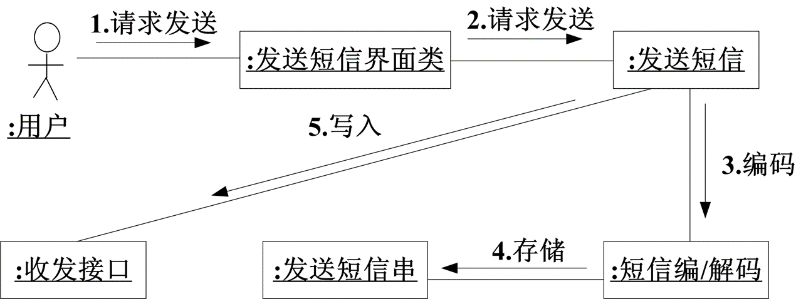

##### 顺序图(时序图)

> 与协作图对应

## 三. 判定表

> [软件工程~~判定树和判定表_判定表例题-CSDN博客](https://blog.csdn.net/weixin_45626404/article/details/112724244)

> 当算法中包含多重嵌套的条件选择时，使用**判定表**能够清楚地表达。
>
> 所以是在设计阶段使用吧

| 判定表   | 组成                                     |
| -------- | ---------------------------------------- |
| 左上部分 | 所有条件                                 |
| 左下部分 | 所有可能做的动作                         |
| 右上部分 | 各种**条件组合**，每一列表示一种可能组合 |
| 右下部分 | 每一列对应每一种条件组合的动作           |

### 例

eg：假设某航空公司规定，乘客可以①免费托运重量不超过30kg的行李。当行李重量超过30kg时，对②头等舱的国内乘客超重部分每公斤收费4元，对③其他舱的国内乘客超重部分每公斤收费6元，对④外国乘客超重部分每公斤收费比国内乘客多一倍，对残疾乘客超重部分每公斤收费比正常乘客少一半。用判定表进行表达。

1. 我们先将所有情况进行列出，就是面对行李是否<30kg，是否为国内乘客，是否为头等舱，是否是残疾乘客我们托运行李的价格不一样
2. T代表满足情况，F代表不满足，X代表我们应该付的价格（我个人建议你根据这个模板自己写其实更简单，顺序不同没有关系，其实就是排列组合所有情况）
3. 

## 四. 软件测试策略

### 4.1 单元测试

1. ==单元测试==: 对软件中的**最小可测试单元**进行检查和验证
   - ==单元==: C中是函数, Java中是类, 图形化软件中是一个窗口/菜单

2. 单元测试主要对模块的五个基本特性进行评价: 

   - **模块接口**: 保证被测程序单元的信息能够正常的流入和流出

   - **局部数据结构**: 确保临时存储的数据在算法的整个执行过程中能维持其完整性

   - **边界条件**: 达到边界值还能正确执行

   - **独立路径**: 确保模块的所有语句至少执行一次

   - **错误处理路径**: 预见各种出错条件

3. 单元测试特点

   - 侧重于软件设计的最小单元的验证工作

   - 侧重于构件中的**内部处理逻辑**和**数据结构**

   - 进行的越早越好

#### 单元测试环境

==测试用例==: 是为某个特殊目标而编制的一组测试输入、执行条件以及预期结果，以便测试某个程序路径是否满足某个特定需求。

==构件==并不是独立程序，所以必须为每个测试单元开发驱动程序和桩程序：

- ==驱动程序==：是“主程序”，接收测试用例数据，将这些数据传递给待测试构件
- ==桩程序==：替换那些从属于待测试构件的构件
- 驱动程序调用被测模块, 桩程序被被测模块调用

- 驱动模块和桩模块都是额外的开销，虽然在单元测试中必须编写，但并不需要作为最终的产品提供给用户。

### 4.2 集成测试

分类: 

- 一步到位的集成

- 增量集成
  - 自顶向下测试
  - 自底向上测试
  - 组合方法（三明治）

#### ①一步到位的集成

1. 所有的构件都连接在一起，全部程序作为一个整体进行测试
   -  

2. 缺点: 

   - 需要**所有单元就绪**，不利于开发进度

   - 问题**定位较为困难**

3. 适合规模较小的应用

#### ②自顶向下法

1. ==自顶向下法==: 首先集成**主控模块**，然后依照控制层次向下进行集成
2. 策略有: 广度优先，深度优先

3. 特点: 

   - 
   - 可能要**编写很多桩程序**

   - **主控模块错误**可能发现的比较早

4. 主控模块用作测试驱动模块，一次用一个实际模块替换一个桩模块
   - 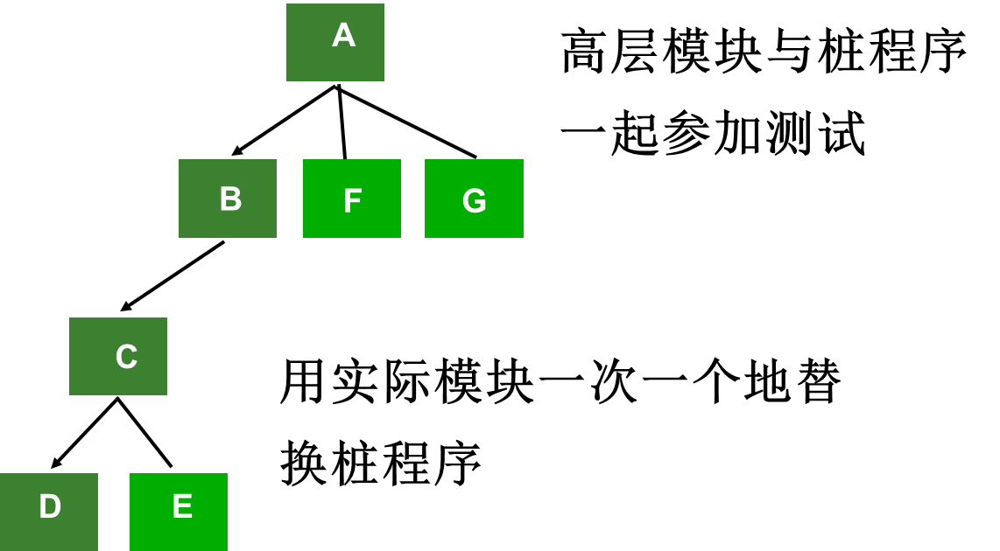 

#### ③自底向上法

1. ==自顶向下法==: 从程序模块结构的**最底层**的模块开始组装和测试

2. 特点: 

   - 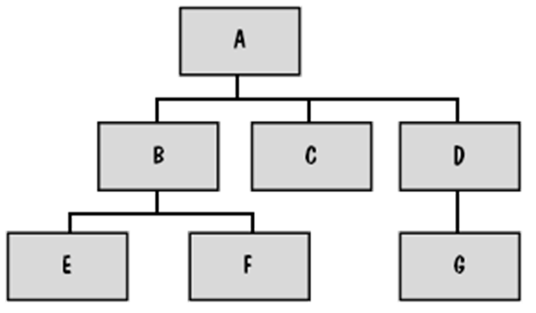 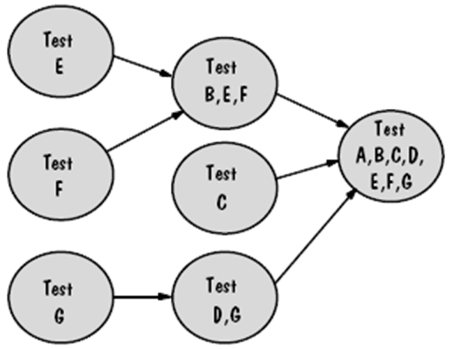
   - 不需要桩模块

   - **要写驱动模块**

   - 主控模块错误发现得比较迟

3. 如果最上两层是自顶向下集成的，可以减少驱动模块的数量（组合方法）
   -  

#### ④组合方法(三明治)

#### 集成测试方法的比较

1. 自顶向下与自底向上增量式测试的比较：
   - 自顶向下增量式测试：
     - 主要优点：可以自然地做到**逐步求精**，一开始就能让测试者看到系统的框架。能较**早发现高层模块的错误**；
     - 主要缺点：需要提供**桩模块**，并且在输入/输出模块接入系统以前，在**桩模块中表示测试数据有一定困难**。
   - 自底向上增量式测试：
     - 主要优点：容易直接使用测试数据，**易于设计测试用例**；
     - 主要缺点：直到最后一个模块被加进去之后才能看到整个程序（系统）的框架。**上层模块错误发现得晚**，影响范围大；

#### ⑤回归测试

1. ==回归测试==: 在**程序有修改**的情况下，保证**原有功能**正常的一种测试策略
   - 重新执行已进行测试的某个子集，以确保变更没有传播不期望的副作用
   - 每次对软件做重要变更时(新构件的集成, 删除, 修改), 要进行回归测试

2. 步骤：
   - 先对**修改部分**进行测试；A
   - 然后**隔离修改**部分，测试程序的未修改部分；B
   - 最后再把它们**集成起来**进行测试；A+B
3. 回归测试的三种测试用例
   - 代表测试样本：能够测试软件**所有**功能；
   - 必要测试样本：侧重于**被改变**的软件构件功能；
   - 额外测试样本：侧重于**可能会**受变更影响的功能；

#### ⑥冒烟测试

> 常用的集成测试方法

1. ==冒烟测试==是**时间关键项目**的决定性机制

2. 活动: 

   - 将已经转化成代码的**软件构件集成到构建**中

   - **设计一系列测试**以暴露影响构建正确完成其功能的**错误**

   - **每天**将构建与其他构建以及整个软件产品**集成起来**进行冒烟测试

3. 好处

   - 降低了集成风险: 每天测试, 较早的发现不相容和业务阻塞错误

   - 提高最终产品的质量: 冒烟测试面向构建(集成), 可以发现功能性错误, 体系结构和构件级设计错误

   - 简化错误的诊断和修正: 新发现的错误可能与软件增量有关

   - 易于评估进展情况

### 4.3 确认测试

### 4.4 系统测试

## 五. 软件体系结构

## 六. 基本路径测试

### 6.1 流图

流图 (或程序图)：

- 一种简单的控制流表示方法；
- **圆**：流图结点，表示一个或多个过程语句。
  - 处理框序列和一个菱形判定框可映射为单个结点(相对于流程图)
- **箭头**：边或连接，表示控制流，一条边必须终于一个节点，即使该结点并不代表任何过程语句。
- 由边和节点限定的区间称为**域**，计算区域时不要忘记区域外的部分，图的外部作为一个域。

### 6.2 独立程序路径

==独立程序路径==是任何贯穿程序的，至少引入一组新的处理语句或一个新条件的执行路径。(不能由其它独立路径组合而成)

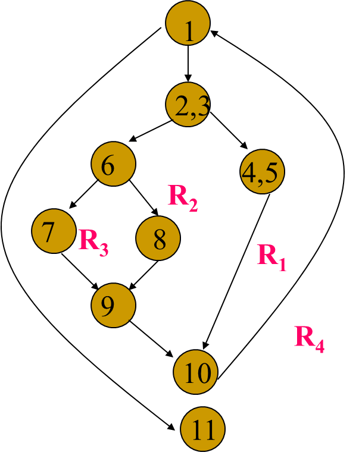 

在图示的控制流图中，一组独立的路径是：

- path1：1 - 11
- path2：1 - 2 - 3 - 4 - 5 - 10 - 1 - 11
- path3：1 - 2 - 3 - 6 - 8 - 9 - 10 - 1 - 11
- path4：1 - 2 - 3 - 6 - 7 - 9 - 10 - 1 - 11
- 路径1 - 2 - 3 - 4 - 5 - 10 - 1 - 2 - 3 - 6 - 8 - 9 - 10 - 1 – 11不是独立路径。
- 路径1、2、3和4构成流图的基本集合。若设计测试强迫执行这些路径 (基本集合)，则可以保证程序中的每条语句至少执行一次，且每个条件的取真和取假都被执行。
  基本集合不是唯一的。

### 6.3 环路复杂性

环形复杂度的计算: 

1. $流图的区域数=环路复杂度 V(G) = \textcolor{orange}{独立路径数}$

2. $V(G)=E-N+2$
   - E是流图的边数，N是流图的节点数

3. $V(G)=P+1$
   - P为包含在**流图G**中的判定节点数

### 例题

#### 例1 ppt

1. 程序结构: 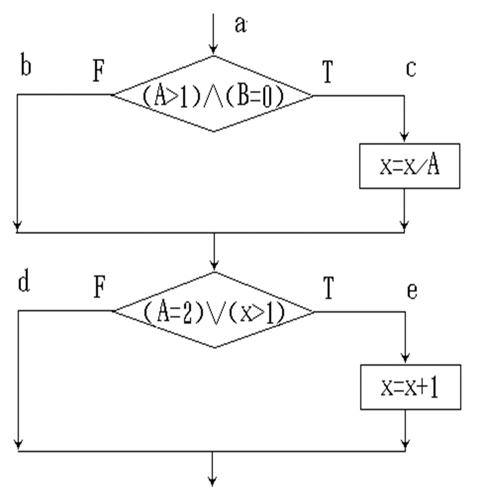
2. 对应流图:    

3. 独立路径: 
   - 1 - 4 - 5 - 7
   - 1 - 4 - 5 - 6 - 7 (走5→6)
   - 1 - 4 - 6 - 7 (走4→6)
   - 1 - 2 - 4 - 6 - 7 (走1→2)
   - 1 - 2 - 3 - 4 - 6 - 7 (走2→3)

#### 例2 csdn

> [软件测试——程序控制流图、McCabe 环形复杂度与独立路径_mccabe流图怎么画-CSDN博客](https://blog.csdn.net/Runner1st/article/details/90514923)

根据程序流程图，完成：
(1) 画出相应的程序控制流图；
~~(2) 给出控制流图的邻接矩阵；~~
(3) 计算 McCabe 环形复杂度；
(4) 找出程序的一个独立路径集合。

1. 画出相应的程序控制流图
   

2. 计算 McCabe 环形复杂度
  一个程序模块的环路复杂度用来衡量模块中判定结构的复杂程度，数量上可以表现为程序控制流图中从开始点到终结点的独立路径条数，相当于合理预防错误所
  需测试的最少路径条数。
  - 计算方法：
  - 单入单出程序控制流图 G 的 McCabe 环路复杂度计算公式：
    V(G) = m - n + 2p
    ◌ m 是 G 的边数目
    ◌ n 是 G 的顶点数目
    ◌ p 是 G 的连通分支数
    简单程序控制流图是连通图，p = 1，此时：
    V(G) = m - n + 2
    G 是平面图时，由欧拉公式，V(G) = R。其中 R 是平面被控制流图划分成的区域数目 (包括外部面)。
    对于简单的单入单出结构化模块，V(G) 值等于程序控制流图中的单条件判断节点的个数 +1。多条件判断条件可以先转化为单条件复合结构再应用本结论。
  - 计算：
    解1：图中 m = 10，n = 7，故
    V(G) = m - n + 2
    = 10 – 7 + 2
    = 5
    解2：图是平面的且有5个面，故
    V(G) = 5
    解3：图中有4个单条件判定节点1, 2, 4, 5, 故
    V(G) = 4 + 1 = 5

4. 找出程序的一个独立路径集合
  独立路径：至少沿一条新的边移动的路径。对所有独立路径的遍历使得程序
  中的所有语句至少被执行一次。
  - 5条独立的基本路径：
    1-2-3-4-5-6-7
    1-3-4-5-6-7 (走1→3)
    1-2-4-5-6-7 (走2→4)
    1-2-3-4-7 (走4→7)
    1-2-3-4-5-7 (走5→7)

## 评审技术

## 挣值分析

> ==挣值分析==是在软件小组按项目进度表工作时，定量分析项目进展的技术
>
> - 围绕着BCWP计算?

按如下步骤确定挣值

1. 为进度表中的每一个工作任务确定其**预计工作的预算成本**（BCWS, Budgeted Cost of Work Scheduled）

   - 一个工作任务有一个BCWS
   - 特定时间点t的BCWS值是在项目进度表中，该时间点应该完成的所有工作任务的**BCWS值之和**

2. 将所有BCWS值加起来，可计算出**工作总预算**（BAC, Budget At Completion）

3. 计算**已完成工作的预算成本**（BCWP, Budgeted Cost of Work Performed，也称Earned Value 挣值），即该时间点已经实际完成的所有工作任务的BCWS的和

4. **进度情况**评估: 

   - BCWP–BCWS
     - **进度执行指标** $SPI=BCWP/BCWS$
       - 效率指标，越接近1.0则效率越高
     - **进度偏差** $SV=BCWP-BCWS$
       - 表示与计划进度的偏差

   - BAC相关
     - **预计完成百分比** $BCWS/BAC$
       - 表示在时间点 t 应该完成工作的百分比值
     - **(实际)完成百分比** = $BCWP / BAC$
       - 表示在特定时间点 t 实际完成工作的百分比值
   - **特定时间实际完成工作的百分比值**: BCWS/BAC(注意这里的BCWS和上面的不一样)

5. **预算准确性**评估

   - **已完成工作的实际成本ACWP**

   - **成本执行指标**$CPI=BCWP/ACWP$
     - CPI越接近1.0表示项目与预算越接近
   - **成本偏差**$CV=BCWP-ACWP$
     - 表示在项目特定阶段的成本节省或短缺

6. |                | 解释                                  | 名称                     | 英文                                                         | 计算式                                                       |
   | -------------- | ------------------------------------- | ------------------------ | ------------------------------------------------------------ | ------------------------------------------------------------ |
   | 预算相关       | 表格给出or简单sum                     | 预计工作预算成本         | **BCWS** Budgeted Cost of Work Scheduled                | 两种 任务的BCWS: 题目给出 特定时间点的BCWS: $\sum$当前时间点前任务的BCWS |
   |                |                                       | 工作总预算               | **BAC ** Budget At Completion                           | $\sum$所有任务的BCWS                                         |
   |                |                                       | 已完成工作预算成本(挣值) | **BCWP / EV **Budgeted Cost of Work Performed / Earned Value | $\sum$已完成任务的BCWS                                       |
   | 进度评估       | BCWP&BCWS相关                         | 进度执行指标             | **SPI**  Schedule Performance Index                     | $SPI = \frac{BCWP}{BCWS}$                                    |
   |                |                                       | 进度偏差                 | **SV** Schedule Variance                                | $SV=BCWP-BCWS$                                               |
   | 进度评估       | BAC相关 BAC都在下                | 预计完成百分比           | -                                                            | $=\frac{BCWP}{BAC}$                                          |
   |                |                                       | (实际)完成百分比         | -                                                            | $=\frac{BCWC}{BAC}$                                          |
   | 预算准确性评估 | BCWP&ACWP 此处才开始用到实际成本 | 已完成工作的实际成本     | **ACWP** Actual Cost for Work Performed                 | $\sum$当前时间点前完成的任务的实际成本                       |
   |                | ACWP都在后or下                        | 成本执行指标             | **CPI** Cost Performance Index                          | $CPI=\frac{BCWP}{ACWP}$                                      |
   |                |                                       | 成本偏差                 | **CV** Cost Variance                                    | $CV=BCWP-ACWP$                                               |

   - 前缀: B: Budgeted, 预计; A: Actual, 实际
   - 后缀: S: Schedule, 计划(进度); P: Performed, 执行; I: Index, 指标(比例)

#### 例题

假设你是一个软件项目管理者，受命为一个小型软件项目进行挣值统计。这个项目共计划了56个工作任务，估计需要582人日才能完成，但是，按照项目进度，现在应该完成15个任务，下面 (在下一页中) 给出相关进度安排数
据 (单位: 人日)，请你做出挣值分析。计算该项目的进度表执行指标SPI、进度偏差SV、预定完成百分比、完成百分
比、成本执行指标CPI和成本偏差CV。

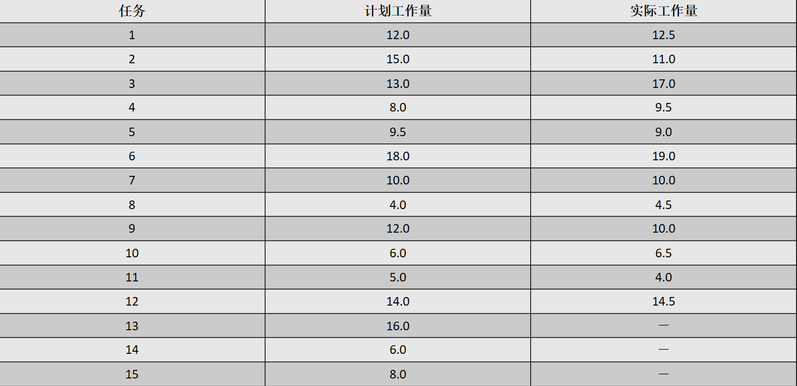

- 计划完成任务BCWS =12+15+13+8+9.5+18+10+4+12+6+5+14+16+6+8=155.5(人日)
- 实际完成任务BCWP = 12+15+13+8+9.5+18+10+4+12+6+5+14=125.5(人日)

- 进度执行指标SPI =BCWP/BCWS= 125.5 /155.5=0.81
- 进度偏差SV =BCWP-BCWS=125.5-155.5=-30(人日)
- 预定完成百分比 =BCWS/BAC=155.5/582=26.7%
- 完成百分比 =BCWP/BAC=125.5/582=21.6%

- 已经完成任务ACWP =12.5+11+17+9.5+9+19+10+4.5+10+6.5+4+14.5=127.5(人日）
- 成本执行指标CPI =BCWP/ACWP=125.5/127.5=0.98
- 成本偏差CV =BCWP-ACWP=125.5-127.5=-2 (人日)

## 风险管理

# 名词解释

1. 什么是测试用例？
   是为某个特殊目标而编制的一组测试输入、执行条件以及预期结果，以便测试某个程序路径是否满足某个特定需求。