# 软件工程

> 亦瑾: 
>
> 18级WHQ学长的笔记, 感谢分享
>
> 这里根据2023版本的课件做了一些校对, 内容补充, 图片添加~~和一些精神不太正常时的吐槽~~XD 
>
> 学长留下的奇妙链接: https://www.cnblogs.com/qyf2199/p/12104922.html
>
> - 一点复习建议: 要不还是多做题吧 这玩意背不了一点
>   - 预习day1: 题都看不懂啊 要不还是先看一遍吧
>   - 

👇这些是按照ppt的章节来划分的（柯逍）

👇无任何重点与汇总:-D

## 第1章 软件的本质

### 1.1 软件的本质

#### 1.1.1 定义软件

1. ==软件==是一组**要素**的集合，教科书给软件的定义: 

   - 指令的集合（计算机**程序**），通过执行这些指令可以满足 预期的特征、功能和性能需求,

   - 数据: 使程序能够适当地**处理信息**的数据结构

   - 软件描述信息（**文档**） ，用来描述程序操作和使用


2. 软件的双重角色: 
   - 软件是一种**产品**
   - 软件是生产产品的**载体**，提供以下基础平台: 
     - 计算机控制 (e.g., 操作系统)
     - 信息通信 (e.g., 网络软件)
     - 应用软件开发 (e.g., 软件工具)
3. 软件和硬件有完全不同的特性: 
   - 软件是设计开发的，而不是传统意义上生产制造的
   - 软件不会**磨损**，但是会**退化**
     - 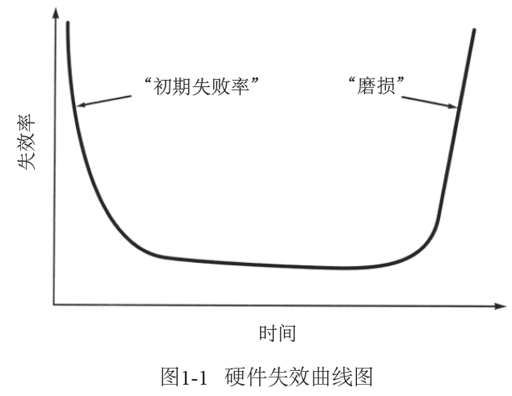 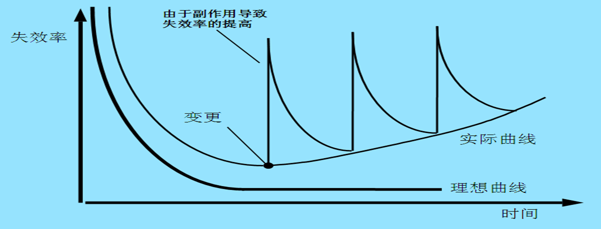

   - 基于构件的构造模式 (构件复用)


软件开发**包括**编码

开发与编码的不同之处

1. 目的不同

   - 编码是让计算机能理解和执行设计者意图
   - 软件开发是要满足用户需求，同时也满足自身利益

2. 方法不同

   -  编码通过规范的程序设计，使程序能正确地理解和执行设计者的意图

   - 软件开发要通过实施软件过程，保证按时交付软件、控制质量和降低成本

3. 参与者不同

   - 编码主要靠个人的经验和技巧
   - 软件需要有团队的合作，要有适合团队特点的软件过程

#### 1.1.2 软件的应用领域

##### ①系统软件

1. ==系统软件==是一整套服务于其他程序的程序

   - 某些系统软件（例如: 编译器、编辑器、文件管理软件）处理**复杂但确定的信息结构**。

   - 另一些系统应用程序（例如: 操作系统构件、驱动程序、网络软件、远程通信处理器）主要处理的是**不确定的数据**。

2. 特点: 

   - 和计算机硬件大量交互


   - 多用户大量使用；


   - 需要调度、资源共享和复杂进程管理的同步操作；


   - 复杂的数据结构以及多种外部接口。


##### ②应用软件

==应用软件==: 解决特定业务需要的独立应用程序

除了传统数据处理的应用程序，应用软件也被用于**业务功能的实时控制**（e.g销售点的交易管理，实时制造过程控制）

##### ③工程/科学软件

这类软件通常带着“数值计算“算法的特征

##### ④嵌入式软件

嵌入式软件存在于**某个产品或者系统**中，可以执行**有限但难于实现**的功能，并**提供重要的功能和控制能力**

##### ⑤产品线软件

产品为**多个不同用户的使用提供特定的功能**，关注有限的特定的**专业市场**或者**大众消费品市场**

趋势: 

- 使用**相同的底层**应用软件和数据体系结构来开发
- 使用可在整个产品线中进行**复用的一组软件构件**来实现

##### ⑥Web应用软件/移动APP

以**网络为中心的软件**，其概念涵盖了宽泛的应用程序产品

随着Web 2.0的出现，网络应用正在**发展为复杂的计算环境**(e.g. 网游、网络社区应用)

趋势

- WebApp允许移动设备通过针对**移动平台的优点和弱点**专门设计的**浏览器**获取基于Web内容的访问。
- 移动App可以直接访问**设备的硬件特性**

##### ⑦人工智能软件

利用**非数值算法**解决计算和直接分析无法解决的**复杂问题**

##### ⑧开放计算

无线网络的快速发展会促成普适计算、分布式计算、以及云计算的发展。软件工程师面临的挑战是开发系统和应用软件，使得移动设备、个人电脑和企业应用可以通过网络设施进行通信

#### 1.1.3 遗留软件

1. ==遗留软件==: 使用了很长时间，由于使用者不愿更换，仍然在使用的系统

2. **特点**

   - **支持核心业务**，并且是业务必不可少的支撑

   - 在使用过程中，**不断地被修改**

   - 质量差: 设计难以扩展、代码费解、文档混乱

3. **对策**: 尽可能什么也不做 ~~(能跑就别动)~~

4. 遗留软件经常会由于下述原因发生演化
   - 进行适应性变化，以**满足新的计算环境或者技术**的需要
   - 根据新的业务需求进行**升级**
   - **扩展**以及具有与更多现代系统或数据库的协作能力
   - **改建**以适应多样化的网络环境


## 第2章 软件工程【概述】

### 2.1 定义软件工程学科

1. Fritz Bauer给出了如下定义: 
   - 建立和使用一套合理的**工程**原则，从而**经济的**获得**可靠的**，可在实际机器上**高效运行**的软件

2. IEEE给出了如下定义: 

   - 将**系统化的、规范的、可量化**的**方法**应用于软件的开发、 运行和维护，即将**工程化**方法应用于软件

   - 对上述方法的研究


3. 软件工程是一种层次化的技术，自下而上分为: 质量关注点→过程→方法→工具

   -  

   - 支持软件工程的**根基**在于***质量关注点***


   - 基础是***过程层***，***过程***定义了一个框架，给出了开发步骤


   - ***方法***为构建软件提供技术上的解决方法，为构建软件提供技术上的解决方法（如何做），包括[沟通]()，[需求分析]()，[设计建模]()、编程、[测试]()和技术支持


   - ***工具***为过程和方法提供自动化或半自动化的支持


### 2.2 软件过程

1. ==过程==是事情进行或事物发展所经过的顺序。 
2. 当开发产品或构建系统时，遵循一系列**可预测的步骤**（即**路线图**）是非常重要的，它有助于及时交付**高质量**的产品。
3. 软件开发中所遵循的路线图就称为**“软件过程”** 


####  过程框架

1. ==过程框架==定义了若干个**框架活动**，为实现完整的软件工程过程建立了基础，每一个**活动**由一组**软件工程动作**组成，每一个动作都包括一系列相互关联的可考核的**任务**
   - $过程框架\begin{cases}框架活动1\begin{cases}软件工程动作1\begin{cases}任务1\\任务2\\...\end{cases}\\软件工程动作2\\...\end{cases}\\框架活动2\\...\end{cases}$ 
   
   - **过程**(框架): 工作产品构建时所进行的一系列活动、动作和任务的集合
   
   - (框架)**活动: **主要实现宽泛的目标，与应用领域，项目大小，结果复杂性或者实施软件工程的重要程度没有直接关系
   
   - (软件工程)**动作: **包含了主要工作产品生产过程中的一系列任务
   
   - **任务: **关注小而明确的目标，能够产生实际产品（e.g构建一个单元测试）
   
2. ==通用过程框架==–五个最基本的框架活动: 
   - 沟通: 目的是理解甲方项目目标, 收集需求
   - 策划: 也叫**软件项目计划**, 定义&描述软件工程工作
     - 包括**技术任务**, **风险**, **资源**需求, 工作**产品**, 工作**进度**计划
   - 建模: 需求建模&对应的软件设计
   - 构建: 编码+测试
   - 部署

3. 软件工程过程框架活动由很多**普适性活动**来补充实现，通常，这些普适性活动**贯穿软件项目始终**，来帮助软件团队管理和控制项目进度、质量、变更和风险。典型的普适性活动包括

   - **软件项目跟踪和控制**: 评估项目进度

   - **风险管理**: 影响产品质量/项目成果的风险

   - **软件质量保证**

   - **技术评审**: 及时debug?

   - **测量**: 定义和收集过程、项目和产品的度量

   - **软件配置管理**

   - **可复用管理**

   - **工作产品的准备和生产**: 建模、文档、日志、表格和列表等。

4. 过程的适应性调整: 不同项目所采用的项目过程可能有很大不同

### 2.3 软件工程实践

软件工程实践的**精髓**

1. **理解问题（沟通和分析）**
   - 利益相关者
   - 数据、功能、特征和行为
   - 问题分解
   - 图形化描述
2. **计划解决方案（建模和软件设计）**
   - 设计模式复用
   - 软件复用
   - 问题解决方案复用
   - 子问题分解→子问题方案复用
   - 快速实现
3. **实施计划（代码生成）**~~亲 您好 这边不考编程呢~~ 
   - 解决方案↔计划
   - 源码↔设计模型
   - 解决方案的各个部分的正确性
   - 评审&算法正确性证明
4. **检查结果的正确性（测试和质量保证）**
   - 测试解决方案的每个部分
   - 测试策略
   - 结果是否一致
   - 需求是否完成

#### 软件工程的一般原则

**软件工程整体实践的原则**

1. **存在价值**: 能否产生价值 ~~不要做垃圾~~
2. **保持简洁**: 简结而非简化
3. **保持愿景**: 目标清晰
4. **关注使用者**: 需求→用户; 设计→实现; 编码→维护和拓展
5. **面向未来**: 持久耐用
6. **提前设计复用**: 
7. **认真思考**: ~~要多想~~

### 2.4 软件神话

~~什么怪东西~~

> 软件神话，即关于软件及其开发过程被人盲目相信的一些说法，可以追溯到计算技术发展的初期。
>  今天，大多数有见地的软件工程师已经意识到软件神话的本质—它实际上误导了管理者和从业人员对软件开发的态度，从而引发了严重的问题。然而，由于习惯和态度的根深蒂固，这一切难以改变，软件神话遗风犹在


### 2.5 软件工程项目的开端

每个软件工程项目都来自业务需求: 

- 对现有应用程序**缺陷的纠正**；debug
- **改变遗留系统**以适应新的业务关键；
- 扩展现有应用程序**功能和特性**；
- 开发某种**新的**产品、服务或系统。

软件项目的初期，业务需求通常是在谈话过程中非正式地表达出来


## 第3章 软件过程结构

### 3.1 通用过程模型

通用过程框架定义了5种框架活动: 沟通, 策划, 建模, 构建, 部署 ~~复读~~

==过程==: 在工作产品构建过程中所需完成的工作活动、动作和任务的集合。这些活动、动作、任务中的每一个都隶属于某一框架或者模型，框架或模型定义了他们与过程之间或者相互之间的关系

软件过程示意图: 从外到内: 软件过程, 过程框架, 普适性活动, 框架活动, 动作, 任务集

-  

- **软件工程动作**由若干个**任务集**构成，而每一个**任务集**都由软件工程工作任务、相关工作产品，质量保证点和项目里程碑组成。
- ==任务集==定义了为达到一个软件工程动作的目标所需完成的工作


#### 过程流

==过程流==: 描述了在执行顺序和执行时间上如何组织框架中的活动、动作和任务

分为: 

1. 线性: 字如其名
   - 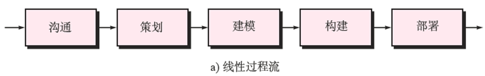 
2. 迭代: 在执行下一个活动前重复执行之前的一个或多个活动
   - 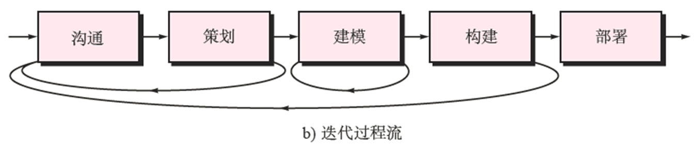 
3. 演化: 采用循环的方式执行各个活动，每次循环都能产生更为完善的软件版本（增量交付）
   - 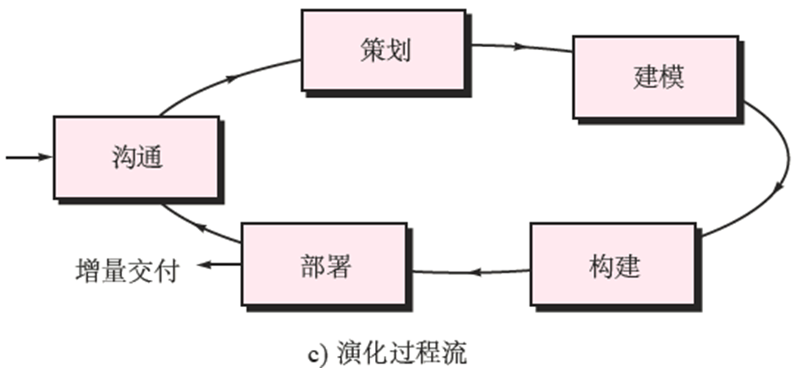 
4. 并行: 将一个或者多个活动与其他活动并行执行
   - 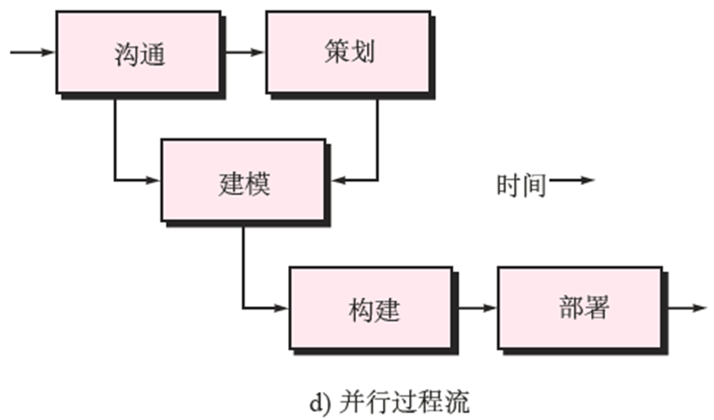 


#### 过程模式

1. ==过程模式==描述了软件工程工作中遇到的过程相关问题、明确了问题环境并给出针对该问题的一种或几种可证明的解决方案

   - 提供了一个 描述问题解决方案的犯法

2. 模式可以在不同抽象层次上进行定义

   - 模式可以描述一个完整的**过程模型**（例如原型开发）的相关问题和解决方案

   - 模式也可以描述一个**框架活动**（例如策划）

   - 或者框架活动中的某一项**具体任务**（例如项目估算）的相关问题与解决方案


3. Ambler过程模式的描述模板: 
   - **模式名称**: 应清楚地表达该模式在软件过程中的含义，比如，技术评审。
   - **驱动力(目的): **模式使用环境及主要问题，以明确主要难点。
   - **类型: **步骤模式（定义框架活动）、任务模式 (定义软件工程动作或任务）、阶段模式（定义框架活动序列）
   - **启动条件: **模式应用前需满足的前提条件(输入) 。需要明确: 
     （1）在此之前，整个开发组织或者开发团队内已有哪些活动？
     （2）已有哪些软件工程信息或是项目信息？
     （3）过程的进入状态是什么？
   - **问题: **描述模式将要解决的具体问题
   - **解决办法: **描述如何成功实现模式。
   - **结束条件: **描述模式成功执行之后的结果(输出)。模式结束时需要明确: 
     （1）必须完成哪些开发组织或是开发团队相关的活动？
     （2）过程的结束状态是什么？
     （3）产生了哪些软件工程信息或是项目信息？
   - **相关模式: **列举与该模式直接相关的其它过程模式。
   - **已知应用实例: **说明该模式可应用的具体实例。(什么场合使用)
4. 【例】回归测试过程模式
   - 模式名称: 回归测试 (指修改了旧代码后，重新进行测试以确认修改没有引入新的错误或导致其他代码产生错误)。
   - 目的: 构造一种测试的过程。
   - 类型: 任务模式。
   - 启动条件: 在模式启动之前必须满足以下三个条件: （1）原来的测试用例；（2）更新后的软件；（3）针对更新部分的新测试用例。
   - 问题: 要测试模块。
   - 解决方法: 先用原来的测试用例测试软件，再用新测试用例测试软件。
   - 结束条件: 完成测试的软件。
   - 相关模式: 测试、单元测试、系统测试。
   - 已知应用实例: 更新软件后建议使用。

## 第4章 过程模型


**==过程模型==**为软件工程工作提供了特定的路线，该路线图规定了所有活动的流程、动作、任务、迭代的程度、工作产品以及要完成的工作应如何组织

### 4.1 惯用过程模型

1. ==惯用过程模型== (==软件生存周期模型==)
   - **目标**: 使软件开发更加有序
   - 所有的软件过程模型都支持通用框架活动，但是每一个**模型都对框架活动有不同的侧重**
   - 瀑布，增量，演化，并发


#### 4.1.1 瀑布模型

1. ==瀑布模型==又称==经典生命周期==，它提出了一个传统的、顺序的软件开发方法，即从用户需求规格说明开始，顺序地通过沟通、策划、建模、构建和部署过程，最终提供完整软件和持续技术支持。
   - 

2. 变体: V模型

   - 软件团队沿着V模型左侧步骤向下推进，编码结束后，团队沿着V模型右侧的步骤向上推进，其本质是增加了一系列测试（质量保证动作）
   - 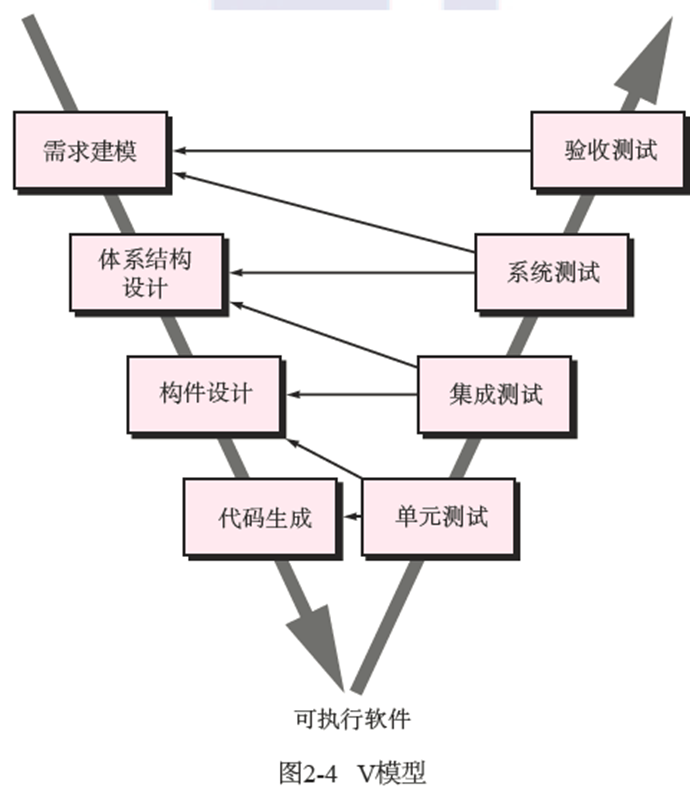 

   - 对比: 两者没有本质区别，V模型提供了一种将验证确认动作应用于早期软件工程工作中的方法

##### 特点 ※

1. 阶段间具有**顺序性**和**依赖性**

     - 顺序性: 只有等前一阶段的工作完成以后，后一阶段的工作才能开始；前一阶段的输出文档，就是后一阶段的输入文档。
     - 依赖性: 只有前一阶段有正确的输出时，后一阶段才可能有正确的结果
2. **推迟实现**的观点: 前面步骤完成后才考虑实现。
   - 把逻辑设计和物理设计清楚的划分开来，尽可能推迟程序的物理实现，这是瀑布型软件开发的一条重要的指导思想
3. **质量保证**的观点: 每一阶段都需要有文档以及经过评审。
     - 为了保证质量，瀑布型软件开发在各个阶段坚持了两个重要的做法
       - 每一阶段都要完成规定的文档。没有完成文档，就认为没有完成该阶段的任务。
       - 每一阶段都要对完成的文档进行复审，以便尽早发现问题，消除隐患。

##### **问题**

- 不适应需求经常发生变更的环境
- 客户只能到项目开发的晚期才能得到程序的可运行版本，大的错误如果到这时才被发现，会造成灾难性后果
- 工作中会发生阻塞状态

##### 总结

所以，在需求已确定的情况下，且工作采用线性的方式完成的时候，瀑布模型是一个很有有用的过程模型

#### 4.1.2 增量过程模型

**提出背景**

需求不明确或迫切需要为用户迅速提供一套功能有限的软件产品，然后再后续版本中再进行细化和扩展功能。

随着时间的推移，增量模型在每一个阶段都运用现性序列。每个线性序列生产出软件的可交付增量。（即**以迭代方式运用瀑布模式**）

 

> 例如，采用增量模型开发的文字处理软件，在第一个增量中提供**基本**的文件管理、编辑和文档生成功能；在第二个增量中提供**复杂**的编辑和文档生成功能；在第三个增量中提供拼写和语法检查功能；在第四个增量中提供高级页面排版功能。

运用增量模型的时候，第一个增量往往是**核心产品（core product**）。也就是，满足了基本的需求，但是许多附加的特性（一些是已知的，一些是未知的）没有提供，客户使用该核心产品或者进行仔细的评价，并**根据评价结果制定下一个增量计划**。这份计划说明了需要对核心产品进行的修改，以便更好地满足客户的要求，也说明了**需要增加的特性和功能** 


- 增量模型侧重于每个增量都提交一个**可以运行的产品**。早期的增量可以看做是最终产品的片段部分。

- 如果在项目既定的商业期限之前不可能找到**足够**的开发人员，这种情况下增量模型显得特别有用
  - 早期增量可以先投入少量人员, 观察核心产品效果后再加人
- 它还可以**规避技术风险**
  - 早期增量中可以先不用不成熟的技术

**优点**

1. 能在**较短时间**内向用户提交可完成**部分工作**的产品； 
2. 用户有较充裕的时间**学习和适应**新产品；
3. 易于**保证核心功能**正确；
4. 可以基于早期版本来**获取需求**；
5. 项目完全失败的**风险小**；
6. 可以为那些**创新**的功能开拓市场；
7. **规避**了**资源缺乏**的风险；

**问题**

1. 把用户需求转化为**功能递增**的不同版本可能比较难 (功能联系紧密，难以完全分开)
2. 难以确定所有版本共需的**公用模块**。(通常进行设计时会先考虑设计公用模块，但是每一个增量只考虑局部的设计，因此，全局的公用模块很难确定)

##### **变体**–迭代开发

迭代式开发是增量式开发的一种变体，不同于传统的增量开发（每次提交一个构件），迭代式开发开始提交所有的模块（部分模块有待优化），在其后的阶段逐渐优化

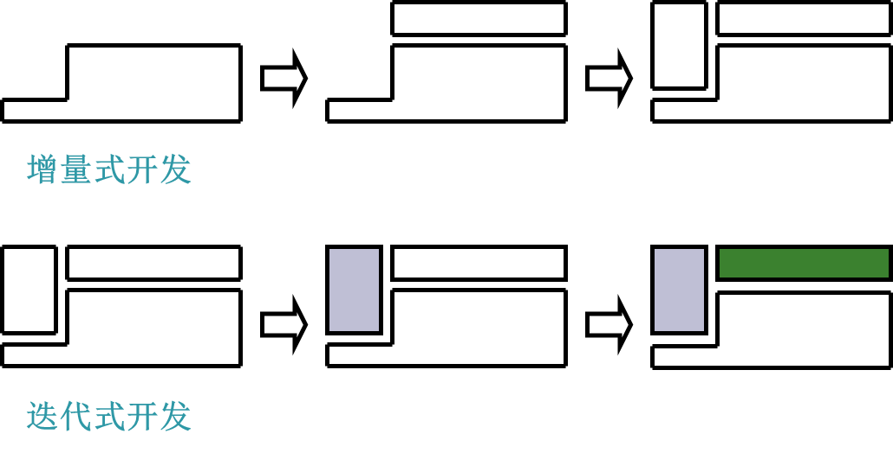

#### 4.1.3 演化过程模型

##### 演化模型概述

1. 提出背景

   - 开发过程中，业务和产品**需求经常变化**；

   - **严格的交付时间**使得开发团队不可能圆满完成软件产品，但是必须交付功能有限的版本以及应对竞争或商业压力

   - 往往很好地理解了核心产品需求，但是系统扩展的细节问题却没有定义


2. ==演化模型==是**迭代的过程模型**，每次迭代产生软件的一个更完整的版本

3. 演化模型分类
   - 原型开发
   - 螺旋模型

##### 原型开发

1. 背景

   - **客户**提出了一些基本功能，但未详细定义输入、处理和输出需求；

   - **开发人员**可能对开发运行环境、算法效率、操作系统的兼容性和人机交互等情况不确定。


2. 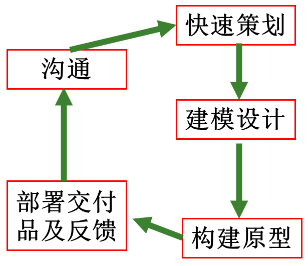 
3. 当需求很模糊的时候，原型开发模型都能帮助软件开发人员和利益相关者更好的理解究竟需要做啥
4. **使用前提**
   - 用户必须积极参与原型的建造，建造原型仅仅是为了定义需求，之后就必须被全部抛弃(至少是部分抛弃)
   - 必须有快速开发工具可供使用


5. 问题: 
   - 利益相关者看到了软件的工作版本，却未察觉到整个软件是随意搭成的，也未察觉到为了尽快完成软件，开发者没有考虑整体软件质量和长期的可维护性。当开发者告诉客户整个系统需要重建以提高软件质量的时候，利益相关者会不愿意，并且要求对软件稍加修改使其变为一个可运行的产品。因此，软件开发管理往往陷入失效。
   - 作为一名软件工程师，软件开发人员为了使一个原型快速运行起来，往往在实现过程中采用折衷的手段。他们经常会使用不合适的操作系统或程序设计语言，仅仅因为当时可用和熟悉。他们也经常会采用一种低效的算法，仅为了证明系统的能力。时间长了，软件开发人员可能会适应这些选择，而忽略了这些选择其实并不合适的理由，结果造成并不完美的选择变成了系统的组成部分的情况。


【注】原型是为定义需求服务的，然后丢弃原型，实际的软件系统是以质量第一为目标而开发的

##### 螺旋模型

1. ==螺旋模型==: 风险驱动的软件开发模型

   - 采用循环的方式，逐步加深系统定义和实现的深度（原型开发的迭代性质）；

   - 确定一系列里程碑，确保利益相关者都支持系统解决方案（瀑布模型的系统性和可控性）；

   - 第一圈一般开发出产品的需求规格说明，接下来开发产品的原型系统，并在每次迭代中逐步完善，开发不同的软件版本；

   - 项目经理还会调整完成软件开发需要迭代的次数；

   - 开发大型系统和软件的理想方法，更好地应对风险

   - 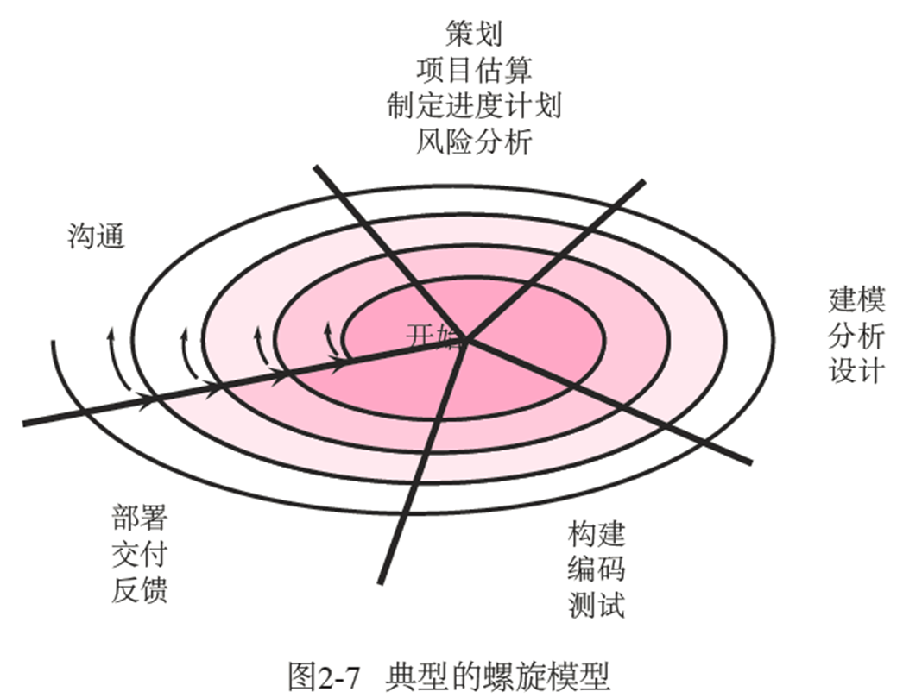 

2. 【注】它可以运用在应用系统开发的整个生命周期，从概念开发到维护

##### 演化模型总结

演化模型的问题: 

- 迭代周期**数目不确定**，大多项目管理和估算技术是**基于活动的线性布局**，所以并不完全适用于演化软件过程
- 演化模型没有确定演化的最快速度
- 演化模型侧重**灵活性和可延展性**，而**不是高质量**。（即: 演化模型优先追求开发速度，而不是零缺陷）

### 4.2 专用过程模型

专用过程模型往往应用面较窄且较专一，只适用于某些特定的软件工程方法

#### 4.2.1 基于构件的开发

1. **基于构件的开发模型**
   - 具有许多螺旋模型的特点，本质上是演化模型，需要以迭代的方式构建软件。
   - 不同之处在于，基于构建的开发模型采用**预先打包的软件**构建来开发应用系统

2. 优点: 能够使**软件复用**，减少项目开发费用，缩短开发周期
3. 建模和构建活动开始于**识别可选构件**。这些构件有些设计成**通用的软件模块**，有些设计成**面向对象的类或软件包**。不考虑构件的开发技术，基于构件开发模型由以下步骤组成（采用演化方法）: 
   1. 对于该问题领域研究和评估可用的基于构件的产品。
   2. 考虑构件集成的问题。
   3. 设计软件架构以容纳这些构件。
   4. 将构件集成到架构中。
   5. 进行充分的测试以保证功能正常。

#### 4.2.2 形式化方法模型

1. 主要活动: 生成**计算机软件形式化的数学规格说明**，使得软件开发人员可以应用严格的数学符号来说明，开发，验证系统

2. 优点: 应用数学分析的方法，歧义性问题、不完整问题、不一致问题等都能够更容易地发现和改正。在设计阶段，形式化方法是程序验证的基础，使软件开发人员能够发现和改正一些往往被忽略的问题。

3. 缺点: 

   - 开发非常耗时，成本也很高；

   - 只有极少数程序员具有应用形式化的背景，需要大量的培训；

   - 对于技术水平不高的客户，很难用这种模型进行沟通。

4. 应用: 高度关注安全性的软件（飞行器，医疗设施，经济领域）

### 4.3 统一过程

1. ==统一过程==(UP, Unified Process)
   - 注重于客户沟通以及从用户的角度描述系统，强调软件体系结构的重要性
   - **特点**: 用例驱动，以架构为核心，迭代并且增量
   - 统一过程认识到与客户沟通以及从用户的角度描述系统并保持该描述的一致性的重要性

2. 统一过程的**五个阶段**

   - **起始阶段**: 识别基本的业务需求，并用用例初步描述每一类用户所需要的主要特性和功能

   - **细化阶段**: 沟通和通用过程模型的建模活动

   - **构建阶段**: 采用体系结构模型作为输入，开发或是获取软件构建，使得最终用户能够操作用例

   - **转换阶段**: 通用构建活动的后期阶段以及通用部署活动的第一部分

   - **生产阶段**: 对持续使用的软件进行监控，提供运行环境的支持，提交并评估缺陷报告和变更请求

   - 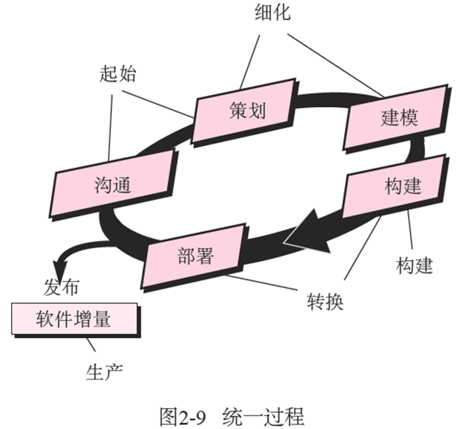 


## 第5章 敏捷开发

> 惯用过程模型对软件开发者的考虑不够到位, 缺乏人性化

### 5.1 什么是敏捷

1. ==敏捷开发==: 是一种软件开发方法论，可以应对客户快速变更的需求，它强调以人为核心，采用迭代的方式，循序渐进的开发软件
   - 敏捷团队是能够适当响应变化的灵活团队
   - 普遍存在的变化是敏捷的基本动力

2. 敏捷不仅仅是有效的应对变更，它

   - 鼓励能够使**沟通**更便利的团队结构和协作态度

   - 强调可运行软件的**快速交付**而不那么看重中间产品

   - 将**客户作为开发团队**的一部分开展工作

   - 意识到**计划是有局限性的**, 项目**计划**必须是可以**灵活调整**的 


#### 敏捷宣言

个体与交互      **胜过**       过程与工具
可用的软件      **胜过**       完备的文档
客户协作          **胜过 **      合同谈判
响应变化          **胜过**       遵循计划

#### 敏捷价值观

- 沟通: 促进团队内部的开发人员之间的沟通，以及团队和客户（project stakeholder不知道是不是）的沟通
- 简单: 画一两张图表来代替几十甚至上百行代码
- 反馈
- 勇气
- 尊重（谦虚）


### 5.2 敏捷变更的成本费用

传统: 

成本费用随着计划的进展成非线性增长，这种方法在软件开发团队收集需求时（在项目的早期）相对容易适应变更，在后期的话，费用会迅速升级

敏捷: 

设计良好的敏捷过程“拉平了”变更成本曲线

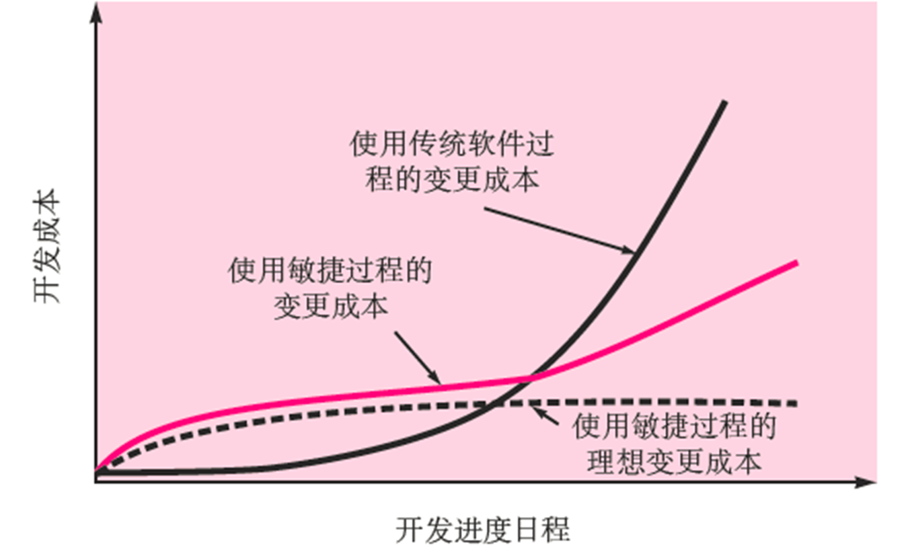 

### 5.3 敏捷过程

1. 为什么要使用敏捷过程
   - 软件开发过程中存在三个问题
     - 提前预测需求/变化比较难
     - 设计和构建是交替进行的
     - 软件开发的几大要素(分析, 设计, 构建和测试)都要不断调整
   - 解决上述问题需要**调整和反馈**, 即**自适应**和**增量提高的过程** 
   - 如何建立能解决不可预测性的过程？
     **过程的自适应性**。

2. 基于==敏捷原则==进行的软件开发过程，视为==敏捷过程==
   - 【注】**基于**: 指充分考虑，而不是全部包含

3. 敏捷原则
    1. 我们最优先要做的是通过**尽早、持续**地交付有价值的软件来使客户满意。
    2. 即使在开发的后期，也**欢迎需求变更**。敏捷过程**利用变更为客户创造竞争优势**。
    3. **经常交付可运行软件**，交付的间隔可以从几个星期到几个月，交付的时间间隔越短越好。
    4. 在整个项目开发期间，业务人员和开发人员必须天天都在**一起工作**。
    5. 围绕有积极性的个人构建项目。给他们**提供所需的环境和支持**，并且**信任他们**能够完成工作。
    6. 在团队内部，最富有效果和效率的信息传递方法是**面对面交谈**。
    7. **可运行软件**是进度的首要度量标准。
    8. 敏捷过程提倡**可持续的开发速度**。责任人（sponsor）、开发者和用户应该能够保持一个**长期的、恒定的开发速度** 。
    9. 不断地关注**优秀的技能和好的设计**会增强敏捷能力。
    10. **简单**是必要的。
    11. 最好的架构、需求和设计出自于**自组织团队**。
    12. 每隔一定时间，团队会**反省**如何才能更有效地工作，并相应**调整**自己的行为。

    - ※ 并不是每一个敏捷模型都同等使用这12项原则，一些模型可以选择忽略（或至少淡化）一个或多个原则的重要性。 

4. 敏捷软件过程必须增量的适应，为了达到这一目的，敏捷团队需要客户的反馈，可执行原型或者部分实现的可运行系统是客户反馈的最有效媒介。因此，应当使用**增量式开发策略**。
   - 这种迭代方法允许客户: **周期性的评价软件增量**，向软件项目组提出必要的防窥，影响为适应反馈而对过程进行适应性修改

5. 敏捷团队成员&团队本身的特点
   - 基本能力
   - 共同目标
   - 精诚合作
   - 决策能力
   - 模糊问题解决能力
   - 相互信任和尊重
   - 自组织: 组织团队，组织过程，组织进度


### 5.4 极限编程

1. ==极限编程==（E**x**treme **P**rogramming, XP）:  敏捷软件开发中使用**最广泛**的敏捷过程

2. 特点: 

   - 是一些相互关联的准则和惯例的集合

   - 追求变更曲线的平坦化

   - 适合于小团队，高风险的项目


3. XP使用面向对象方法作为推荐的开发泛型，它包含了**策划、设计、编码和测试**4个框架活动的规则和实践。 
   - 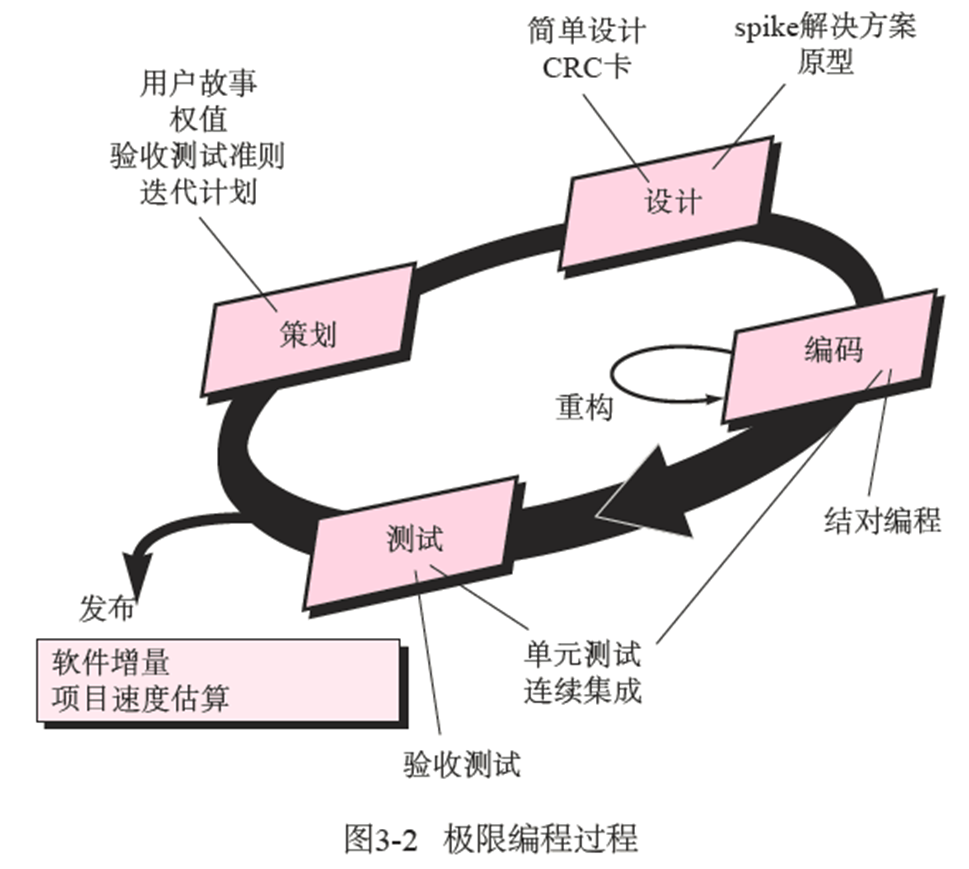 

#### 极限编程过程

1. 策划 
   - 建立描述软件特征&功能的**故事**(客户用自然语言描述系统的功能)
   - 评估故事, 估计成本(单位: 开发周数)
   - 故事分组, 分解为软件增量
   - 形成对发布版本的基本承诺
   - 对待开发故事进行排序 ①所有选定故事(下一个增量)必须在几周内完成 ②高权值优先 ③高风险优先
   - 第一个版本发布后, XP团队对开发速度进行估计
     - 估计后续版本的发布时间&进度安排
     - 确定是否对整个开发项目中的所有故事有过分承诺
   - 在开发过程中，客户可以增加故事，改变故事的权值，分解或者去掉故事。然后由XP团队重新考虑并修改计划。
2. 设计
   - 遵循**KIS**(Keep It Simple)原则
   - 使用**CRC卡**(类-责任-协作者)去顶当前软件增量相关的面向对象的类
   - **Spike解决方案**: 让不明确的评估成为明确的评估
   - 鼓励**重构**
3. 编码
   - 先开发测试用例再编码
   - 结对编程: 两人面对同一台计算机
     - 提供了**实时解决问题**和**实时质量保证**的机制
   - 结对工作完成后, 需要与其他人的工作**集成**起来
4. 测试
   - 单元测试使用自动测试框架, 支持回归测试策略
   - 将个人单元测试组织到一个**通用测试集**, 每天进行系统的**集成和确认测试**, 尽早发现问题
   - XP验收测试(客户测试): 客户校验系统的**特征和功能**(也就是用户故事)

#### 工业极限编程IXP

六个新的实践: 

- 准备评估
- 项目社区
- 项目特许
- 测试驱动管理
- 回顾
- 持续学习

#### 关于XP的争论

- 需求易变。因为客户是XP团队的成员，对需求的改变不是正式地提出。结果是，项目的范围会发生变化，早期的工作或许要进行修改来适应当前的要求。
- 矛盾的客户需求。许多项目都有众多客户，每个客户都有自己的一套需求。在XP中，团队自身需要吸纳不同客户的要求，这项工作可能超出了自己的职权范围。

### 5.5 其他敏捷过程模型

#### Scrum

原则与敏捷宣言是一致的，应用Scrum原则指导过程中的开发活动，过程由“**需求，分析，设计，演化，交付**“等框架性活动组成

每一个框架活动中，发生于一个过程模式中的**工作任务**称为一个**冲刺**（sprint）。冲刺中进行的工作（每一个框架活动中的冲刺的数目根据产品**复杂度**和**规模大小**而有所不同）适应于当前的问题，由Scrum团队规定并常常作实时修改。 

每一个过程模式定义一系列开发活动: 

- ***待定项: ***能为用户提供商业价值的**项目需求**或**特征**的优先级列表。待定项中可以随时加入新项(即变更的引入)。产品经理根据需要**评估待定项并修改优先级**。

- ***冲刺: ***（待定项的一部分，眼前具体的任务）由一些**工作单元**组成 ，并且必须能在预定的**时间段** (time-box)内(一般情况下为30天)完成。冲刺过程中不允许有变更(例如，积压工作项)。因此，冲刺给开发团队成员的工作提供了**短期但稳定的环境**。

- ***Scrum例会***: 每天召开的短会（一般为15min）会上所有成员都要回答三个问题: 

  - 上次例会后做了什么
  - 遇到了什么困难
  - 下次例会前计划做些什么

👆，站立式会议，任务看板，更新任务看板

团队领导（也称为Scrum主持人）主持会议并评价每个团队成员的表现。Scrum会议帮助团队尽早发现潜在的问题。同时，每日例会进一步促进自我组织团队的建设。

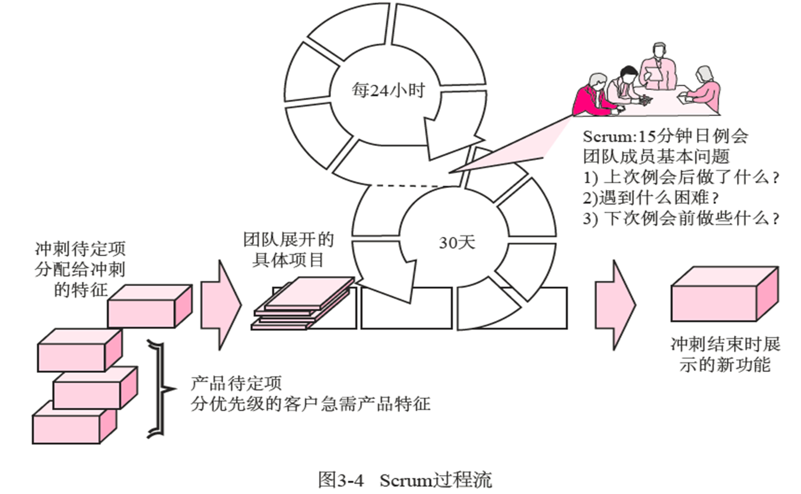

#### 动态系统开发DSDM

> 注意，这个是一种过程框架

提供一种框架，使其“通过在可控项目环境中使用增量原型开发模式来满足对时间有约束系统的构建和维护”

e.g: 如果交付整个应用系统需要100%的时间，那么80%的应用系统可以用20%的时间交付

特点: 每一个迭代都遵循**80%**原则，即每个增量只完成能够保证顺利进入下一增量的工作，剩余的细节则可以在知道更多业务需求或者提出并同意变更之后完成。

**生命周期活动**

1. **可行性研究**: 建立业务需求&相关约束, 评估是否应该采用DSDM
2. **业务研究**: 建立功能和信息需求, 确定系统架构, 识别可维护性需求
3. **功能模型迭代: **为客户开发一系列证明其功能的增量原型 (注意: 所有DSDM原型都倾向于逐渐发展成可交付的应用系统 )。迭代的意图是在用户使用原型系统时诱导出反馈信息以获取其他的需求。
4. **设计与构建迭代**: 重新构建原型以确保每一个原型都以工程化方式实现，并能为最终用户提供可操作的业务价值。 
5. **实现**: 将最终软件增量（一个可操作的原型）置于操作环境中，应当注意: 
  1. 增量不见得100%完成
  2. 增量置于操作环境以后可能需要改变

#### 敏捷建模AM

原则: 

- 有目的的模型: 在构建模型之前，开发者心中应当有明确的目标
- 使用多个模型: **每一种模型应当表达系统的不同侧面**，并且应使用能够为那些预期的读者提供**有价值的模型**
- 轻装上阵: 随着软件工程的进展，只**保留那些能够提供长期价值的模型**，抛弃其余的模型
- **内容重于表达形式**: 一个有用的内容很少，但语法完美的模型不如一个有缺陷但能向读者提供有用内容的模型更有价值。
- 理解模型及工具: 理解每一个模型及其构建工具的优缺点
- 适应本地需要: 建模方法应该适应敏捷团队的需要

#### 敏捷统一过程AUP

1. 全局串行, 局部迭代
2. 采用了经典UP**阶跃性活动**——开始，加工，构建以及变迁

3. 每个AUP迭代执行以下内容

   - 建模: UML建立了对商业和问题域的表述，为了保持敏捷，必须保证这些模型足够好

   - 实现: 将模型翻译成源代码

   - 测试: 设计/执行一系列测试来发现错误以保证源代码满足需求

   - 部署: 重点是对软件增量的交付以及获取最终用户的反馈信息

   - 配置及项目管理: 
     - **配置管理**着眼于变更管理/风险管理/开发团队的任一常效产品的控制
     - **项目管理**追踪和控制开发团队的活动情况和工作进展


   - 环境管理: 协调过程的基础设施


【注】UML可以与本章所讲的任一敏捷过程‘’模型相结合

## 第6章 软件工程的人员方面 【略！】

### 6.1 软件工程师的七种特质

1. 个人责任感
2. 对一些人的需求有敏锐的意识
   - 团队成员, 利益相关者, 管理者
3. 坦诚
4. 展现抗压能力
5. 有高度的公平感
6. 注重细节
7. 务实

### 6.3 软件团队

团队毒性: 

1. 混乱的工作氛围
   - 解决方案: 获取工作所需所有信息, 确定主要目标

2. 重大挫折使得团队成员产生摩擦
   - 解决方案: 给团队更多决策权, 增强信心
3. 糟糕的软件过程 (碎片式的或协调很差)
   - 解决方法: 允许团队选择过程模型
4. 成员角色模糊
   - 解决方法: 团队应该建立责任机制，并规定一系列当团队成员未能完成任务时的纠正方法。
5. 反复地失败
   - 解决方法: 建立基于团队的信息反馈方法和解决问题的技术

### 6.4 团队结构

**团队的四种组织模式**

1. 封闭式模式: 按照传统的权力层级模式，创新性较弱
2. 随机式模式: 松散的组织团队，依赖成员的主动性，很难完成”有秩序的操作”
3. 开放式模式: 尝试组成一种团队，有包含上两种团队的特性（可控性，创新型），但是效率没有其他团队高
4. 同步式模式: 依赖于问题的自然区分，不需要很多的交流就可以将成员组织起来共同解决问题

### 主程序员团队

> 从历史的角度看，最早的软件团队组织是封闭式模式结构，最初称为==主程序员团队==

一个高级工程师（主程序员）+技术人员（2-5人）+一个后备工程师

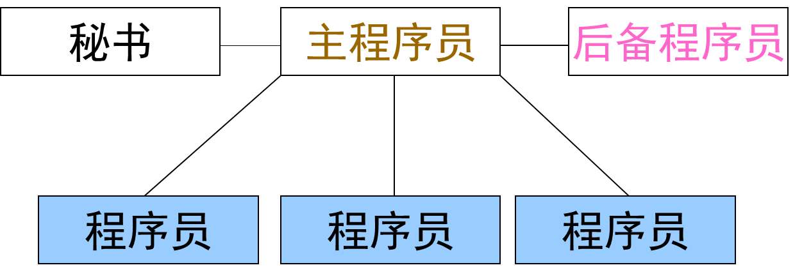 

优点: 

- 实现了项目人员分工专业化
- 降低了管理的复杂性，提高了工作效率

缺点: 现实社会中，缺乏同时具备高超管理才能和技术才能的“全才”

6.5 敏捷团队
6.6 社交媒体的影响
6.7 软件工程中云的应用
6.8 协作工具
6.9 全球化团队


## 第7章 理解需求 ※核心

需求工程——提供了解决挑战的可靠途径

### 7.1 需求工程

1. **软件需求**
   - 对期望的软件行为的表达
   - 分为 **功能需求** 和 **非功能需求**

2. **功能需求**: 描述系统预期提供的功能或服务
3. **非功能需求**: 不直接与系统具体功能相关的需求，
   - 产品需求: 性能 可靠性 可用性
   - 机构需求: 所在机构的政策和规定
   - 外部需求: 互操作需求、道德需求
4. ==需求工程==致力于**不断理解需求的大量任务和技术**。
   - 从软件过程的角度看，需求工程是一个软件工程动作，开始于沟通并持续到建模活动。他必须适用于过程，项目，产品和人员的需要
   - 需求工程在设计和构建之间建立起联系的桥梁（？，柯逍在这句话这里打了X，啥意思？）
5. 两种需求过程: 
   - **瀑布式需求**
     项目早期完全确定需求
   - **进化式需求**
     结合迭代开发，持续地寻找、记录、组织和跟踪不断变更的需求

#### 需求工程的任务

需求工程包括七项明确的任务

1. **起始**

   - 多数项目都是当确定了商业要求或是发现了潜在新市场、新服务时才开始
   - 项目起始阶段，要建立基本的理解
   
2. **获取**

   询问客户、用户和其他人: 

   - 系统的目标是什么
   - 想要实现什么
   - 系统和产品如何满足业务的要求
   - 最终系统或产品如何用于日常工作

   **获取过程**中最重要的是建立商业目标

   【注】导出需求中出现的问题

   *范围问题*: 一般发生在系统边界不清楚的情况下

   *理解问题*: 发生在客户和用户并不完全确定需要什么的情况下

   *易变问题*: 发生在需求随时间推移而变更的情况

   为了帮助解决👆，需求工程师必须以有组织的方式开展需求收集活动

3. **细化**

   - 将**起始**和**获取**阶段获得的信息在**细化**阶段进行扩展和提炼
   - 任务核心——开发一个精准的需求模型，用以说明软件的功能，特征和信息的各个方面
   
4. **协商**

   问题: 

   - 业务资源有限，客户和用户却提出了过高的要求
   - 不同的客户或用户提出了相互冲突的需求，并坚持自己的特殊需求至关重要

   需求工程师需要通过**协商**来调解这些冲突。

   用迭代的方法给需求排序，逐个评估成本和风险，表述内部冲突，删除、组合或修改需求，以便于各方均能达到一定的满意度

5. **规格说明**

   **两种需求文档: **

   1. **需求定义**: 客户要求的完整列表（对外）

      通常是由客户和需求分析师一起编写，是开发人员对系统功能的一个合同，主要给**客户**阅读

   2. **需求规格说明**: 要构建系统的规格化说明（对内）

      由需求分析师编写，并由其他**软件开发人员**使用

   **==软件需求规格说明== SRS**

   - 详细描述软件各个方面的文档
   
   - 很多项目没有写正规的SRS，很多实例表明花在软件需求规格说明的工作量还不如投入到其他软件工程活动
   
   - 但是以下几种情况规格说明显得非常必要
   
     （1）软件由第三方开发时
   
     （2）缺少规格说明将导致严重业务问题时
   
     （3）当系统非常复杂或设计十分重要的业务时
   
6. **确认**

   对需求工程的工作产品进行**质量评估**

   **正式的技术评审**是最主要的需求确认机制，确认需求的评审小组包括软件工程师，客户，用户和其他利益相关者，他们检查系统规格说明，并寻找: 

   - 内容/解释上的差错
   - 可能需要进一步澄清的地方
   - 丢失的信息
   - 不一致（开发大型系统时的主要问题）
   - 冲突或不现实的需求

   【注】质量需求越关键，越要采用量化术语来陈述！

    	某些情况下，常见质量需求可以使用定性技术进行验证，在其他情况下，质量需求可以使用定性和定量相结合的评估方式进行验证

7. **需求管理**

   对于基于计算机的系统，其需求会变更，而且变更的要求贯穿于系统的整个生命周期

   **需求管理**是用于帮助项目组在项目进展中标识、控制和跟踪需求以及需求变更的一组活动

【注】这些需求工作中的一些任务会并行发生，并且要全部适应项目的要求

### 7.2 建立根基

确认利益相关者——>识别多重观点——>协同合作——>首次提问（欸奇怪这个是流程吗？）

1. **确认利益相关者**
   - 两个大佬对利益相关者的定义: **直接**或**间接**地从正在开发的系统中获益的人
   - 每个利益相关者对系统有不同的考虑，开发成功后获得的利益也不同，失败面临的风险也不同

2. **识别多重观点**
   - 参与者都将为需求工程贡献信息，**从多个角度收集信息时，所形成的需求可能存在不一致性或是相互矛盾**。需求工程师把所有利益相关者提供的信息分类，便于决策制定者为系统选择一个内部一致的需求集合

3. **协同合作**

   - 需求工程师的工作是**标识公共区域** (即所有利益相关者都同意的需求)和**矛盾区域或不一致区域** (即某个利益相关者提出的需求和其他利益相关者的需求相矛盾）。

4. 首次提问

   - 项目开始时的提问应该是“与环境无关的”

   - 三组问题，分别用来: 

     - 识别所有对构建软件感兴趣的利益相关者

     - 有助于软件开发组更好的理解问题

     - 关注与沟通活动本身效率有关的问题
     - 👆这些问题有助于"打破坚冰"，并有助于交流的开始

   - 【注】Q&A会议应该仅仅用于首次解除，然后应该用问题求解、协商和规格说明等需求获取方式来取代

### 7.3 获取需求

需求获取（需求收集）将问题求解、细化、协商和规格说明等方面的元素结合起来在一起

#### 7.3.1 协作收集需求

1. **基本原则**

   - **会议**由软件工程师和其他的利益相关者共同举办和参与。

   - 制定筹备和参与会议的**规则**。

   - 建议拟定一个会议**议程**，这个议程既要足够正式，使其涵盖所有的重点，但也不能太正式，以鼓励思想的自由交流。

   - 由一个“**调解人**”(可以是客户、开发人员或其他人)控制会议。

   - 采用“**方案论证手段**”(可以是工作表、活动挂图、不干胶贴纸或电子公告牌、聊天室或虚拟论坛)。


2. 目的: **识别问题**

   - 提出解决方案的要素，协商不同的方法以及在有利于完成目标的氛围中确定一套解决需求问题的初步方案。

   - ==小规格说明==: 列表所描述的对象或服务需要更多的解释，为了完成这一任务，利益相关者为列表中的条目编写**小规格说明**
   - 

3. **质量功能部署QFD**

   - 质量功能部署是一种将客户要求转化成软件技术需求的技术
   - 目的: 最大限度的让客户从软件工程过程中感到满意

   - 一些小概念: 

     - **常规需求**: 会议中向客户陈述一个产品或系统时的目标，如果这些需求存在，客户会满意

     - **期望需求**: 客户没有清晰表述的**基础功能**，缺少了会引起客户的不满

     - **兴奋需求**: 超出客户预期的需求，这些需求存在时会令人非常满意


4. **用户场景**
   - ==场景==: 通常称为==用例==，它提供了将如何使用系统的描述 (类似于举例)

5. 获取工作产品
   - 根据将要构建的系统或产品规模的不同，需求获取后产生的工作产品也不同


### 7.4 开发用例

1. ==用例==: 从最终用户的角度描述了软件或系统

   - 撰写用例的第一步: 确定故事中所包含的“参与者”

   - ==参与者==: 在功能和行为环境内使用系统或产品的各类人员(或设备)。参与者代表了系统运行时人(或设备)所扮演的角色。
     - 【注】参与者!=最终用户
       用户可能在使用系统的时候扮演了许多不同的角色，参与者在用例中仅扮演一种角色
     - 例如，考虑**一个机床操作员(一个用户)**，他和生产车间 (其中装有许多机器人和数控机床)内的某个控制计算机交互。在仔细考察需求后，控制计算机的软件需要**4种不同的交互模式(角色)**: 编程模式、测试模式、监测模式和故障检查模式。因此，**4个参与者**可定义为: 程序员、测试员，监控员和故障检修员。
   - 参与者的分类
     - **主要参与者**: 直接且经常使用软件、获取所需的系统功能并从系统得到预期收益。
     - **次要参与者**: 支持系统，以便主要参与者能够完成他们的工作。

2. **基本用例**从较高层次上给出参与者与系统之间交互的故事，但是在很多情况下，需要进一步细化用例以便为交互提供更详细的说明。

   - 模板: 

     ```pseudocode
     用例: 用例名
     主要参与者: 
     目标: 
     前提条件: 
     触发器: 
     场景: 
     1. 
     2. 
     3. 
     异常: 
     1. 
     2. 
     3. 
     优先级: 
     何时可用: 
     使用频率: 
     使用方式: 
     次要参与者: 
     次要参与者使用方式: 
     
     未解决的问题: 
     
     ;;; SafeHome用例模板
     用例: 初始化检测
     主要参与者: 房主
     目标: 设置系统在房主离开住宅or留在房间内时检测传感器
     前提条件: 系统已输入密码 并 识别各种传感器
     触发器: 房主决定"设置"系统, 即打开报警功能
     场景: 
         1. 房主: 观察控制面板
         2. 房主: 输入密码
         3. 房主: 选择"stay"or"away"
     异常: 
         1. 控制面板没有准备就绪：房主检查所有的传感器，确定哪些是开着的（即门窗是开着的），并将其关闭。
         2.密码不正确（控制面板鸣叫一声）：房主重新输人正确的密码。
         3.密码不识别：必须对监测和响应子系统重新设置密码。
         4.选择stay：控制面板鸣叫两声而且stay灯点亮；激活边界传感器。
         5.选择away：控制面板鸣叫三声并且away灯点亮；激活所有传感器。
     优先级: 必须实现
     何时可用: 第一个增量
     使用频率: 每天多次
     使用方式: 控制面板接口
     次要参与者: 技术支持人员, 传感器
     次要参与者使用方式: 
      技术支持人员：电话线。
      传感器：有线或无线接口
     未解决的问题: 
         1.是否还应该有不使用密码或使用缩略密码激活系统的方式？
         2.控制面板是否还应显示附加的文字信息？
         3.房主输入密码时，从按下第一个按键开始必须在多长时间内输入密码？
         4.在系统真正激活之前有没有办法关闭系统？
     可以使用类似的方法开发其他房主的交互用例。重要的是必须认真评审每个用例。如果某些交互元素模糊不清，用例评审将解决这些问题
     ```

   - 实现方法: 用例图！
     - e.g safehome用例图
       

### 7.5 构建分析模型

需求模型=分析模型


#### 7.5.1 分析模型的元素 ※要会画图！！！

##### 基于场景的元素

==基于场景的元素==：可以从用户的视角描述系统

- e.g 用例，用例图，活动图

##### 基于类的元素

每个使用场景都暗示着当一个参与者和系统交互时所操作的一组对象。

这些对象被分成类—具有相似属性和共同行为的事务集合。

- e.g UML类图
  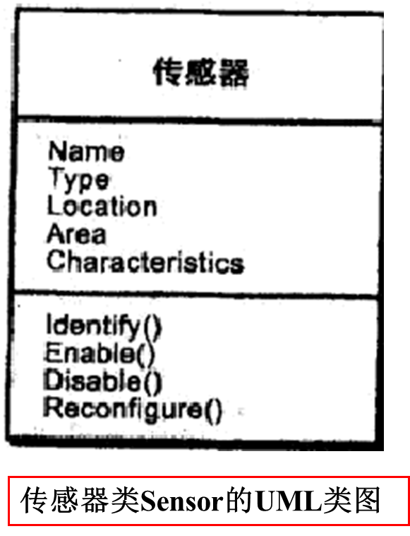 

##### 行为元素

==行为元素==：

- 状态图是一种表现系统行为的方法，该方法描绘：
  - 系统状态
  - 导致系统改变状态的事件
  - 某个特殊事件后采取什么动作

- e.g 状态图
  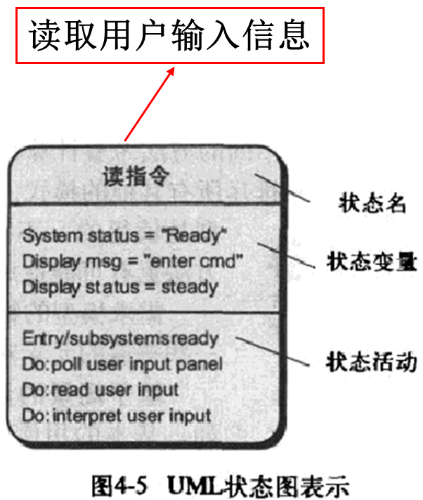 


##### 一些图的画法

1. **UML活动图** 
   - 
   - 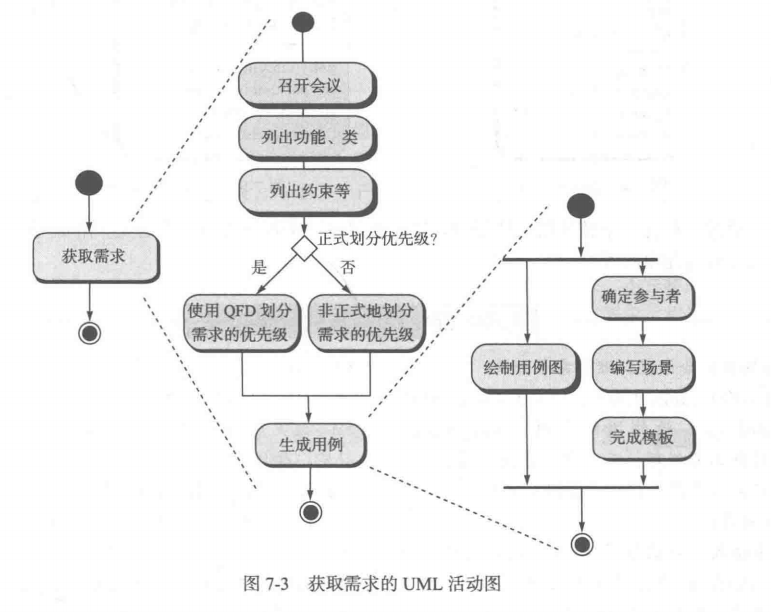 

**类图和状态图**

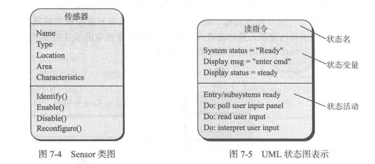

#### 7.5.2 分析模式

分析模式在特定应用领域内提供一些解决方案（如类，功能，行为），在为许多应用项目建模时都可以重复使用

优点: 

- 提高了抽象分析模型的开发速度

- 有利于把分析模型转变到设计模型

#### 7.5.3 协商需求

1. 详细的客户需求几乎不可能完全得到, 所以需要与利益相关者进行==协商==, 要让利益相关者以成本和产品投放市场的时间为背景，平衡功能、性能和其他的产品或系统特性。
2. 最好的协商是争取“双赢”的结果：
   - 利益相关者的“赢”在于获得满足客户大多数需要的系统或产品；
   - 软件团队的“赢”在于按照实际情况、在可实现的预算和时间内完成工作。
3. 每个软件过程迭代启动时的协商活动：
   1. 识别系统或子系统关键的利益相关者。
   2. 确认利益相关者“赢”的条件（客户优先）。
   3. 就利益相关者“赢”的条件进行协商，以便使其与所有涉及人(包括软件团队)的一些双赢条件一致。

#### 7.5.4 确认需求

当需求模型的每个元素都已创建时，需要检查一致性、是否有遗漏以及歧义性

### 7.6 避免常见错误

作为软件团队实施需求工程时必须避免的三个相关错误：

- **特性偏好**是指以**功能覆盖率**来表征整体系统质量的做法。一种软件开发者倾向快速实施简易功能，而不考虑它们的质量。事实上软件项目失败的最常见原因之一是缺少可实用的质量——而不是丢失功能。为了避免落入这个陷阱，你应与其他利益相关者讨论系统必需的关键功能，确保每项已交付的功能都具备了所有必要的质量特性。
- **灵活性偏好**发生在软件工程师**过分重视产品的自适应性和配置便利性**时。过分灵活的系统会很难配置，并且可操作性差，这是系统范围定义混乱的征兆。结果是“灵活”系统产生了不必要的复杂性，越难测试就会有越多的管理挑战。
- **性能偏好**是指软件开发者**过分关注质量特性**的方面的系统性能开销，如可维护性、可靠性和安全性。系统性能特性应该部分取决于非功能软件需求的评估。性能应该与产品的商业需求一致，同时必须与其他系统特性相兼容。


## 第8章 需求建模: 基于场景的方法

### 8.1 需求分析

#### 8.1.1 总体目标和原理

1. 需求建模动作产生以下一种或者多种模型类型

   - **场景模型**: 出自各种系统“参与者”观点的需求。

   - **数据模型**: 描述问题信息域的模型。

   - **面向类的模型**: 表示面向对象类(属性和操作)的模型，其方式为通过类的协作获得系统需求。

   - **面向流程的模型**: 表示系统的功能元素并且描述当功能元素在系统中运行时怎样进行数据变换的模型。

   - **行为模型**: 显示了软件如何对外部事件或激励做出相应。


2. 在整个分析建模的过程中，软件工程师的主要关注点集中在**做什么**而不是**怎么做**

3. **需求模型的三个主要目标**

   - 描述用户需要什么

   - 为软件设计奠定基础

   - 定义在软件完成后可以被确认的一组需求


需求模型在系统级描述和软件设计之间建立了一座桥梁

#### 8.1.2 分析的经验原则

**创建分析模型时应该遵循的规则**

1. 关注在问题域或业务域内**可见的需求**，抽象级别应该相对高一点
2. 需求模型的**每个元素**都应能增加对软件需求的**整体理解**，并提供对**信息域，功能，系统行为**的深入理解
3. 关于**基础结构**和其他**非功能的模型**应**推延**到设计阶段再考虑
4. **最小化**整个**系统内的关联**, 
5. 确认**需求模型**为**所有利益相关者都带来价值**
6. 尽可能保持**模型简洁**

#### 8.1.3 域分析

1. **目标: **查找或创建那些广泛应用的分析类或分析模式，使其能够复用。
2. **域分析师**的角色是发现和定义可复用的分析模式、分析类和相关的信息（剽窃？）
   - 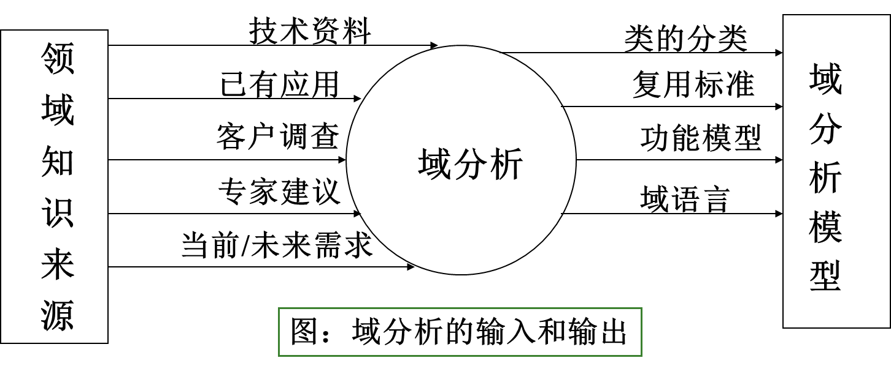 

#### 8.1.4 需求建模的方法

1. 结构化分析

   考虑数据和处理的需求建模方法

2. 面向对象的分析

   -  

   【注】柯逍课件里面写得四类需求建模方法

   - **基于场景的元素**: 表述用户如何与系统和使用软件时出现的特定活动序列进行交互。
     - 用例, 用户故事
   - **基于类的元素: **描述了系统操作的对象、对象间关系(某层级)，以及定义的类间发生的协作。
     - 类图, 协作图
   - **行为元素**: 描述了外部事件如何改变系统或驻留在系统里的状态。
     - 状态图, 顺序图
   - **面向流的元素: **表示信息转换的系统，描述了数据对象在流过各种系统功能时是如何转换的。(输入 - 处理 - 输出)
     - 数据流图, 数据模型

### 8.2 基于场景建模

#### 8.2.1 创建初始用例

**用例**: 帮助定义系统之外存在什么以及系统应该完成什么，即用例从某个特定参与者的角度出发，采用简明的语言描述一个特定的使用场景。但是问题是: 

1. 编写什么
2. 写多少
3. 编写说明应该多详细
4. 如何组织说明

开始开发用例时，应该列出特定参与者执行的功能或活动。这些可以借助所需系统功能的列表，通过与利益相关者交流，或通过评估活动图（作为需求建模中的一部分而开发）获得

#### 8.2.2 细化初始用例

为了全面理解用例描述功能，对交互操作给出另外的描述是很有必要的。

主场景中的每一个步骤都将通过如下提问得到评估: 

- 在这一状态点，参与者能进行一些**其他动作**吗?
- 在这一状态点，参与者有没有可能遇到一些**错误的条件**?如果有可能，这些错误会是什么?
- 在这一状态点，参与者有没有可能遇到一些**其他的行为**(如由一些参与者控制之外的事件调用)?如果有，这些行为是什么?

👆这些问题的答案导致创建一组次场景，次场景属于原始用例的一部分，但是表现了可供选择的行为

👇以下问题也值得关注

- 在这些用例中是否可以支持功能(或参与者)的应答失败？
- 性能差的系统是否会导致无法预期或不正确的用户活动？

##### 编写正式用例

非正规用例对于需求建模常常是够用的。
但是，当一个用例包含关键活动或描述一套具有大量异常处理的复杂步骤时，就会希望采用更为正规的方法。


### 8.3 补充用例的UML模型

#### 图形化用户场景

每种需求建模方法都有其局限性，用例方法也无例外: 
- 如果描述不清晰，用例可能会误导或有歧义。
- 对于必须特别详细和精准的需求建模情景 (例如安全关键系统)，图形化的表示方法更有助于理解。

可以使用: 

- 用例图
- 活动图
- 泳道图

👆这些要会画

见[简答&综合 ](./简答&综合.md) 

### 8.4 补充 数据建模

> 数据库

1. ==数据建模==：定义在系统内处理的所有**数据对象**、数据对象之间的**关系**以及其它与这些关系相关的信息。
2. 什么是==数据对象==？
   - 任何必须被软件理解的复合信息的表示；
   - 所谓复合信息是指具**有一系列不同性质或属性的事物**，仅有单个值的事物 (例如，宽度)不是数据对象。
     - 但“维度”(包括宽度、高度和深度)可以被定义为一个对象。
   - 数据对象可能是外部实体 (例如产生或使用信息的任何东西)，事物 (例如报告或显示)，偶发事件 (例如电话呼叫)或事件 (例如警报)，角色 (例如销售人员)，组织单位 (例如财务部)，地点 (例如仓库)或结构 (例如文件)。
     - 例如，一个人或一部车可以被认为是数据对象，它们可以用一组属性来定义。
3. 什么是数据属性？
   - 数据属性定义了数据对象的性质，可用于：
     - 命名数据对象的实例（命名属性）
     - 描述某个实例（描述属性）
     - 建立对另一个表中的另一个实例的引用（引用属性）
   - 标识符的值是唯一的，但不是必须的。
   - 可以把一个或多个属性定义为标识符。
   - 也就是说，当我们要找到数据对象的一个实例时，标识符属性成为一个“键”。
   - 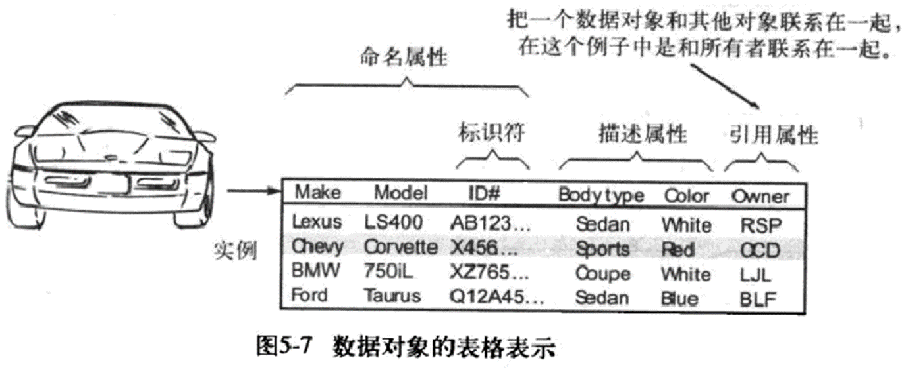
4. 什么是关系？
   - 数据对象之间的联系
   - 数据对象可以以多种不同的方式与另一个数据对象连接。箭头方向可以减少歧义和误解。
   - 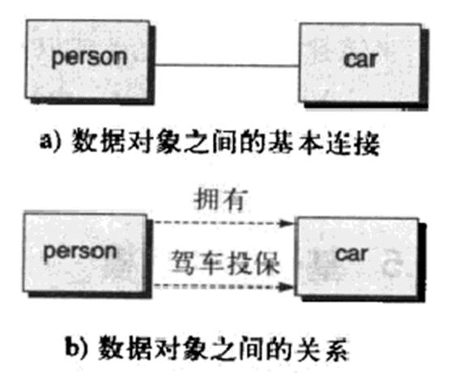 
5. 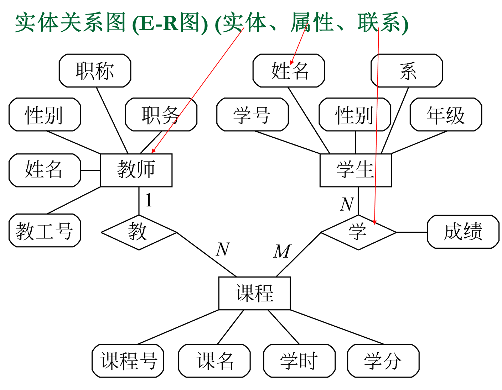 
   - ~~闹麻了 前面铺垫那么多最后丢出来一张ER图~~

## 第9章 需求建模: 基于类的方法

1. 基于类的分析模型的元素包括: 

   - 类和对象

   - 属性

   - 操作

   - CRC模型

   - 协作图

   - 包


2. 建模过程
    1. 通过检查问题描述来识别类
    2. 分离潜在类
    3. 识别类的所有属性
    4. 定义操作

### 9.1 分析和识别类

进行**语法解析**，第一次出现的**名词**加下划线，第一次出现的**动词**用斜体

抽取名词来获得潜在类

分离出所有名词，我们该寻找什么？分析类表现为

- 外部实体 (其他系统、设备、人员)
- 事物 (报告、显示、字母、信号)
- 偶发事件或事件
- 角色 (经理、工程师、销售人员)
- 组织单元 (部门、组、团队)
- 场地 (制造车间或码头)
- 结构 (传感器、四轮交通工具、计算机)

在分析模型中，分析师考虑每一个潜在类是否应该使用如下这些特征

- 保留信息: 必须记录潜在类的信息才能保证系统正常工作
- 所需服务: 有一组可确认的，能改变属性值的操作
- 多个属性: 只有一个属性的类可能在设计中有用，但在分析阶段，更适合作为另一个类的某个属性
- 公共属性: 可定义一组属性，它们适用于该潜在类的所有实例
- 公共操作: 可定义一组操作，它们适用于该潜在类的所有实例
- 必要需求: 在问题空间中出现的外部实体、或者任何系统解决方案的运行所必需的信息

【注】某些被拒绝的潜在类（不符合上述特征）将成为被接收类的属性
对问题的不同陈述可能导致作出“接收或拒绝”不同的决定

### 9.2 描述属性

**属性**: 属于类的“东西”

课本: 属性描述了已经选择包含在需求模型中的类。实质上，属性定义了类，以澄清类在问题空间的环境下意味着什么

【注】如果有超过一个项和某个类相关联，应该避免把这个项定义为属性

### 9.3 定义操作

1. **操作**定义了某个对象的行为

2. 操作的四个类型

   - 以某种方式**操作数据** (例如: 添加、删除、重新格式化、选择)；

   - 执行**计算**的操作；

   - 获取某个对象**状态**的操作；

   - **监视**某个对象发生某个**控制事件**的操作。

#### 例

平面设计类(FloorPlan)的类图

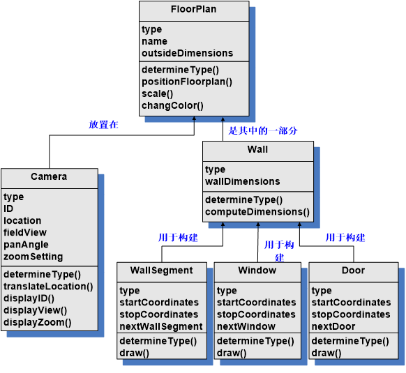

### 9.4 CRC建模

1. ==CRC (Class-Responsibility-Collaborator，类-职责-协作者)建模==：提供了一个简单方法，用于识别和组织与系统或产品需求相关的类。
2. CRC模型是表示类的标准索引卡片的集合，分为三部分
   - 顶部写类名
   - 左侧列出类的职责（与类相关的属性与操作）
   - 右侧列出类的协作者（提供完成某个职责所需要信息的类）
   - 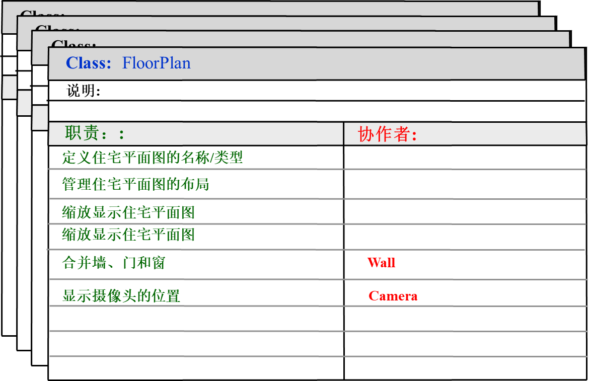 

#### 9.4.1 类

类的分类可以通过如下三种分类方式进行拓展

- **实体类**: 也称**模型或业务类**，是从问题说明中直接提取出来的。

- **边界类**: 用于创建用户可见的和在使用软件时**交互的接口**(如交互屏幕或打印的报表)。

- **控制类**: 用于管理“工作单元”，控制类可以管理: 
  
  1. 实体类的创建或更新；
  2. 边界类获取信息后的实例化。
  3.  对象集合间的复杂通信。
  4.  对象间或用户和应用系统间交换数据的确认。

  通常直到设计开始时才开始考虑控制类

##### 类间的三种通用关系

1. is-part-of（是。。。的一部分）
2. has-knowledge-of(有。。。的知识): 一个类需要从另一个类中获取信息时
3. depends-upon（依赖。。。）: 依赖关系

#### 9.4.2 职责

**职责的5个指导原则**

1. **智能系统**应分布在所有类中以求最佳地满足问题的需求
2. 每个职责的说明应尽可能具有普遍性
3. 信息和与之相关的行为应放在同一个类中
4. 某个事物的信息应局限于一个类中而不要分布在多个类中
5. 职责应由相关类共享

#### 9.4.3 协作

类有两种方法实现其职责：
(1) 类可以使用其自身的操作控制各自的属性，从而实现特定的职责；(自主完成)
(2) 一个类可以和其他类协作

### 9.5 关联与依赖

#### 9.5.1 关联

- 两个分析类以某种方式相互联系着，这些联系被称作==关联==(associations)。
- 在某些情况下，关联可以更进一步地指出多样性。多样性限制的表示：
  - `1..* `表示一个或多个
  - `0..*` 表示0或多个
  - `*` 表示范围无上界
- 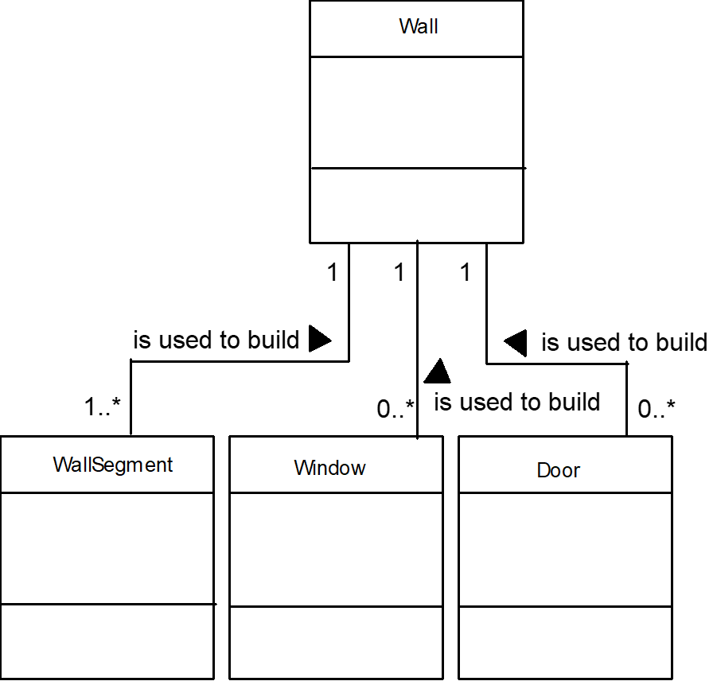 

#### 9.5.2 依赖

1. 一个Camera对象向一个DisplayWindow对象提供视频图像。这两个对象间的关系不是简单的关联，而是存在着依赖关系。
   - 建模者必须提供特定的密码才能查看指定摄像机的位置。`《access》`意味着通过特定的密码控制使用摄像机的输出。
   - 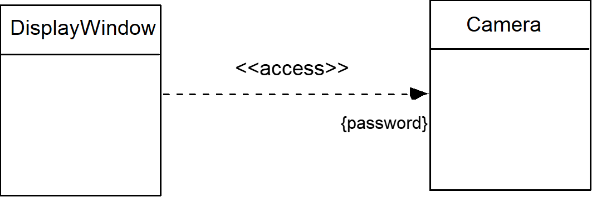 

### 分析包

将分析模型的各种元素以一种方式分类，分组打包后称为分析包，并取一个有代表性的名字

e.g

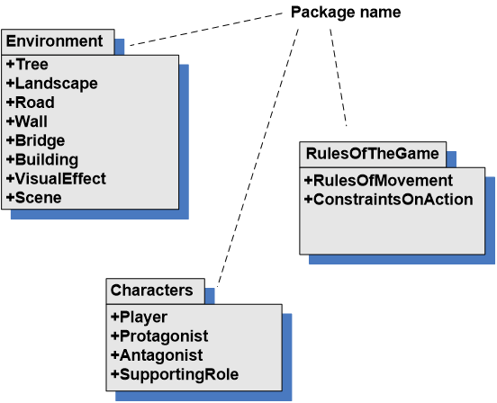

`+`: 该类是公共可见的 public

`-`: 该类对其他包是隐藏的 private

`#`: 只能由指定包中的类访问该元素 protect


## ? [补充] 面向流程建模 ※

1. 描述了数据对象在系统中的变换过程
2. 采用数据流图（DFD），状态迁移图等

#### DFD

1. 符号: 
   - 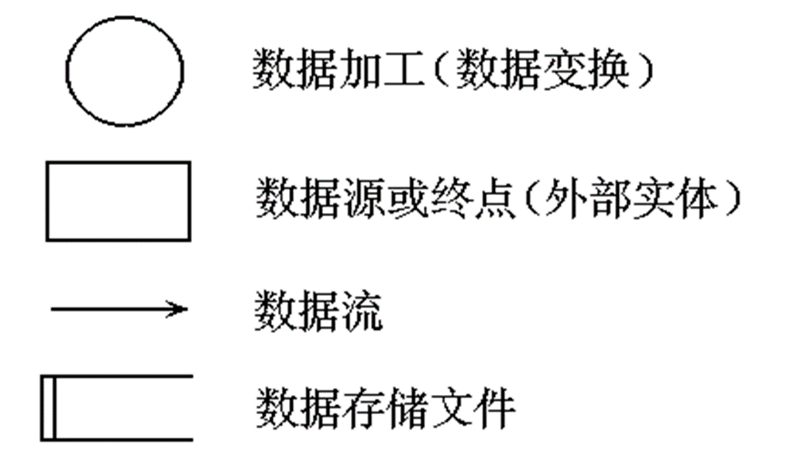 

2. 例子: 
   - 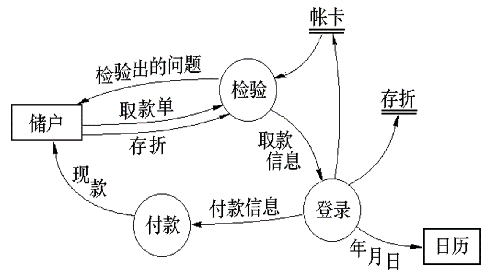 
   - 外部实体：储户、日历 
   - 处理(数据变换)：检验、登录、付款
   - 数据存储：帐卡、存折

3. DFD使用**分层**的方式来表示
   - 第一个数据流模型（第0层DFD，也称为==环境图==）表示整个系统，随后的数据流图改进环境图，在为一个后续层提供更多的细节。
   - 当把DFD逐步细化时，分析师同时也就完成了系统功能分解。
   - 与此同时，当数据在应用系统中的多个处理间流动时，DFD的精炼结果导致了相应的数据精化。

4. 指导原则
   1. 第0层DFD（也称环境层DFD或顶层DFD）将系统描述成一个泡泡；
   2. 仔细标记主要的输入和输出；
   3. 通过把选定的处理、数据对象和数据存储分离为下一层表示而开始精化过程，即逐步求精，一次精化一个处理；
   4. 使用有意义的名称，标记所有的箭头和泡泡；
   5. 从一层转至另一层时，注意保持信息流的连续性；
   6. 一次精化一个泡泡。
   7. 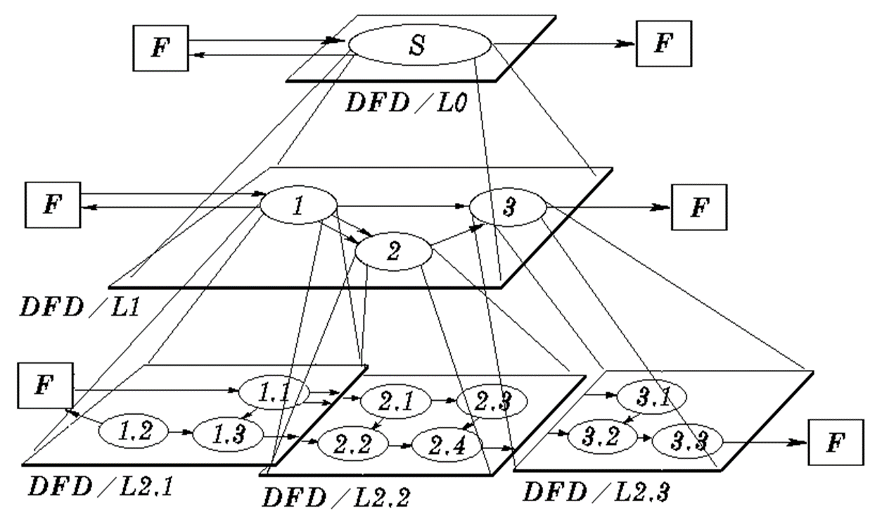 

5. **如何将第0层DFD扩展到第1层数据流模型？**
   - 对描述环境层泡泡的用例叙述采用语法解析的方法
   -  根据语法解析: 
     - **动词**是处理，在后续的DFD中用泡泡表示
     - **名词**是外部实体（方框)、数据或控制对象(箭头)、数据存储(双横线)。
   - 在**任何DFD层次**中对某个泡泡的**处理叙述文字**进行**语法解析**，可以产生许多如何精化到下一个层次的有用信息。
   - 持续进行DFD的求精，直到每个泡泡都执行了某个单一的功能，也就是说，直至每个泡泡所代表的处理都执行一个功能，并且该功能可以很容易地成为一个程序构件。
   
   - 【注】DFD之间的数据流必须要连续

##### 例

1. SafeHome安全功能的环境层DFD
   - 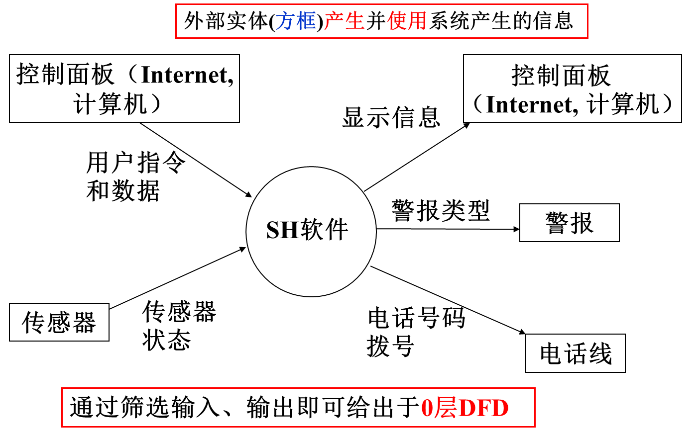 
2. 第一层DFD
   - 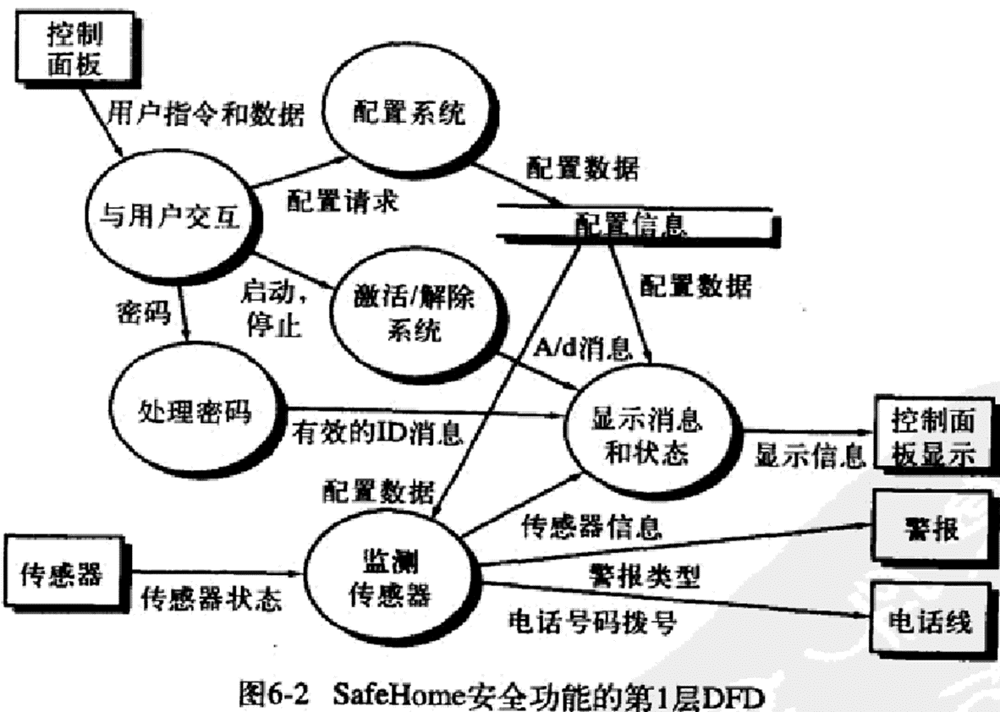 
3. 第二层DFD(监测传感器) (始终记得验证输入与输出)
   - 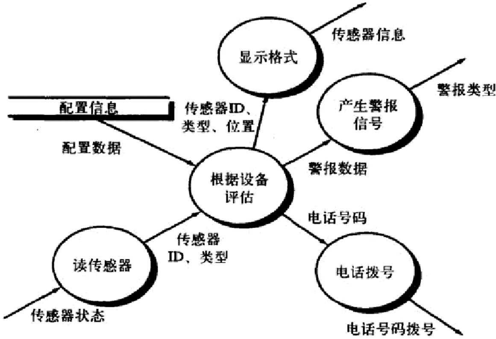 
4. SafeHome安全功能的状态图
   - 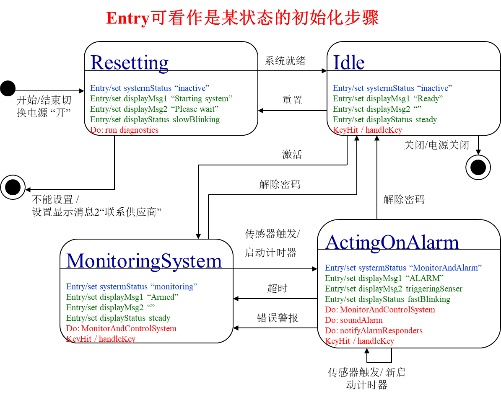

#### 判定表

一个表格，描述条件和条件导致的动作的集合

- 例: 
  -  

#### 数据字典

1. 管理各种关系模型中的信息，具体信息包括: 

   - 一般信息: 名字、别名、描述等；

   - 定义信息: 数据类型、长度、结构；

   - 使用特点: 值的范围、使用频率、使用方式；

   - 控制信息: 来源、使用它的程序；

   - 分组信息: 父结构、从属结构、物理位置等；

2. 数据元素组成数据对象的方式: 

   - 顺序: 两个或多个分量以确定次序进行连接；

   - 选择: 从两个或多个可能的元素中选取一个；

   - 重复: 把指定的分量重复零次或多次。

3. 符号: 

   - `=  `等价于

   - `+`和

   - `[]`或 (选择一个，用|隔开分量)
     - 例: 字母或数字 =  [字母字符 | 数字字符]

   - `{ }` 重复 ，(左右的数字分别为重复次数的上、下界)
     - 例: 字母数字串 = 0{字母或数字}7   (可重复0-7次)

   - `( ) `可选 (即从括号从中任选一项，也可一项都不选)

4. 例

   - 

   - 

## 第10章 需求建模: 行为和模式

### 10.1 生成行为模型

**行为模型**显示了软件如何对外部**事件**或激励做出**响应**

### 10.2 识别用例事件

1. ==事件==的产生: 只要系统和参与者之间**交换了信息就发生了事件**
- 【注】事件应该不是被交换的信息，而是已交换信息的**事实**
   
- 对于事件: 
   
  - 应确认每个事件的**参与者**
   
  - 应标记**交换的所有信息**
   
  - 应列出任何**条件或限制**


2. 一旦确定了所有的事件，这些事件将被分配到所**涉及的==对象==**。
   - 对象负责生成事件
     - 例如，Homeowner房主**对象** 生成 “输入密码”**事件**；
   - or识别已经在其他地方发生的事件
     - 例如，ControlPanel控制面板**对象** 识别 “比较密码”**事件**的二元结果。

### 10.3 状态表达

#### 两种不同的状态描述

1. 系统执行其功能时每个类的状态
2. 系统执行其功能时从外部观察到的系统状态

#### 类的状态

类状态有主动/被动之分

- **被动状态**——某个对象**所有属性**的**当前状态**

- **主动状态**——对象进行**连续变换和处理**时的当前状态
  - 必然存在**前后不同状态**。比如，移动、休息、受伤、疗伤、被捕、失踪等；
  - 必然发生事件（触发器）才能迫使对象做出从一个主动状态到另一个主动状态的迁移

#### 具体实现: 

##### 状态图

状态图描述类的**对象**所有可能的状态，以及事件发生时状态的转移条件。他们可以告知一个对象可以拥有的状态，并且事件会怎么随着时间的推移来影响这些状态。

状态图是对类图的补充。

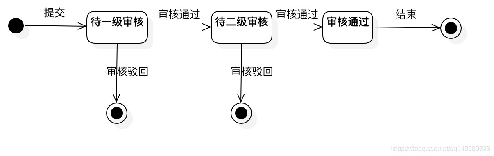

##### 活动图

==活动图==描述用例要求所要进行的活动，以及活动间的约束关系，有利于识别并行活动。能够演示出系统中哪些地方存在功能，以及这些功能和系统中其他组件的功能如何共同满足前面使用用例图的业务需求。

活动图是状态图的一种特殊情况，这些状态大都处于活动状态。本质是一种**流程图**，它描述了活动到活动的控制流。


UML活动图在特定场景内通过提供迭代流的图形化表示来补充用例。

- 两端为半圆形的矩形表示一个特定的系统功能
- **箭头**表示通过系统的流
- **判定菱形**表示判定分支
- **实心水平线**意味着并行发生的活动。(见后面的案例)


##### 顺序图

==顺序图==是将交互关系表示为一个二维图：

- 用时间函数表明事件如何引发从一个**对象**到另一个**对象**的转移。
- 每个箭头代表了一个事件；
- 时间纵向向下度量；消息的顺序是从左到右排列；
- 窄的纵向矩形表示处理某个活动所用的时间。

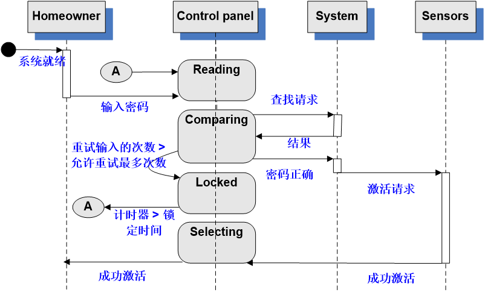

#### 类

类包括: 

- 边界类
- 控制类
- 实体类

### 10.4 需求建模的模式

==软件模式==是获取领域知识的一种机制，从而遇到新问题时可以反复使用。

- 在某些情况下，领域知识在同一应用领域中用于解决新问题。
- 在另外一些情况下，通过模式获取的领域知识可借助模拟用于完全不同的应用领域。

需求模型的组成元素

- 基于场景(用例)、基于数据(数据模型)、基于类、基于流和行为。
- 其中每个元素都是从不同的视角检查问题，并且每一个都提供一种发现模式的机会，可能发生在整个应用领域，或者发生在类似但横跨不同的应用领域。

在需求模型的描述中最基本的元素是==用例==。一套连贯用例可以成为服务于发现一个或多个分析模式的基础。

#### 例: 监控系统

用例：监控反向运动
描述：当车辆安装了反向齿轮，控制软件就能从后向视频摄像机将一段视频输入到仪表板显示器上。控制软件在仪表板显示器上叠加各种各样距离和方向的线，以便车辆向后运动时驾驶员能保持方向。控制软件还能监控临近传感器，以判定在车后方10英尺内是否有物体存在。如果临近传感器检测到某个物体在车后方x英尺内就会让车自动停止，这个x值由车辆的速度决定。

##### ①发现分析模式

本例中，“传感器”提供临近信息和视频信息。“执行器”用于车辆的停止系统。许多不同应用领域的软件需要监控传感器和控制物理执行器。所依照的分析模式描述了能广泛应用的通用需求。
形成了模式Actuator-Sensor (执行器-传感器)

##### ②需求模式举例

**模式名**：执行器—传感器
**目的**：详细说明在嵌入式系统中的各种传感器和执行器。
**动机**：嵌入式系统常有各种传感器和执行器。这些传感器和执行器都直接或间接连接到一个控制单元。虽然许多传感器和执行器看上去十分不同，但它们的行为是相似的，足以让它们构成一个模式。这个模式显示了如何为一个系统指定传感器和执行器，包括属性和操作。执行器—传感器模式为：

- 被动式传感器使用“拉机制”(通过请求查询来获得值)；
- 主动传感器使用“推机制”(值改变时，主动进行消息广播)。

**约束**：

- 每个被动传感器必须有某种方法读取传感器的输入和表示传感器值的属性。
- 每个主动传感器必须能在其值发生变更时广播更新消息。
- 每个主动传感器应该能发送一个生命刻度，即在特定时间帧中发布状态信息，以便检测出可能的错误动作。
- 每个执行者必须有某种方法调用由ComputingComponent构件产生的适当应答。
- 每个传感器和执行器应有实施检测其自身操作状态的功能。
- 每个传感器和执行器能测试接收值或发送值的有效性，并且当值超出指定边界时能设定其操作状态。

**适用性**：对有多个传感器和执行器的任何系统都是非常有用的。
**结构体**：执行器、被动传感器和主动传感器是抽象类，该模式中有四种不同的传感器和执行器。


**行为**：顺序图，用以控制安全摄像机的调整 (例如转动、变焦、聚焦)

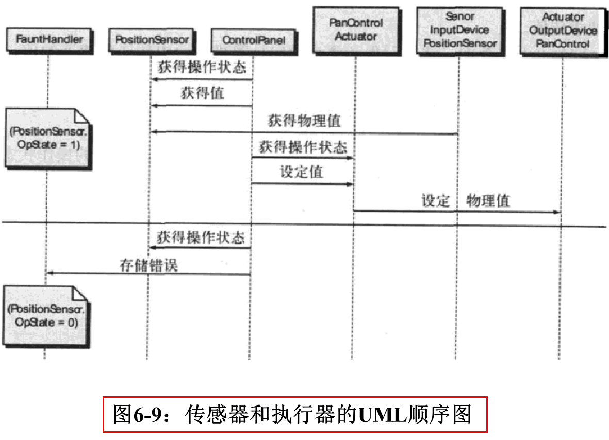

**参与者**: 列举需求模式中的类或对象，并描述每个类和对象的职责

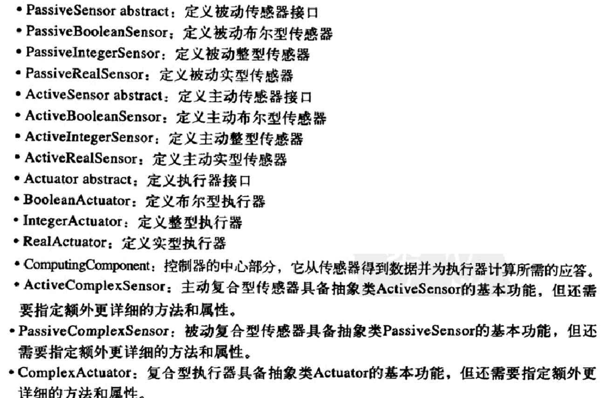

**协作**：描述的是对象和类之间如何进行交互活动以及实现自身的责任。

- 当ComputingComponent需要更新PassiveSensor时，它询问传感器，通过发送适当的消息请求传值。
- ActiveSensor无需查询。这些对象和类主动向计算机单元中传送传感器的值，使用适当的方法设定在ComputingComponent中的值。对象和类在指定的时间帧发送至少一次生命刻度，以便用系统时间更新它们的时间戳。
- 当ComputingComponent需要设定执行器的值时，给执行器发送值。
- ComputingComponent能使用适当的方法查询和设定传感器和执行器的操作状态。如果发现操作状态为零，就发送错误给FaultHandler错误处理程序，这个类包含处理错误消息的方法，比如启动更详细的恢复机制或者备份设备。如果不可恢复，系统只能使用传感器最后的已知值或者默认值。

**结果**：

1. 传感器和执行器类有一个通用接口。
2. 只能通过消息访问类的属性，并且类决定是否接受这个消息。
例如，如果设定执行器的值超过其最大值，执行器类就可能不接受消息，或者使用默认的最大值。
3. 通过传感器和执行器的统一接口可以降低系统潜在的复杂度。

## 第十一章 设计概念

软件设计在软件工程过程中属于核心技术，它的应用与所使用的软件过程模型无关。

软件设计时建模活动的最后一个软件工程活动，接着便要进入**构建**阶段（编码与测试）

### 11.1 软件工程中的设计

需求模型→设计模型

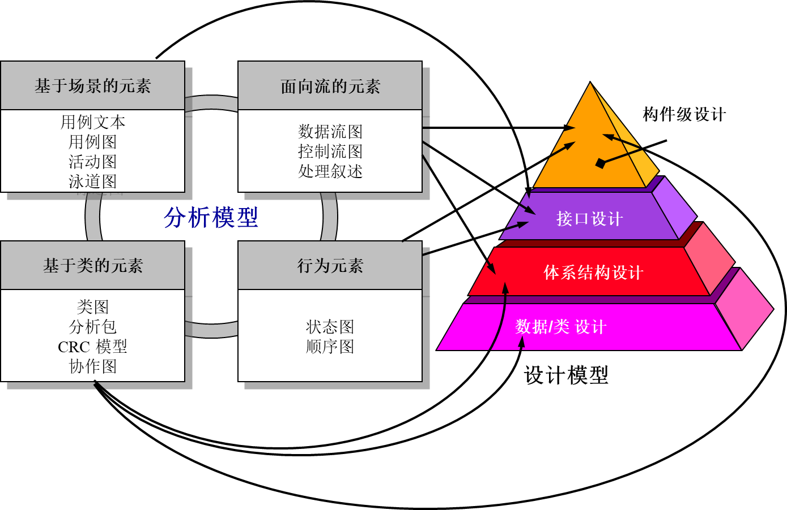

#### 四种设计模型

1. **数据/类设计**
  - 将**类模型**转化为设计类的实现以及软件实现所要求的**数据结构**

2. **体系结构设计**

  - 软件的**整体结构**
  - 定义了软件的主要**构造元素之间的关系**，包括软件部件、外部可见的**属性**和它们之间的**关系**；
  - 可以从**系统规约、需求模型**及其定义的**子系统**的交互导出。

3. **接口设计**

  - 描述了软件和协作系统之间、软件和使用人员之间是如何通信的，使用**场景**和**行为模型**为接口设计提供了大量的信息
  - **外部系统接口**：银行网上支付接口
  - **设备接口**：读卡器、扫描枪、传感器接口
  - **信息接口**：需要导入/导出的数据接口
  - 设计软件内部各个**部件间的接口**

4. **构件级设计(部件级别设计)**
  - 完整的描述每个软件构件的内部细节
  - 将软件体系结构的结构化元素变换为对软件构建的过程性描述，从**基于类的模型**和**行为模型**中获得的信息是构件设计的基础
  - 构件整体的处理和执行流程
  - 构件内本地数据对象的数据结构
  - 构件内处理过程的算法

### 11.2 设计过程

#### 11.2.1 质量指导

整个设计过程中，我们使用一系列**技术评审**来评估设计演化的质量，良好设计演化的三个特征: 

1. **满足用户需求**：
   - 必须实现需求模型中所有的显式需求；
   - 必须满足用户希望的所有隐式需求；

2. **可读、可理解**：
   - 设计必须是可读、可理解的，使得将来易于编程、易于测试、易于维护；

3. 全面性：
   - 应从实现角度出发，给出与数据、功能、行为相关的软件全貌


#### 11.2.2 质量属性

==软件质量属性FURPS==体现了所有软件设计的目标

- 功能性 (Functionality) ：通过评估程序的特征集和能力、所提交功能的通用性以及整个系统的安全性来评估。
- 易用性 (Usability)：通过考虑人员因素、整体美感 、一致性和文档来评估。
- 可靠性 (Reliability)：通过测量故障的频率和严重性、输出结果的精确性、平均故障时间(Mean-Time-To-Failure, MTTF) 、故障恢复能力和程序的可预见性来评估。
- 性能 (Performance)：通过考虑处理速度、响应时间、资源消耗、吞吐量和效率来度量。
- 可支持性 (Supportability)：包括可维护性(可扩展性、适应性和耐用性)，可测试性、兼容性、可配置性、系统安装的简易性和问题定位的容易性。

【注】并不是每个软件质量属性都具有相同的权重

重要的是: 设计开始时就应该考虑这些质量属性，而不是设计完成后和构建已经开始时才考虑

#### 11.2.3 通用设计任务集

1. 检查信息域模型，并为数据对象及其属性设计恰当的**数据结构**。
2. 使用分析模型，选择一种适用于软件的**体系结构风格**。
3. 将分析模型**分割为若干个子系统**，并在体系结构内分配这些子系统:
  - 确保每个子系统是**功能内聚**的；
  - 设计子系统接口；
  - 为每个子系统分配分析类或功能；
4. 创建一系列的**设计类**或**构件**:
     - 将每个**分析类**描述转化为**设计类**。
     - 根据设计标准检查每个设计类，**考虑继承问题**。
     - 定义与每个设计类**相关的方法和消息**。
     - 评估设计类或子系统，并为这些类或子系统**选择设计模式**。
     - **评审设计类**，并在需要时修改。
5. **设计外部**系统或设备所需要的所有**接口**。
6. **设计用户接口**:
     - 评审任务分析的结果。
     - 基于用户场景详细说明活动序列。
     - 创建接口的**行为模型**。
     - 定义接口对象，控制机制。
     - 评审接口设计，并根据需要进行修改。
7. 进行**构件级设计**：
     - 在相对较低的抽象层次上**详细地说明所有算法**。
     - **精化**每个构件的**接口**。
     - **定义**构件级的**数据结构**。
     - **评审**每个构件并**修正**所有已发现的错误。
8. 开发部署模型。

### 11.3 设计概念

#### 11.3.1 抽象

分为两种不同的抽象: 

- 数据抽象 描述数据对象的具体数据集合
  - e.g 门
     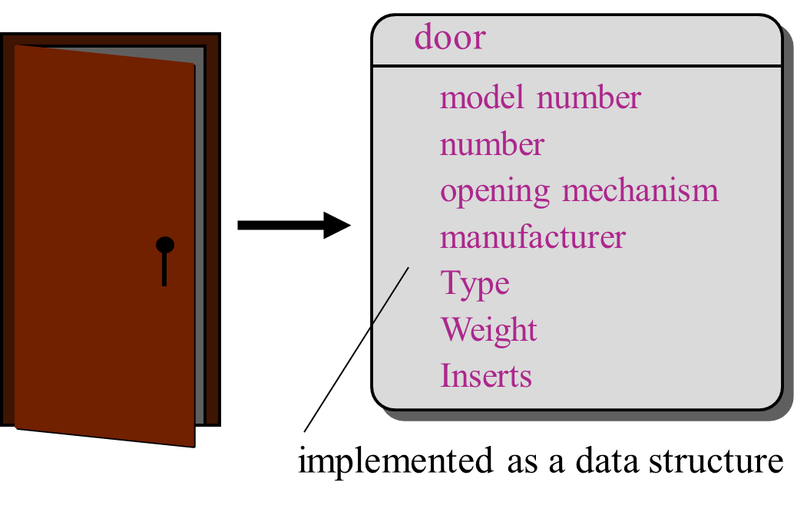 

- 过程抽象    具有明确和有限功能的指令序列
  - e.g 开门
    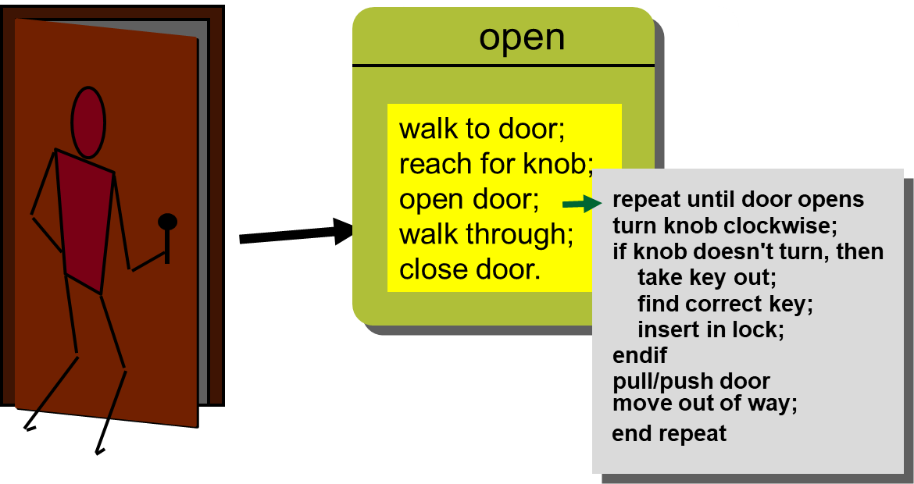


#### 11.3.2 体系结构

1. ==体系结构==是程序**构件(模块)**的**结构和组织**、这些构件**交互的形式**以及这些构件所用**数据的结构**。
2. **软件设计的目标**之一是导出系统的**体系结构示意图**，该示意图作为一个框架，将指导更详细的设计活动。
3. 一系列的**体系结构模式**使软件工程师能够解决常见的设计问题。

4. 软件体系结构设计的一组属性

   - 结构特性
     - 定义了系统的**构件**(如模块、对象、过滤器)、构件**被封装的方式**以及构件之间**相互作用的方式**。


   - 外部功能特性
     - 指出设计体系结构如何**满足需求**，这些需求包括：**性能需求、能力需求、可靠性需求、安全性需求、可适应性需求**以及其他系统特征需求。


   - 相关系统族
     - 体系结构应当能抽取出在一类相似系统开发中经常遇到的**重复性模式**。本质上，设计应当能够**重用体系结构构件**。


【注】ADL(Architecture Description language): 体系结构描述语言

#### 11.3.3 (设计)模式

==设计模式==描述了解决某个特定设计问题的设计结构，该设计问题处在一个特定环境中，该环境会影响到模式的应用和使用方式

设计模式的目的: 

提供一种描述，使得设计人员可以决定: 

- 模式是否适用于当前的工作
- 模式是否能够复用
- 模式是否能够用于指导开发一个相似但功能或结构不同的模式

> 怎么就讲完了 我那么多设计模式不讲一下?

#### 11.3.4 关注点分离

==关注点分离==将关注点分割为更小的关注点，以便于用更小的工作量和时间解决一个问题

- **分而治之**

#### 11.3.5 模块化

> 关注点分离最常见的表现

1. ==模块化==: 按照**设计原则**将系统划分为若干个较小的模块

   - 模块间相互独立，又相互关联

   - 实质: 系统分解和抽象的过程


2. ==模块==是相对独立的程序体：

   - 模块是数据说明、可执行语句等**程序对象**的集合。

   - 模块是**单独命名**的，并且可以通过名字来访问。
     - 例如：类、过程、函数、子程序、宏等 。

3. 通过模块化降低开发复杂度

   - C(x)：问题x的复杂性；
     E(x)：解决问题x所需工作量；
   - 对于两个问题 p1 和p2：
     1) 如果C(p1)>C(p2) 那么 E(p1)>E(p2)	
         **问题越复杂解决问题所需要的花费更多**
     2) C(p1+p2)>C(p1)+C(p2)因此E(p1+p2)>E(p1)+E(p2)
         **将复杂问题分解成可以多个子问题分别解决会更加容易(模块化思想的依据)**

4. 能否无限制划分软件？？？答案: 否
   - 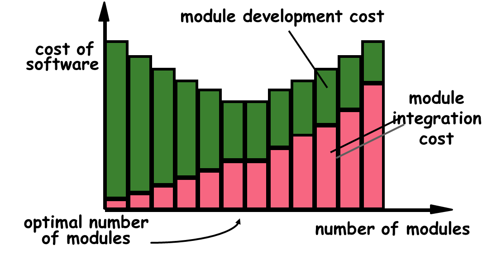
   - 子模块工作量之和(绿色部分)下降
     模块之间的接口和集成以及沟通成本上升
5. 结论: 适度的模块化, 寻找最佳模块化程度平衡点
   - 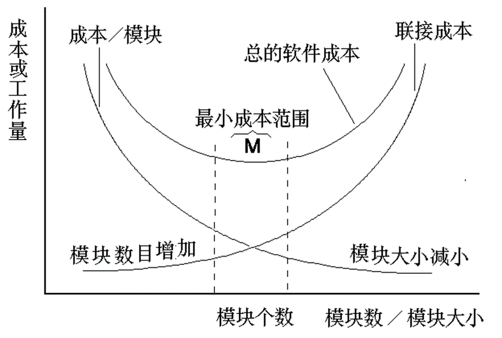 
6. 模块化优点
   - 使开发工作更易于规划；
   - 可以定义和交付软件增量；
   - 更容易实施变更；
   - 能够更有效地开展测试和调试；
   - 可以进行长期维护而没有严重的副作用。

#### 11.3.6 信息隐蔽

1. ==信息隐蔽==原则: 
   - 每个模块都尽量对其他模块隐藏自己的内部实现细节, 只交流实现软件功能所必须的信息
   - 由于大多数数据和过程对软件的其他部分是隐蔽的，因此，在修改过程中不小心引入的错误就不太可能传播到软件的其他地方
   - **信息隐蔽是实现抽象/模块化机制的基本支撑**

2. 优点: 

   - 对外隐蔽，减少副作用的可能性；

   - 强调通过控制接口进行通信；

   - 不鼓励使用全局数据；

   - 使用封装——高质量的设计的一个属性；

   - 使得产生高质量软件。


#### 11.3.7 功能独立

> 关注点分离，模块化，抽象和信息隐蔽概念的直接产物

1. ==功能独立==: 通过开发具有“专一”功能和“避免”与其他模块过多交互的模块，实现功能独立
   - 每个模块仅涉及需求的某个特定子集, 并且每个模块只有一个简单的接口

2. 两条标准进行评估: 内聚&耦合

##### 内聚性

1. ==内聚性==: 一个模块内部各个元素彼此结合的紧密程度

  一个内聚的模块应该只完成一件事情。应该避免“分裂型”构件

2. 内聚的七个层次: 

   - **巧合内聚**: 将几个模块中的**相同程序代码**段独立出来建立的模块(无明显独立性)
   - **逻辑内聚**: 完成一组逻辑相关任务的模块，由控制型参数来确定执行哪一种功能 (选择其中一个功能，内聚性不强)
   - **时间内聚**: 模块中的多个任务必须在**一段时间内先后执行** (有时间约束，无明确的过程约束)
   - **过程内聚**：模块内的多个任务必须按**指定的过程**执行。
   - **通信内聚**：模块内所有**处理元素**都集中在**某个数据结构的一块区域**中 (例如对课程进行选、退课和查询)。
   - **顺序内聚**：指一个模块完成多个功能，这些功能又必须**顺序执行** (更加单一的过程内聚)。
   - **功能内聚**：指一个模块中各个部分都是为完成一项具体功能而协同工作，紧密联系，不可分割的 (单个功能)。
   - 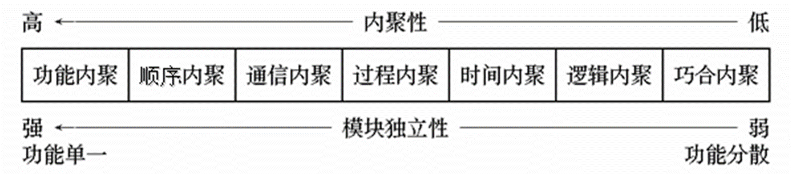 

##### 耦合性

1. ==耦合性==: 显示了模块之间的相互依赖性

  - 表明软件结构中多个模块之间的相互连接。

  - 简单的连接性使得软件易于理解并减少“涟漪效果“的倾向

2. 耦合的七个层次

   - **内容耦合**：一个模块可以直接访问另一个模块的内部数据或内部功能。
   - **公共耦合**：多个模块共同访问某些公共数据元素。
   - **外部耦合**：多个模块间需要遵循同样的外部约束，例如通信协议、数据格式等。(遵循全局的约束)
   - **控制耦合**：模块间的交互参数包含控制信息，可影响另一个模块的执行逻辑。
   - **标记耦合**：模块间传递特定的数据结构。
   - **数据耦合**：模块间仅传递简单数据。
   - **非直接耦合**：两个模块可以相对独立工作。
   - 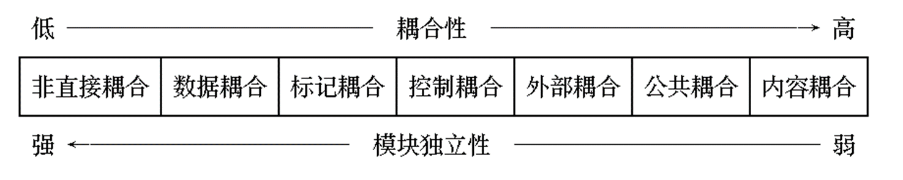


软件设计时，尽量做到高内聚，低耦合

#### 11.3.8 求精

==求精==: 对各种抽象的细化

抽象和细化是互补的概念

- 抽象能够说明内部过程和数据，但对外部使用者隐藏了底层的细节
- 细化有助于在设计过程中揭示底层细节。

↑两个概念均有助于设计人员在设计演化中构建出完整的设计模型

#### 11.3.9 重构

> 为简化设计而进行的重组

1. ==重构==: **不改变**代码[设计]的**外部行为**而是**改变其内部结构**。


#### 11.3.10 设计类

1. 五种设计类, 每种表示体系结构的一个不同层次

   - **用户接口类**

   - **业务域类**

   - **过程类**

   - **持久类**

   - **系统类**


2. 组织良好的设计类的四个特征: 

   - **完整性与充分性**

   - **原始性**

   - **高内聚性**

   - **低耦合性**


### 11.4 设计模型

两个维度: 过程维度、抽象维度

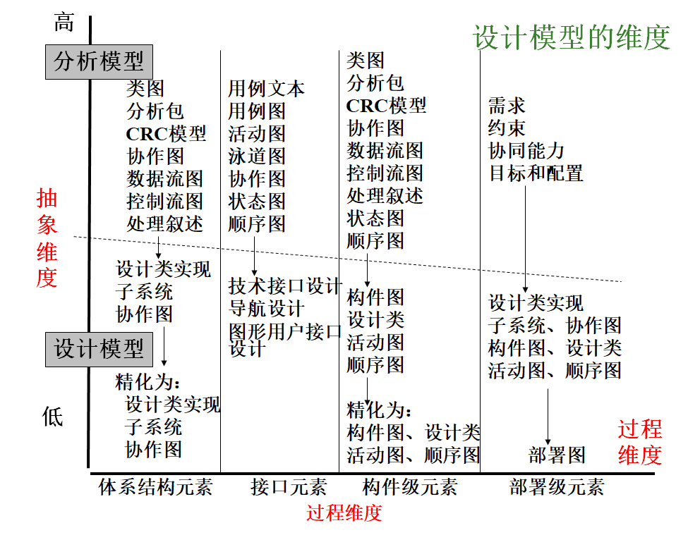

四个主要元素: 数据，体系结构，构件，接口

#### 设计元素

1. 数据设计元素——
  - 数据模型->数据结构/数据库体系结构/数据仓库
2. 体系结构设计元素
  - 提供软件的**整体视图**
3. 接口设计元素——UML类图中的接口
   - 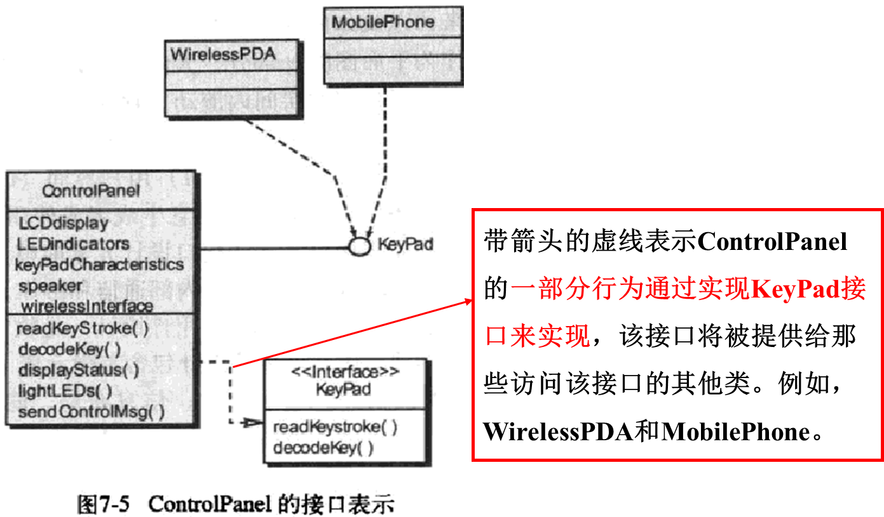 

4. 构件级设计元素——UML构建图(组件图)
   - 构件图也称组件图。
     - 描述了软件的各种构件和它们之间的依赖关系。
     - 通常包括三个元素：构件、接口和依赖。
   - 
5. 部署级设计元素——UML部署图
   - 


## 第十二章 体系结构设计

> 疯了 目录都一长串 疯了
> <div>
>     <font size=1>12.1 软件体系结构</br>
>         12.2 体系结构类型</br>
>         12.3 体系结构风格</br>
>         12.4 体系结构考虑要素</br>
>         12.5 体系结构决策</br>
>         12.6 体系结构设计</br>
>         12.7 评估候选的体系结构设计</br>
>         12.8 经验学习</br>
>         12.9 基于模式的体系结构评审</br>
>         12.10 体系结构一致性检查</br>
>         12.11 敏捷性与体系结构</br>
>     </font>
> </div>

### 12.1 什么是体系结构

1. ==软件体系结构==(架构): 指的是系统的一个或者多个架构

   - 包括软件构件、构件的外部可见属性以及他们之间的相互关系

   - 对于同一个体系结构, 可能会产生多种基于该体系结构的设计

2. 体系结构决策描述模板

   - 设计问题：描述将要解决的体系结构设计问题。

   - 解决方案：陈述所选择的解决设计问题的方法。

   - 分类：指定问题和解决方案陈述的分类(例如，数据设计、内容结构、构件结构、集成)

   - 假设：指出任何有助于制定决策的假设。

   - 约束：指定任何有助于制定决策的环境约束(例如，技术标准、可用的模式、项目相关问题)。

   - 候选方案：简要描述所考虑的体系结构设计候选方案。

   - 争论：陈述为什么选择这种解决方案而不是其他的候选方案。

   - 意义：指出制定决策对设计的影响。选择的解决方案会在某种程度上约束设计吗?

   - 相关决策：其他记录的决策和该决策有什么相关性?

   - 相关关注点：其他相关的需求和该决策有什么相关性?

   - 工作产品：指出在体系结构描述中，决策会在哪里体现出来。

   - 注释：其他团队的备忘录或文档。

     

     

### 12.2 体系结构类型

类型经常会规定特定的体系结构方法

**类型**隐含了在整个软件领域中的一个特定类别

### 12.3 体系结构风格

软件体系结构风格，每种风格描述一种系统类别，包括四个关键元素

- 一组构件，它们完成系统需要的某种功能
- 一组连接件，它们实现构件间的 “通信、合作和协调”
- 约束，定义构件如何集成为一个系统
- 语义模型，使设计者能通过分析系统的组成成分的已知属性，来理解系统的整体性质

> 体系结构风格的简单分类

#### 12.3.1 以数据为中心的体系结构

1. 以==数据为中心==的体系结构： 数据存储位于这种体系结构的中心，其他构建会经常访问该数据存储，并进行增删改查。
   - 黑板(变种): 当用户感兴趣的数据发生变化时，他将通知客户软件

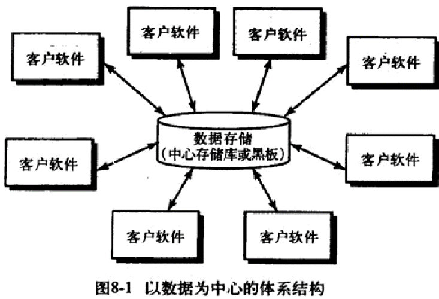

2. 特点: 

   - 一些数据(比如一个文件或者数据库)保存在整个结构的中心，并且被其他部件频繁地使用、添加、删除、或者修改

   - 提升可集成性，即现有的构件可以被修改而且新的客户构件可以加入到系统结构中，而无需考虑其他的客户。

   - 数据可以在客户间通过“黑板”机制传送，客户构件独立地执行过程。


3. 优点: 

   - 开放: 数据对所有使用者开放

   - 客户构件基本独立


4. 问题: 

   - 客户软件难以协作

   - 中心数据的格式必须为所有客户软件所接受


#### 12.3.2 数据流体系结构

1. 数据流体系结构: 当输入数据经过一系列的计算构件和操作构件的变换形成输出数据时，可应用该体系结构。

   - 例如管道—过滤器模式：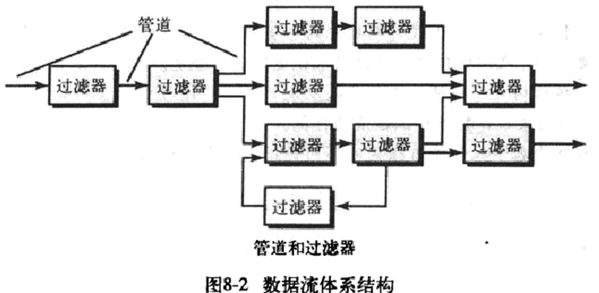

   - 特点: 

     - 过滤器没有必要了解与之相邻的其他过滤器的工作

     - 数据需要服从输入——变换——输出的简单流程


2. 优点: 

   - 易于理解

   - 过滤器易于重用

   - 系统易维护

   - 易并行运行


3. 问题: 

   - 适用于批处理，不易于交互

   - 流的协作需要考虑

   - 过滤器功能重复


#### 12.3.3 调用和返回体系结构

能够设计出一个相对易于修改和扩展的程序结构

存在子风格: 

- 主程序/子程序体系结构

  将功能分解为一个控制层次结构，其中主程序调用一组程序构件，程序构件又去调用别的程序构件

  

- 远程调用体系结构

  构件分布在网络的多个计算机上

#### 12.3.3 面向对象体系结构

- 系统的构件封装了数据和应用到该数据上的操作。
- 构件间通过消息传递进行通信与合作。

#### 12.3.4 层次体系结构


- 定义了不同的层次，各个层次完成各自的操作
- 每一层为上层提供服务，又接受下层的服务

优点: 

- 明确的抽象层次，易于增减或修改层次

问题: 

- 系统并不是总能分层


###　体系结构模式

风格的具体体现（体系结构设计的一个框架）

区别: 

（1）体系结构模式涉及的范围要小一些，它更多集中在体系结构的某一局部而不是体系结构的整体
（2）模式在体系结构上施加规则，描述了软件是如何在基础设施层次上处理某些功能性方面的问题
（3）体系结构模式倾向于在系统结构的环境中处理特定的行为问题

==体系结构模式==: 体系结构模式在特定坏境和一系列限制与约束下处理特定的应用问题。

模式提出了能够作为体系结构设计基础的体系结构解决方案

### 12.4 体系结构的考虑要素

- 经济型: 整洁, 通过抽象化减少无用细节
- 易见性: 体系结构和决策及其依据应该是显而易见的
- 隔离性: 模块化
- 对称性: 属性是均衡一致的
- 应急性: 能够应对突发事件

### 12.5 体系结构决策

决策模型记录了所需要的体系结构决策、在过往的项目中实际做出的决策以及支持这些决策的理由。

### 12.6 体系结构设计

#### 系统环境表示

1. 在体系结构设计层，软件体系结构设计师用**体系结构环境图ACD**对软件与其外围实体的**交互方式**进行建模
2. ACD例子: 
   - 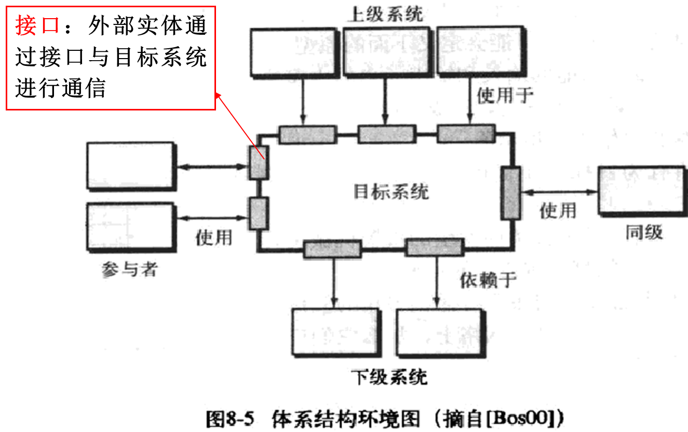 
   - 与目标系统交互的系统，即外部实体可表示为：
     **上级系统**：视目标系统为某些高层处理方案的一部分
     **下级系统**：被目标系统使用，向完成目标系统提供必要的数据和处理
     **同级系统**：在对等的基础上相互作用 (即信息或者由同级系统和目标系统产生，或者被同级系统和目标系统使用)
     **参与者**：通过产生和消耗必要的处理信息，实现与目标系统交互的实体。(人、设备)
3. SafeHome安全功能的体系结构环境图
   - 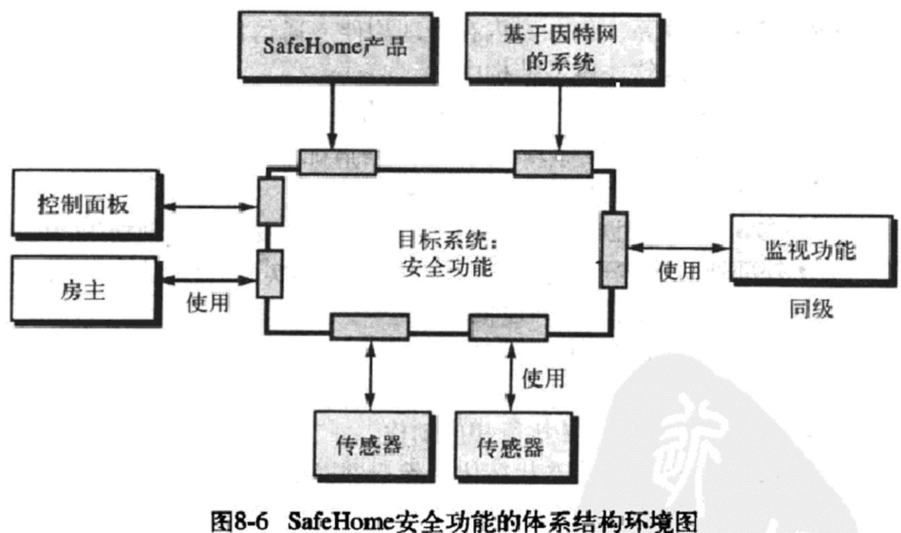

#### 将体系结构细化为构件

1. 构件的来源: 

   - 应用领域: 需求分析模型中的类

   - 基础设施域: 内存管理，通信构件，数据库构件等

   - 界面领域: 环境图中描述的接口隐含多个特定的构件

2. 每一个顶层构件都必须经过反复的迭代精化

3. 带有顶层构件的SafeHome整体体系结构
   - 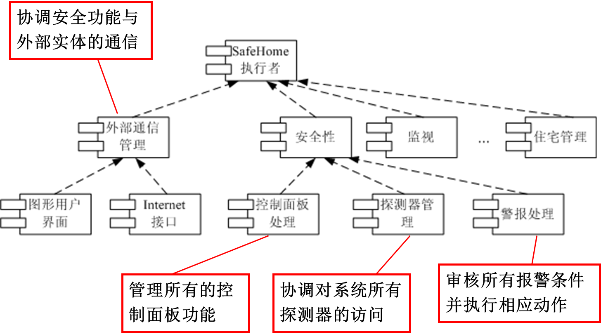
4. 精化:  
   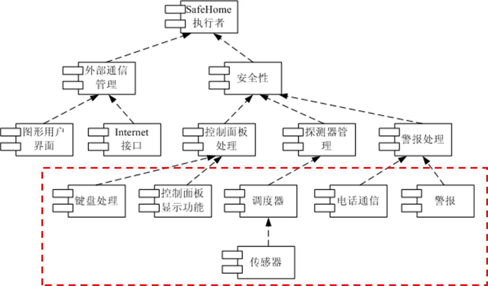


要会画UML构件图

#### 体系结构评审

一种特定的技术性评审，提供了一种评估方法，该方法可以评估软件体系结构满足系统质量需求的能力和识别任何潜在风险的能力。

往往只设计软件工程团队成员

评审技术: 

- 基于经验的推理
- 原型评估
- 情境评审
- 检查单的使用

### 12.8 经验学习

用决策分析和解决方案（DAR）有助于消除分歧和促成协作

- 原因链法
- 石川鱼骨法
- 思维导图

### 12.9 基于模式的体系结构评审（PBAR）

用于应对短暂的开发周期、紧迫的交付日期、反复变更的需求以及小规模的开发团队

### 12.10 体系结构一致性检查

静态体系结构一致性分析——评估已完成的软件系统是否与它的体系结构模型相符合

### 12.11 敏捷性与体系结构

敏捷团队坚持在**新的需求**出现时**自由地做出变更**。

体系结构设计师想要确保的是体系结构的重要部分已经经过了斟酌，并且开发者也征求了利益相关者的意见。

两方的意见可以通过运用一种称为进展的签署的做法来得到满足，即在每一次新的原型完成后，相关的产品应该记录在文档中并获得批准。

### [补充]使用数据流进行体系结构映射

1. 可以定义一些不同的“映射”，利用这些映射可以把**数据流图变换成软件结构**。
2. 两种信息流类型：**变换型、事务型**。
   - 大型软件系统通常是变换型结构和事务型结构的混合。
   - 通常采用以变换分析为主，事务分析为辅的方式进行软件结构设计。
3. **数据流映射流程**:
   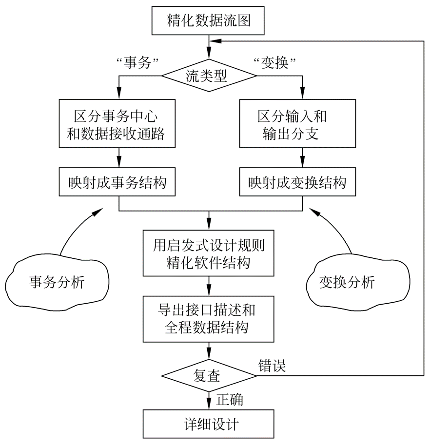 
4. **事务流**
   - 将外部信息转换成一个事务，对事务进行评估，并且根据评估结果，启动其中一条（也可能是若干条）动作路径流。
   - 发出很多动作路径的信息流中心称为事务中心。
   -  
5. 事务映射
   - 步骤：
     (1) 评审基本系统模型；
     (2) 评审和精化软件的数据流图；
     (3) 确定DFD含有变换流还是事务流特征；
     (4) 标识事务中心和每条动作路径上的流特征；
     (5) 将DFD映射到一个适合事务处理的体系结构上；
     (6) 分解并精化事务结构和每条动作路径的结构；
     (7) 精化第一次迭代得到的体系结构。
   - 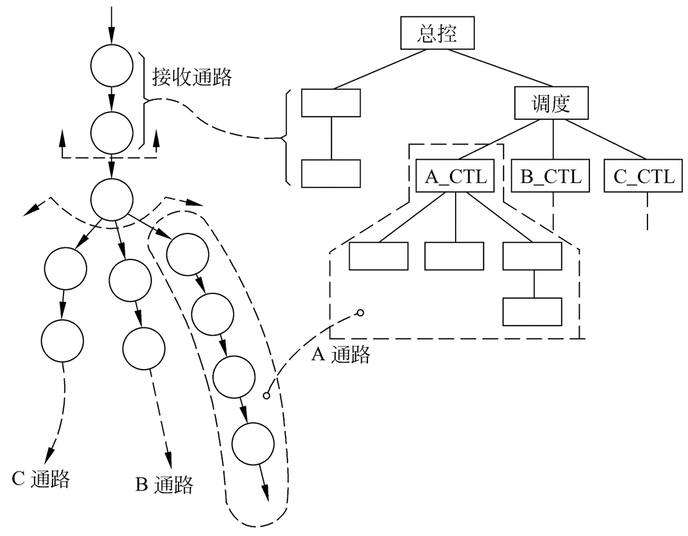

#### 步骤1: 评审基本系统模型

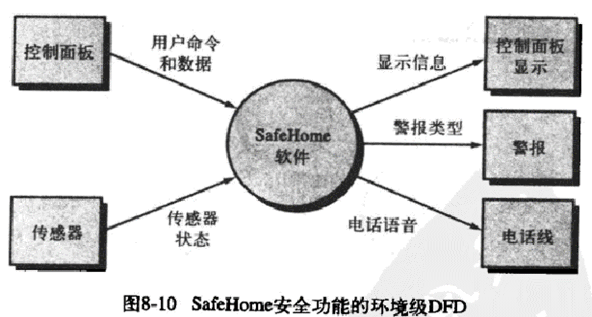 

基本系统模型或者环境图把安全功能描述为一个单一的变换，描述了流入和流出该功能数据的外部生产者和消费者

**求精后的安全功能数据流**

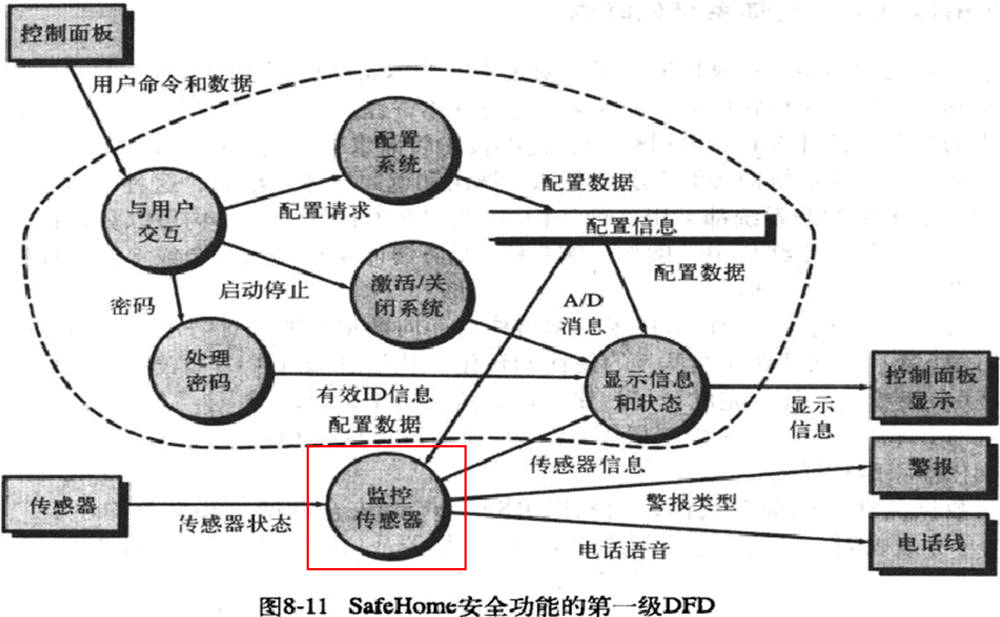 

#### 步骤2：评审和精化软件的数据流图

对从需求模型获得的信息进行精化，以获得更多的细节。

 

监控传感器的第3层DFD

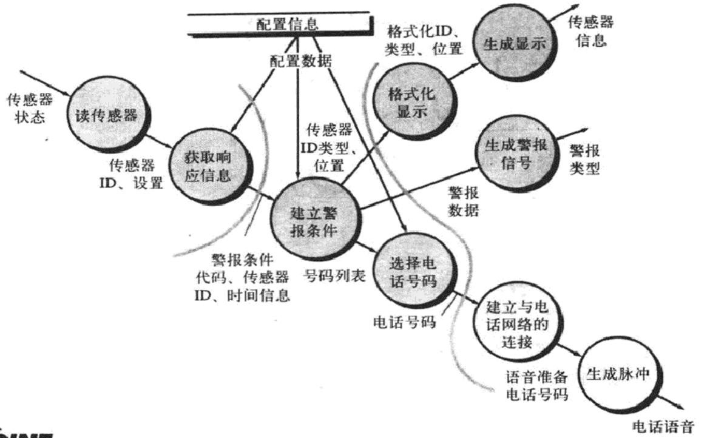 

第3层DFD，数据流图中的每个变换都展示了相对较高的内聚性，即变换所隐含的过程完成单一的、清楚的功能，该功能可以作为构件来实现，所以不需要再进一步精化。

#### 步骤3：确定DFD是否含有变换流或事物流特征

数据通过一条输入路径进入软件，沿三条输出路径流出。(三条输出路径，而不是选择一条)
因此，信息流将呈现出一个从头到尾的总体变换特征。


#### 步骤4：通过确定输入和输出流的边界，分离出变换中心

输入数据流沿着一条路径流动，在该路径上，信息从外部形式转换为内部形式；输出流将内部数据转化为外部形式。
但是输入流和输出流的边界还有待说明，也就是说，不同的设计人员在选择流边界时可能不尽相同。事实上，不同的流边界选择会导致不同的设计方案。尽管在选择流边界时要加以注意，但沿流路径若有一个“泡泡”的差异对最终程序结构的影响并不会太大。本设计步骤的重点在于选择合理的边界，而不是花时间反复考虑边界的位置。
例如，将输入流的边界放置在读传感器和获得响应信息之间也可以

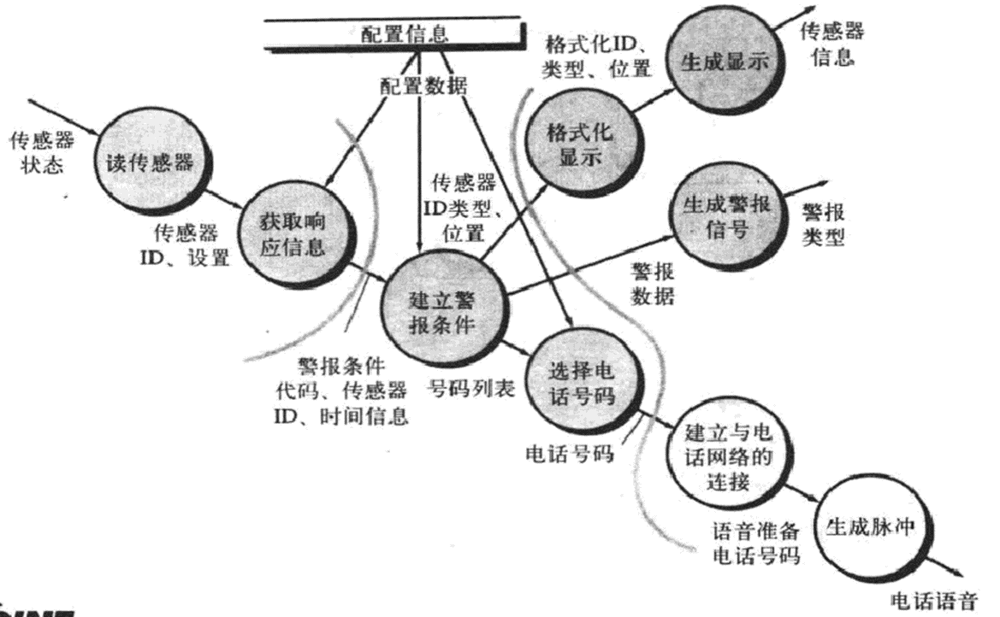 

#### 步骤5：完成“第一级分解”

使用这个映射导出的程序体系结构导致了自顶向下的控制分布。分解的作用是得到一个程序结构：其中

- 顶层构件完成决策制定；
- 底层构件完成大多数输入、计算和输出工作；
- 中间层构件完成一部分控制和适度的任务。

当遇到变换流时，DFD将被映射成一个能为信息的输入、变换和输出处理提供控制的特定结构。

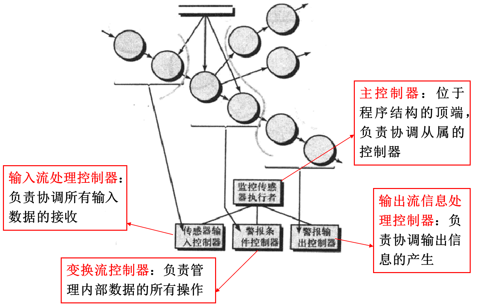

#### 步骤6：完成“第二级分解”

第二级分解是将DFD中的每个变换(泡泡)映射到体系结构中的相应模块。从变换中心的边界开始，沿输入路径和输出路径向外，将变换依次映射到软件结构的从属层：

- 一对一映射；
- 两个甚至三个泡泡可以合并在一起表示为一个构件；
- 一个单独的泡泡也可以扩展成两个或者多个构件。

 

##### 监控传感器第一次迭代结构

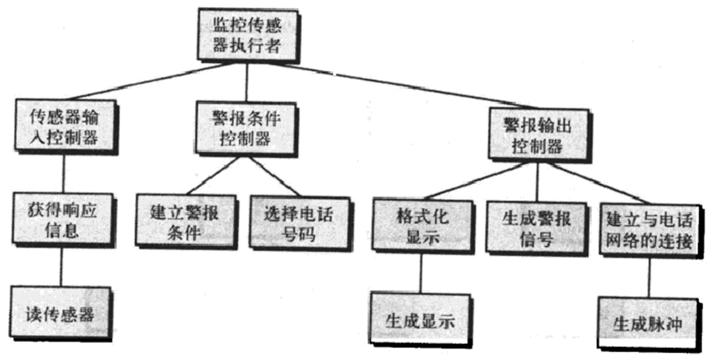

#### 步骤7

步骤7：使用提高软件质量的设计启发式方法，精化第一次迭代得到的体系结构：
应用功能独立性的概念精化第一次迭代得到的体系结构
对构件进行“分解” 或“结合”，可以产生合理的分解、好的内聚性、低的耦合性的构件。最重要的是获得易于实现、测试和维护的程序结构。

##### 精化程序结构

  

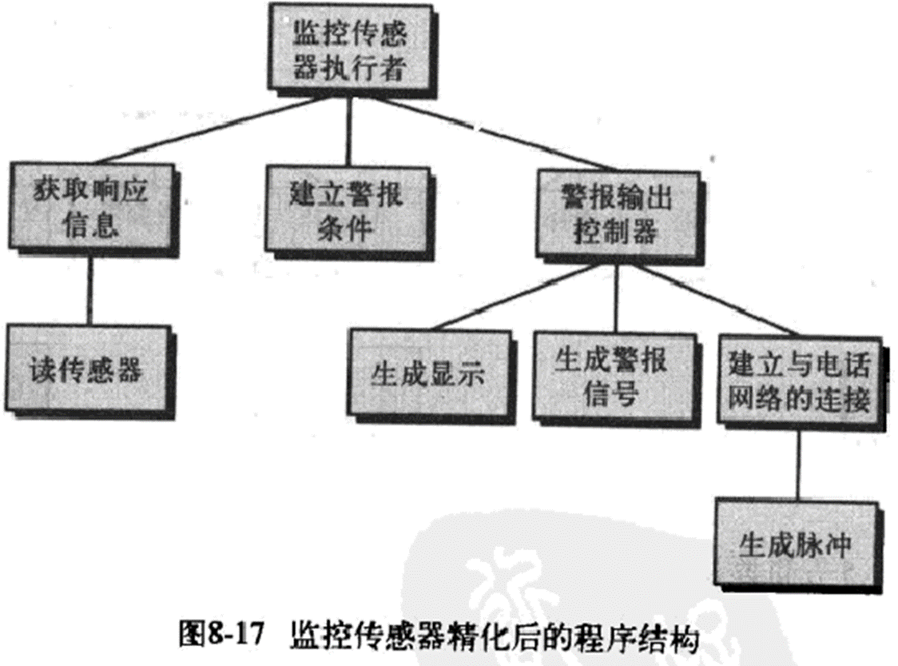 


#### 出卷系统案例

回顾: 

1. 一层数据流图
   

2. 二级数据流图(自动出卷部分)

   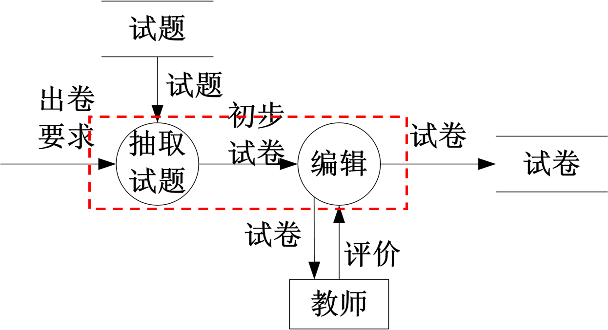

自动出卷系统的体系结构


## 第17章 软件测试策略

==软件测试策略==包括

- 测试计划
- 测试用例设计
- 测试执行
- 测试结果数据的收集与评估

### 17.1 软件测试的策略性方法

1. 测试策略必须提供

   - 低级测试，来验证一小段代码是否正确实现
   - 高级测试，确认系统的主要功能是否满足用户需求
2. 测试策略为

   - 专业人员提供工作指南
   - 管理者提供一系列里程碑
3. 测试**进度必须是可度量**的，并且使问题尽可能早的暴露


软件开发人员对负责程序各个单元的测试

在软件体系结构完成后，独立测试组ITG开始介入

> 备注 此处省略了很多内容

### 17.2 策略问题

#### 成功的测试策略

1. 早在开始测试之前，就要以量化的方式规定产品需求
2. 明确地陈述测试目标
3. 了解软件的用户并为每类用户建立用户描述
4. 制定强调“快速周期测试”的测试计划
5. 建立能够测试自身的“健壮”软件

6. 测试之前，利用有效的正式技术评审作为过滤器
7. 实施正式技术评审以评估测试策略和测试用例本身
8. 为测试过程建立一种持续的改进方法

### 软件测试策略——宏观

> 这一节未在课件中找到

#### 螺旋模型: 

软件过程: 沿着螺旋向内，分别为系统工程，需求，设计，编码，每走一圈都会降低软件的抽象层次

测试策略: 单元测试其实与螺旋的中心，往外是集成测试，确认测试，系统测试

- 单元测试: 
- 集成测试: 处理并验证与程序构建相关的问题
- 确认测试: 为软件满足所有的功能，行为和性能需求提供最终保证

#### 测试完成的标准

测试永远也完不成~~~

傻了吧


### 17.3 传统软件的测试策略

#### 17.3.1 单元测试

1. ==单元测试==: 对软件中的**最小可测试单元**进行检查和验证
   - ==单元==: C中是函数, Java中是类, 图形化软件中是一个窗口/菜单

2. 单元测试主要对模块的五个基本特性进行评价: 

   - **模块接口**: 保证被测程序单元的信息能够正常的流入和流出

   - **局部数据结构**: 确保临时存储的数据在算法的整个执行过程中能维持其完整性

   - **边界条件**: 达到边界值还能正确执行

   - **独立路径**: 确保模块的所有语句至少执行一次

   - **错误处理路径**: 预见各种出错条件


3. 一些???
   - 最基本的任务: 选择测试的执行路径
   - 最重要的单元测试任务之一: 边界测试
   - 模块结构测试是基础

4. 单元测试特点

   - 侧重于软件设计的最小单元的验证工作

   - 侧重于构件中的**内部处理逻辑**和**数据结构**

   - 进行的越早越好


##### 单元测试环境

==测试用例==: 是为某个特殊目标而编制的一组测试输入、执行条件以及预期结果，以便测试某个程序路径是否满足某个特定需求。

==构件==并不是独立程序，所以必须为每个测试单元开发驱动程序和桩程序：

- ==驱动程序==：是“主程序”，接收测试用例数据，将这些数据传递给待测试构件
- ==桩程序==：替换那些从属于待测试构件的构件
- 驱动程序调用被测模块, 桩程序被被测模块调用


- 驱动模块和桩模块都是额外的开销，虽然在单元测试中必须编写，但并不需要作为最终的产品提供给用户。


##### 何时进行单元测试？

- 通常在编码完成后进行
- 前期应提前准备: 单元测试计划，编写**测试用例**，单元测试代码
   ↑一般由白盒测试工程师，开发人员完成

- 依据: 源程序/项目的《详细设计》文档

##### 单元测试一般步骤

- 编译运行，进行语法正确性验证
- 静态测试，检查代码是否符合规范
- 动态测试，深入检查代码的正确性、容错性和边界值

#### 17.3.2 集成测试

1. ==集成测试==: 单元测试的下一个阶段，指将通过测试的单元模块组装成系统或子系统，再进行测试。

2. 内容

   - 单元组装后的**功能正确性**

   - 单元之间的**接口**

   - 集成后的系统**性能**


3. 分类: 

   - 一步到位的集成

   - 增量集成
     - 自顶向下测试
     - 自底向上测试
     - 组合方法（三明治）: 用自顶向下方法测试程序结构较高层，用自底向上方法测试其从属层

4. 特点

   - 增量式测试方式**不需要所有单元就绪**，使单元测试与集成测试的重叠**并行**是可行的，测试时，若发现问题，一般可定位于新加入的单元 (更容易进行问题的定位)。
   - 适合于**规模较大**的应用。
   - 增量式测试比非增量式测试具有一定的**优越性**。

5. ==关键模块==

   - 当执行集成测试时，测试人员应能标识关键模块。关键模块具有下述一个或多个特征：
     - 涉及几个软件需求；
     - 含有高层控制（位于程序结构的高层）；
     - 复杂的或易错的；
     - 有明确的性能需求。
   - 关键模块应**尽可能早**测试。
   - 回归测试应侧重于关键模块的功能。

##### ①一步到位的集成

1. 所有的构件都连接在一起，全部程序作为一个整体进行测试
   - 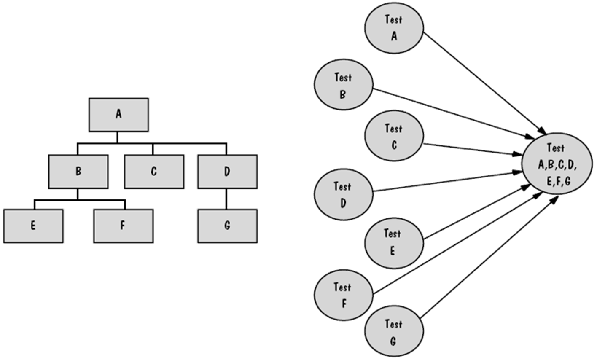 

2. 缺点: 

   - 需要**所有单元就绪**，不利于开发进度

   - 问题**定位较为困难**

3. 适合规模较小的应用

##### 增量式测试

特点: 

- 集成是**逐步**实现的
- 逐次将未曾集成测试的模块和已经集成测试的模块结合成**程序包**，再将这些模块集成为较大的系统
- 不需要所有单元就绪
- 适合规模较大的应用
- 相比于非增量测试有一定优越性

##### ②自顶向下法

1. ==自顶向下法==: 首先集成**主控模块**，然后依照控制层次向下进行集成
2. 策略有: 广度优先，深度优先

3. 特点: 

   - 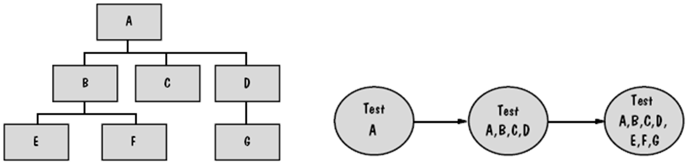
   - 可能要**编写很多桩程序**

   - **主控模块错误**可能发现的比较早


4. 主控模块用作测试驱动模块，一次用一个实际模块替换一个桩模块
   -  

##### ③自底向上法

1. ==自顶向下法==: 从程序模块结构的**最底层**的模块开始组装和测试

2. 特点: 

   -  
   - 不需要桩模块

   - **要写驱动模块**

   - 主控模块错误发现得比较迟


3. 如果最上两层是自顶向下集成的，可以减少驱动模块的数量（组合方法）
   -  

##### ④组合方法(三明治)

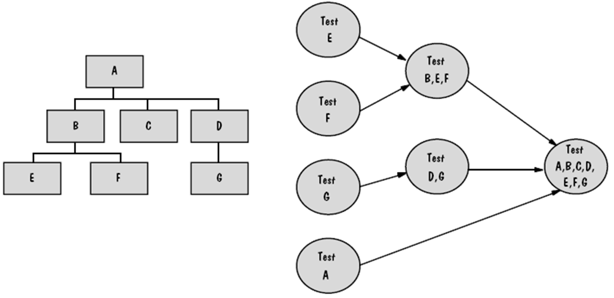 


##### 集成测试方法的比较

1. 自顶向下与自底向上增量式测试的比较：
   - 自顶向下增量式测试：
     - 主要优点：可以自然地做到**逐步求精**，一开始就能让测试者看到系统的框架。能较**早发现高层模块的错误**；
     - 主要缺点：需要提供**桩模块**，并且在输入/输出模块接入系统以前，在**桩模块中表示测试数据有一定困难**。
   - 自底向上增量式测试：
     - 主要优点：容易直接使用测试数据，**易于设计测试用例**；
     - 主要缺点：直到最后一个模块被加进去之后才能看到整个程序（系统）的框架。**上层模块错误发现得晚**，影响范围大；

##### ⑤回归测试

1. ==回归测试==: 在**程序有修改**的情况下，保证**原有功能**正常的一种测试策略
   - 重新执行已进行测试的某个子集，以确保变更没有传播不期望的副作用
   - 每次对软件做重要变更时(新构件的集成, 删除, 修改), 要进行回归测试

2. 步骤：
   - 先对**修改部分**进行测试；A
   - 然后**隔离修改**部分，测试程序的未修改部分；B
   - 最后再把它们**集成起来**进行测试；A+B
3. 回归测试的三种测试用例
   - 代表测试样本：能够测试软件**所有**功能；
   - 必要测试样本：侧重于**被改变**的软件构件功能；
   - 额外测试样本：侧重于**可能会**受变更影响的功能；

##### ⑥冒烟测试

> 常用的集成测试方法

1. ==冒烟测试==是**时间关键项目**的决定性机制

2. 活动: 

   - 将已经转化成代码的**软件构件集成到构建**中

   - **设计一系列测试**以暴露影响构建正确完成其功能的**错误**

   - **每天**将构建与其他构建以及整个软件产品**集成起来**进行冒烟测试


3. 好处

   - 降低了集成风险: 每天测试, 较早的发现不相容和业务阻塞错误

   - 提高最终产品的质量: 冒烟测试面向构建(集成), 可以发现功能性错误, 体系结构和构件级设计错误

   - 简化错误的诊断和修正: 新发现的错误可能与软件增量有关

   - 易于评估进展情况


##### 集成测试工作产品

SafeHome安全系统的集成测试可以划分为如下：

- 用户交互 ：命令输入与输出、显示表示、出错处理与表示；
- 传感器处理 ：获取传感器输出、确定传感器的状态、作为状态的结果所需要的动作；
- 通信功能 ：与中央监测站通信的能力；
- 警报处理 ：测试遇到警报发生时的软件动作。

##### 测试阶段的准则

- **接口完整性**。当每个模块 (或簇)引入到程序结构中时，要对其内部和外部接口进行测试；
- **功能有效性**。执行旨在发现功能错误的测试；
- **信息内容**。执行旨在发现与局部或全局数据结构相关错误的测试；
- **性能**。执行旨在验证软件设计期间建立的性能边界的测试；

### 17.4 面向对象软件的测试策略

#### 17.4.1 面向对象环境中的单元测试

不再孤立地对单个操作进行测试 (传统的单元测试观点)，而是将**操作作为类的一部分**

- 在子类中测试父类的操作(因为子类会有差别)

面向对象软件的==类测试==等同于传统软件的单元测试

#### 17.4.2 面向对象环境中的集成测试

> 面向对象软件没有明显的层次控制结构, 自顶向下和自底向上集成策略已无太大意义
>
> 另外，由于类的成分间直接或间接的**相互作用**，每次将一个操作集成到类中 (传统的增量集成方法)往往是不可能的

两种策略: 

- **基于线程的测试**
  - 对响应系统的一个输入或事件所需的一组类进行集成。
  - **每个线程单独地集成和测试**。
  - 应用回归测试以确保没有产生副作用

- **基于使用的测试**
- 通过测试**很少使用服务类**的那些类（称为独立类）开始构造系统
  - **独立类**测试完成后，利用独立类测试下一层次的类（依赖类）
- 继续**依赖类**的测试直到完成整个系统

### 17.5 确认测试

始于集成测试的结束(测试完成单个构建, 软件组装成完整的软件)

测试集中于用户可见的动作和用户可识别的系统输出

#### 17.5.1 确认测试准则

1. ==软件确认==是通过一系列表明与软件需求相符合的测试而获得的：
   - **测试计划**列出**将要执行的测试类**；
   - **测试规程**定义了特定的**测试用例**；
   - 设计的**特定测试用例**用于确保满足所有功能需求、所有行为特征，所有内容都准确无误且正确显示，达到所有性能需求；
   - **文档**是正确的、可用的，且满足其他需求 (如：可移植性、兼容性、错误恢复和可维护性)。
2. 执行每个确认测试用例之后，存在下面两种可能条件之一：
   (1) 功能或性能特征符合需求规格说明，可以接受；
   (2) 发现了与规格说明的偏差，创建缺陷列表：
   在项目的这个阶段发现的错误或偏差很难在预定的交付期之前得到改正。此时往往必须与客户进行协商，确定解决缺陷的方法。

#### 17.5.2 α测试&β测试

1. ==验收测试==是由最终用户而不是软件工程师进行的，让每个用户都进行正式的验收测试是不切实际的：
2. ==α测试==是由有代表性的最终用户在**开发者的场所**进行。软件在自然的环境下使用，开发者站在用户的后面观看，并记录错误和使用问题。α测试在受控的环境下进行。
3. ==β测试==在一个或多个**最终用户场所**进行。与α测试不同，开发者通常不在场，因此， β测试是在不为开发者控制的环境下软件的“现场”应用。最终用户记录测试过程中遇见的所有问题，并定期地报告给开发者。
4. β测试的一种变体称为==客户验收测试==，软件开发和QA人员也应该参加，有时是按照合同交付给客户时进行的。
5. 确认测试
   - 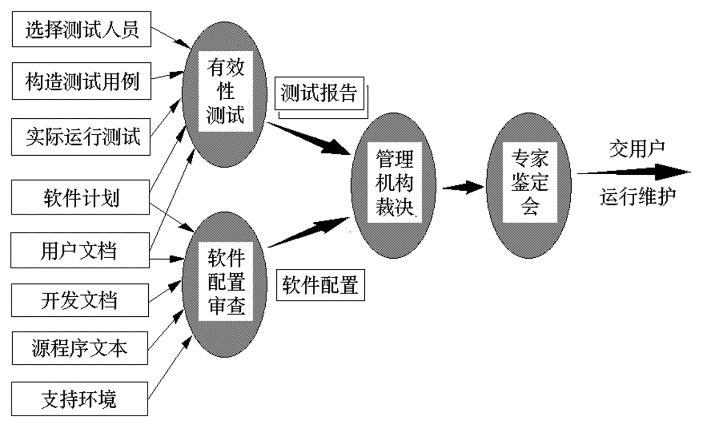

### 17.6 系统测试


1. 恢复测试
   - 强制让系统发生故障, 验证其能适当恢复
     - 恢复是自动的, 则对重新初始化、检查点机制、数据恢复和重新启动都要进行正确性评估
     - 恢复是人工的, 计算平均恢复时间 (Mean-Time-To-Repair，MTTR)
2. 安全测试
   - 验证系统保护机制能否保护系统不受非法入侵
   - 测试扮演供给系统角色, 进行攻击
3. 压力测试
   - 压力测试目的是在性能可以接受的前提下，测试系统可以支持的**最大负载**。
   - 压力测试要求以非正常的数量、频率或容量的方式执行系统。
4. 性能测试
   - 性能测试是在不同负载下**(负载一定)**时，通过一些系统参数(如反应时间等)验证系统性能指标。
   - 通过监测系统，测试人员可以发现导致效率降低和系统故障的情形。
5. 部署测试
   - 也将部署测试称为配置测试，是在软件将要运行的每一种环境中测试软件

### 17.7 调试技巧

调试是使错误消除的过程，发生在测试之后

#### 调试方法

- 蛮干法
- 回溯法
- 原因排除法


## 第18章 测试传统的应用软件

### 18.1 软件测试基础

1. 测试的目标: 发现错误
   - 测试相当于从右边容器中拿出球：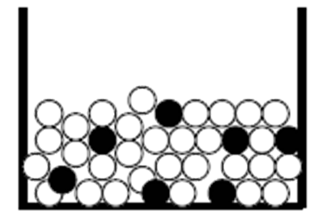
     - 白球：导致正确输出
     - 黑球：导致错误输出
   - 测试的==有效性==：在n次尝试中，拿到多少黑球？
     - 越多越好
   - ==可测试性==：一次尝试中拿到黑球的可能性

2. 软件可测试: 计算机程序能够被测试的容易程度
   - **可操作性**: 妨碍测试执行的错误
   - **可观察性**: 输入产生清晰的输出
   - **可控制性**: 通过输入的某些组合**产生所有可能的输出**
   - **可分解性**: 软件由能够进行单独测试的独立模块组成
   - **简单性**
     - 功能简单性 (例如，一个模块完成单一或者简单的功能)
     - 结构简单性 (例如，将体系结构模块化以限制错误的传播)
     - 代码简单性 (例如，采用编码标准以使代码易于审查和维护
   - **稳定性**
   - **易理解性**: 体系结构设计以及内部构件、外部构件和共享构件之间的依赖关系能被较好地理解
3. 影响可测试性的因素
   - 软件开发文档不完整、不清晰、不准确；
   - 隐藏故障的代码难以测试；
4. 软件失效产生过程：输入引起故障执行 -> 故障执行导致数据状态的错误 -> 数据状态传播到输出状态。  
5. 软件可测性设计包括：
   - **简化**设计使软件容易测试；
   - 软件具有完整的编码**注释**和正确的技术**文档**；
   - 尽早**确定用户接口**：保证可分解、可控制和稳定；
6. 好的测试
   - 高的有效性——发现错误的可能性较高
   - 不冗余——每个测试都有不同的目标
   - 最佳性——最佳品种
     - 使用最有可能发现所有错误的测试
   - 适当的复杂性——不太简单也不太复杂 (分解大的测试)
     - 应该独立执行每个测试，防止错误被“掩盖”

### 18.2 测试的分类

1. 软件测试技术分类
   - 黑盒测试 / 白盒测试：从要不要看代码部分来区分
   - 动态测试 / 静态测试：从要不要运行软件来区分

2. 黑盒与白盒
   - **黑盒测试**: 在软件接口处执行测试——检查系统的功能方面，而不考虑软件的内部结构（外部观察）
   - **白盒测试**: 基于过程细节的封闭检查，贯穿软件的**逻辑路径和构件间的协作**（内部观察）

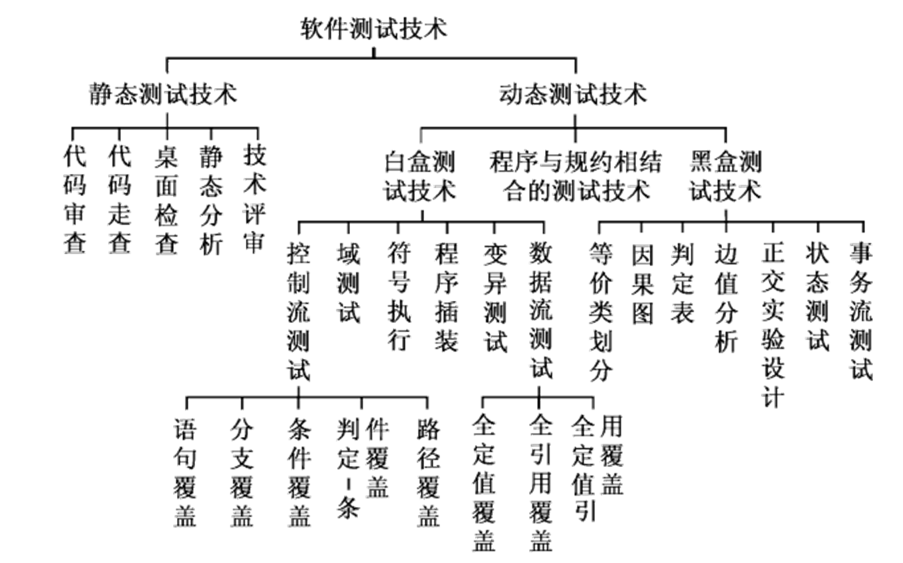

### 18.3 白盒测试

一种测试用例设计方法，一般在测试的早期进行

利用构件级设计的一部分所描述的控制结构来生成测试用例

对==程序模块==进行如下检查

- 对模块的所有独立的执行路径至少测试一次；
- 对所有的逻辑判定，取“真”与取“假”的两种情况都至少测试一次；
- 在上下边界和可操作的范围内执行所有的循环；
- 测试内部数据结构的有效性。

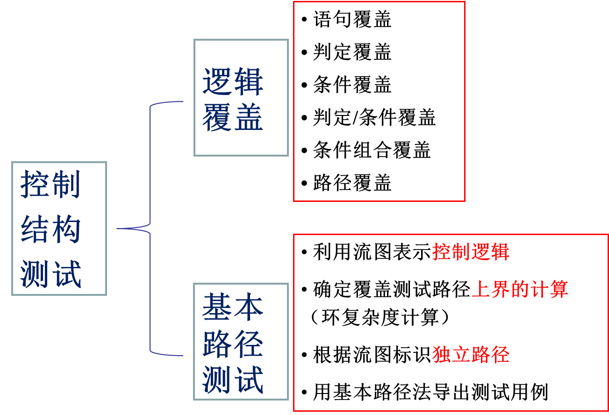

### 18.4 基本路径测试

一种白盒测试技术

在**程序控制流图**的基础上，分析控制构造的环路复杂性，导出基本可执行路径集合。

#### 18.4.1 流图

- 合并顺序执行的语句
- 分离判定语句的不同条件

==流图== (或程序图)：

- 一种简单的控制流表示方法；
- **圆**：流图结点，表示一个或多个过程语句。
  - 处理框序列和一个菱形判定框可映射为单个结点(相对于流程图)
- **箭头**：边或连接，表示控制流，一条边必须终于一个节点，即使该结点并不代表任何过程语句。
- 由边和节点限定的区间称为**域**，计算区域时不要忘记区域外的部分，图的外部作为一个域。

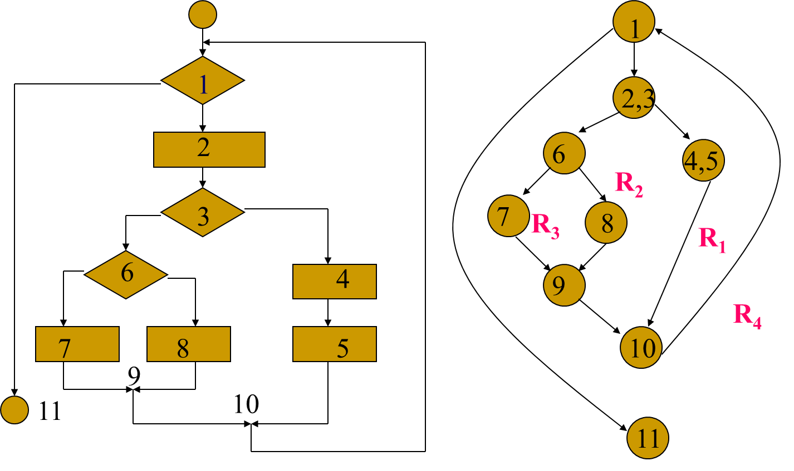

#### 18.4.2 独立程序路径

==独立程序路径==是任何贯穿程序的，至少引入一组新的处理语句或一个新条件的执行路径。(不能由其它独立路径组合而成)

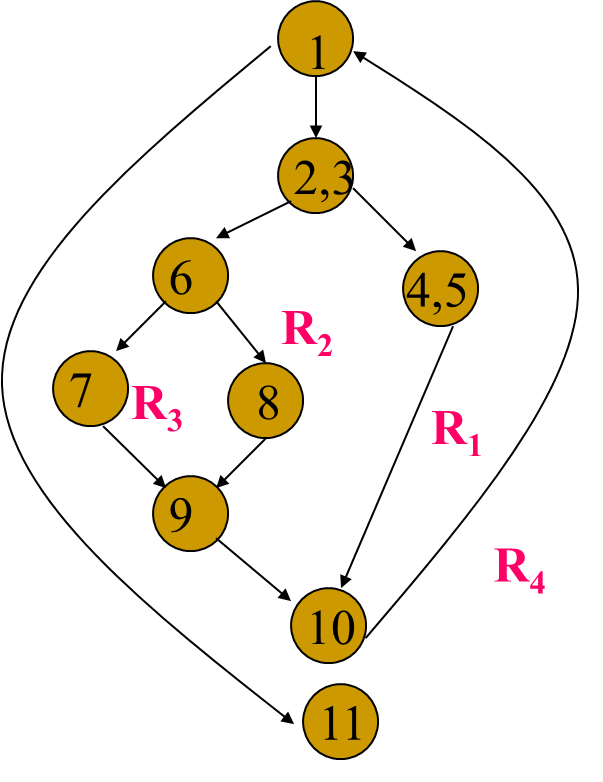 

在图示的控制流图中，一组独立的路径是：

- path1：1 - 11
- path2：1 - 2 - 3 - 4 - 5 - 10 - 1 - 11
- path3：1 - 2 - 3 - 6 - 8 - 9 - 10 - 1 - 11
- path4：1 - 2 - 3 - 6 - 7 - 9 - 10 - 1 - 11
- 路径1 - 2 - 3 - 4 - 5 - 10 - 1 - 2 - 3 - 6 - 8 - 9 - 10 - 1 – 11不是独立路径。
- 路径1、2、3和4构成流图的基本集合。若设计测试强迫执行这些路径 (基本集合)，则可以保证程序中的每条语句至少执行一次，且每个条件的取真和取假都被执行。
  基本集合不是唯一的。

#### 环路复杂性

1. V(G)=E-N+2

   E是流图的边数，N是流图的节点数

2. 域的数量=环复杂性

3. V(G)=P+1

   P为包含在流图G中的判定节点数

↑V(G)的值提供了组成基本集合的独立路径的上界，并由此得出覆盖所有程序语句所需设计和运行的测试数量的上界

#### 导出测试用例的步骤

1. 画出流图
2. 确定环复杂性，确定线性独立路径的数量
3. 确定独立路径的基本集合
4. 准备测试用例集，强制执行基本集合中的每条路径

### 控制结构测试

略

## 第二十五章 项目进度安排

###　挣值分析 ※

按如下步骤确定挣值

1. 为进度表中的每一个工作任务确定其**预计工作的预算成本**（BCWS）

2. 将所有BCWS值加起来，可计算出**完成工作的预算**（BAC）

3. 计算**已完成工作的预算成本**（BCWP），即该时间点已经实际完成的所有工作任务的BCWS的和

   可以得到: 

   进度表执行指标SPI=BCWP/BCWS（效率指标，越接近1.0则效率越高）

   进度表偏差SV=BCWP-BCWS（只表示与计划进度的偏差）

   预计完成百分比值: BCWS/BAC（应该完成的）

   特定时间实际完成工作的百分比值: BCWS/BAC(注意这里的BCWS和上面的不一样)

4. 计算出**已完成工作的实际成本ACWP**

   字如其名

   成本执行指标CPI=BCWP/ACWP（越接近1.0表示项目与预算越接近）

   成本偏差CV=BCWP-ACWP（表示在项目特定阶段的成本节省或短缺）

   

## 第二十六章 风险管理

风险管理策略: 

- 主动风险策略
- 被动风险策略（印第安纳·琼斯）tmd，xs

工作产品: RMMM计划或者一组风险信息表单

RMMM: 

- 风险缓解
- 检测
- 管理

### 软件风险

特性: 

- 不确定性（不一定会发生）
- 损失（一旦发生就会产生恶心后果或损失）

风险类型: 

- 项目风险

  威胁到项目计划。

  指预算、进度、人员、资源、利益相关者、需求等方面的潜在问题以及他们对软件项目的影响

- 技术风险

  威胁到要开发软件的质量和交付时间。

  指设计、实现、接口、验证和维护等方面潜在的问题

- 商业风险

  威胁到要开发软件的生存能力

  又分为: 

  - 市场风险
  - 策略风险
  - 销售风险
  - 管理风险
  - 预算风险

另一种风险分类方式: 

- 已知风险

  仔细评估项目计划、开发项目的商业及技术环境以及其他可靠的信息来源之后可以发现的那些风险

- 可预测风险

  从过去的项目经验推断来的风险

- 不可预测风险

  可能出现但是难以识别的风险

实施有效风险管理框架的七项原则

- 保持全面的观点
- 采用长远的观点
- 鼓励广泛交流
- 结合: 考虑风险时必须与软件过程相结合
- 强调持续过程
- 开发共享的产品
- 鼓励协同工作


### 风险识别

上面的每一类风险又可以分为两种不同的类型

- 一般风险
- 产品特定的风险

#### 识别方法

建立风险条目检查表，用于风险识别，主要用于识别下列几种类型中的一些已知/可预测风险

- 产品规模
- 商业影响
- 客户特性
- 过程定义
- 开发环境
- 开发技术
- 人员才干与经验

#### 风险因素和驱动因子

项目管理者要识别印象软件风险因素的**风险驱动因子**

风险因素: 

- 性能风险
- 成本风险
- 支持风险
- 进度风险

风险驱动因子对风险因素的影响

- 可忽略的
- 轻微的
- 严重的
- 灾难性的

### 风险预测

试图从两个方面来评估每一个风险

1. 风险发生的可能性或概率
2. 如果风险发生，风险相关问题产生的后果

