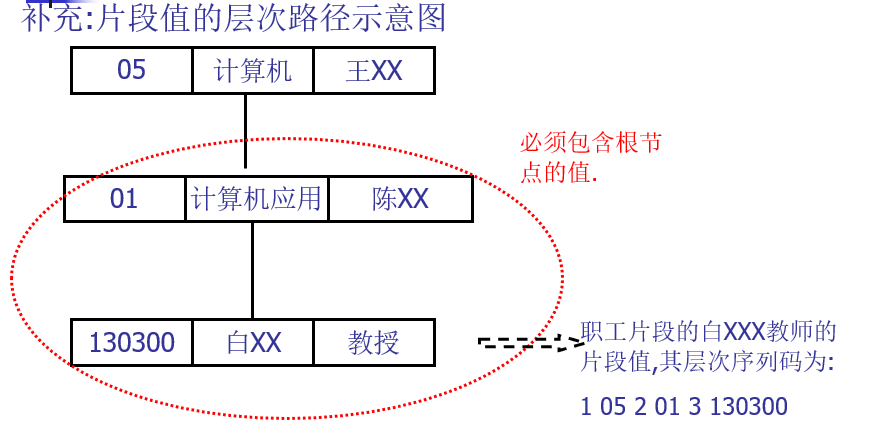
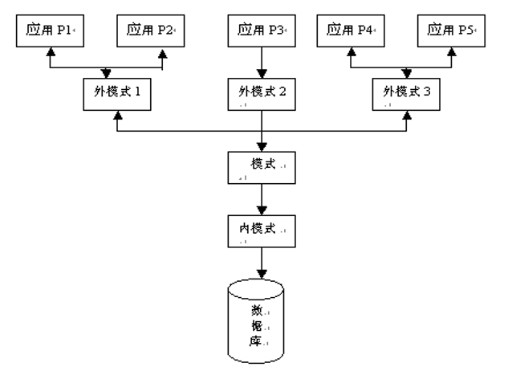

# 第一章 绪论

从现实数据到计算机数据库系统

$$现实世界(手工管理)\\数据模型(建模)\begin{cases}信息世界(概念模型)\\计算机世界\begin{cases}数据逻辑模型\\数据物理模型\end{cases}\\计算机世界(DBS):DBMS+开发工具+系统架构\end{cases} $$

## 1.1 数据库系统概述

### 1.1.1 基本概念

> 数据、数据库、DBMS、DBS

<font color=66ccff>数据(Data) </font>: 描述事物的符号记录

<font color=66ccff>数据库(Database, DB)</font> : 长期存储在计算机内有组织, 可共享的大量数据集合

<font color=66ccff>数据库管理系统(Database Mange System, DBMS) </font>: 对数据库进行管理，使之能为多个用户共享，能保证数据的安全性、可靠性、完整性、一致性，并保证数据的高度独立性。

- 数据库定义(DDL: Data Definition Language) : 对数据库中的数据对象的组成和结构进行定义
- 数据组织、存储和管理
- 数据库操纵(DML: Data Manipulation Language): 进行增删改查
- 数据库的事务管理和运行管理
- 数据库控制(DCL: Data Control Language): 数据库的建立和维护功能
- 数据库通信(CM: Communication Management)

<font color=66ccff>数据库系统(Database System, DBS) </font>: 由数据库, DBMS(及其应用开发工具), 应用系统和数据库管理员(database administrator, DBA)组成的存储, 管理, 处理和维护数据的系统

- DBS=DB+DBMS+运行计算机(硬件和os)+DBA+一些说明文档

### 1.1.2 数据管理技术的产生和发展


| 对比项       | 人工管理阶段                         | 文件系统阶段             | 数据库系统阶段                                               |
| ------------ | ------------------------------------ | ------------------------ | ------------------------------------------------------------ |
| 应用领域     | 科学计算                             | 科学计算,数据管理        | 大规模数据管理                                               |
| 主要硬件     | 无直接存取存储设备                   | 磁盘, 磁鼓               | 大容量磁盘, 磁盘阵列                                         |
| 主要软件     | 没有操作系统, 没有管理数据的专门软件 | 有文件系统               | 有数据库管理系统                                             |
| 数据处理方式 | 批处理                               | 联机实时处理, 批处理     | 联机实时处理, 分布处理, 批处理                               |
| 数据管理者   | 人(程序员)                           | 文件系统                 | 数据库管理系统                                               |
| 数据面向对象 | 某一应用程序                         | 某一应用                 | 现实世界(部门, 企业, 跨国组织等)                             |
| 数据共享程度 | 不独立, 完全依赖应用                 | 独立性弱                 | 具有较强的物理独立性和一定的逻辑独立性                       |
| 数据结构化   | 无结构                               | 记录内有结构, 整体无结构 | 整体结构化, 用数据模型描述                                   |
| 数据控制能力 | 应用程序自己控制                     | 应用程序自己控制         | 由数据库管理系统提供数据安全性, 完整性, 并发控制和数据库恢复功能 |

### 1.1.3 数据库系统的特点

- 整体数据的结构化
  - 数据之间具有联系, 不仅要考虑某个应用的数据结构, 还要考虑整个组织的数据结构
- 数据的共享性强, 冗余度低且易于扩充
- 数据的独立性强: 数据改变时, 代码不用修改, 相互独立
  - 物理独立性: 数据的物理结构改变时, 应用程序不用改变
  - 逻辑独立性: 数据的逻辑结构改变时, 应用程序不用改变
- 数据有数据库管理系统统一管理和控制
  - 数据库的安全性(security)保护
  - 数据库的完整性(integrity)检查
  - 数据库的并发性(concurrency)控制
  - 数据库的恢复

## 1.2 数据模型

1. 两类：概念模型<font color='orange'><E-R图></font>、逻辑模型<font color='orange'>(本书中的数据模型指的是逻辑上的数据模型)</font>和物理模型<font color='orange'>(DBMS实现)</font>
   - 

2. 数据模型三要素

   - 概念模型：实体、联系、E-R图(Entity-Relationship model)

   - 逻辑模型：层次、网状、关系

### 1.2.1 概念模型-信息结构与E-R方法

#### 数据的三种范畴

> 物理世界, 信息世界, 计算机

- 现实世界的术语：事物、特征、事物集、标识特征。

  - **事物**：客观存在并可以相互区分的事、物或抽象事件。

  - **特征**：事物的某个性质/属性/方面。

  - **事物集**：具有相同特征的一类事物的集合。

  - **标识特征**：区分事物的特征**。**
- 信息世界的术语：

  - **实体Entity**：客观存在并可以相互区分的事物或抽象事件。//个体
  - **属性Attribute**：实体所具有的某一特性
  - **码Key**：唯一标识实体的属性或属性集
  - **域Domain**：属性的取值范围。
  - **实体型**：用实体名及其属性名集合来抽象和刻画同类实体。
  - **实体集**：同一类型实体的集合。//实体
  - **联系Relationship**：实体内部的联系和实体之间的联系**。**

- 计算机世界的术语：**记录、数据项/字段、文件、关键字**。
  - 型和值：型表示定义/结构，值表示某个术语的具体的表现/值。

#### 两个实体之间的联系

1. 联系的种类
   - 一对一联系：1:1
   - 一对多联系：1:n
   - 多对多联系：m:n
2. 如何表示？实体-联系方法(Entity-Relationship, ER)

   - 实体-联系方法用于描述现实世界中的信息结构，描述结果称为E-R模型或概念模型。它是最高级的抽象，与具体的数据模型没有关系。现实世界中的语义在这里（指确定联系类型的种类）起了最关键的作用！
   - 用画图表示, 即为==E-R图==

3. 图元素

   - 实体：用矩形框表示，并写上实体名。
   - 属性：用椭圆形表示，写上属性名，用边与相应的实体相连。
   - 联系：用菱形框表示，写上联系名，并用连线与有关的实体相连。

4. 联系画法

   - **1:1联系** 实体A中的个体与实体B中的个体存在一一对应关系。比如，厂长实体与工厂实体，如下所示。
     

   - **1:n联系** 对于实体A中的一个个体，在实体B中可以有多个个体与之对应，但对于实体B中的一个个体，实体A中最多只有一个个体与之对应。比如，学校实体与学生实体。
     

   - **m:n联系** 对于实体A中的一个个体，在实体B中可以有多个个体与之对应，反之亦然。比如，学生实体与课程实体。
     


#### 两个以上的实体型之间的联系

如下, 三个实体之间具有联系

比如，在考虑仓库、器件、供应商三个实体时，我们规定：

- 每个仓库可以向多个供应商订购多种器件
- 每个供应商可以向多个仓库提供多种器件
- 每种器件可以由多个供应商供应，可以由多个仓库购买。

这样，描述仓库、器件、供应商三个实体之间的E-R图如下所示。


#### 单个实体型内的联系

实体A中的两个个体之间也可以存在着联系。比如，在职工实体中，有领导者与被领导者，用E-R图表示为：
 
当然，也可以考虑两个实体：职工、领导者。这样的设计与上述设计对今后数据库有很大的影响。

#### 实体与属性

标识属性(码)加下划线。

- 注意：*联系也会有属性*。
-  

#### 例: 工厂物资管理的概念模型

实体之间的联系主要取决于现实世界的管理方法，或者说，取决于语义，即同样两个实体，在不同的语义下，将有不同的联系类型。比如，对于仓库和器件两个实体：

- 如果规定一个仓库只能存放一种器件，并且一种器件只能存放在一个仓库，
  这时仓库和器件之间的联系是一对一的

- 如果规定一个仓库可以存放多种器件，但是一种器件只能存放在一个仓库，
  这时仓库和器件之间的联系是一对多的
- 如果规定一个仓库可以存放多种器件，同时一种器件可以存放在多个仓库，
  这时仓库和器件之间的联系是多对多的

**实体：**

- 仓库：属性有仓库号、面积、电话号码
- 零件：属性有零件号、名称、规格、单价、描述
- 供应商：属性有供应商号、姓名、地址、电话号码、帐号
- 项目：属性有项目号、预算、开工日期
- 职工：属性有职工号、姓名、年龄、职称

**实体之间的联系如下：**

- 一个仓库可以存放多种零件，一种零件可以存放在多个仓库，因此仓库和零件之间的联系是**多对多**的；
  用库存量表示某种零件在某个仓库中的数量。 

- 一个仓库有多个职工，一个职工只能在一个仓库工作，因此仓库和职工之间的联系是**一对多**的。
- 职工之间具有领导-被领导关系，因此职工实体型中具有一对多的联系。
- 供应商、项目和零件三者之间有多对多的联系。


### 1.2.2 数据模型-数据逻辑模型

1. 数据模型三要素
   - 数据结构: 描述数据库的组成对象以及对象之间的联系。
     - 如 层次结构、网状结构、关系结构和面向对象结构
   - 数据操作： 对数据库中各种对象允许执行的操作集合
     - 如关系模型的增删改查
   - 完整性约束(Integrity Constraints, IC): 规定给定的数据模型中数据及其联系所应满足的制约和依存规则，以保证数据的正确、有效和相容。
     - 对关系模型而言，有三种完整性约束：实体完整性、参照完整性和用户自定义完整性。
2. 传统的三种数据逻辑模型: 层次模型, 网状模型, 关系模型

#### 层次模型

- 用树形结构来表示实体以及实体之间的联系, 在层次模型中，结点表示实体，连线表示一对多的联系。
- 层次模型的特征/限制是：
  1. 有且仅有一个结点无父结点，这个结点即为树的根；
  2. 其他结点有且仅有一个父结点。
-  
- 层次数据库管理系统的典型代表是：IMS(Information Management System)
  - 型和值: IMS中把构成层次结构的一组实体称作层次型，层次型中的每个实体称作片段，组成片段的最小数据单位是字段。
- 层次模型特点
  - 层次模型像一棵倒立的树。
  - 层次模型的一个基本的特点是：任何一个给定的记录值只有按其路径查看时，才能显出它的全部意义，没有一个子女记录值能够脱离**父结点记录值**而独立存在。
    
  - 层次型数据库不支持多对多联系，可以考虑把有两个父结点的非层次结构转换成两个层次型。
- 层次模型的数据操纵：查询、插入、删除和更新。
- 层次模型的完整性约束条件：维持层次模型, 如插入时没有相应的双亲节点值就不能插入其子女结点值, 删除双亲节点值, 那么子女结点值也要删除
- 层次模型的存储结构：
  - 邻接法：P23
  - 链接法：P24
- 层次模型的优缺点：
  - 优点：数据结构简单、清晰;查询效率高；良好的完整性支持。
  - 缺点：
    - 多对多联系表示困难；
    - 一个结点有多个双亲时，表示比较困难；
    - 查询子女结点必须通过其双亲结点；层次命令趋于结构化。

#### 网状模型

- 用网络结构来表示实体之间联系的数据模型称为<font color='#66ccff'>网络数据模型</font>。
  网络模型的典型代表是CODASYL ——Conference On Data System Language.
- 在网络模型中，取消了层次模型中的两点限制，即允许一个结点可以有多个父结点。
  - 网络模型和层次模型在本质上是一样的，从逻辑上看它们都是用连线表示实体之间的联系，用结点表示实体；
    从物理上看它们都是用指针来实现两个文件之间的联系，只是在网络模型中连线更加复杂。
- 网状数据模型的存储结构：P27图1。25
- 网状模型的优缺点：
  - 优点：
    - ①结点之间可以有多种联系，因此能够更为直接地描述某些现实世界。
    - ②存取效率较高。
  - 缺点：
    - ①结构比较复杂；
    - ②相应的DDL、DML语言复杂；
    - ③记录之间联系是通过存取路径而实现，应用程序在访问数据时必须选择适当的存取路径。

#### 关系模型

- 关系模型Relational Data Model：用关系结构（二维表）来表示实体以及实体之间的联系。
- 关系数据库管理系统的典型代表是：Oracle、Sybase、DB2、SQL Server、InfoMix、Access…。

- Basic Concepts：

  - 一个关系对应一张二维表；
    - 在关系模型中，二维表格中的每一行称作一个<font color='#66ccff'>元组(Tuple)</font>，它相当于一个记录值，

    - 每一列是一个属性，列可以命名，称为属性名。

    - 因此可以说，关系是元组的集合。

    - 如果表格中有n列，称该关系是n元关系。

  - 一些定义
    - <font color='#66ccff'>码</font>：表中的某个/些属性集，可以唯一地确定一个元组。
    - <font color='#66ccff'>域</font>：属性的取值范围。
    - <font color='#66ccff'>分量</font>：元组中的一个属性值。
    - <font color='#66ccff'>关系模式</font>：对关系的描述。一般表示为：关系名（属性1，属性2，……，属性n）
    - 关系数据模型的<font color='#66ccff'>固有约束</font>：关系的每一个分量必须是一个不可分的数据项目。

- 关系数据模型的存储结构：
- 关系数据模型的优缺点：
  - 优点：
    1. 有严格的数学概念//[集合论](# 正式定义)
    2. 关系模型的概念单一//？
    3. 存取路径对用户透明。//Transparent!
  - 缺点：查询效率比较低。//Query Optimization

## 1.3 数据库系统的结构

> 如何认识数据库系统的体系结构？
>
> - 从企业信息化建设的角度来看：DBS总体架构可以采用集中式和分布式两类，在集中式DBS中根据数据访问模式的不同又分为C/S和B/S两种体系结构；
> - 从信息管理系统的组成部分来看：DBS=DBMS+DB+DBA+Application+Specifications
> - 从计算机系统的角度来看：DBS将所有的数据划分为**三层模式**，相邻两层模式之间提供**映射**，见后面论述。

### 1.3.1 数据库三层模式

数据库系统的三级模式结构：外模式、模式和内模式。相应地，有三层数据库。

  

- 定义**存储数据库结构**的模式称作<font color='#66ccff'>存储模式/内模式</font>；
  - 内模式是数据物理结构和存储方式的描述，是数据在数据库内部的表示方式。

- 定义**概念数据库结构**的模式称作<font color='#66ccff'>概念模式</font>，简称<font color='#66ccff'>模式</font>； <font color='orange'>(此处的概念模式指的是数据逻辑模型, 要与概念模型相区别)</font>
  - 模式实际上是数据库在逻辑级上的视图(window)。一个数据库只有一个模式。数据库模式以某一种数据模型为基础，统一综合地考虑了所有用户的需求，并将这些需求有机地结合成一个逻辑整体。

- 定义**外部数据库结构**的模式称作<font color='#66ccff'>外部模式</font>，也称<font color='#66ccff'>子模式</font>；
  - 用户的数据**视图**(View)
- 注意与[数据模型](# 1.2 数据模型)区别

### 1.3.2 两种映象

> 在数据库的三级模式结构中，存在两种映像，外模式/模式映像，模式/内模式映像。

<font color='#66ccff'>外模式/模式映像</font> 

- 定义了某个外模式与模式之间的对应关系。当模式改变时，由DBA对各个外模式 /模式的映像作相应的改变，可以使外模式保持不变。应用程序是依据外模式编写的，从而应用程序不必修改，保证了数据与程序的逻辑独立性。
- <font color='#66ccff'>概念数据独立性(逻辑独立性)</font>: 
  - 外部文件/子文件：概念文件中与某个应用程序相关的部分字段。
  - 指当修改概念文件的结构时<font color='orange'>(数据逻辑结构改变)</font>，应用程序不用改变。

<font color="#66ccff">模式/内模式映像</font> 

- 定义了数据全局逻辑结构与存储结构之间的对应关系。当数据库的存储结构改变了，由DBA对模式/内模式映像作相应修改，可以使模式保持不变，从而应用程序也不必改变，保证了数据与程序的物理独立性。

- <font color = #66ccff>存储数据独立性(物理独立性)</font>：存储文件的存储方法和存储结构<font color=orange>(物理存储)</font>改变，用户程序不用改变


## 1.4 数据库系统的组成

1. DBS的组成：数据库DB, DBMS(及其应用开发工具), 应用系统和数据库管理员(database administrator, DBA)组成

2. 数据库管理系统DBMS读取一条记录时所发生的一系列事件：
   1. 用户程序A向DBMS发出读一条记录的指令，这时用户程序要给出外部文件名和记录的关键字值；
   2. DBCS(数据库控制系统)分析所接到的指令，访问对应的外部模式；
   3. DBCS完成外部模式到概念模式的转换，决定访问哪个/些概念文件；
   4. 接着由DBSS(数据库存储系统)完成概念模式到存储模式的转换，并决定访问哪个/些存储文件；
   5. DBSS调用存取方法，通过操作系统将读取的记录送到系统缓冲区；
   6. 用户程序从系统缓冲区得到所需记录和DBMS返回的状态信息；
   7. 用户程序在工作区中使用所得到的记录。


## 第一章小测

一：选择题（3分）

1．物理数据独立性是指（**C**）。

   A．模式改变，外模式和应用程序不变；B．逻辑模式改变，内模式不变

   C．内模式改变，逻辑模式不变；     D．外模式改变，模式不变

2．数据库在磁盘上的基本组织形式是（ **B**）。

   A．DB   B．文件   C．二维表   D．系统目录

3．当关系有多个候选码时，则选择一个作为主码，但若主码为全码时应包含( **D** )。

   A．单个属性   B．两个属性   C．多个属性   D．全部属性

二：填空题（5分）

1、数据管理技术的发展，与 <u>计算机硬件 、 系统软件 和  应用</u> 有密切的联系。

2、对现实世界进行第一层抽象（最高级别的抽象）的模型，称为 <u>概念</u> 模型，对现实世界进行第二层抽象的模型，称为 <u>逻辑</u> 模型。

三：E-R图（6分）

设要建立一个企业数据库，该企业各部门有许多职员，但一个职员仅属于一个部门；每个职员可参加多项工程，每项工程可有多个职员；有若干供应商同时为各不同工程供应各种零件。试画出E-R图，自行适当给出各实体的属性2-3个。 

- 注意: 零件也是实体 供应商:零件(M:N)

四、简答题（6分）

1.数据逻辑模型三要素是什么？对于关系模型而言，其三要素是什么？

- **数据结构; 数据操纵; 完整性约束**
   **二维表; 增删改查; 实体完整性, 参照完整性, 用户定义完整性**

# 第二章 关系数据库

> History of Relational Database
>
> - CODASYL于1962年发表的“信息代数”一文 
>
> - E.F.Codd从1970年起发表了一系列的论文
>
> - 20世纪70年代末的实验系统System R和Ingres(UCB)
>
> - 从20世纪80年代逐步走向成熟,Oracle, Sybase…

## 2.1 关系数据结构及形式化定义

<font color='#66ccff'>关系</font>数据结构 (什么是关系)

- 关系数据结构非常简单，在关系数据模型中，现实世界中的实体及实体与实体之间的联系均用关系来表示。从逻辑或用户的观点来看，关系就是**二维表**。 

### 2.1.1 关系型数据库操作

- 传统的集合运算 
  - 并（Union） 、交（Intersection） 、差（Difference） 
  - 广义笛卡尔积（Extended Cartesian Product） 
- 专门的关系运算
  - 选择（Select） 、投影（Project） 、连接（Join）
  - 除（Divide）
- 有关的数据操作 
  - 插入（Insert） 删除（Delete） 修改（Update） 
- ==注意==: 
  - 关系是以集合的方式操作的，即操作的对象是元组的集合，操作的结果也是元组的集合。
    这和非关系模型的操作结果是一条记录有着重要区别。

### 2.1.2 关系的操作方式

- 关系的操作能力可以用代数方式和逻辑方式来表示: 
  - **代数方式**是通过关系代数对关系的运算来表达查询要求的方式。
    - 典型代表是关系代数语言。
  - **逻辑方式**是通过关系演算、用谓词表达对关系的查询要求的方式。
    - 典型代表是元组关系演算语言和域关系演算语言。 
    - DataLog语言：人工智能语言Prolog在数据库中的应用。
- <font color='#66ccff'>关系数据库标准语言 SQL（Structured Query Language）</font>，它是一种介于关系代数和关系演算的语言，提供DDL（数据定义语言）、DML（数据操纵语言）和DCL（数据控制语言）等功能。 
- 可以把关系数据语言分为三类：
  - 关系代数语言(ISBL,由IBM研制)
  - 关系演算语言(ALPHA/QUEL/QBE)
  - 具有关系代数和关系演算双重特点的SQL语言。
- SQL特点：具有完备的表达能力，是非过程化的集合操作语言，功能强，可以直接交互使用也可以嵌入高级程序设计语言中使用。

### 2.1.3 关系完整性约束(Integrity Constraint, IC)

- 在数据库中数据完整性是指保证数据正确的特性，是一种语义概念。它包括两方面的内容：
  - 与现实世界中应用需求的数据的相容性和正确性； 
  - 数据库内数据之间的相容性和正确性。 
- 在关系数据模型中一般将数据完整性分为三类： 
  - 实体完整性 
  - 参照完整性 
  - 用户定义完整性 

### 2.1.4 关系模型

- 关系模型的基本数据结构是关系：实体以及实体之间的联系都用关系来表示，并且直观来看关系就是二维表,由行和列组成
   

#### 关系模型的一些概念

1. <font color='#66ccff'>关系(Relation)</font>：二维表，表名就是关系名。

2. <font color='#66ccff'>属性(Attribute)</font>：表中的**列**称为属性，每个属性有一个在该表中唯一的属性名，列的个数称为关系的元数，有n个列的表为n元关系。

3. <font color='#66ccff'>值域(Domain)</font>：表中属性的取值范围称为值域。
   - 不同的列可以有相同的值域

4. <font color='#66ccff'>元组(Tuple)</font>：表中的行称为元组/记录。

5. <font color='#66ccff'>分量(Component)</font>：元组中的每一个**属性值**称为元组的一个分量，n元关系的每个元组就有n个分量。

      

6. <font color='#66ccff'>关系模式(Relation Schema)</font>：二维表的结构称为关系模式。设关系名为REL，属性为A1,A2,…,An,则关系模式可以表示为：REL(A1,A2,…,An)

7. <font color='#66ccff'>关系模型(Relation Model)</font>：所有的关系模式的总称。

8. <font color='#66ccff'>关系数据库(Relation Database)</font>：对应于一个关系模型的所有关系的集合称为关系数据库。
   关系模型是“型”，或“内涵(Intention)”，关系数据库是“值”，或外延(Extension)。

9. <font color='#66ccff'>候选关键字, 候选键, 候选码(Candidate Key)</font>：如果一个属性集的值能**唯一标识**该关系的元组而又**不含有多余的属性**，则称该属性集为候选关键字/候选键/候选码，一个关系可以有多个候选键。

      - <font color='#66ccff'>主属性(Primary Attribute)</font>：任一候选键中出现的属性称为主属性。
      - <font color='#66ccff'>非主属性(Nonprimary Attribute)</font>：不在任一候选键中出现的属性。

10. <font color='#66ccff'>主关键字, 主键, 主码(Primary Key)</font>：当一个关系有**多个候选键**时，可以**指定其中一个**作为主关键字/主键/主码。
      - 每个关系有且只有一个主键

11. <font color='#66ccff'>全码(All-key)</font>: 关系的所有属性是这个关系模式的候选码

12. <font color='#66ccff'>外部关键字, 外部键, 外码(Foreign Key)</font>：如果一个属性集不是所在关系的关键字，但是是其他关系的关键字，则该属性集称为外部关键字/外部键/外码。

13. 参照关系(Referencing Relation)和被参照关系(Referenced Relation)：在关系数据库中通过外部键使两个关系关联，这种联系通常是一对多(1:n)的，其中主/父关系(1方)称为被参照关系，从/子关系(n方)称为参照关系。

#### 正式定义

> CODD论文的内容

1. <font color='#66ccff'>域</font>: 域是一组具有相同数据类型的值的集合
2. <font color='#66ccff'>笛卡尔积</font>：给定一组域$D_1，D_2，…，D_n$（它们可以相同），定义$D_1，D_2，…，D_n$的笛卡尔积为：
   - $D_1\times D_2\times…\times D_n = \{(d_1, d_2,\ ...\ ,d_n)| d_i\in D_i, i=1,2,..,n\}$
   - 其中每一个元素$(d_1, d_2,\ ...\ ,d_n)$叫作一个<font color='#66ccff'>n元组</font>，元组中每一个d_i叫作<font color='#66ccff'>元组的一个分量</font>。
   - 笛卡尔积就是一种所有可能的组合的运算
3. 关系的形式定义：笛卡尔积$D_1，D_2，…，D_n$ 上的一个n元关系。
4. ==注意==
   - **集合中的元素是无序**的，关系是元组的集合，元组可以是无序的；但关系中的**元组的分量是有序**的。 
     例如，在关系中(a,b)≠(b,a)，但在集合中{a,b}={b,a}。
   - 若一个关系的元组个数是无限的，则该关系称为无限关系，否则称为有限关系；
     在数据库中只考虑有限关系。

#### 关系的性质

- 每一分量必须是不可分的最小数据项，即每个属性都是不可再分解的，这是关系数据库对关系的最基本的限定。 <font color='orange'>(即1NF)</font>

- 列的个数和每列的数据类型是固定的，即每一列中的分量是同类型的数据，来自同一个值域。 

- 不同的列可以出自同一个值域，每一列称为属性，每个属性要给予不同的属性名。 
- 列的顺序是无关紧要的，即列的次序可以任意交换，但一定是整体交换，属性名和属性值必须作为整列同时交换。 
- 行的顺序是无关紧要的，即行的次序可以任意交换。 
- 元组不可以重复，即在一个关系中任意两个元组不能完全一样。 

## 2.2 关系操作

1. ==关系操作==：**选择**、**投影**、连接、除、**并**、**差**、交、**笛卡儿积**。
   - 其中，选择、投影、并、差、笛卡儿积是5种基本操作，其他操作可以用基本操作来定义和导出。
2. 集合操作方式：操作的对象和结果都是集合，即一次一集合方式，Set-at-a-time。
   非关系数据模型的数据操作方式为一次一记录，即Record-at-a-time。
3. 关系数据语言的分类
   - 关系代数语言：ISBL
   - 关系演算语言：
     1. 元组关系演算APLHA，QUEL
     2. 域关系演算QBE
     3. SQL：T-SQL、PL/SQL、…

## 2.3 关系的完整性

> 三种完整性约束:实体完整性、参照完整性和用户自定义完整性

### 2.3.1 实体完整性

1. ==实体完整性==是要保证关系中的每个元组都是**可识别和唯一的**。

2. 实体完整性规则的具体内容是：若属性A是关系R的**主属性**，则属性A**不可以为空值**NULL。

   - **空值**: 就是“不知道”或“还没有确定”，它既不是数值0，也不是空字符串，是一个未知的量(Null)。 

3. 实体完整性是关系模型必须满足的完整性约束条件，也称作是关系的不变性。

   关系数据库管理系统可以用主关键字实现实体完整性，这是由关系系统自动支持的。

### 2.3.2 参照完整性

> 现实世界中的实体间存在着某种联系，而在关系模型中实体是用关系描述的、实体之间的联系也是用关系描述的，这样就自然存在着**关系和关系之间的参照或引用**。

==参照完整性==也是关系模型必须满足的完整性约束条件，是关系的另一个不变性。

- 通过一个例子来说明什么是参照完整性。
  比如，仓库(仓库号，城市，面积)，职工(职工号，仓库号，工资) ，在仓库关系和职工关系之间存在参照/引用关系，即职工关系的仓库号属性的取值需要来自于仓库关系的关键字“仓库号”，因为，从语义上来讲，一个职工肯定隶属于一个已经存在的仓库，而不会属于一个不存在的仓库。在这里，仓库关系是被参照/被引用关系，职工关系是参照关系。

1. 参照完整性规则的内容是：如果属性（或属性组）F是关系R的**外部关键字**，它与关系S的**主关键字K**相对应，则对于关系R中每个元组在属性（或属性组）F上的值必须为：

   - 或者取空值（F的每个属性均为空值）
     - 比如说，在前面的例子中，某个新来的职工还未确定在哪个仓库工作，则该职工的仓库号为空值。
   - 或者等于S中某个元组的主关键字的值。

   - 在关系系统中通过说明**外部关键字(外键)**来实现参照完整性。

### 2.3.3 用户自定完整性

==用户自定义完整性==: 一种与应用密切相关的数据完整性约束，如 

- 某个属性的值必须唯一

- 某个属性的取值必须在某个范围内

- 某些属性值之间应该满足一定的函数关系等

类似以上的约束不是关系数据模型本身所要求的，而是为了满足应用方面的语义要求而提出的，这些完整性需求需要由用户定义，因此称为用户自定义完整性。

在用户定义完整性中最常见的是限定属性的取值范围，即对值域的约束，也称为**域完整性约束**，包括说明属性的数据类型、精度、取值范围、是否允许空值等。

### 2.3.4 完整性约束作用

**执行插入操作时检查完整性** 

- 执行插入操作时需要分别检查实体完整性规则、参照完整性规则和用户定义完整性规则。
- 检查实体完整性规则：主属性是否为空？主键取值是否唯一？
- 检查参照完整性规则：外部键取值是否存在？
- 检查用户定义完整性规则：是否满足用户定义的约束？

**执行删除操作时检查完整性** 

- 执行删除操作时一般只需要检查参照完整性规则。

**执行更新操作时检查完整性** 

- 执行更新操作可以看作是先删除旧的元组，然后再插入新的元组。所以执行更新操作时的完整性检查**综合了上述两种情况**。

## 2.4 关系代数 ※

> 重点+SQL 7~8题 21~24分

| Operation          | 中文         | 符号                              | $\LaTeX$                    |
| ------------------ | ------------ | --------------------------------- | --------------------------- |
| Projection         | 投影         | $\Pi$                             | `\Pi`                       |
| Selection          | 选择         | $\sigma$                          | `\sigma`                    |
| Renaming           | 重命名       | $\rho$                            | `\rho`                      |
| Aggregate Function | 聚合函数     | $\mathcal{G}$                     | `\mathcal{G}`               |
| Union              | 交           | $\cap$                            | `\cap`                      |
| Intersection       | 补           | $\cup$                            | `\cup`                      |
| Natural Join       | 自然连接     | $\bowtie$                         | `\bowtie`                   |
| Left Outer Join    | 左外连接     | ⟕                                 | … 这几个直接复制吧          |
| Right Outer Join   | 右外连接     | ⟖                                 |                             |
| Full Outer Join    | 全外连接     | ⟗                                 |                             |
| Cartesian product  | 笛卡尔乘积   | $\times$                          | `\times`                    |
| Divide             | 除           | $\div$                            | `\div`                      |
| Assignment         | 赋值         | $\div$                            | `\leftarrow`                |
| And                | 条件并列     | $land$                            | `\land` or `\vee`           |
| Negation           | 非           | $neg$                             | `\neg`                      |
| Exist              | 存在         | $\exist$                          | `\exists`                   |
| For All            | 对所有       | $\forall$                         | `\forall`                   |
|                    | 下标文字     | $\sigma_{username}$               | `_{\text{}}`                |
|                    | 粗体文字     | $\mathcal{G}_{\textbf{count}}(*)$ | `\textbf{}`                 |
|                    | 长长长长括号 | $\big( \Big( \bigg( \Bigg($       | `\big( \Big( \bigg( \Bigg(` |
|                    | 比较         | >, ≥, <, ≤, ≠                     | `\gt \ge \lt \le \ne`       |

### 2.4.1 基本概念和几个符号

1. 关系代数的运算由如下两大类组成，即：
   - 传统的集合运算：广义笛卡尔积、集合并、集合交、集合差运算等；
   - 专门的关系运算：选择、投影、连接和除运算。

#### 关系代数中的运算符

- 集合运算符：$\cap,\ \cap,\ -, \ \times$；
- 关系运算符：$\sigma,\Pi,\infty , \div$；
- 比较运算符：$﹥、﹤、＝、≠、≤、≥$；
- 逻辑运算符：$﹁、∧、∨$。

#### 几个专门的符号：

- 设有关系模式R(A1，A2，…，An) 

  - $r∈R$表示r是R的一个**元组**；

  - $r.A_i$或$r[A_i]$表示r这个元组中相应于属性$A_i$的一个**分量**； 
  - 例如，假设R是仓库关系，r=（“WH1”,“北京”,370）是仓库关系的一个元组，则r∈R ，r.仓库号或r[仓库号]为“WH1”。 

- 设R为m元关系，S为n元关系，并且r=(r1,r2,…,rm)∈R，s=(s1,s2,…,sn)∈S，则 rs=(r1,r2,…,rm, s1,s2,…,sn)称为<font color='#66ccff'>元组的连串</font>。这是一个（m+n）元组，前m个分量为R中的一个m元组，后n个分量为S中的一个n元组。 

#### 元组中<font color='#66ccff'>属性的映像集</font>(P54)：

- 设有关系模式**R(X**,**Y)，其中X、Y可以是单个属性，也可以是属性集，定义当X取值为x时,即r[X]=x，x在R中的映象集为：**$Y_x=\{r[Y]| r∈R ∧ r.X=x\}$

- 例子：考虑订购单关系。设X={职工号}，Y={供应商号,订购单号,订购日期}，则当X取值E3时，Yx={(S7,OR67,2002/06/23), (S4,OR79,2002/07/29), (S6,OR907,2002/07/13), (S3,OR91,2002/10/27)}.

- 例子：R(X,Z),元组有：{(x1,Z1),(x1,Z2),(x1,Z3),(x2,Z2),(x2,Z3),(x3,Z1),(x3,Z3)}

  - x1在R中的映象集Zx1={Z1,Z2,Z3}

  - x2在R中的映象集Zx2={Z2,Z3}

  - x3在R中的映象集Zx3={Z1,Z3}

### 2.4.2 运算介绍

#### 传统的集合运算

集合运算：∪、∩、－、×；

- $R ∪ S=\{t|t∈R∨t∈S\}$;

- $R ∩ S=\{t|t∈R∧t∈S\}$;

- $R － S=\{t|t∈R ∧ t\notin S\}$; 
  //以上要求R和S是同质的。

- $R × S=\{rs|r∈R,s∈S\}$:假设R是m元关系，有k个元组，S是n元关系，有l个元组，则R × S是m+n元关系，有k*l个元组。<font color='orange'>(笛卡尔积)</font>

#### 专门的关系运算

1. <font color='#66ccff'>选择运算$σ$</font>: 从指定的关系中选择满足某个or些逻辑条件的元组形成一个新的关系。
   - 结构不变，元组个数改变。
   - $σ_F(R)=\{r|r ∈ R∧F\}$，这里F为结果为“真”的逻辑表达式。
   - 例: T=σ~职工号=“E3”~(订购单); S1=σ~Sdept=“IS”~(Student)。

2. <font color='#66ccff'>投影运算$П$</font>: 从指定的关系中由部分属性及元组的相应分量形成一个新的关系。
   - 结构改变，元组个数可能改变。

   - $П_{Attr(R)}=\{r.Attr|r ∈ R\}$，这里Attr为被投影的属性/属性集。

   - 例: T=П~职工号，供应商号~(订购单)；S2=П~Sname，Sdept~(Student) 。

3. <font color='#66ccff'>连接运算$∞_\theta$ </font>: 连接相互之间有联系的两个关系, 形成一个新的关系。
   - 参与运算的两个关系通常是具有一对多联系的引用与被引用关系,并且是通过外部键与主键的匹配而实现的
     - 这两个键也称为**连接属性**

   - 通常我们也称连接运算为$\theta$连接运算,这里$\theta$是比较运算符。当$\theta$为“=”时，称为<font color='#66ccff'>等值连接</font>，其余情况称为非等值连接；

4. <font color='#66ccff'>自然连接$∞$</font> : ①等值连接，并且②去掉重复的属性。

   - 例：假设R(A,B,C),S(A,D,E),则R与S的$\theta$连接运算，其结果关系模式为：T(A1,B,C,A2,D,E);
     R与S的自然连接运算，其结果关系模式为：T(A,B,C,D,E)。//暂时不考虑元组。

5. <font color='#66ccff'>除运算$\div$</font>: 假设R(X,Y)和S(Y),其中X、Y是一个or组属性集，则
   - $R÷S=\{r.X|r∈R ∧ S\subseteq Y_x \}$
     - R为被除关系，S为除关系。
   - 商关系由R中一些**X属性值构成**，其中的任一X值所**对应的一组Y值**都**包含除关系S**
   -  
   - 应用: 至少….
     如: 列出至少向仓库WH1、WH3、WH5供货的供应商号
     


## 2.5 关系演算

感觉不如SQL…实用

## 关系代数小结

关系代数运算:

- 8种关系代数运算:并、差、交、笛卡尔积、投影、选择、连接、除；

- 5种基本运算:并、差、笛卡尔积、投影、选择；

5个操作是基本的：

- 积是唯一能使属性数目增加的操作，它不能用别的操作来表达。所以积是基本的；
- 投影是唯一能减少属性数目的操作；
- 并是唯一能不增加属性数目的但能增加元组数目的操作；
- 差不能通过并(因为并永远不能减少元组的数目)或积(同样的原因)或投影(因为投影只能是减少属性)来表达,也不能利用选择来表达,因为第二个关系中的值对差很重要,选择中却不然,因此,差是基本的；
- 选择是唯一允许属性上的值相互比较的操作；

### 补充:半连接运算T=R∝S

- T是这样的关系,它是R中参加R与S的自然连接运算后的元组集合,即:
  - $T=R∝S=П_{attr(R)}(R∞S)$ 

# 第三章 关系数据库语言SQL

## 3.1 SQL概述

SQL语言的主要特点:

- SQL是一种一体化的语言,它包括了数据定义、数据查询、数据操纵和数据控制等方面的功能，它可以完成数据库活动中的全部工作。 

- SQL语言是一种高度非过程化的语言。 

- SQL语言可以直接以命令方式交互使用，也可以嵌入到程序设计语言中以程序方式使用。

- SQL语言非常简洁，语法也很简单，很接近自然语言，共有9个动词如下：
  

### SQL的两个基本概念

<font color='#66ccff'>基本表</font>：在数据库中独立存在的表/关系

<font color='#66ccff'>视图</font>：从一个或几个基本表导出的表。数据库中只存储视图的定义而不存放视图对应的数据。

视图的作用：

- 可以动态地反映数据库的瞬时状态
- 数据保密

## 3.2 数据定义 (表的定义)

创建`CREATE`，删除`DROP`，修改`ALTER `(针对大的数据库对象：表、视图、索引)

### 3.2.1 基本表的定义,删除,修改

#### 一. 定义基本表

```sql
CREATE TABLE <表名>(
<列名1> <数据类型> [<列级完整性约束>],…, 
<列名n> <数据类型> [<列级完整性约束>],
                 [<表级完整性约束>]
)
```

名字

- `<表名>`给出要创建的基本表的名称;
- `<列名>`给出列名或字段名;
- `<数据类型>`为列指定数据类型及其数据宽度;

建表的同时可以定义与该表有关的**完整性约束**条件。如果完整性约束条件涉及到该表的多个属性列，则必须定义在表级上，否则既可以定义在列级也可定义在表级。

- `<列级完整性约束>`用于定义一列上的完整性约束,一般包括**是否允许为空值**、**域约束**、**默认值**、**主关键字**等；

- `<表级完整性约束>`用于定义表一级的完整性约束,一般包括复合属性构成的**主关键字说明**、**外部关键字**及**参照关系说明**、同时涉及到多个属性的**域约束**等；


##### 1. 数据类型

为列指定数据类型及其数据宽度(长度)

关系数据库支持非常丰富的数据类型，不同的数据库管理系统支持的数据类型基本是一样的，以下为常用数据类型


##### 2. 列级完整性约束

用于定义列或字段一级的完整性约束，一般包括：

- `NOT NULL`和`NULL`约束 
- `PRIMARY KEY`约束 
- `UNIQUE`约束
- `FOREIGN KEY`约束 
- `DEFAULT`定义
- `CHECK`约束

##### 3. 表级完整性约束

用于定义表一级的完整性约束，一般包括：

- `PRIMARY KEY`约束（复合属性构成的主关键字说明）
- `FOREIGN KEY`约束（外部关键字及参照关系说明）
- `CHECK`约束（同时涉及到多个属性的域完整性约束） 

## 3.3 数据查询 SELECT

```sql
SELECT [ALL|DISTINCT] <表达式>[,<表达式>……]
FROM <表名>[,<表名>……]
[WHERE <逻辑表达式>]
[GROUP BY <列名>[,<列名>……][HAVING <谓词, 分组后的结果选择条件>]] 
# 按照列名在表中不同的取值进行分组 (也可以多个列名联合分组)
[ORDER BY <列名>[ASC|DESC],[<列名>[ASC|DESC]]……]
```

- 6个子句,即SELECT子句、FROM子句、WHERE子句、GROUP BY子句、HAVING子句和ORDER BY子句。

- SELECT子句表示要返回的查询结果,可为列名或涉及列的表达式,可用*表示表中的所有列
  - ALL说明不去掉重复元组,DISTINCT说明要去掉重复元组.

- FROM子句说明要查询的数据来自哪个or些表.由此,查询也常常分为单表查询和多表查询
- WHERE子句说明要查询的数据应该满足哪个/些条件.可以用于查询条件的运算符有:
  - 比较: =,>,>=,<,<=,!=,<>,!>,!<
  - 确定范围: BETWEEN  AND, NOT BETWEEN  AND
  - 确定集合: IN, NOT IN
  - 字符匹配: LIKE, NOT LIKE
  - 空值: IS NULL, IS NOT NULL
  - 否定: NOT
  - 多重条件: AND, OR
- GROUP BY子句用于对于查询结果进行分组//分组汇总.
  - HAVING子句必须跟随GROUP BY子句使用,它用来限定分组必须满足的条件 
    如 `count(*)>=50`, 组内的记录数要>=50
- ORDER BY子句用来对查询的结果进行排序.

### 3.3.? 嵌套查询（子查询）

#### 一. 普通子查询

当检索关系*X*中的元组时，它的条件依赖于相关的关系*Y*中的元组的属性值，这时使用普通的嵌套查询将非常方便。

例：

- 哪些城市至少有一个仓库的职工的工资为1250元？（仓库表&职工表）

- 找出和职工E4挣同样工资的所有职工。 （两次职工表）

- 找出哪些城市的仓库向北京的供应商发出了订购单。 （仓库表&订购单表）

#### 二. 使用量词的嵌套查询

在嵌套查询中可以使用ANY、SOME、ALL等量词，它们的形式是：

```sql
<表达式> <比较运算符> [ANY|ALL|SOME] (子查询)
```

- 其中ANY和SOME是同义词，在进行比较运算时只要子查询中有一行能使结果为真，则结果就为真；
  而ALL则要求子查询中的所有行都使结果为真时，结果才为真。


**例: 检索有职工的工资大于或等于WH1仓库中任任意一名职工的工资的仓库号**

 

- ```sql
  SELECT DISTINCT 仓库号 FROM 职工 
  WHERE 工资 >= ANY (SELECT 工资 FROM 职工 WHERE 仓库号= 'WH1'); 
  # 等价于
  SELECT DISTINCT 仓库号 FROM 职工 
  WHERE 工资 >= (SELECT MIN(工资)  FROM 职工 WHERE 仓库号= 'WH1');
  ```

- 结果：WH1，WH2，WH3


#### 三. 内、外层互相关嵌套查询

普通的嵌套查询都是外层查询依赖于内层查询的结果，而内层查询与外层查询无关。

事实上，有时也需要内、外层互相关的查询，即内层查询需要外层查询提供数据，而外层查询又依赖内层查询的结果，将这种查询命名为<font color="66ccff">相关子查询</font>(其他子查询就叫普通子查询)


**例：在订购单关系中加入一个新字段总金额，说明完成该订购单所应付出的总金额数**


查询要求：列出每个职工经手的具有最高总金额的订购单信息 //未确定因素:每个职工有多少单?

- ```sql
  SELECT *
  FROM 订购单 outa
  WHERE 总金额 = (SELECT MAX(总金额)
               	FROM 订购单 innera
               	WHERE outa.职工号 = innera.职工号); 
  ```
  
- 结果是：

  ```sql
  E7  S4   OR76  2002-05-25   7250.00
  E6  S6   OR77  2002-06-29   6000.00
  E3  S7   OR67  2002-06-23  35000.00
  E1  S6   OR80  2002-07-29  25600.00
  ```

#### 四. 使用EXISTS的嵌套查询

在嵌套查询中还可以使用[NOT] EXISTS，具体形式是：

```sql
[NOT] EXISTS (子查询)
```

`EXISTS`或`NOT EXISTS`是用来检查在子查询中==是否有结果返回==（即存在元组或不存在元组．注意，这里不能用“＝”）。


例题：检索那些仓库中还没有职工的仓库的信息。

 

- ```sql
  SELECT * FROM 仓库 WHERE NOT EXISTS # 没有在该仓库中的员工
  	(SELECT * FROM 职工 WHERE 仓库号 = 仓库.仓库号); # 在该仓库中的员工
   # 等价于
   SELECT * FROM 仓库 WHERE 仓库号 NOT IN
      (SELECT 仓库号 FROM 职工); # 有职工的仓库
  ```

- 结果是：`WH4 武汉 400`


例题：检索那些仓库中至少已经有一个职工的仓库的信息

 

- ```SQL
  SELECT * FROM 仓库 WHERE EXISTS 
  	(SELECT * FROM 职工 WHERE 仓库号=仓库.仓库号)
  ```

#### 五. 分组计算及查询

SQL语言不仅可以从数据库中查询原始信息，而且还可以直接对查询结果进行计算和汇总。

SQL语言支持分组的计算和汇总。

用于计算检索的函数主要有：

- COUNT——计数 
-  SUM——求和 
- AVG——计算平均值
- MAX——求最大值 
- MIN——求最小值 

这些函数称为聚合函数,可以在SELECT子句中对查询结果进行计算,或在HAVING子句中根据查询结果限定分组.


GROUP BY子句可以进行分组计算.如果在SELECT子句中同时出现单个/多个属性和聚合函数,则必须按所出现的属性进行分组。

```sql
SELECT 仓库号,AVG(工资) FROM 职工 GROUP BY 仓库号;
SELECT 仓库号,职工号,AVG(工资) FROM 职工 GROUP BY 仓库号;
```

- GROUP BY子句能完成汇总，但是却不能显示细节。 
- 利用COMPUTE子句，汇总结果是附加在细节之后显示的，这样用户既能看到细节，又能看到汇总行。 

##### COMPUTE

```sql
COMPUTE <函数名>(<列名>)[,<函数名>(<列名>)…] [BY <列名>[,<列名>…]]
```

- 这里<函数名>只能是用于SELECT计算查询的函数SUM、AVG、MIN、MAX和COUNT等。 
- COMPUTE子句中的BY子句是用来说明分组的，如果在COMPUTE子句中不使用BY子句，则是对整个表进行汇总。
  - 这里使用BY子句，也必须使用ORDER BY子句，BY子句指出的列必须和ORDER BY子句指出的列顺序相同，但BY子句的列数可以少于ORDER BY子句的列数。

## 3.4 数据更新

<<<<<<< HEAD

#### 3.4.1 INSERT 插入

```sql
# 插入一个元组 
INSERT INTO <表名>[(<列名>[,<列名>…])] 
VALUES(<表达式>[,<表达式>……]) 

# 插入一个查询结果//成批处理
INSERT INTO <表名>[(<列名>[,<列名>…])] <SELECT查询>  
```

- 注意属性的完整性约束:`NULL`

**例**

```sql
# 插入一个完整的元组
INSERT INTO 订购单 VALUES('E7','S4','OR76','05-25-2002'); 
# 插入一个不完整的元组
INSERT INTO 订购单(职工号,订购单号)VALUES('E7','OR76'); 
# 插入一个查询结果
INSERT INTO 订购单备份 SELECT * FROM 订购单; 
```


#### 3.4.2 UPDATE 更新

```sql
UPDATE <表名> SET <列名> = <表达式> [,<列名> = <表达式>…]
[[FROM <表名>] WHERE <逻辑表达式>] 
```

- UPDATE更新满足**“逻辑表达式”**条件的记录；
- 一次可以更新多个属性的值；
- 更新的条件可以与其他的表相关（使用FROM指定）； 
- 如果没有指定更新条件则更新表中的全部记录。 （很危险

**例**

```sql
# 给WH1仓库的职工提高10%的工资
UPDATE 职工 SET 工资 = 工资*1.10 WHERE 仓库号 = 'WH1';

# 给所有职工增加10%的工资 
UPDATE 职工 SET 工资 = 工资*1.10;

# 给“武汉”仓库的职工提高10%的工资 
UPDATE 职工 SET 工资 = 工资*1.10
WHERE 仓库号 = (SELECT　仓库号　FROM 　仓库　WHERE 城市='武汉') ;

UPDATE 职工 SET 工资 = 工资*1.10
FROM 仓库　WHERE 职工．仓库号＝仓库．仓库号 AND 城市='武汉' ;
```

#### 3.4.3 DELETE 删除

```sql
DELETE FROM <表名> 
[[FROM <表名>] WHERE <逻辑表达式>]
```

- DELETE命令从指定的表中删除满足“逻辑表达式”条件的元组；
- 如果没有指定删除条件则删除表中的全部元组，所以在使用该命令时要格外小心；
- 删除的条件可以与其他的表相关（使用可选的FROM指定）； 
- DELETE命令**只删除元组**，它不删除表或表结构。


**例**

```sql
# 删除仓库关系中仓库号值是WH2的元组 
DELETE FROM 仓库 WHERE 仓库号 = 'WH2'; 
# 删除所在城市是上海的仓库的所有职工元组 

DELETE FROM 职工 
WHERE  仓库号=(SELECT 仓库号 FROM 仓库 WHERE  城市='上海');

DELETE FROM 职工 
FROM 仓库 WHERE 仓库.仓库号=职工.仓库号 AND 城市='上海';
```

#### 总结

在执行插入、更新和删除操作时可能会受到关系**完整性的约束**，这种约束可以保证数据库中的数据是正确的。

虽然视图可以像基本表一样进行各种查询，但是插入、更新和删除操作在视图上却有一定限制。因为视图是由基本表导出的，对视图的任何操作最后都落实在基本表上，这些操作不能违背定义在表上的完整性约束。

可以利用游标（Cursor）对表进行删除和更新操作。 


## 3.5 空值的处理


## 3.6 视图

> 通过create table创建的表，基本表base table；create view视图=虚表
>
> 视图可以动态地反映数据库的状态
>
> - 注意与快照的区别

**简答题**

1. 什么是视图?
   - 视图(VIEW)也被称作虚表，即虚拟的表，是一组数据的逻辑表示,其本质是对应于一条SELECT语句，结果集被赋予一个名字，即视图名字。
     视图本身并不包含任何数据，它只包含映射到基表的一个查询语句，当基表数据发生变化，视图数据也随之变化。
2. 视图的作用 (四点)
   1. 视图能够对机密数据提供安全保护
   2. 视图对重构数据库提供了一定程度的逻辑独立性
   3. 视图能简化用户操作 (简化查询语句)
   4. 视图使得用户能够以多角度看待同一数据 (通过定义多种视图)


#### 3.6.1 视图定义

视图是根据对基本表的查询定义的，其命令格式如下：

```sql
CREATE VIEW <视图名> AS <SELECT-查询块>
```

- 从单个表派生出的视图
- 从多个表派生出的视图
- 视图中的虚列

定义视图的例子

```sql
CREATE  VIEW  v_bj  AS
SELECT  仓库号，面积
FROM  仓库
WHERE  城市 = '北京' ;
# 基于视图进行查询：
SELECT * FROM  v_bj;

CREATE  VIEW  e_w  AS
SELECT  职工号，仓库号
FROM  职工; 
#基于视图进行查询：
SELECT * FROM  e_w;
```


定义一个虚列

```sql
CREATE VIEW v_sal(职工号,月工资,年工资) AS 
SELECT 职工号,工资,工资*12 FROM 职工;
```
- `职工号`, `月工资`, `年工资`即为定义出来的虚列

#### 3.6.2 视图的删除

```sql
# 命令格式是：
DROP  VIEW  <视图名>
# 例:
Drop View v_emp;
```


# 第六章 关系数据理论 (关系模式规范化理论)

## 6.1 问题的提出

关系模式是一个五元组

- **R(U, D, DOM, F)** (一张表)
- R: 关系名
- U: 组成该关系的属性名集合
- D: 属性组U中属性所来自的域
- DOM: 属性向域的映像集合 (定义的属性的数据类型, 取值范围, 约束)
- F: U上的一组**数据依赖**

### 关系模式的简化表示

关系模型R(U, D, DOM, F)简化为一个三元组 **R(U, F)**

- F是R上的数据必须要满足的

### 数据依赖

1. 什么是数据依赖
   - 属性值间的相互关联, 通过属性间值的相等与否来描述
   - 体现了了数据之间的相互关联, 时现实世界属性间相互关联关系的抽象
   - **是数据内在的性质, 是业务语义的体现**
   - 数据库模式设计的关键
2. 数据依赖的类型
   - 函数依赖Functional Dependency, FD <重要>
   - 多值依赖Multivalued Dependency, MVD
   - 包含依赖 Inclusion Dependency (涉及到两张表)


## 6.2 规范化

### 6.2.1 函数依赖

<font color="66ccff">定义1</font>: 给定关系模式R(U, F), X, Y是U的子集. 若对于R(U, F)的任意一个可能的**关系r**, r中不可能存在两个元组在X上的属性值相等, 而在Y上的属性值不等, 则称**X函数确定Y** / **Y函数依赖于X**, 记作$X→Y$

- X→Y, 不能1X对多Y

<font color="66ccff">定义2</font>: $\forall t_1, t_2\in r, 若t_1[X]=t_2[X], 则一定有t_1[Y]=t_2[Y]$

#### 平凡与非平凡

1. $X→Y, 但Y\sube X, 则称X→Y为\textcolor{#66ccff}{平凡}的函数依赖$ 
   - 对于任一关系模式, 平凡的函数依赖一定成立, 但是他并不反映新的语义<font color="orange">(自己依赖自己, 没什么用)</font>
   - 若非特殊声明, 讨论的都是非平凡的函数依赖
2. $X→Y, 但Y\not\sube X, 则称X→Y为\textcolor{#66ccff}{非平凡}的函数依赖$ 

#### 部分与完全

- 在R(U,F)中，如果X→Y，并且对于X的任何一个真子集X’，都有$X’\not \rightarrow Y$, 则称Y对X完全函数依赖，记作$X\stackrel{F} → Y$。

- 若X→Y，但Y不完全函数依赖于X，则称Y对X部分函数依赖，记作$X\stackrel{P} → Y$。


1. 若$X→Y$, 则X称为这个函数依赖的决定属性组, 也称为**决定因素** 
2. 若$X→Y, Y→X, 则记为X←→Y$


### 6.2.2 码

定义

 

### 6.2.3 范式

关系数据库中的关系必须满足一定的要求。满足不同程度要求的为不同范式

一个低一级范式的关系模式，通过模式分解（schema decomposition）可以转换为若干个高一级范式的关系模式的集合，这种过程就叫规范化（normalization）。

### 6.2.4 2NF

### 6.2.5 3NF

### 6.2.6 BCNF

### 6.2.7 多值依赖

### 6.2.8 4NF


## 6.3 数据依赖的公理系统 ※

数据依赖的公理系统是**模式分解算法**的理论基础。

- 函数依赖的一个有效而完备的公理系统——Armstrong公理系统。
  - 是一套推理规则，是模式分解算法的理论基础

- 用途

  - 求给定关系模式的码


  - 从一组函数依赖求得蕴含的函数依赖

- 逻辑蕴含: 定义6.11 给定关系模式R(U，F)，其任何一个关系r，若函数依赖X→Y都成立（即r中任意两元组t，s，若t [X]=s [X]，则 t [Y ] = s [Y]），则称F逻辑蕴含X →Y。

### 6.3.1 Armstrong公理系统

设U为属性组全集，F是U上的一组函数依赖， 于是有关系模式R <U，F >。

对R (U，F)来说有以下的推理规则：

1. <font color=66ccff>A1自反律(Reflexivity)</font>：若$Y\sube X \sube U$，则X →Y为F所蕴含。
2. <font color=66ccff>A2增广律(Augmentation)</font>：若X→Y为F所蕴含，且$Z \sube U$，则XZ→YZ为F所蕴含。
3. <font color=66ccff>A3传递律(Transitivity)</font>：若X→Y及Y→Z为F所蕴含，则X→Z为F所蕴含。

- 注意：由自反律所得到的函数依赖均是平凡的函数依赖，自反律的使用并不依赖于F

定理6.1 Armstrong推理规则是正确的。

  （证明略）

### 6.3.2 导出规则

1. 根据A1，A2，A3这三条推理规则可以得到下面三条推理规则：
   - <font color=66ccff>合并规则</font>：$由X→Y，X→Z，有X→YZ$。
     - 证明（A2， A3） X→Y X ，XY →ZY
   - <font color=66ccff>伪传递规则</font>：$由X→Y，WY→Z，有XW→Z$。
     - 证明（A2， A3） XW→YW
   - <font color=66ccff>分解规则</font>：$由X→Y及Z\sube Y，有X→Z$。
     - 证明（A1， A3） ZÍY，Y→Z

2. 根据合并规则和分解规则，可得引理6.1
   - 引理6.1 $X→A_1 A_2…A_k$成立的**充分必要条件**是$X→A_i$成立（i=1，2，…，k）。


### 6.3.3 函数依赖闭包

1. <font color=66ccff>闭包</font>: 在关系模式R(U，F)中为F所逻辑蕴含的函数依赖的全体叫作F的闭包，记为$F^+$。

2. 属性关于F的闭包: 设F为属性集U上的一组函数依赖，X为U的子集，$X \sube U， X_F^+ =\{ A|X→A能由F根据Armstrong公理导出\}$，$X_F^+$称为**属性集X关于函数依赖集F的闭包**。

3. 例: F={ X→Y,Y→Z }, 

   $F^+$ = {

   X→φ,  Y→φ, Z→φ,  XY→φ,   XZ →φ,  YZ →φ,  XYZ →φ, 

   X →X,  Y→Y,  Z→Z,   XY → X,   XZ→X,   YZ→Y,   XYZ→X,

   **X → Y,  Y → Z** ,      XY → Y,   XZ→Y,   YZ →Z,   XYZ → Y,

   **X → Z**,  Y → YZ,     XY → Z,   XZ→Z,    YZ →YZ, XYZ → Z,

   X → XY,          XY → XY, XZ → XY,           XYZ → XY, 

   X → XZ,          XY → YZ, XZ → XZ,           XYZ → YZ

   X → YZ,          XY → XZ, XZ → XY,           XYZ → XZ,

   ​                 XY → XYZ, XZ → XYZ,         XYZ → XYZ 

   }

   - 只有**X → Y,  Y → Z, X → Z**为非平凡的

#### 关于闭包的引理

引理6.2: 设F为属性组U上的一组函数依赖，$X，Y \sube U，X→Y$能由F根据Armstrong公理导出的充分必要条件是$Y \sube X_F^+$。

用途: 将判定X→Y是否能由F根据Armstrong公理导出的问题，就转化为求出$X_F^+$ ，判定Y是否为$X_F^+$的子集的问题。

#### 求闭包的算法

算法6.1 求属性集$X（X \sube U）$关于U上的函数依赖集F的闭包$X_F^+$ 。       

输入：X，F

输出：$X_F^+$ 

步骤：

（1）令X^（0）^=X，i =0

（2）求B，这里$B = \{ A |(\exist V)( \exist W)(V→W\in F∧V \in X^{（i）}∧A\in W)\}$；

（3）X^（i+1）^=B ∪X^（i）^

（4）判断X^（i+1）^= X ^（i）^

（5）若X^（i+1）^与X ^（i）^相等或X^（i）^=U , 则X^（i）^就是$X_F^+$ , 算法终止。

（6）若否，则i =i +l，返回第（2）步。

- 逐步检查函数依赖, 将函数依赖右边的属性加入B

> **例**: 已知关系模式R(U，F)，其中U={A，B，C，D，E, H}；F={AB→C，B→D，C→E，EC→B，AC→B}。
>
> 求$（AB）_F^+$ ,判断AB是否为候选码

- 可以考虑将属性分为四种: 
  - L型, 只在依赖左边出现的属性: A
  - R型, 只在依赖右边出现的属性: D
  - LR型, 左右都有出现: BCE
  - N型, 没有出现在依赖中: H
- 可以算出: 若没有H, AB, AC为候选码; 若有H, ABH, ACH为候选码

### 6.3.4 Armstrong公理的有效性和完备性

1. 有效性:   

Armstrong公理的完备性及有效性说明:

1. “蕴含” == “导出”  是等价的概念

2. $F^+$ ：为F所逻辑蕴含的函数依赖的全体（定义6.12 ）
   - $F^+$ ：可以说成由F出发借助Armstrong公理导出的函数依赖的集合

### 6.3.5 函数依赖集等价

1. 函数依赖集等价 定义: 如果$G^+=F^+$，就说函数依赖集F覆盖G（F是G的覆盖，或G是F的覆盖），或者F与G==等价==。
   - $F与G等价 \Longleftrightarrow F^+=G^+ \Longleftrightarrow F^+\sube G^+\and G^+\sube F^+\Longleftrightarrow F\sube G^+\and G\sube F^+$ 

2. > 例: R(A,B,C)
   > F = {A→B, B→A, B→C, A→C, C→A}
   > G = {A→B, B→C, C→A} //G其实是F的最小化
   > 判断F与G是否等价

   - 判断$F\sube G^+$

     - $B→A\sube F, B\rightarrow A不输入G\Rightarrow 判断B→A是否输入G^+$ 
       $计算B_{G^+}={BCA}, A\sube B_{G^+}, B→A属于G^+$
     - A→C同理

     - 判断$G\sube F^+$
       - $G\sube F \sube F^+$

   - F与G等价 成立

### 6.3.6 最小依赖集

定义6.15 如果函数依赖集F满足下列条件，则称F为一个<font color="66ccff">极小函数依赖集</font>。亦称为最小依赖集或最小覆盖。

1. F中任一函数依赖的右部仅含有一个属性。 

   - 右边单属性化

2. F中不存在这样的函数依赖X→A， X有真子集Z使得$F-\{X→A\}∪\{Z→A\}$与F等价。

   - 左边既约化(最小化)

3. F中不存在这样的函数依赖X→A，使得$F与F-\{X→A\}$等价。

   - 无冗余, F中所有函数依赖不能由F中的其他函数依赖导出
   - 证明: 考虑$X→A \in F, G=F-\{X→A\}, X→A是否\in G^+ (或 A是否\in X^+_G)$ 

4. > 例: R(X,Y,Z), 判断F={X→Y, Y→Z, X→Z}是否最小化

   - 右边单属性
   - 左边既约化
   - 冗余判断
     - $X→Y \in F, G=F-\{X→Y\} = \{Y→Z, X→Z\}$
       $X→Y\notin G, Y\not\sube X_G^+=\{X, Z\}$
     - $Y→Z \in F, G=F-\{Y→Z\} = \{X→Y, X→Z\}$
       $X→Y\notin G, Y\not\sube X_G^+=\{X, Z\}$ //TODO 改一下, 列举三个
     - $X→Y \in F, G=F-\{X→Y\} = \{Y→Z, X→Z\}$
       $X→Y\notin G, Y\not\sube X_G^+=\{X, Z\}$

5. > 设R(A, B, C) $F = \{C→A, A→D, CD→B, B→A\}$ 

   1. 右边单属性化 (已完成)
   2. 若先无冗余化
      1. 考虑去掉C→A, $G = \{A→D, CD→B, B→A\}, C→A\notin G, 判断A是否包含在C^+_G中, $
         $ C^+_G=\{C\}, A\notin C^+_G, C→A不被G逻辑蕴含, C→A不是冗余的$  
      2. A→D同理, $D\notin A^+_G={A}$ 
   3. 既约化: 考虑CD→B
      -  $C→B, G = \{C→A, A→D, C→B, B→A\}\textcolor{orange}{(将CD→B改为C→B)}$
   4. 添加了新的C→B, 考虑无冗余化...
   5. 答案 $F = \{A→D, C→B, B→A\}$ 
   6. ==↑错误步骤, 应该先既约化, 再无冗余化== 

### 6.3.7 极小化


## 6.4 模式的分解

关系模式的规范化过程是通过对关系模式的分解来实现的

- 把低一级的关系模式分解为若干个高一级的关系模式的方法并不是唯一的

- 在这些分解方法中，只有能够保证分解后的关系模式与原关系模式等价的方法才有意义

1. 定义--关系模式的分解: 关系模式R(U,F)的一个分解是指$ρ = \{ R_1(U_1,F_1)，R_2 (U_2,F_2)，… ，R_n (U_n,F_n)\}$

（其中$U= ∪_{i=1}^n U_i$, 并且没有$U_i\sube U_j$，1 ≤ i ≠ j ≤ n, Fi为是F在Ui上的投影），即

​     $F_i = \{ X→Y | X→Y ∈ F+ ∧ XY ⊆ U_i \}$


> 分裂具有无损连接性的校验 (一分多)
>
> 设R(ABCDE), F={A→C, B→C, C→D, DE→C, CE→A}, R的某个分解$ρ = \{R_1=AD, R2=AB, R3=BE,R4=CDE, R5=AE\}$ 检验该分解是否具有无损连接性

- F1={A→D}

- 画出矩阵

  |      | A    | B    | C    | D    | E    | 说明     |
  | ---- | ---- | ---- | ---- | ---- | ---- | -------- |
  | R1   | a1   | b12  | b13  | a4   | b14  | R1(A, D) |
  | R2   | a1   | a2   | b23  | b24  | b25  | R2(A, B) |
  | R3   | b31  | a3   | b33  | b34  | a3   |          |
  | R4   | b41  | b42  | a3   | a4   | a5   |          |
  | R5   | a1   | b52  | b53  | b54  | a5   |          |


> 设关系模式R(C, T, H, R, S, G), R上的函数依赖F = {C→T, HR→C, HT→R, CS→G, HS→R}
>
> 1\) 将R分解成BCNF, 且分解具有无损连接性
>
> 2\) 将R分解成3NF, 且分解保持函数依赖

1\) 码: HS

考虑CS→G, R1(C, S, G), F1={CS→G}; R2(C, T, H, R, S), F2={C→T, HR→C, HT→R, HS→R} (~~CS→G~~)

- 挑选右端出现最少的, 减少影响

或考虑HT→R, 则较为麻烦

> 假设R(S, A, I , P), R上的函数依赖集为: F={S→A, SI→P}, R的一个分解为: R1(S, A), R2(S, I, P), 检查该分解是否为无损分解

在F中存在FD: S→A, R1和R2的共同属性=S, 右边是R1, R2不同属性 

> 设有关系模式R(A,B,C,D,E), 并有函数依赖F={AB→D, AC→E, BC→D, D→A, E→B}, 现将R分解成关系模式S(A, B, C)和其他一些关系模式, 请给出在关系模式S上成立的函数依赖

- S(A, B, C), F~S~={BC→A, AC→B}
- 判断S到达第几范式
  - L型: C, 候选码BC, AC
  - 左边都是码, $S\in BCNF$

