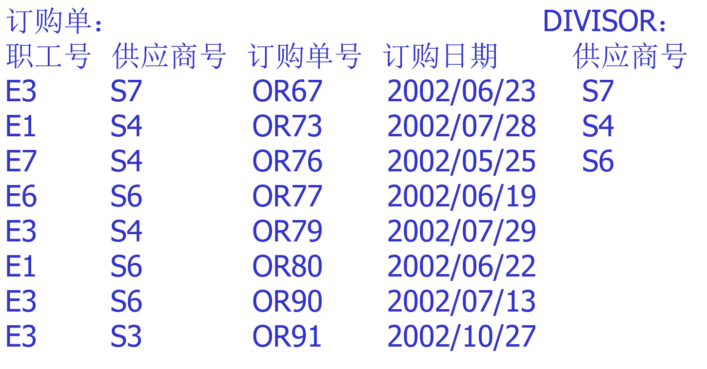
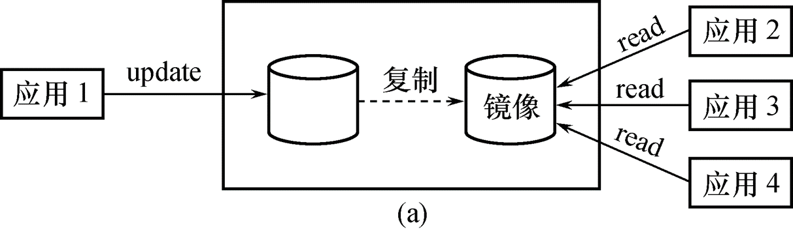
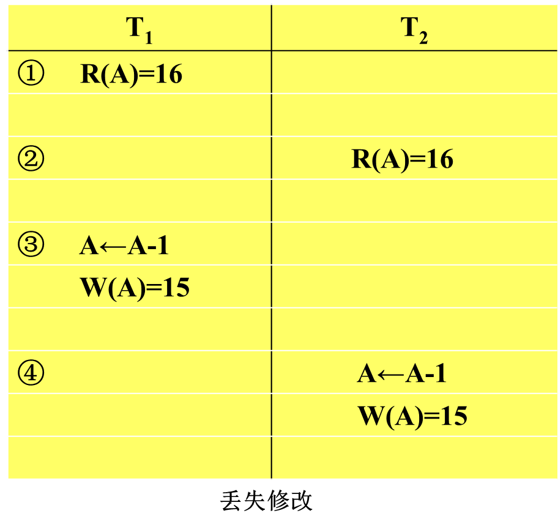
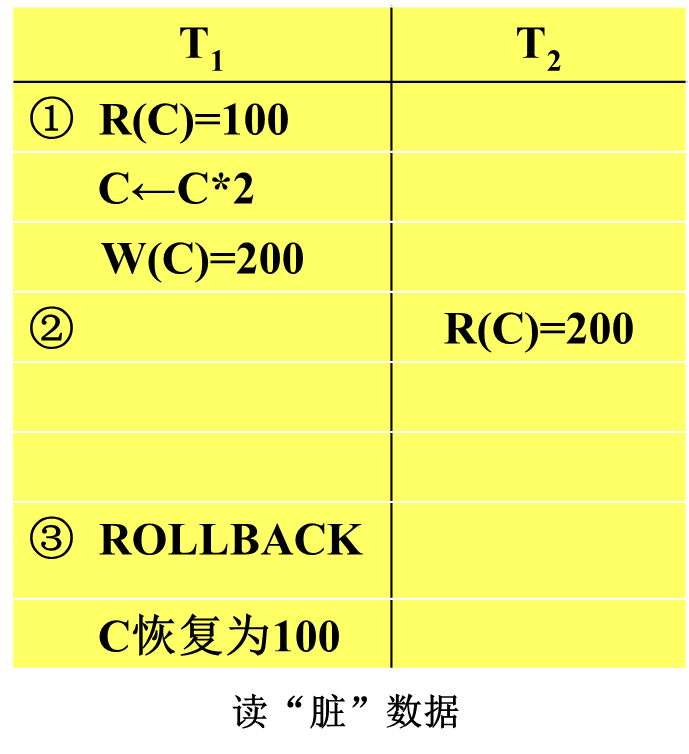
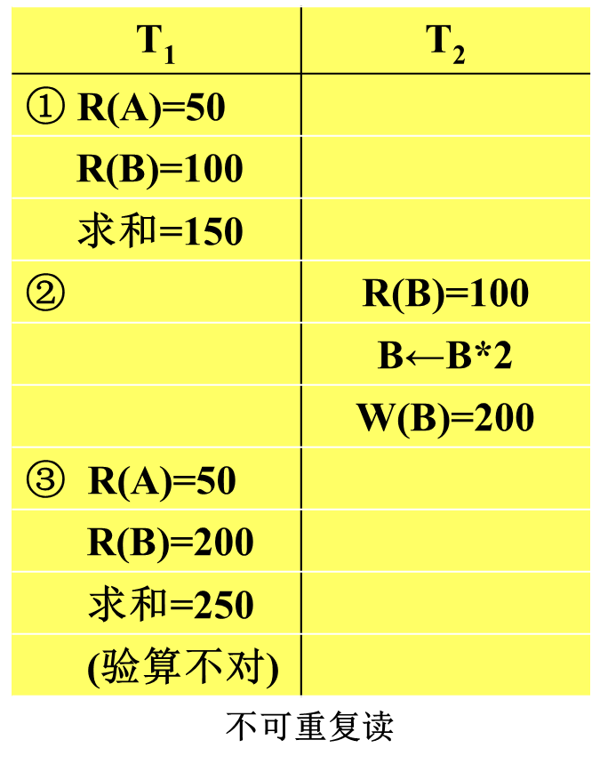

# 第1章 绪论

从现实数据到计算机数据库系统

$$现实世界(手工管理)\\数据模型(建模)\begin{cases}信息世界(概念模型)\\计算机世界\begin{cases}数据逻辑模型\\数据物理模型\end{cases}\\计算机世界(DBS):DBMS+开发工具+系统架构\end{cases} $$

## 1.1 数据库系统概述

### 1.1.1 基本概念

> 数据、数据库、DBMS、DBS

<font color=66ccff>数据(Data) </font>: 描述事物的符号记录

<font color=66ccff>数据库(Database, DB)</font> : 长期存储在计算机内有组织, 可共享的大量数据集合

<font color=66ccff>数据库管理系统(Database Mange System, DBMS) </font>: 对数据库进行管理，使之能为多个用户共享，能保证数据的安全性、可靠性、完整性、一致性，并保证数据的高度独立性。

- 数据库定义(DDL: Data Definition Language) : 对数据库中的数据对象的组成和结构进行定义
- 数据组织、存储和管理
- 数据库操纵(DML: Data Manipulation Language): 进行增删改查
- 数据库的事务管理和运行管理
- 数据库控制(DCL: Data Control Language): 数据库的建立和维护功能
- 数据库通信(CM: Communication Management)

<font color=66ccff>数据库系统(Database System, DBS) </font>: 由数据库, DBMS(及其应用开发工具), 应用系统和数据库管理员(database administrator, DBA)组成的存储, 管理, 处理和维护数据的系统

- DBS=DB+DBMS+运行计算机(硬件和os)+DBA+一些说明文档

### 1.1.2 数据管理技术的产生和发展


| 对比项       | 人工管理阶段                         | 文件系统阶段             | 数据库系统阶段                                               |
| ------------ | ------------------------------------ | ------------------------ | ------------------------------------------------------------ |
| 应用领域     | 科学计算                             | 科学计算,数据管理        | 大规模数据管理                                               |
| 主要硬件     | 无直接存取存储设备                   | 磁盘, 磁鼓               | 大容量磁盘, 磁盘阵列                                         |
| 主要软件     | 没有操作系统, 没有管理数据的专门软件 | 有文件系统               | 有数据库管理系统                                             |
| 数据处理方式 | 批处理                               | 联机实时处理, 批处理     | 联机实时处理, 分布处理, 批处理                               |
| 数据管理者   | 人(程序员)                           | 文件系统                 | 数据库管理系统                                               |
| 数据面向对象 | 某一应用程序                         | 某一应用                 | 现实世界(部门, 企业, 跨国组织等)                             |
| 数据共享程度 | 不独立, 完全依赖应用                 | 独立性弱                 | 具有较强的物理独立性和一定的逻辑独立性                       |
| 数据结构化   | 无结构                               | 记录内有结构, 整体无结构 | 整体结构化, 用数据模型描述                                   |
| 数据控制能力 | 应用程序自己控制                     | 应用程序自己控制         | 由数据库管理系统提供数据安全性, 完整性, 并发控制和数据库恢复功能 |

### 1.1.3 数据库系统的特点

- 整体数据的结构化
  - 数据之间具有联系, 不仅要考虑某个应用的数据结构, 还要考虑整个组织的数据结构
- 数据的共享性强, 冗余度低且易于扩充
- 数据的独立性强: 数据改变时, 代码不用修改, 相互独立
  - 物理独立性: 数据的物理结构改变时, 应用程序不用改变
  - 逻辑独立性: 数据的逻辑结构改变时, 应用程序不用改变
- 数据有数据库管理系统统一管理和控制
  - 数据库的安全性(security)保护
  - 数据库的完整性(integrity)检查
  - 数据库的并发性(concurrency)控制
  - 数据库的恢复

## 1.2 数据模型

1. 两类：概念模型<font color='orange'><E-R图></font>、逻辑模型<font color='orange'>(本书中的数据模型指的是逻辑上的数据模型)</font>和物理模型<font color='orange'>(DBMS实现)</font>
   - 

2. 数据模型三要素

   - 概念模型：实体、联系、E-R图(Entity-Relationship model)

   - 逻辑模型：层次、网状、关系

### 1.2.1 概念模型-信息结构与E-R方法

#### 数据的三种范畴

> 物理世界, 信息世界, 计算机

- 现实世界的术语：事物、特征、事物集、标识特征。

  - **事物**：客观存在并可以相互区分的事、物或抽象事件。

  - **特征**：事物的某个性质/属性/方面。

  - **事物集**：具有相同特征的一类事物的集合。

  - **标识特征**：区分事物的特征**。**
- 信息世界的术语：

  - **实体Entity**：客观存在并可以相互区分的事物或抽象事件。//个体
  - **属性Attribute**：实体所具有的某一特性
  - **码Key**：唯一标识实体的属性或属性集
  - **域Domain**：属性的取值范围。
  - **实体型**：用实体名及其属性名集合来抽象和刻画同类实体。
  - **实体集**：同一类型实体的集合。//实体
  - **联系Relationship**：实体内部的联系和实体之间的联系**。**

- 计算机世界的术语：**记录、数据项/字段、文件、关键字**。
  - 型和值：型表示定义/结构，值表示某个术语的具体的表现/值。

#### 两个实体之间的联系

1. 联系的种类
   - 一对一联系：1:1
   - 一对多联系：1:n
   - 多对多联系：m:n
2. 如何表示？实体-联系方法(Entity-Relationship, ER)

   - 实体-联系方法用于描述现实世界中的信息结构，描述结果称为E-R模型或概念模型。它是最高级的抽象，与具体的数据模型没有关系。现实世界中的语义在这里（指确定联系类型的种类）起了最关键的作用！
   - 用画图表示, 即为==E-R图==

3. 图元素

   - 实体：用矩形框表示，并写上实体名。
   - 属性：用椭圆形表示，写上属性名，用边与相应的实体相连。
   - 联系：用菱形框表示，写上联系名，并用连线与有关的实体相连。

4. 联系画法

   - **1:1联系** 实体A中的个体与实体B中的个体存在一一对应关系。比如，厂长实体与工厂实体，如下所示。
     

   - **1:n联系** 对于实体A中的一个个体，在实体B中可以有多个个体与之对应，但对于实体B中的一个个体，实体A中最多只有一个个体与之对应。比如，学校实体与学生实体。
     

   - **m:n联系** 对于实体A中的一个个体，在实体B中可以有多个个体与之对应，反之亦然。比如，学生实体与课程实体。
     


#### 两个以上的实体型之间的联系

如下, 三个实体之间具有联系

比如，在考虑仓库、器件、供应商三个实体时，我们规定：

- 每个仓库可以向多个供应商订购多种器件
- 每个供应商可以向多个仓库提供多种器件
- 每种器件可以由多个供应商供应，可以由多个仓库购买。

这样，描述仓库、器件、供应商三个实体之间的E-R图如下所示。


#### 单个实体型内的联系

实体A中的两个个体之间也可以存在着联系。比如，在职工实体中，有领导者与被领导者，用E-R图表示为：
 
当然，也可以考虑两个实体：职工、领导者。这样的设计与上述设计对今后数据库有很大的影响。

#### 实体与属性

标识属性(码)加下划线。

- 注意：*联系也会有属性*。
-  

#### 例: 工厂物资管理的概念模型

实体之间的联系主要取决于现实世界的管理方法，或者说，取决于语义，即同样两个实体，在不同的语义下，将有不同的联系类型。比如，对于仓库和器件两个实体：

- 如果规定一个仓库只能存放一种器件，并且一种器件只能存放在一个仓库，
  这时仓库和器件之间的联系是一对一的

- 如果规定一个仓库可以存放多种器件，但是一种器件只能存放在一个仓库，
  这时仓库和器件之间的联系是一对多的
- 如果规定一个仓库可以存放多种器件，同时一种器件可以存放在多个仓库，
  这时仓库和器件之间的联系是多对多的

**实体：**

- 仓库：属性有仓库号、面积、电话号码
- 零件：属性有零件号、名称、规格、单价、描述
- 供应商：属性有供应商号、姓名、地址、电话号码、帐号
- 项目：属性有项目号、预算、开工日期
- 职工：属性有职工号、姓名、年龄、职称

**实体之间的联系如下：**

- 一个仓库可以存放多种零件，一种零件可以存放在多个仓库，因此仓库和零件之间的联系是**多对多**的；
  用库存量表示某种零件在某个仓库中的数量。 

- 一个仓库有多个职工，一个职工只能在一个仓库工作，因此仓库和职工之间的联系是**一对多**的。
- 职工之间具有领导-被领导关系，因此职工实体型中具有一对多的联系。
- 供应商、项目和零件三者之间有多对多的联系。


### 1.2.2 数据模型-数据逻辑模型

1. 数据模型三要素
   - 数据结构: 描述数据库的组成对象以及对象之间的联系。
     - 如 层次结构、网状结构、关系结构和面向对象结构
   - 数据操作： 对数据库中各种对象允许执行的操作集合
     - 如关系模型的增删改查
   - 完整性约束(Integrity Constraints, IC): 规定给定的数据模型中数据及其联系所应满足的制约和依存规则，以保证数据的正确、有效和相容。
     - 对关系模型而言，有三种完整性约束：实体完整性、参照完整性和用户自定义完整性。
2. 传统的三种数据逻辑模型: 层次模型, 网状模型, 关系模型

#### 层次模型

- 用树形结构来表示实体以及实体之间的联系, 在层次模型中，结点表示实体，连线表示一对多的联系。
- 层次模型的特征/限制是：
  1. 有且仅有一个结点无父结点，这个结点即为树的根；
  2. 其他结点有且仅有一个父结点。
-  
- 层次数据库管理系统的典型代表是：IMS(Information Management System)
  - 型和值: IMS中把构成层次结构的一组实体称作层次型，层次型中的每个实体称作片段，组成片段的最小数据单位是字段。
- 层次模型特点
  - 层次模型像一棵倒立的树。
  - 层次模型的一个基本的特点是：任何一个给定的记录值只有按其路径查看时，才能显出它的全部意义，没有一个子女记录值能够脱离**父结点记录值**而独立存在。
    
  - 层次型数据库不支持多对多联系，可以考虑把有两个父结点的非层次结构转换成两个层次型。
- 层次模型的数据操纵：查询、插入、删除和更新。
- 层次模型的完整性约束条件：维持层次模型, 如插入时没有相应的双亲节点值就不能插入其子女结点值, 删除双亲节点值, 那么子女结点值也要删除
- 层次模型的存储结构：
  - 邻接法：P23
  - 链接法：P24
- 层次模型的优缺点：
  - 优点：数据结构简单、清晰;查询效率高；良好的完整性支持。
  - 缺点：
    - 多对多联系表示困难；
    - 一个结点有多个双亲时，表示比较困难；
    - 查询子女结点必须通过其双亲结点；层次命令趋于结构化。

#### 网状模型

- 用网络结构来表示实体之间联系的数据模型称为<font color='#66ccff'>网络数据模型</font>。
  网络模型的典型代表是CODASYL ——Conference On Data System Language.
- 在网络模型中，取消了层次模型中的两点限制，即允许一个结点可以有多个父结点。
  - 网络模型和层次模型在本质上是一样的，从逻辑上看它们都是用连线表示实体之间的联系，用结点表示实体；
    从物理上看它们都是用指针来实现两个文件之间的联系，只是在网络模型中连线更加复杂。
- 网状数据模型的存储结构：P27图1。25
- 网状模型的优缺点：
  - 优点：
    - ①结点之间可以有多种联系，因此能够更为直接地描述某些现实世界。
    - ②存取效率较高。
  - 缺点：
    - ①结构比较复杂；
    - ②相应的DDL、DML语言复杂；
    - ③记录之间联系是通过存取路径而实现，应用程序在访问数据时必须选择适当的存取路径。

#### 关系模型

- 关系模型Relational Data Model：用关系结构（二维表）来表示实体以及实体之间的联系。
- 关系数据库管理系统的典型代表是：Oracle、Sybase、DB2、SQL Server、InfoMix、Access…。

- Basic Concepts：

  - 一个关系对应一张二维表；
    - 在关系模型中，二维表格中的每一行称作一个<font color='#66ccff'>元组(Tuple)</font>，它相当于一个记录值，

    - 每一列是一个属性，列可以命名，称为属性名。

    - 因此可以说，关系是元组的集合。

    - 如果表格中有n列，称该关系是n元关系。

  - 一些定义
    - <font color='#66ccff'>码</font>：表中的某个/些属性集，可以唯一地确定一个元组。
    - <font color='#66ccff'>域</font>：属性的取值范围。
    - <font color='#66ccff'>分量</font>：元组中的一个属性值。
    - <font color='#66ccff'>关系模式</font>：对关系的描述。一般表示为：关系名（属性1，属性2，……，属性n）
    - 关系数据模型的<font color='#66ccff'>固有约束</font>：关系的每一个分量必须是一个不可分的数据项目。

- 关系数据模型的存储结构：
- 关系数据模型的优缺点：
  - 优点：
    1. 有严格的数学概念//[集合论](# 正式定义)
    2. 关系模型的概念单一//？
    3. 存取路径对用户透明。//Transparent!
  - 缺点：查询效率比较低。//Query Optimization

## 1.3 数据库系统的结构

> 如何认识数据库系统的体系结构？
>
> - 从企业信息化建设的角度来看：DBS总体架构可以采用集中式和分布式两类，在集中式DBS中根据数据访问模式的不同又分为C/S和B/S两种体系结构；
> - 从信息管理系统的组成部分来看：DBS=DBMS+DB+DBA+Application+Specifications
> - 从计算机系统的角度来看：DBS将所有的数据划分为**三层模式**，相邻两层模式之间提供**映射**，见后面论述。

### 1.3.1 数据库三层模式

数据库系统的三级模式结构：外模式、模式和内模式。相应地，有三层数据库。

  

- 定义**存储数据库结构**的模式称作<font color='#66ccff'>存储模式/内模式</font>；
  - 内模式是数据物理结构和存储方式的描述，是数据在数据库内部的表示方式。

- 定义**概念数据库结构**的模式称作<font color='#66ccff'>概念模式</font>，简称<font color='#66ccff'>模式</font>； <font color='orange'>(此处的概念模式指的是数据逻辑模型, 要与概念模型相区别)</font>
  - 模式实际上是数据库在逻辑级上的视图(window)。一个数据库只有一个模式。数据库模式以某一种数据模型为基础，统一综合地考虑了所有用户的需求，并将这些需求有机地结合成一个逻辑整体。

- 定义**外部数据库结构**的模式称作<font color='#66ccff'>外部模式</font>，也称<font color='#66ccff'>子模式</font>；
  - 用户的数据**视图**(View)
- 注意与[数据模型](# 1.2 数据模型)区别

### 1.3.2 两种映象

> 在数据库的三级模式结构中，存在两种映像，外模式/模式映像，模式/内模式映像。

<font color='#66ccff'>外模式/模式映像</font> 

- 定义了某个外模式与模式之间的对应关系。当模式改变时，由DBA对各个外模式 /模式的映像作相应的改变，可以使外模式保持不变。应用程序是依据外模式编写的，从而应用程序不必修改，保证了数据与程序的逻辑独立性。
- <font color='#66ccff'>概念数据独立性(逻辑独立性)</font>: 
  - 外部文件/子文件：概念文件中与某个应用程序相关的部分字段。
  - 指当修改概念文件的结构时<font color='orange'>(数据逻辑结构改变)</font>，应用程序不用改变。

<font color="#66ccff">模式/内模式映像</font> 

- 定义了数据全局逻辑结构与存储结构之间的对应关系。当数据库的存储结构改变了，由DBA对模式/内模式映像作相应修改，可以使模式保持不变，从而应用程序也不必改变，保证了数据与程序的物理独立性。

- <font color = #66ccff>存储数据独立性(物理独立性)</font>：存储文件的存储方法和存储结构<font color=orange>(物理存储)</font>改变，用户程序不用改变


## 1.4 数据库系统的组成

1. DBS的组成：数据库DB, DBMS(及其应用开发工具), 应用系统和数据库管理员(database administrator, DBA)组成

2. 数据库管理系统DBMS读取一条记录时所发生的一系列事件：
   1. 用户程序A向DBMS发出读一条记录的指令，这时用户程序要给出外部文件名和记录的关键字值；
   2. DBCS(数据库控制系统)分析所接到的指令，访问对应的外部模式；
   3. DBCS完成外部模式到概念模式的转换，决定访问哪个/些概念文件；
   4. 接着由DBSS(数据库存储系统)完成概念模式到存储模式的转换，并决定访问哪个/些存储文件；
   5. DBSS调用存取方法，通过操作系统将读取的记录送到系统缓冲区；
   6. 用户程序从系统缓冲区得到所需记录和DBMS返回的状态信息；
   7. 用户程序在工作区中使用所得到的记录。


## 第一章小测

一：选择题（3分）

1．物理数据独立性是指（**C**）。

   A．模式改变，外模式和应用程序不变；B．逻辑模式改变，内模式不变

   C．内模式改变，逻辑模式不变；     D．外模式改变，模式不变

2．数据库在磁盘上的基本组织形式是（ **B**）。

   A．DB   B．文件   C．二维表   D．系统目录

3．当关系有多个候选码时，则选择一个作为主码，但若主码为全码时应包含( **D** )。

   A．单个属性   B．两个属性   C．多个属性   D．全部属性

二：填空题（5分）

1、数据管理技术的发展，与 <u>计算机硬件 、 系统软件 和  应用</u> 有密切的联系。

2、对现实世界进行第一层抽象（最高级别的抽象）的模型，称为 <u>概念</u> 模型，对现实世界进行第二层抽象的模型，称为 <u>逻辑</u> 模型。

三：E-R图（6分）

设要建立一个企业数据库，该企业各部门有许多职员，但一个职员仅属于一个部门；每个职员可参加多项工程，每项工程可有多个职员；有若干供应商同时为各不同工程供应各种零件。试画出E-R图，自行适当给出各实体的属性2-3个。 

- 注意: 零件也是实体 供应商:零件(M:N)

四、简答题（6分）

1.数据逻辑模型三要素是什么？对于关系模型而言，其三要素是什么？

- **数据结构; 数据操纵; 完整性约束**
   **二维表; 增删改查; 实体完整性, 参照完整性, 用户定义完整性**

# 第2章 关系数据库

> History of Relational Database
>
> - CODASYL于1962年发表的“信息代数”一文 
>
> - E.F.Codd从1970年起发表了一系列的论文
>
> - 20世纪70年代末的实验系统System R和Ingres(UCB)
>
> - 从20世纪80年代逐步走向成熟,Oracle, Sybase…

## 2.1 关系数据结构及形式化定义

<font color='#66ccff'>关系</font>数据结构 (什么是关系)

- 关系数据结构非常简单，在关系数据模型中，现实世界中的实体及实体与实体之间的联系均用关系来表示。从逻辑或用户的观点来看，关系就是**二维表**。 

### 2.1.1 关系型数据库操作

- 传统的集合运算 
  - 并（Union） 、交（Intersection） 、差（Difference） 
  - 广义笛卡尔积（Extended Cartesian Product） 
- 专门的关系运算
  - 选择（Select） 、投影（Project） 、连接（Join）
  - 除（Divide）
- 有关的数据操作 
  - 插入（Insert） 删除（Delete） 修改（Update） 
- ==注意==: 
  - 关系是以集合的方式操作的，即操作的对象是元组的集合，操作的结果也是元组的集合。
    这和非关系模型的操作结果是一条记录有着重要区别。

### 2.1.2 关系的操作方式

- 关系的操作能力可以用代数方式和逻辑方式来表示: 
  - **代数方式**是通过关系代数对关系的运算来表达查询要求的方式。
    - 典型代表是关系代数语言。
  - **逻辑方式**是通过关系演算、用谓词表达对关系的查询要求的方式。
    - 典型代表是元组关系演算语言和域关系演算语言。 
    - DataLog语言：人工智能语言Prolog在数据库中的应用。
- <font color='#66ccff'>关系数据库标准语言 SQL（Structured Query Language）</font>，它是一种介于关系代数和关系演算的语言，提供DDL（数据定义语言）、DML（数据操纵语言）和DCL（数据控制语言）等功能。 
- 可以把关系数据语言分为三类：
  - 关系代数语言(ISBL,由IBM研制)
  - 关系演算语言(ALPHA/QUEL/QBE)
  - 具有关系代数和关系演算双重特点的SQL语言。
- SQL特点：具有完备的表达能力，是非过程化的集合操作语言，功能强，可以直接交互使用也可以嵌入高级程序设计语言中使用。

### 2.1.3 关系完整性约束(Integrity Constraint, IC)

- 在数据库中数据完整性是指保证数据正确的特性，是一种语义概念。它包括两方面的内容：
  - 与现实世界中应用需求的数据的相容性和正确性； 
  - 数据库内数据之间的相容性和正确性。 
- 在关系数据模型中一般将数据完整性分为三类： 
  - 实体完整性 
  - 参照完整性 
  - 用户定义完整性 

### 2.1.4 关系模型

- 关系模型的基本数据结构是关系：实体以及实体之间的联系都用关系来表示，并且直观来看关系就是二维表,由行和列组成
   

#### 关系模型的一些概念

1. <font color='#66ccff'>关系(Relation)</font>：二维表，表名就是关系名。

2. <font color='#66ccff'>属性(Attribute)</font>：表中的**列**称为属性，每个属性有一个在该表中唯一的属性名，列的个数称为关系的元数，有n个列的表为n元关系。

3. <font color='#66ccff'>值域(Domain)</font>：表中属性的取值范围称为值域。
   - 不同的列可以有相同的值域

4. <font color='#66ccff'>元组(Tuple)</font>：表中的行称为元组/记录。

5. <font color='#66ccff'>分量(Component)</font>：元组中的每一个**属性值**称为元组的一个分量，n元关系的每个元组就有n个分量。

      

6. <font color='#66ccff'>关系模式(Relation Schema)</font>：二维表的结构称为关系模式。设关系名为REL，属性为A1,A2,…,An,则关系模式可以表示为：REL(A1,A2,…,An)

7. <font color='#66ccff'>关系模型(Relation Model)</font>：所有的关系模式的总称。

8. <font color='#66ccff'>关系数据库(Relation Database)</font>：对应于一个关系模型的所有关系的集合称为关系数据库。
   关系模型是“型”，或“内涵(Intention)”，关系数据库是“值”，或外延(Extension)。

9. <font color='#66ccff'>候选关键字, 候选键, 候选码(Candidate Key)</font>：如果一个属性集的值能**唯一标识**该关系的元组而又**不含有多余的属性**，则称该属性集为候选关键字/候选键/候选码，一个关系可以有多个候选键。

      - <font color='#66ccff'>主属性(Primary Attribute)</font>：任一候选键中出现的属性称为主属性。
      - <font color='#66ccff'>非主属性(Nonprimary Attribute)</font>：不在任一候选键中出现的属性。

10. <font color='#66ccff'>主关键字, 主键, 主码(Primary Key)</font>：当一个关系有**多个候选键**时，可以**指定其中一个**作为主关键字/主键/主码。
      - 每个关系有且只有一个主键

11. <font color='#66ccff'>全码(All-key)</font>: 关系的所有属性是这个关系模式的候选码

12. <font color='#66ccff'>外部关键字, 外部键, 外码(Foreign Key)</font>：如果一个属性集不是所在关系的关键字，但是是其他关系的关键字，则该属性集称为外部关键字/外部键/外码。

13. 参照关系(Referencing Relation)和被参照关系(Referenced Relation)：在关系数据库中通过外部键使两个关系关联，这种联系通常是一对多(1:n)的，其中主/父关系(1方)称为被参照关系，从/子关系(n方)称为参照关系。

#### 正式定义

> CODD论文的内容

1. <font color='#66ccff'>域</font>: 域是一组具有相同数据类型的值的集合
2. <font color='#66ccff'>笛卡尔积</font>：给定一组域$D_1，D_2，…，D_n$（它们可以相同），定义$D_1，D_2，…，D_n$的笛卡尔积为：
   - $D_1\times D_2\times…\times D_n = \{(d_1, d_2,\ ...\ ,d_n)| d_i\in D_i, i=1,2,..,n\}$
   - 其中每一个元素$(d_1, d_2,\ ...\ ,d_n)$叫作一个<font color='#66ccff'>n元组</font>，元组中每一个d_i叫作<font color='#66ccff'>元组的一个分量</font>。
   - 笛卡尔积就是一种所有可能的组合的运算
3. 关系的形式定义：笛卡尔积$D_1，D_2，…，D_n$ 上的一个n元关系。
4. ==注意==
   - **集合中的元素是无序**的，关系是元组的集合，元组可以是无序的；但关系中的**元组的分量是有序**的。 
     例如，在关系中(a,b)≠(b,a)，但在集合中{a,b}={b,a}。
   - 若一个关系的元组个数是无限的，则该关系称为无限关系，否则称为有限关系；
     在数据库中只考虑有限关系。

#### 关系的性质

- 每一分量必须是不可分的最小数据项，即每个属性都是不可再分解的，这是关系数据库对关系的最基本的限定。 <font color='orange'>(即1NF)</font>

- 列的个数和每列的数据类型是固定的，即每一列中的分量是同类型的数据，来自同一个值域。 

- 不同的列可以出自同一个值域，每一列称为属性，每个属性要给予不同的属性名。 
- 列的顺序是无关紧要的，即列的次序可以任意交换，但一定是整体交换，属性名和属性值必须作为整列同时交换。 
- 行的顺序是无关紧要的，即行的次序可以任意交换。 
- 元组不可以重复，即在一个关系中任意两个元组不能完全一样。 

## 2.2 关系操作

1. ==关系操作==：**选择**、**投影**、连接、除、**并**、**差**、交、**笛卡儿积**。
   - 其中，选择、投影、并、差、笛卡儿积是5种基本操作，其他操作可以用基本操作来定义和导出。
2. 集合操作方式：操作的对象和结果都是集合，即一次一集合方式，Set-at-a-time。
   非关系数据模型的数据操作方式为一次一记录，即Record-at-a-time。
3. 关系数据语言的分类
   - 关系代数语言：ISBL
   - 关系演算语言：
     1. 元组关系演算APLHA，QUEL
     2. 域关系演算QBE
     3. SQL：T-SQL、PL/SQL、…

## 2.3 关系的完整性

> 三种完整性约束:实体完整性、参照完整性和用户自定义完整性

### 2.3.1 实体完整性

1. ==实体完整性==是要保证关系中的每个元组都是**可识别和唯一的**。

2. 实体完整性规则的具体内容是：若属性A是关系R的**主属性**，则属性A**不可以为空值**NULL。

   - **空值**: 就是“不知道”或“还没有确定”，它既不是数值0，也不是空字符串，是一个未知的量(Null)。 

3. 实体完整性是关系模型必须满足的完整性约束条件，也称作是关系的不变性。

   关系数据库管理系统可以用主关键字实现实体完整性，这是由关系系统自动支持的。

### 2.3.2 参照完整性

> 现实世界中的实体间存在着某种联系，而在关系模型中实体是用关系描述的、实体之间的联系也是用关系描述的，这样就自然存在着**关系和关系之间的参照或引用**。

==参照完整性==也是关系模型必须满足的完整性约束条件，是关系的另一个不变性。

- 通过一个例子来说明什么是参照完整性。
  比如，仓库(仓库号，城市，面积)，职工(职工号，仓库号，工资) ，在仓库关系和职工关系之间存在参照/引用关系，即职工关系的仓库号属性的取值需要来自于仓库关系的关键字“仓库号”，因为，从语义上来讲，一个职工肯定隶属于一个已经存在的仓库，而不会属于一个不存在的仓库。在这里，仓库关系是被参照/被引用关系，职工关系是参照关系。

1. 参照完整性规则的内容是：如果属性（或属性组）F是关系R的**外部关键字**，它与关系S的**主关键字K**相对应，则对于关系R中每个元组在属性（或属性组）F上的值必须为：

   - 或者取空值（F的每个属性均为空值）
     - 比如说，在前面的例子中，某个新来的职工还未确定在哪个仓库工作，则该职工的仓库号为空值。
   - 或者等于S中某个元组的主关键字的值。

   - 在关系系统中通过说明**外部关键字(外键)**来实现参照完整性。

### 2.3.3 用户自定完整性

==用户自定义完整性==: 一种与应用密切相关的数据完整性约束，如 

- 某个属性的值必须唯一

- 某个属性的取值必须在某个范围内

- 某些属性值之间应该满足一定的函数关系等

类似以上的约束不是关系数据模型本身所要求的，而是为了满足应用方面的语义要求而提出的，这些完整性需求需要由用户定义，因此称为用户自定义完整性。

在用户定义完整性中最常见的是限定属性的取值范围，即对值域的约束，也称为**域完整性约束**，包括说明属性的数据类型、精度、取值范围、是否允许空值等。

### 2.3.4 完整性约束作用

**执行插入操作时检查完整性** 

- 执行插入操作时需要分别检查实体完整性规则、参照完整性规则和用户定义完整性规则。
- 检查实体完整性规则：主属性是否为空？主键取值是否唯一？
- 检查参照完整性规则：外部键取值是否存在？
- 检查用户定义完整性规则：是否满足用户定义的约束？

**执行删除操作时检查完整性** 

- 执行删除操作时一般只需要检查参照完整性规则。

**执行更新操作时检查完整性** 

- 执行更新操作可以看作是先删除旧的元组，然后再插入新的元组。所以执行更新操作时的完整性检查**综合了上述两种情况**。

## 2.4 关系代数 ※

> 重点+SQL 7~8题 21~24分

| Operation          | 中文         | 符号                              | $\LaTeX$                    |
| ------------------ | ------------ | --------------------------------- | --------------------------- |
| Projection         | 投影         | $\Pi$                             | `\Pi`                       |
| Selection          | 选择         | $\sigma$                          | `\sigma`                    |
| Renaming           | 重命名       | $\rho$                            | `\rho`                      |
| Aggregate Function | 聚合函数     | $\mathcal{G}$                     | `\mathcal{G}`               |
| Union              | 交           | $\cap$                            | `\cap`                      |
| Intersection       | 补           | $\cup$                            | `\cup`                      |
| Natural Join       | 自然连接     | $\bowtie$                         | `\bowtie`                   |
| Left Outer Join    | 左外连接     | ⟕                                 | … 这几个直接复制吧          |
| Right Outer Join   | 右外连接     | ⟖                                 |                             |
| Full Outer Join    | 全外连接     | ⟗                                 |                             |
| Cartesian product  | 笛卡尔乘积   | $\times$                          | `\times`                    |
| Divide             | 除           | $\div$                            | `\div`                      |
| Assignment         | 赋值         | $\div$                            | `\leftarrow`                |
| And                | 条件并列     | $land$                            | `\land` or `\vee`           |
| Negation           | 非           | $neg$                             | `\neg`                      |
| Exist              | 存在         | $\exist$                          | `\exists`                   |
| For All            | 对所有       | $\forall$                         | `\forall`                   |
|                    | 下标文字     | $\sigma_{username}$               | `_{\text{}}`                |
|                    | 粗体文字     | $\mathcal{G}_{\textbf{count}}(*)$ | `\textbf{}`                 |
|                    | 长长长长括号 | $\big( \Big( \bigg( \Bigg($       | `\big( \Big( \bigg( \Bigg(` |
|                    | 比较         | >, ≥, <, ≤, ≠                     | `\gt \ge \lt \le \ne`       |

### 2.4.1 基本概念和几个符号

1. 关系代数的运算由如下两大类组成，即：
   - 传统的集合运算：广义笛卡尔积、集合并、集合交、集合差运算等；
   - 专门的关系运算：选择、投影、连接和除运算。

#### 关系代数中的运算符

- 集合运算符：$\cap,\ \cap,\ -, \ \times$；
- 关系运算符：$\sigma,\Pi,\infty , \div$；
- 比较运算符：$﹥、﹤、＝、≠、≤、≥$；
- 逻辑运算符：$﹁、∧、∨$。

#### 几个专门的符号：

- 设有关系模式R(A1，A2，…，An) 

  - $r∈R$表示r是R的一个**元组**；

  - $r.A_i$或$r[A_i]$表示r这个元组中相应于属性$A_i$的一个**分量**； 
  - 例如，假设R是仓库关系，r=（“WH1”,“北京”,370）是仓库关系的一个元组，则r∈R ，r.仓库号或r[仓库号]为“WH1”。 

- 设R为m元关系，S为n元关系，并且r=(r1,r2,…,rm)∈R，s=(s1,s2,…,sn)∈S，则 rs=(r1,r2,…,rm, s1,s2,…,sn)称为<font color='#66ccff'>元组的连串</font>。这是一个（m+n）元组，前m个分量为R中的一个m元组，后n个分量为S中的一个n元组。 

#### 元组中<font color='#66ccff'>属性的映像集</font>(P54)：

- 设有关系模式**R(X**,**Y)，其中X、Y可以是单个属性，也可以是属性集，定义当X取值为x时,即r[X]=x，x在R中的映象集为：**$Y_x=\{r[Y]| r∈R ∧ r.X=x\}$

- 例子：考虑订购单关系。设X={职工号}，Y={供应商号,订购单号,订购日期}，则当X取值E3时，Yx={(S7,OR67,2002/06/23), (S4,OR79,2002/07/29), (S6,OR907,2002/07/13), (S3,OR91,2002/10/27)}.

- 例子：R(X,Z),元组有：{(x1,Z1),(x1,Z2),(x1,Z3),(x2,Z2),(x2,Z3),(x3,Z1),(x3,Z3)}

  - x1在R中的映象集Zx1={Z1,Z2,Z3}

  - x2在R中的映象集Zx2={Z2,Z3}

  - x3在R中的映象集Zx3={Z1,Z3}

### 2.4.2 运算介绍

#### 传统的集合运算

集合运算：∪、∩、－、×；

- $R ∪ S=\{t|t∈R∨t∈S\}$;

- $R ∩ S=\{t|t∈R∧t∈S\}$;

- $R － S=\{t|t∈R ∧ t\notin S\}$; 
  //以上要求R和S是同质的。

- $R × S=\{rs|r∈R,s∈S\}$:假设R是m元关系，有k个元组，S是n元关系，有l个元组，则R × S是m+n元关系，有k*l个元组。<font color='orange'>(笛卡尔积)</font>

#### 专门的关系运算

1. <font color='#66ccff'>选择运算$σ$</font>: 从指定的关系中选择满足某个or些逻辑条件的元组形成一个新的关系。
   - 结构不变，元组个数改变。
   - $σ_F(R)=\{r|r ∈ R∧F\}$，这里F为结果为“真”的逻辑表达式。
   - 例: T=σ~职工号=“E3”~(订购单); S1=σ~Sdept=“IS”~(Student)。

2. <font color='#66ccff'>投影运算$П$</font>: 从指定的关系中由部分属性及元组的相应分量形成一个新的关系。
   - 结构改变，元组个数可能改变。

   - $П_{Attr(R)}=\{r.Attr|r ∈ R\}$，这里Attr为被投影的属性/属性集。

   - 例: T=П~职工号，供应商号~(订购单)；S2=П~Sname，Sdept~(Student) 。

3. <font color='#66ccff'>连接运算$∞_\theta$ </font>: 连接相互之间有联系的两个关系, 形成一个新的关系。
   - 参与运算的两个关系通常是具有一对多联系的引用与被引用关系,并且是通过外部键与主键的匹配而实现的
     - 这两个键也称为**连接属性**

   - 通常我们也称连接运算为$\theta$连接运算,这里$\theta$是比较运算符。当$\theta$为“=”时，称为<font color='#66ccff'>等值连接</font>，其余情况称为非等值连接；

4. <font color='#66ccff'>自然连接$∞$</font> : ①等值连接，并且②去掉重复的属性。

   - 例：假设R(A,B,C),S(A,D,E),则R与S的$\theta$连接运算，其结果关系模式为：T(A1,B,C,A2,D,E);
     R与S的自然连接运算，其结果关系模式为：T(A,B,C,D,E)。(暂时不考虑元组。)

5. <font color='#66ccff'>除运算$\div$</font>: 假设R(X,Y)和S(Y),其中X、Y是一个or组属性集，则
   - $R÷S=\{r.X|r∈R ∧ S\subseteq Y_x \}$
     - R为被除关系，S为除关系。
   - 商关系由R中一些**X属性值构成**，其中的任一X值所**对应的一组Y值**都**包含除关系S**
   -  
   - 应用: 至少….
     如: 列出至少向仓库WH1、WH3、WH5供货的供应商号
     


## 2.5 关系演算

感觉不如SQL…实用

## 关系代数小结

关系代数运算:

- 8种关系代数运算:并、差、交、笛卡尔积、投影、选择、连接、除；

- 5种基本运算:并、差、笛卡尔积、投影、选择；

5个操作是基本的：

- 积是唯一能使属性数目增加的操作，它不能用别的操作来表达。所以积是基本的；
- 投影是唯一能减少属性数目的操作；
- 并是唯一能不增加属性数目的但能增加元组数目的操作；
- 差不能通过并(因为并永远不能减少元组的数目)或积(同样的原因)或投影(因为投影只能是减少属性)来表达,也不能利用选择来表达,因为第二个关系中的值对差很重要,选择中却不然,因此,差是基本的；
- 选择是唯一允许属性上的值相互比较的操作；

### 补充:半连接运算T=R∝S

- T是这样的关系,它是R中参加R与S的自然连接运算后的元组集合,即:
  - $T=R∝S=П_{attr(R)}(R∞S)$ 

# 第3章 关系数据库语言SQL

## 3.1 SQL概述

SQL语言的主要特点:

- SQL是一种一体化的语言,它包括了数据定义、数据查询、数据操纵和数据控制等方面的功能，它可以完成数据库活动中的全部工作。 

- SQL语言是一种高度非过程化的语言。 

- SQL语言可以直接以命令方式交互使用，也可以嵌入到程序设计语言中以程序方式使用。

- SQL语言非常简洁，语法也很简单，很接近自然语言，共有9个动词如下：
  

### SQL与数据库三级模式


<font color='#66ccff'>基本表</font>：在数据库中独立存在的表

- 关系数据库管理系统中一个关系就对应一个基本表
- 一个或多个基本表对应一个存储文件
- 一个表可以带若干索引

<font color='#66ccff'>存储文件</font>

- 逻辑结构和物理结构组成了关系数据库的内模式

- 物理文件结构是由数据库管理系统设计确定的

<font color='#66ccff'>视图</font>：从一个或几个基本表导出的表。数据库中只存储视图的定义而不存放视图对应的数据。

- 视图是一个虚表

  用户可以在视图上再定义视图

- 视图的作用：

  - 可以动态地反映数据库的瞬时状态

  - 数据保密


## 3.2 数据定义 (表的定义)

> SQL的数据定义功能:
>
> - 数据库模式定义
>
> - 表定义
>
> - 视图和索引的定义

| **操作对象**   | **操作方式**     |                |                    |
| -------------- | ---------------- | -------------- | ------------------ |
|                | **创建**  CREATE | **删除**  DROP | **修改**  ALTER    |
| **数据库模式** | CREATE  SCHEMA   | DROP  SCHEMA   | *SQL标准无修改语句 |
| **表**         | CREATE  TABLE    | DROP  TABLE    | ALTER  TABLE       |
| **视图**       | CREATE  VIEW     | DROP  VIEW     |                    |
| **索引**       | *CREATE  INDEX   | *DROP  INDEX   | *ALTER  INDEX      |

### 模式

 

关系数据库管理系统提供层次化的数据库对象命名机制

- 一个关系数据库管理系统的实例（Instance）中可以建立多个数据库
- 一个数据库中可以建立多个模式
- 一个模式下通常包括多个表、视图和索引等数据库对象

### 3.2.1 模式的定义与删除

#### 定义模式

定义模式实际上定义了一个命名空间。

在这个空间中可以定义该模式包含的数据库对象，例如基本表、视图、索引等。

在CREATE SCHEMA中可以接受CREATE TABLE，CREATE VIEW和GRANT子句。

```sql
CREATE SCHEMA <模式名> AUTHORIZATION <用户名>
[<表定义子句>|<视图定义子句>|<授权定义子句>]
```

- ［例3.3］ 为用户ZHANG创建一个模式Test，并且在其中定义一个表Tab1。

  ```sql
  CREATE SCHEMA Test AUTHORIZATION Zhang
  CREATE TABLE Tab1(Col1 SMALLINT,
                    Col2 INT,
                    Col3 CHAR(20),
                    Col4 NUMERIC(10,3),
                    Col5 DECIMAL(5,2)
                   );
  ```

#### 删除模式

`DROP SCHEMA <模式名> <CASCADE|RESTRICT>`

- CASCADE（级联）
  删除模式的同时把该模式中所有的数据库对象全部删除
- RESTRICT（限制）
  如果该模式中定义了数据库对象（如表、视图等），则拒绝该删除语句的执行。
  - 仅当该模式中没有任何下属的对象时才能执行

### 3.2.2 基本表的定义,删除,修改

#### 一. 定义基本表

```sql
CREATE TABLE <表名>
      (<列名> <数据类型>[ <列级完整性约束 ]
       [,<列名> <数据类型>[ <列级完整性约束>] ] 
       …
       [,<表级完整性约束> ] );
```

- `<表名>`给出要创建的基本表的名称;
- `<列名>`给出列名或字段名;
- `<数据类型>`为列指定数据类型及其数据宽度;

建表的同时可以定义与该表有关的**完整性约束**条件。如果完整性约束条件涉及到该表的多个属性列，则必须定义在表级上，否则既可以定义在列级也可定义在表级。

- `<列级完整性约束>`用于定义一列上的完整性约束,一般包括**是否允许为空值**、**域约束**、**默认值**、**主关键字**等；

- `<表级完整性约束>`用于定义表一级的完整性约束,一般包括复合属性构成的**主关键字说明**、**外部关键字**及**参照关系说明**、同时涉及到多个属性的**域约束**等；

###### 例

以学生选课数据库为例
定义一个“学生选课”模式S-C-SC，包括以下三个表：
“学生”表：Student(Sno, Sname, Ssex, Sbirthdate, Smajor)
“课程”表：Course(Cno,Cname,Ccredit,Cpno)
“学生选课”表：SC(Sno,Cno,Grade,Semester,Teachingclass)

```sql
# 建立学生表Student    
CREATE TABLE Student          
      (Sno   CHAR(8) PRIMARY KEY, 		/* 列级完整性约束条件,Sno是主码*/  
       Sname VARCHAR(20) UNIQUE,        /* Sname取唯一值*/
       Ssex    CHAR(6),
       Sbirthdate Date,
       Smajor  VARCHAR(40)
      ); 

# 建立课程表Course
CREATE TABLE  Course
	(Cno       CHAR(5) PRIMARY KEY,
     Cname  VARCHAR(40) NOT NULL,            
     Ccredit  SMALLINT，
     Cpno     CHAR(5),				# 直接先修课
     FOREIGN KEY (Cpno) REFERENCES  Course(Cno)
             /* Cpno是外码 被参照表是Course 被参照列是Cno */
    ); 
# 建立“学生选课”表SC
CREATE TABLE SC
  (Sno CHAR(8),
   Cno CHAR(5),
   Grade SMALLINT,              /*成绩*/ 
   Semester CHAR(5),           /*开课学期*/ 
   Teachingclass CHAR(8),     /*学生选修某一门课所在的教学班*/ 
   PRIMARY KEY (Sno,Cno),    	
   /*主码由两个属性构成，必须作为表级完整性进行定义*/
   FOREIGN KEY (Sno) REFERENCES Student(Sno),
   /*表级完整性约束，Sno是外码，被参照表是Student */
   FOREIGN KEY (Cno) REFERENCES Course(Cno)
   /*表级完整性约束，Cno是外码，被参照表是Course*/
  );
```


##### 1. 数据类型

为列指定数据类型及其数据宽度(长度)

关系数据库支持非常丰富的数据类型，不同的数据库管理系统支持的数据类型基本是一样的，以下为常用数据类型

| **数据类型**                      | **含义**                                                     |
| --------------------------------- | ------------------------------------------------------------ |
| CHAR(n),  CHARACTER(n)            | 长度为n的定长字符串                                          |
| VARCHAR(n),   CHARACTERVARYING(n) | 最大长度为n的变长字符串                                      |
| CLOB                              | 字符串大对象                                                 |
| BLOB                              | 二进制大对象                                                 |
| INT，INTEGER                      | 整数（4字节），取值范围是[-2147483648，2147483647]           |
| SMALLINT                          | 短整数（2字节），取值范围是[-32768，32767]                   |
| BIGINT                            | 大整数（8字节），取值范围是[-2^63，2^63-1]                   |
| NUMERIC(p, d)                     | 定点数，由p位数字（不包括符号、小数点）组成，小数点后面有d位数字 |
| DECIMAL(p,d),  DEC(p, d)          | 同NUMERIC类似，但数值精度不受p和d的限制                      |
| REAL                              | 取决于机器精度的单精度浮点数                                 |
| DOUBLE  PRECISION                 | 取决于机器精度的双精度浮点数                                 |
| FLOAT(n)                          | 可选精度的浮点数，精度至少为n位数字                          |
| BOOLEAN                           | 逻辑布尔量                                                   |
| DATE                              | 日期，包含年、月、日，格式为YYYY-MM-DD                       |
| TIME                              | 时间，包含一日的时、分、秒，格式为HH:MM:SS                   |
| TIMESTAMP                         | 时间戳类型                                                   |
| INTERVAL                          | 时间间隔类型                                                 |

##### 2. 列级完整性约束

用于定义列或字段一级的完整性约束，一般包括：

- `NOT NULL`和`NULL`约束 
- `PRIMARY KEY`约束 
- `UNIQUE`约束
- `FOREIGN KEY`约束 
- `DEFAULT`定义
- `CHECK`约束

##### 3. 表级完整性约束

用于定义表一级的完整性约束，一般包括：

- `PRIMARY KEY`约束（复合属性构成的主关键字说明）
- `FOREIGN KEY`约束（外部关键字及参照关系说明）
- `CHECK`约束（同时涉及到多个属性的域完整性约束） 

##### 4. 模式与表

每一个基本表都属于某一个模式，一个模式包含多个基本表

**定义基本表所属模式**

- 方法一：在表名中明显地给出模式名 

  ```sql
  Create table "S-C-SC".Student(…);  		/*Student所属的模式是S-C-SC*/
  Create table "S-C-SC".Course(…);      	/*Course所属的模式是S-C-SC*/
  Create table "S-C-SC".SC(…);         	/*SC所属的模式是S-C-SC*/
  ```

- 方法二：在创建模式语句中同时创建表 

- 方法三：设置所属的模式 

创建基本表（其他数据库对象）时，若没有指定模式，系统根据**搜索路径**来确定该对象所属的模式

关系数据库管理系统会使用模式列表中第一个存在的模式作为数据库对象的模式名

若搜索路径中的模式名都不存在，系统将给出错误

- 显示当前的搜索路径： SHOW SEARCH_PATH; 

- 搜索路径的当前默认值是：$user， PUBLIC 

数据库管理员用户可以设置搜索路径，然后定义基本表 

- `SET SEARCH_PATH TO "S-C-SC", PUBLIC;`
- 定义基本表：`Create table Student(......);  `

- 建立S-C-SC.Student基本表
- 关系数据库管理系统发现搜索路径中第一个模式名S-C-SC ，就把该模式作为基本表Student所属的模式


#### 二. 修改基本表

```sql
ALTER TABLE <表名>
[ ADD [COLUMN] <新列名> <数据类型> [ 完整性约束 ] ]
[ ADD <表级完整性约束>]
[ DROP [ COLUMN ] <列名> [CASCADE| RESTRICT] ]
[ DROP CONSTRAINT<完整性约束名>[ RESTRICT | CASCADE ] ]
[ RENAME COLUMN <列名> TO <新列名> ]
[ ALTER COLUMN <列名> TYPE <数据类型> ];
```

- <表名>是要修改的基本表
- ADD子句用于增加新列、新的列级完整性约束和新的表级完整性约束
- `DROP COLUMN`子句用于删除表中的列
  - 如果指定了`CASCADE`短语，则自动删除引用了该列的其他对象
  - 如果指定了`RESTRICT`短语，则如果该列被其他对象引用，关系数据库管理系统将拒绝删除该列
- `DROP CONSTRAINT`子句用于删除指定的完整性约束
- `RENAME COLUMN`子句用于修改列名
- `ALTER COLUMN`子句用于修改列的数据类型

#### 三. 删除基本表

```sql
DROP TABLE <表名>［RESTRICT| CASCADE］;
```

- `RESTRICT`：删除表是有限制的
  - 欲删除的基本表不能被其他表的约束所**引用**(外键)
  - 如果存在依赖该表的对象，则此表不能被删除
- `CASCADE`：删除该表没有限制
  - 在删除基本表的同时，相关的依赖对象一起删除

### 3.2.3 索引的建立与删除

#### 一. 什么是索引

1. 建立索引目的：加快查询速度
2. 数据库常见索引：
  - 顺序文件上的索引
  - B+树索引
  - 哈希（hash）索引
  - 位图索引
3. 特点：
  - B+树索引具有动态平衡的优点 
  - 哈希索引具有查找速度快的特点

#### 二. 建立索引

```sql
CREATE [UNIQUE] [CLUSTER] INDEX <索引名> 
ON <表名>(<列名>[<次序>][,<列名>[<次序>] ]…);
```

- `<表名>`：要建索引的基本表的名字
- 索引：可以建立在该表的一列或多列上，各列名之间用逗号分隔
- `<次序>`：指定索引值的排列次序，升序：ASC，降序：DESC。默认值：ASC
- `UNIQUE`：此索引的每一个索引值只对应唯一的数据记录
- `CLUSTER`：表示要建立的索引是聚簇索引

#### 三. 修改索引

```sql
ALTER INDEX <旧索引名> RENAME TO <新索引名>;
```

#### 四. 删除索引

```sql
DROP INDEX <索引名>;
```

删除索引时，系统会从数据字典中删去有关该索引的描述

#### 3.2.4 数据字典

数据字典是关系数据库管理系统内部的一组系统表，它记录了数据库中所有定义信息：

- 关系模式定义
- 视图定义
- 索引定义
- 完整性约束定义
- 各类用户对数据库的操作权限
- 统计信息等

关系数据库管理系统在执行SQL的数据定义语句时，就是在更新数据字典表中的相应信息
查询优化和查询处理时，关系数据库管理系统要根据数据字典中的信息执行处理算法和优化算法


## 3.3 数据查询 SELECT

```sql
SELECT [ALL|DISTINCT] <表达式>[,<表达式>……]
FROM <表名>[,<表名>……]
[WHERE <逻辑表达式>]
[GROUP BY <列名>[,<列名>……][HAVING <谓词, 分组后的结果选择条件>]] 
# 按照列名在表中不同的取值进行分组 (也可以多个列名联合分组)
[ORDER BY <列名>[ASC|DESC],[<列名>[ASC|DESC]]……]
LIMIT <行数1>[ OFFSET <行数2>];
```

- 6个子句,即SELECT子句、FROM子句、WHERE子句、GROUP BY子句、HAVING子句和ORDER BY子句。

- `SELECT`子句表示要返回的查询结果,可为列名或涉及列的表达式,可用*表示表中的所有列
  - ALL说明不去掉重复元组,DISTINCT说明要去掉重复元组.

- `FROM`子句说明要查询的数据来自哪个or些表.由此,查询也常常分为单表查询和多表查询
- `WHERE`子句说明要查询的数据应该满足哪个/些条件.可以用于查询条件的运算符有:
  - 比较: =,>,>=,<,<=,!=,<>,!>,!<
  - 确定范围: BETWEEN  AND, NOT BETWEEN  AND
  - 确定集合: IN, NOT IN
  - 字符匹配: LIKE, NOT LIKE
  - ==空值==: `IS NULL`,` IS NOT NULL` (**不能=NULL**)
  - 否定: NOT
  - 多重条件: AND, OR
- `GROUP BY`子句用于对于查询结果进行分组 //分组汇总
  - HAVING子句必须跟随GROUP BY子句使用,它用来限定分组必须满足的条件 
    如 `count(*)>=50`, 组内的记录数要>=50
- `ORDER BY`子句用来对查询的结果进行排序

- `LIMIT`子句:限制SELECT语句查询结果的数量为<行数1>行，
  `OFFSET <行数2>`，表示在计算<行数1>行前忽略<行数2>行

### 3.3.1 单表查询

#### 一. 选择列

1. 查询指定列: `SELECT [列名1], [列名2] FROM Student`

2. 查询全部列: `SELECT * FROM Student`

3. 查询经过计算的列

   - SELECT子句的<目标列表达式>可以是算术表达式、字符串常量、函数等

   - ```sql
     SELECT Sname, (extract(year from current_date) - extract(year from Sbirthdate)) AS "年龄" 
         FROM Student;
     ```

#### 二. 选择元组

1. 消除重复行: `SELECT DISTINCT ...`
   - 缺省则为`SELECT ALL ...` 不会去重

2. 设置查询条件(`WHERE`)

   - | **查询条件**           | **谓词**                                            |
     | ---------------------- | --------------------------------------------------- |
     | 比较                   | =，>，<，>=，<=，!=，<>，!>，!<；NOT+上述比较运算符 |
     | 确定范围               | BETWEEN  AND，NOT  BETWEEN AND                      |
     | 确定集合               | IN，NOT  IN                                         |
     | 字符匹配               | LIKE，NOT  LIKE                                     |
     | 空值                   | IS  NULL，IS  NOT NULL                              |
     | 多重条件  （逻辑运算） | AND，OR，NOT                                        |

3. 确定集合 `IN`
   - `IN <值表>`,  `NOT IN <值表>`  

4. 字符匹配

   - ```sql
     [NOT] LIKE  ‘<匹配串>’  [ESCAPE ‘ <换码字符>’]
     ```

   - `  <匹配串>`：一个完整的字符串或含有通配符%和 _
   - `%` （百分号）：任意长度（长度可以为0）的字符串
     - 例如a%b表示以a开头，以b结尾的**任意长度**的字符串
   - `_` （下横线） ：任意单个字符。
     - 例如a_b表示以a开头，以b结尾的**长度为3**的任意字符串

5. 空值查询

   - `IS NULL` 或 `IS NOT NULL`

6. 多重条件查询
   - 逻辑运算符：`AND`和 `OR`来连接多个查询条件
   - AND的优先级高于OR，可以用括号改变优先级

#### 三. ORDER BY子句

可以按一个或多个属性列排序升序（`ORDER BY xxx ASC`）降序（`ORDER BY xxx DESC`）排列，默认值为升序
对于空值，排序时显示的次序由具体系统实现决定

#### 四. 聚集函数

1. 统计元组个数: `COUNT(*)`
2. 统计一列中值的个数: `COUNT([DISTINCT|ALL] <列名>)`
3. 计算一列值的总和: `SUM([DISTINCT|ALL] <列名>)`	
   - 此列必须为数值型
4. 计算一列值的平均值: `AVG([DISTINCT|ALL] <列名>)` 
   - 此列必须为数值型
5. 求一列中的最大值和最小值
   - `MAX([DISTINCT|ALL] <列名>)`
   - `MIN([DISTINCT|ALL] <列名>)`

#### 五. GROUP BY子句

GROUP BY子句分组：

- 按指定的一列或多列值分组，值相等的为一组
- 如果未对查询结果分组，聚集函数将作用于整个查询结果
- 分组后，**聚集函数**将作用于每一个组 

[例3.47] 查询2019年第2学期选修了10门以上课程的学生学号

```sql
SELECT Sno
FROM  SC
WHERE Semester='20192'          /*先求出2019年第2学期选课的所有学生*/
GROUP BY Sno                   	/*用GROUP BY子句按Sno进行分组*/
HAVING COUNT(*) >10;            /* 用聚集函数COUNT对每一组计数 */
```

`HAVING`短语与WHERE子句的区别：

- WHERE子句作用于基表或视图，从中选择满足条件的元组
- HAVING短语**作用于组**，从中选择满足条件的组。

[例3.48 ]查询平均成绩大于等于90分的学生学号和平均成绩

```sql
SELECT Sno,AVG(Grade)
FROM SC
GROUP BY Sno
HAVING AVG(Grade)>=90;

# 下面的语句是错误的：
SELECT Sno,AVG(Grade)
FROM SC
WHERE AVG(Grade)>=90
GROUP BY Sno;
```

#### 六. LIMIT子句

```sql
LIMIT <行数1>[ OFFSET <行数2>];
```

LIMIT子句用于限制SELECT语句查询结果的（元组）数量

- 语义是忽略前<行数2>行，然后取<行数1>作为查询结果数据
- OFFSET可以省略，代表不忽略任何行
- LIMIT子句经常和ORDER BY子句一起使用


### 3.3.2 连接查询

==连接查询==：同时涉及两个以上的表的查询

**连接条件或连接谓词**：(在WHERE中)用来连接两个表的条件

- 一般格式：

  ```sql
  [<表名1>.]<列名1>  <比较运算符>  [<表名2>.]<列名2>
  [<表名1>.]<列名1> BETWEEN [<表名2>.]<列名2> AND [<表名2>.]<列名3>
  ```

**连接字段**：连接谓词中的列名称

- 连接条件中的各连接字段类型必须是可比的，但**名字不必相同**

#### 一. 等值与非等值连接查询

==等值连接==：连接运算符为=

- [例3.51]查询每个学生及其选修课程的情况

  ```sql
  SELECT Student.*, SC.*
  FROM Student,SC
  WHERE Student.Sno=SC.Sno 	/* 将Student与SC中同一学生的元组连接起来 */ 
  ```

- 执行过程

  ```pseudocode
  for (s1:Student)
  	for (s2:SC)
  		if(s1.sno==s2.sno) answer.add(s1, s2);
  ```

  - 首先在表Student中找到第一个元组，然后从头开始扫描SC表，逐一查找与Student第一个元组的Sno相等的SC元组，找到后就将Student中的第一个元组与该元组拼接起来，形成结果表中一个元组
  - SC全部查找完后，再找Student中第二个元组，然后再从头开始扫描SC，逐一查找满足连接条件的元组，找到后就将Student中的第二个元组与该元组拼接起来，形成结果表中一个元组。
  - 重复上述操作，直到Student中的全部元组都处理完毕


#### 二. 自然连接查询

> 在等值链接查询中, Student.sno和SC.sno相同, 但同时在结果中(`Student.*, SC.*`)返回, 造成浪费

==自然连接==: 在等值连接中把目标列中重复的属性列去掉

- [例3.52]查询每个学生的学号、姓名、性别、出生日期、主修专业及该学生选修课程的课程号与成绩

  ```sql
  SELECT Student.Sno,Sname,Ssex,Sbirthdate,Smajor,Cno,Grade     
  FROM  Student,SC
  WHERE Student.Sno=SC.Sno;
  ```

  - Sname，Ssex，Sbirthdate，Smajor，Cno和Grade属性列在Student表与SC表中唯一，引用时可以去掉表名前缀
  - **Sno在两个表都出现**，因此SELECT子句和WHERE子句在引用时必须加上表名前缀
  - 当然 为了便于理解维护, 最好全都加上表名前缀


#### 三. 复合条件连接查询

==复合条件连接==：WHERE子句是由连接谓词和选择谓词组成的复合条件

- [例3.53]查询选修81002号课程且成绩在90分以上的所有学生的学号和姓名

  ```sql
  SELECT Student.Sno,Sname
  FROM Student,SC
  WHERE Student.Sno=SC.Sno  AND             	/*连接谓词 */
  	   SC.Cno='81002' AND SC.Grade>90;	/*其他选择条件*/
  ```

- 优化（高效）执行过程
  - 先从SC中挑选出Cno='81002'并且Grade>90的元组形成一个中间关系
  - 再和Student中满足连接条件的元组进行连接得到最终的结果关系
    (减少两次for的上下界范围)


#### 四. 自身连接查询(自连接)

==自身连接(自连接)==：一个表与其自己进行连接

- 需要给表起别名以示区别

- 由于所有属性名都是同名属性，因此必须使用别名前缀

- [例3.54]查询每一门课的间接先修课（即先修课的先修课）

  ```sql
  SELECT FIRST.Cno,SECOND.Cpno
  FROM Course FIRST, Course SECOND
  WHERE FIRST.Cpno=SECOND.Cno and SECOND.Cpno IS NOT NULL;
  ```

  - 查询每一门课的间接先修课，必须先对一门课找到其直接先修课Cpno

  - 再按此先修课的课程号查找它的先修课程

    - 相当于将Course表与其自身连接后，取第一个副本的课程号与第二个副本的先修课号做为目标列中的属性。

  - 可以为Course表取两个别名：FIRST和SECOND, 这样让Course能够与其自身连接

    

#### 五. 外连接查询

**外连接与普通连接的区别**

- 普通连接操作只输出满足连接条件的元组
- 外连接操作以指定表为连接主体，将主体表中不满足连接条件的元组一并输出
- 左外连接: 列出左边关系中所有的元组 
- 右外连接: 列出右边关系中所有的元组 

  

#### 六. 多表连接查询

==多表连接==：两个以上的表进行连接
[例3.56]查询每个学生的学号、姓名、选修的课程名及成绩。

- ```sql
  SELECT Student.Sno,Sname,Cname,Grade
  FROM Student,SC,Course
  WHERE Student.Sno=SC.Sno AND SC.Cno=Course.Cno;
  ```

  可能的执行方式
  先将Student表与SC表进行连接，得到每个学生的学号、姓名、所选课程号和相应的成绩
  再将其与Course表进行连接，得到最终结果 


### 3.3.3 嵌套查询（子查询）

#### 〇. 嵌套查询概述


一个`SELECT-FROM-WHERE语句`称为一个查询块
将一个查询块嵌套在另一个查询块的WHERE子句或HAVING短语的条件中的查询称为==嵌套查询==

```sql
 SELECT Sname	                                   /*外层查询或父查询*/
 FROM Student
 WHERE Sno IN
	( SELECT Sno              /*内层查询或子查询*/
	FROM SC
	WHERE Cno= ‘ 81003 ');
```

- 上层的查询块称为外层查询或父查询
- 下层的查询块称为内层查询或子查询

SQL语言允许多层嵌套查询, 即一个子查询中还可以嵌套其他子查询
子查询的限制: SELECT语句不能使用ORDER BY子句

##### 嵌套查询求解方法

==不相关子查询==：子查询的查询条件不依赖于父查询

- 由里向外逐层处理。即每个子查询在上一级查询处理之前求解，子查询的结果用于建立其父查询的查找条件。

==相关子查询==：子查询的查询条件依赖于父查询

- 首先取外层查询中表的第一个元组，根据它与内层查询相关的属性值处理内层查询，若WHERE子句返回值为真，则取此元组放入结果表
- 然后再取外层表的下一个元组
- 重复这一过程，直至外层表全部检查完为止


#### **一. 普通子查询**

当检索关系*X*中的元组时，它的条件依赖于相关的关系*Y*中的元组的属性值，这时使用普通的嵌套查询将非常方便

**例：**

- 哪些城市至少有一个仓库的职工的工资为1250元？（仓库表&职工表）

  ```sql
  SELECT  城市
  FROM  仓库
  WHERE  仓库号  IN  
  (SELECT  仓库号 FROM  职工
    WHERE  工资 = 1250 );
  ```

- 找出和职工E4挣同样工资的所有职工。 （两次职工表）

  ```sql
  SELECT  职工号
  FROM  职工
  WHERE  工资 =  
     (SELECT  工资  FROM  职工
       WHERE  职工号 = “E4” );
  ```

- 找出哪些城市的仓库向北京的供应商发出了订购单。 （仓库表&订购单表）

  ```sql
  SELECT 城市 FROM 仓库 WHERE 仓库号 IN 
    (SELECT 仓库号  FROM 职工  WHERE 职工号 IN 
      (SELECT 职工号 FROM 订购单 WHERE 供应商号 IN 
         (SELECT 供应商号 FROM 供应商 WHERE 地址='北京'))); 
  ```

  

#### **二. 使用量词的嵌套查询**

**在嵌套查询中可以使用`ANY`、`SOME`、`ALL`等量词，它们的形式是：**

```sql
<表达式> <比较运算符> [ANY|ALL|SOME] (子查询)
```

- 其中ANY和SOME是同义词，在进行比较运算时只要子查询中有一行能使结果为真，则结果就为真；
  而ALL则要求子查询中的所有行都使结果为真时，结果才为真。


**例: 检索有职工的工资大于或等于WH1仓库中任任意一名职工的工资的仓库号**


- ```sql
  SELECT DISTINCT 仓库号 FROM 职工 
  WHERE 工资 >= ANY (SELECT 工资 FROM 职工 WHERE 仓库号= 'WH1'); 
  # 等价于
  SELECT DISTINCT 仓库号 FROM 职工 
  WHERE 工资 >= (SELECT MIN(工资)  FROM 职工 WHERE 仓库号= 'WH1');
  ```

- **结果：WH1，WH2，WH3**


#### **三. 内、外层互相关嵌套查询**

普通的嵌套查询都是外层查询依赖于内层查询的结果，而内层查询与外层查询无关。

事实上，有时也需要内、外层互相关的查询，即内层查询需要外层查询提供数据，而外层查询又依赖内层查询的结果，将这种查询命名为<font color="66ccff">相关子查询</font>(其他子查询就叫普通子查询)


**例：在订购单关系中加入一个新字段总金额，说明完成该订购单所应付出的总金额数**

 

查询要求：列出每个职工经手的具有最高总金额的订购单信息 

- 未确定因素:每个职工有多少单?

- ```sql
  SELECT *
  FROM 订购单 outa
  WHERE 总金额 = (SELECT MAX(总金额)
               	FROM 订购单 innera
               	WHERE outa.职工号 = innera.职工号); 
  ```
  
- **结果是：**

  ```sql
  E7  S4   OR76  2002-05-25   7250.00
  E6  S6   OR77  2002-06-29   6000.00
  E3  S7   OR67  2002-06-23  35000.00
  E1  S6   OR80  2002-07-29  25600.00
  ```

#### **四. 使用EXISTS的嵌套查询**

**在嵌套查询中还可以使用[NOT] EXISTS，具体形式是：**

```sql
[NOT] EXISTS (子查询)
```

**`EXISTS`或`NOT EXISTS`是用来检查在子查询中==是否有结果返回==（即存在元组或不存在元组．注意，这里不能用“＝”）。**

**例题：检索那些仓库中还没有职工的仓库的信息。**


- ```sql
  SELECT * FROM 仓库 WHERE NOT EXISTS # 没有在该仓库中的员工
  	(SELECT * FROM 职工 WHERE 仓库号 = 仓库.仓库号); # 在该仓库中的员工
   # 等价于
   SELECT * FROM 仓库 WHERE 仓库号 NOT IN
      (SELECT 仓库号 FROM 职工); # 有职工的仓库
  ```

- **结果是：`WH4 武汉 400`**


**例题：检索那些仓库中至少已经有一个职工的仓库的信息**


- ```SQL
  SELECT * FROM 仓库 WHERE EXISTS 
  	(SELECT * FROM 职工 WHERE 仓库号=仓库.仓库号)
  ```

### 3.3.4 分组计算及查询

SQL语言不仅可以从数据库中查询原始信息，而且还可以直接对查询结果进行计算和汇总。

SQL语言支持分组的计算和汇总。

用于计算检索的函数主要有：

- COUNT——计数 
-  SUM——求和 
- AVG——计算平均值
- MAX——求最大值 
- MIN——求最小值 

这些函数称为聚合函数,可以在SELECT子句中对查询结果进行计算,或在HAVING子句中根据查询结果限定分组.


GROUP BY子句可以进行分组计算.如果在SELECT子句中同时出现单个/多个属性和聚合函数,则必须按所出现的属性进行分组。

```sql
SELECT 仓库号,AVG(工资) FROM 职工 GROUP BY 仓库号;
SELECT 仓库号,职工号,AVG(工资) FROM 职工 GROUP BY 仓库号;
```

- GROUP BY子句能完成汇总，但是却不能显示细节。 
- 利用COMPUTE子句，汇总结果是附加在细节之后显示的，这样用户既能看到细节，又能看到汇总行。 

##### COMPUTE 略

```sql
COMPUTE <函数名>(<列名>)[,<函数名>(<列名>)…] [BY <列名>[,<列名>…]]
```

- 这里<函数名>只能是用于SELECT计算查询的函数SUM、AVG、MIN、MAX和COUNT等。 
- COMPUTE子句中的BY子句是用来说明分组的，如果在COMPUTE子句中不使用BY子句，则是对整个表进行汇总。
  - 这里使用BY子句，也必须使用ORDER BY子句，BY子句指出的列必须和ORDER BY子句指出的列顺序相同，但BY子句的列数可以少于ORDER BY子句的列数。

### 3.3.5 集合查询

1. 集合操作的种类

   - 并操作UNION

   - 交操作INTERSECT

   - 差操作EXCEPT

2. 集合操作条件

   - 各查询结果的列数必须相同;

   - 对应项的数据类型也必须相同 

3. [例3.66]查询计算机科学与技术专业的学生 及 年龄不大于19岁（包括等于19岁）的学生

   ```sql
   SELECT * FROM Student WHERE Smajor='计算机科学与技术' 
   UNION 
   SELECT * FROM Student 
   WHERE (extract(year from current_date) - extract(year from Sbirthdate)) <=19;
   ```

   - `UNION`：将多个查询结果合并起来时，系统自动去掉重复元组
   - `UNION ALL`：将多个查询结果合并起来时，保留重复元组 

### 3.3.6 基于派生表的查询

子查询不仅可以出现在WHERE子句中，还可以出现在FROM子句中，子查询生成的==临时派生表==（derived table）成为主查询的查询对象

- 派生表: 子查询生成的临时派生表

**[例3.59]找出每个学生超过他自己选修课程平均成绩的课程号**

```sql
SELECT Sno, Cno
FROM SC, (SELECT Sno, Avg(Grade) FROM SC GROUP BY Sno)
            AS Avg_SC(Avg_sno,Avg_grade)
WHERE SC.Sno = Avg_SC.Avg_sno AND SC.Grade >= Avg_SC.Avg_grade;
```


如果子查询中没有聚集函数，派生表可以**不指定属性列**，子查询SELECT子句后面的列名为其缺省属性。

**[例3.62]查询所有选修了81001号课程的学生姓名**

```sql
SELECT Sname
FROM Student,  
	(SELECT Sno FROM SC WHERE Cno=‘ 81001 ') AS SC1
WHERE Student.Sno = SC1.Sno;
```

- FROM子句生成派生表时，AS关键字可省略，必须为派生关系指定一个别名
- 派生表是一个中间结果表，查询完成后派生表将被系统**自动清除**


## **3.4 数据更新**


#### **3.4.1 INSERT 插入**

```sql
# 插入一个元组 
INSERT INTO <表名>[(<列名>[,<列名>…])] 
VALUES(<表达式>[,<表达式>……]) 

# 插入一个查询结果//成批处理
INSERT INTO <表名>[(<列名>[,<列名>…])] <SELECT查询>  
```

- **注意属性的完整性约束:`NULL`** 

`INTO`子句

- 没有指明任何属性列名，新插入的元组必须在每个属性列上均有指定值
- 没有出现的属性列，新元组在这些列上将取空值(NULL)
- 定义表时指定了相应属性列的缺省值，新元组在这些列上将取缺省值
- 在表定义时说明了NOT NULL的属性列不能取空值

`VALUES`子句

- 提供的值(个数 类型)必须与INTO子句匹配

**例**

```sql
# 插入一个完整的元组
INSERT INTO 订购单 VALUES('E7','S4','OR76','05-25-2002'); 
# 插入一个不完整的元组
INSERT INTO 订购单(职工号,订购单号)VALUES('E7','OR76'); 
# 插入一个查询结果
INSERT INTO 订购单备份 SELECT * FROM 订购单; 
```


#### 3.4.2 UPDATE 修改

```sql
UPDATE <表名> 
SET <列名> = <表达式> [,<列名> = <表达式>…]
[[FROM <表名>] WHERE <逻辑表达式>] 
```

- UPDATE更新满足`<逻辑表达式>`条件的记录
- 一次可以更新多个属性的值
- 更新的条件可以与其他的表相关（使用FROM指定）
- 如果没有指定WHERE则更新表中的全部记录（很危险!!!)</font>

**例**

```sql
# 给WH1仓库的职工提高10%的工资
UPDATE 职工 SET 工资 = 工资*1.10 WHERE 仓库号 = 'WH1';

# 给所有职工增加10%的工资 
UPDATE 职工 SET 工资 = 工资*1.10;

# 给“武汉”仓库的职工提高10%的工资 
UPDATE 职工 SET 工资 = 工资*1.10
WHERE 仓库号 = (SELECT　仓库号　FROM 　仓库　WHERE 城市='武汉') ;

UPDATE 职工 SET 工资 = 工资*1.10
FROM 仓库　WHERE 职工．仓库号＝仓库．仓库号 AND 城市='武汉' ;
```

#### **3.4.3 DELETE 删除**

```sql
DELETE FROM <表名> 
[[FROM <表名>] WHERE <逻辑表达式>]
```

- DELETE命令从指定的表中删除满足`<逻辑表达式>`条件的元组；
- 如果没有指定删除条件则删除表中的全部元组，所以在使用该命令时要格外小心；
- 删除的条件可以与其他的表相关（使用可选的FROM指定）； 
- DELETE命令只删除元组，它不删除表或表结构。

WHERE子句

- 指定要删除的元组
- 缺省表示要删除表中的全部元组，但表的定义仍在字典中

**例**

```sql
# 删除仓库关系中仓库号值是WH2的元组 
DELETE FROM 仓库 WHERE 仓库号 = 'WH2'; 
# 删除所在城市是上海的仓库的所有职工元组 

DELETE FROM 职工 
WHERE  仓库号=(SELECT 仓库号 FROM 仓库 WHERE  城市='上海');

DELETE FROM 职工 
FROM 仓库 WHERE 仓库.仓库号=职工.仓库号 AND 城市='上海';
```

#### **总结**

在执行插入、更新和删除操作时可能会受到关系完整性的约束，这种约束可以保证数据库中的数据是正确的。

虽然视图可以像基本表一样进行各种查询，但是插入、更新和删除操作在视图上却有一定限制。因为视图是由基本表导出的，对视图的任何操作最后都落实在基本表上，这些操作不能违背定义在表上的完整性约束。

可以利用游标（Cursor）对表进行删除和更新操作。 


## **3.5 空值的处理**

1. ==空值 NULL==: 就是“不知道”、“不存在”或“无意义”的值。

   - 空值是一个很特殊的值，含有不确定性。对关系运算带来特殊的问题，需要做特殊的处理。

2. 一般有以下几种情况：

   - 该属性应该有一个值，但目前不知道它的具体值

   - 该属性不应该有值

   - 由于某种原因不便于填写

3. 空值判断: 用`IS NULL` or `IS NOT NULL`

4. 空值约束
   - 在创建基本表时，如果属性定义（或者域定义）为NOT NULL约束，则该属性不能取空值。
   - 主码的属性不能取空值
     - SC表的主码是（Sno,Cno），Sno和Cno**都不能取空值**。
     - Student表的主码是Sno，不能取空值。

5. 空值的算术运算、比较运算和逻辑运算

   - 空值与另一个值（包括另一个空值）的算术运算的结果为空值
   - 空值与另一个值（包括另一个空值）的比较运算的结果为UNKNOWN。
   - 有UNKNOWN后，传统的逻辑运算中二值（TRUE，FALSE）逻辑就扩展成了三值逻辑

   - | **x    y** | **x AND y** | **x OR y** | **NOT x** |
     | ---------- | ----------- | ---------- | --------- |
     | **T    T** | **T**       | **T**      | **F**     |
     | **T    U** | **U**       | **T**      | **F**     |
     | **T    F** | **F**       | **T**      | **F**     |
     | **U    T** | **U**       | **T**      | **U**     |
     | **U    U** | **U**       | **U**      | **U**     |
     | **U    F** | **F**       | **U**      | **U**     |
     | **F    T** | **F**       | **T**      | **T**     |
     | **F    U** | **F**       | **U**      | **T**     |
     | **F    F** | **F**       | **F**      | **T**     |

     - T表示TRUE，F表示FALSE，U表示UNKNOWN


## **3.6 视图**

> **通过create table创建的表，基本表base table；create view视图=虚表**
>
> **视图可以动态地反映数据库的状态**
>
> - **注意与快照的区别**

**简答题**

1. **什么是视图?**
   - 视图(VIEW)也被称作虚表，即虚拟的表，是一组数据的逻辑表示,其本质是对应于一条SELECT语句，结果集被赋予一个名字，即视图名字。
   - 视图本身并不包含任何数据，它只包含映射到基表的一个查询语句，当基表数据发生变化，视图数据也随之变化。
   
2. **视图的作用 (四点)**
   1. 视图能够对机密数据提供安全保护
   
      - 对不同的用户定义不同的视图，使机密数据不出现在不应看到这些数据的用户视图上
   
   2. 视图对重构数据库提供了一定程度的逻辑独立性
   
      - 数据的逻辑独立性是指当数据库重构造时，如增加新的关系或对原有关系增加新的字段等，用户的应用程序不会受影响
   
   3. 视图能简化用户操作 (简化查询语句)
   
      - 当视图中数据不是直接来自基本表时，定义视图能够简化用户的操作
      - 适当的利用视图可以更清晰的表达查询
   
   4. 视图使得用户能够以多角度看待同一数据 (通过定义多种视图)
   
      - 视图机制能使不同用户以不同方式看待同一数据，适应数据库共享的需要
   
      - 希望了解学生的平均成绩，学生的最高成绩和最低成绩，都可以在基本表SC上定义自己感兴趣的视图，直接对这些视图查询
   
        

#### **3.6.1 视图定义**

**视图是根据对基本表的查询定义的，其命令格式如下：**

```sql
CREATE VIEW <视图名> [(<列名>  [,<列名>]…)]
	AS  <子查询>
    [WITH  CHECK  OPTION];
```

- 子查询可以是任意的SELECT语句，是否可以含有ORDER BY子句和DISTINCT短语，则取决于具体系统的实现。
- `WITH CHECK OPTION`表示对视图进行UPDATE，INSERT和DELETE操作时要保证更新、插入或删除的行满足视图定义中的谓词条件（即子查询中的条件表达式）。

组成视图的属性列名或者**全部省略**或者**全部指定**

- **全部省略**: 由子查询中SELECT子句目标列中的诸字段组成
- 下列情况必须**明确指定**组成视图的所有列名:
  - 某个目标列不是单纯的属性名，而是聚集函数或列表达式
  - 多表连接时选出了几个同名列作为视图的字段
  - 需要在视图中为某个列启用新的更合适的名字


**定义视图的例子**

```sql
CREATE  VIEW  v_bj  AS
SELECT  仓库号，面积
FROM  仓库
WHERE  城市 = '北京' ;
# 基于视图进行查询：
SELECT * FROM  v_bj;

CREATE  VIEW  e_w  AS
SELECT  职工号，仓库号
FROM  职工; 
#基于视图进行查询：
SELECT * FROM  e_w;
```


**定义一个虚列**

```sql
CREATE VIEW v_sal(职工号,月工资,年工资) AS 
SELECT 职工号,工资,工资*12 FROM 职工;
```
- `职工号`, `月工资`, `年工资`即为定义出来的虚列 

##### 一堆例子

```sql
# [例3.86] 建立信息管理与信息系统专业学生的视图
CREATE VIEW IS_Student
	AS
	SELECT Sno,Sname,Ssex,Sbirthdate, Smajor
	FROM Student
	WHERE Smajor='信息管理与信息系统’;
```

- 省略视图IS_Student的列名，表示隐含由子查询中SELECT子句中的五个列名(`Sno,Sname,Ssex,Sbirthdate, Smajor`)组成。
- 关系数据库管理系统执行CREATE VIEW语句的结果只是把视图的定义存入数据字典，并不执行其中的SELECT语句。只有在对视图查询时，才按视图的定义从基本表中将数据查出。

```sql
# [例3.87] 建立信息管理与信息系统专业学生的视图，并要求进行插入、修改和删除操作时仍需保证该视图只有信息管理与信息系统专业的学生。
CREATE VIEW IS_Student
	AS
	SELECT Sno,Sname,Ssex,Sbirthdate, Smajor
	FROM Student
	WHERE Smajor='信息管理与信息系统'
	WITH CHECK OPTION;
```

- 定义IS_Student视图时加了`WITH CHECK OPTION`子句，对该视图进行插入、修改和删除操作时，关系数据库管理系统会自动检查Smajor='信息管理与信息系统'的条件。
  - INSERT INTO IS_Student values ('20180010','贾明','男','2001-11-1','信息管理与信息系统');插入成功。
  - INSERT INTO IS_Student values (‘20180011’,‘王伟’,‘男’,‘2003-11-1’,‘计算机科学与技术’);插入失败，不符合WITH CHECK OPTION条件
- 若一个视图是从单个基本表导出，并且只是去掉了基本表的某些行和某些列，但保留了主码，则称这类视图为==行列子集视图==。
  - IS_Student视图就是一个行列子集视图。

```sql
# 视图也可以建立在多个基本表上
# [例3.88] 建立信息管理与信息系统专业选修了81001号课程的学生的视图（包括学号、姓名、成绩属性）。
CREATE VIEW IS_C1(Sno,Sname,Grade)
	AS
	SELECT Student.Sno,Sname,Grade
	FROM Student,SC					# 使用了Student和SC两张表
	WHERE Smajor='信息管理与信息系统' AND
	Student.Sno=SC.Sno AND SC.Cno='81001';

# 视图也可以建立在一个或多个已定义好的视图上，或建立在基本表与视图上。
# [例3.89] 建立信息管理与信息系统专业选修了81001号课程且成绩在90分以上的学生的视图（包括学号、姓名、成绩属性） 。	
CREATE VIEW IS_C2
	AS
	SELECT Sno,Sname,Grade
	FROM  IS_C1						# 使用上面的IS_C1
	WHERE Grade>=90;

# 带表达式的视图
# [例3.90]将学生的学号、姓名、年龄定义为一个视图。
CREATE VIEW S_AGE(Sno,Sname,Sage)
	AS
    SELECT Sno,Sname,(extract(year from current_date)-extract(year from Sbirthdate) )
    FROM Student;

# 分组视图
# [例3.91] 将学生的学号及平均成绩定义为一个视图。
CREATE VIEW S_GradeAVG(Sno,Gavg)
	AS
    SELECT Sno,AVG(Grade)
    FROM SC
    GROUP BY Sno;
```


#### **3.6.2 视图的删除**

```sql
# 命令格式是：
DROP  VIEW  <视图名> [CASCADE]
# 例:
Drop View v_emp;
```

- 视图定义从数据字典中删除
- 如果该视图上还导出了其他视图，使用`CASCADE`级联删除语句，把该视图和由它导出的所有视图一起删除 
- 删除基表时，由该基表导出的所有视图定义都必须显式地使用DROP VIEW语句删除 


# 第6章 关系数据理论

## 6.1 问题的提出

### 6.1.1 数据库逻辑设计

1. 关系数据库逻辑设计
   - 针对一个具体问题，如何构造一个适合于它的数据模式，即应该**构造几个关系**，**每个关系由哪些属性组成**等
   - 数据库逻辑设计的工具──关系数据库的规范化理论。

2. 例

   - 某个学校开发应用系统涉及的已知事实：

     1. 一个学院有若干学生， 但一个学生只属于一个学院；
     2. 一个学院只有一名（正职）院长；
     3. 一个学生可以选修多门课程， 每门课程有若干学生选修；
     4. 每个学生学习每一门课程有一个成绩。

     存储并管理这些信息

   - 设计了一个关系模式 STUDENT（Sno, School, Mname, Cno, Grade）

   - | Sno    | School   | Mname  | Cno    | Grade  |
     | ------ | -------- | ------ | ------ | ------ |
     | S1     | 信息学院 | 张明   | C1     | 95     |
     | S2     | 信息学院 | 张明   | C1     | 90     |
     | S3     | 信息学院 | 张明   | C1     | 88     |
     | S4     | 信息学院 | 张明   | C1     | 70     |
     | S5     | 信息学院 | 张明   | C1     | 78     |
     | ...... | ......   | ...... | ...... | ...... |

   - 存在的问题

     1. 数据冗余度太大，浪费存储空间（data redundancy）
        - 如：院长的姓名重复出现，重复次数与该学院所有学生的所有课程成绩出现次数相同。
     2. 更新异常（Update Anomaly）
        - 数据冗余 ，更新数据时，维护数据完整性代价大
        - 如果某学院更换院长，系统必须修改与该学院学生有关的每一个元组。

     3. 插入异常（Insertion Anomaly），该插入的数据插不进去
        - 如果新成立一个学院，尚无学生，我们就无法把这个学院及其院长的信息存入数据库。
     4. 删除异常（Deletion Anomaly），不该删除的数据也删去了
        - 如果某个学院的学生全部毕业了， 我们在删除该学院学生信息的同时，把这个学院及其院长的信息也丢掉了。

   - 结论
     STUDENT（Sno, School, Mname, Cno, Grade）不是一个好的模式。

3. 一个“好”的模式应当不会发生插入异常、删除异常、更新异常、数据冗余应尽可能少。

   - 原因: 由存在于模式中的某些**数据依赖**引起的。
   - 解决方法: 用规范化理论改造关系模式，**消除其中不合适的数据依赖**。

   


### 6.1.2 数据依赖

1. 什么是数据依赖
   - 属性值间的相互关联, 通过属性间值的相等与否来描述
   - 体现了了数据之间的相互关联, 时现实世界属性间相互关联关系的抽象
   - 是数据内在的性质, 是业务语义的体现
   - 数据库模式设计的关键
2. 数据依赖的类型
   - 函数依赖Functional Dependency, FD <重要>
   - 多值依赖Multivalued Dependency, MVD
   - 包含依赖 Inclusion Dependency (涉及到两张表)


### 6.1.3 关系模式的简化表示

1. 关系模式的形式化定义

   关系模式是一个五元组: **R(U, D, DOM, F)** (一张表)

   - R: 关系名，是符号化的元组语义

   - U: 组成该关系的属性名集合

   - D: 属性组U中属性所来自的域<font color='orange'>(值域)</font>

   - DOM: 属性向域的映像集合 (定义的属性的数据类型, 取值范围, 约束)

   - F: U上的一组数据依赖

2. 关系模型R(U, D, DOM, F)简化为一个三元组 **R(U, F)** 
   - F是R上的数据必须要满足的
   
   - 由于D、DOM与模式设计关系不大，因此在本章把关系模式表示为R(U,F) 
     当且仅当U上的一个关系 r 满足F时，r 称为关系模式R(U, F)的一个关系
   
     


## 6.2 规范化

### 6.2.1 函数依赖

#### 一. 什么是函数依赖

1. <font color="66ccff">定义6.1</font>: 给定关系模式R(U, F), X, Y是U的子集. 若对于R(U, F)的任意一个可能的关系r, r中不可能存在两个元组在X上的属性值相等, 而在Y上的属性值不等, 则称X函数确定Y / Y函数依赖于X, 记作$X→Y$ 

   - X称为这个函数依赖的决定属性组，也称为==决定因素==(determinant)。
     若$X→Y$, 则X称为这个函数依赖的决定属性组, 也称为决定因素 

   - 关系r中可以根据X确定一个Y, **X→Y, 不能1X对多Y** 

   - 若$X→Y, Y→X, 则记为X←→Y$

     若Y不函数依赖于X, 则记为$X\not →Y$。

2. <font color="66ccff">定义2</font>: $\forall t_1, t_2\in r, 若t_1[X]=t_2[X], 则一定有t_1[Y]=t_2[Y]$

#### 二. 如何确定函数依赖

1. 函数依赖是语义范畴的概念。只能根据数据的语义来确定函数依赖。
   - 例如“姓名→年龄”这个函数依赖只有在“学生不允许有重名”的条件下成立
2. 数据库设计者可以对现实世界作强制的规定。
   - 例如设计者可以强行规定不允许学生有重名，因而使函数依赖“姓名→年龄”成立
3. 函数依赖是指关系模式R在任何时刻的关系实例均要满足的约束条件。
   - 不是指某个或某些关系实例满足的约束条件，而是指R的所有关系实例均要满足的约束条件。


#### 三. 平凡与非平凡

1. $X→Y, 但Y\sube X, 则称X→Y为\textcolor{#66ccff}{平凡}的函数依赖$ 
   - 对于任一关系模式, 平凡的函数依赖一定成立, 但是他并不反映新的语义<font color="orange">(自己依赖自己, 没什么用)</font>
   - 若非特殊声明, 讨论的都是非平凡的函数依赖
2. $X→Y, 但Y\not\sube X, 则称X→Y为\textcolor{#66ccff}{非平凡}的函数依赖$ 

#### 四. 部分与完全

1. 在R(U,F)中，如果X→Y，并且对于X的任何一个真子集X’，都有$X’\not \rightarrow Y$, 则称Y对X==完全函数依赖==，记作$X\stackrel{F} → Y$。

2. 若X→Y，但Y不完全函数依赖于X，则称Y对X部分函数依赖，记作$X\stackrel{P} → Y (也就是\neg  (X\stackrel{F} → Y))$。

#### 五. 传递函数依赖

1. 定义6.3: 在R(U,F)中，如果$X→Y，（Y⊈X），Y↛X，Y→Z， Z ⊈ Y$，则称Z对X传递函数依赖（transitive functional dependency）。记为：$X\stackrel{T} → Z$。
   - 注意: 如果Y→X, 即X←→Y，则Z直接依赖于X。


### 6.2.2 码

1. 定义6.4: 设K为关系模式R(U,F)中的属性或属性组合。若K → U，则K称为R的一个<font color='#66ccff'>候选码(码)(candidate key)</font>。
   - U: 组成该关系的属性名**集合**, 也就是说 通过一个K能够确定唯一的U
   - 如果U部分函数依赖于K，即K → U,则K称为<font color='#66ccff'>超码（surpkey）</font>(超码不是码!)
   - 候选码是最小的超码，即K的任意一个真子集都不是候选码。
   - 候选码的计算通过闭包计算实现

2. 若关系模式R有多个候选码，则选定其中的一个做为<font color='#66ccff'>主码(primary key)</font>

   - ```
     [例] S(Sno, Sname, School, Sage)， 假设学生无重名
            Sno、 Sname是候选码，选择Sno为主码。
           (Sno, School)、 (Sno, Sage)、 (Sno, School, Sage) 是超码
     ```

3. 主属性与非主属性

   - 包含在**任何一个候选码中的属性** ，称为<font color='#66ccff'>主属性</font>（Prime attribute） 只要有出现在候选码中的, 就是主属性
   - 不包含在任何码中的属性称为<font color='#66ccff'>非主属性</font>（Nonprime attribute）或非码属性（Non-key attribute） 

4. 全码：整个属性组是码，称为<font color='#66ccff'>全码</font>（All-key） 

5. 外码: 关系模式 R中属性或属性组X 并非 R的码，但 X 是另一个关系模式的码，则称 X 是R 的<font color='#66ccff'>外码</font>。

   

### 6.2.3 范式

关系数据库中的关系必须满足一定的要求。满足不同程度要求的为不同范式

一个低一级范式的关系模式，通过模式分解（schema decomposition）可以转换为若干个高一级范式的关系模式的集合，这种过程就叫规范化（normalization）

### 6.2.4 1NF&2NF

1. 1NF: 如果一个关系模式R的所有属性都是**不可分**的基本数据项，则R∈1NF
   - 关系模式的基本要求, 不满足第一范式的数据库模式不能称为关系数据模式。

2. <font color='#66ccff'>2NF</font>: 若R∈1NF，且每一个非主属性**完全函数依赖**于**任何**一个候选码，则R∈2NF。
   - 缺点: 可能还存在传递依赖, 导致插入, 删除异常和修改较为复杂的问题

### 6.2.5 3NF

1. 3NF: 设关系模式R(U,F)∈1NF,若R中不存在这样的**码X**、属性组Y及非主属性Z（Y⊇ Z）,使得$X→Y，Y→Z成立， Y↛X，则称R(U,F) ∈ 3NF $
   - 既没有**非主属性**对码的**部分**函数依赖(2NF)，也没有**非主属性**对码的**传递**函数依赖(3NF)

2. 若R∈3NF，则R的每一个非主属性既不部分函数依赖于候选码也不传递函数依赖于候选码。
   如果R∈3NF，则 R∈2NF。
   采用投影分解法将一个2NF的关系分解为多个3NF的关系，可以在一定程度上解决原2NF关系中存在的插入异常、删除异常、数据冗余度大、修改复杂等问题。
   将一个2NF关系分解为多个3NF的关系后，并不能完全消除关系模式中的各种异常情况和数据冗余。

   

### 6.2.6 BCNF

1. 例6.8：关系模式STJ（S，T，J）中，S表示学生，T表示教师，J表示课程

   - 函数依赖：
     假设每一教师只教一门课， T→J
     每门课由若干教师教，但某一学生选定某门课，就确定了一个固定的
     教师，(S，J)→T
     某个学生选修某个教师的课就确定了所选课的名称，(S，T)→J

   -  
   - 存在的问题：
     1. 插入异常
        如果某个教师开设了某门课程，但尚未有学生选修，则有关信息也无法存入数据
        库中。
     2. 删除异常
        如果选修过某门课程的学生全部毕业了，在删除这些学生元组的同时，相应教师
        开设该门课程的信息也同时丢掉了。
     3. 数据冗余度大
        虽然一个教师只教一门课，但每个选修该教师该门课程的学生元组都要记录这一
        信息。
     4. 修改复杂
        某个教师开设的某门课程改名后，所有选修了该教师该门课程的学生元组都要进
        行相应修改。
   - 因此虽然STJ∈3NF，但它仍存在增删改等异常，还不是一个理想的关系模式。

   - 原因: 主属性J依赖于T，即主属性J部分依赖于码(S, T)。

2. BCNF的定义: 定义6.8  关系模式R(U，F)∈1NF，若X →Y且Y ⊈ X时X必含有码，则R(U，F) ∈BCNF。

   - 每一个决定因素(依赖左侧)都包含码

3. BCNF的关系模式所具有的性质
   1. **所有**非主属性都**完全**函数依赖于**每个候选码**(2NF & 3NF)
   2. 所有主属性对每一个**不包含它的码**也是**完全**函数依赖(BCNF)
   3. 没有任何属性完全函数依赖于非码的任何一组属性 (BCNF)

4. 如果一个关系数据库中的所有关系模式都属于BCNF，那么在函数依赖范畴内，它已实现了模式的彻底分解，达到了最高的规范化程度，消除了插入异常和删除异常。

5. 全码一定是BCNF

   

### 6.2.7 多值依赖

1. 多值依赖定义: 定义6.9    给定关系模式R(U,F)，X,Y,Z是U的**子集**，并且Z=U-X-Y。关系模式R(U)中多值依赖X→→Y成立，当且仅当对R (U,F)的任一关系r给定的一对(x,z)值，有一组Y的值，这组值仅仅决定于x值而与z值无关。

   -  

     例  Teaching（C, T, B）: 对于C的每一个值，T有一组值与之对应，而不论B取何值。因此T多值依赖于C，即C→→T。 

2. 多值依赖等价定义: 在R(U,F)的任一关系r中，如果存在元组t, s 使得t[X]=s[X]，那么就必然存在元组w，v∈r，（w，v可以与s，t相同）, 使得w[X]=v[X]=t[X]，而w[Y]=t[Y]，w[Z]=s[Z]，v[Y]=s[Y]，v[Z]=t[Z]（即交换s，t元组的Y值所得的两个新元组必在r中），则Y多值依赖于X，记为X→→Y。这里X，Y是U的子集，Z=U-X-Y。

3. 平凡多值依赖和非平凡的多值依赖

   - 若X→→Y，而Z＝Ф，即Z为空，则称X→→Y为平凡的多值依赖。
   - 否则称X→→Y为非平凡的多值依赖。

   

### 6.2.8 4NF

1. <font color='#66ccff'>4NF</font>: 定义6.10  关系模式R(U,F)∈1NF，如果对于R的每个非平凡多值依赖X→→Y（Y ⊈ X），X都含有码，则R(U,F)∈4NF。
   - 4NF就是限制关系模式的属性之间不允许有**非平凡且非函数依赖的多值依赖**。
   - 4NF所允许的非平凡多值依赖实际上是函数依赖。

#### 小结


## **6.3 数据依赖的公理系统 ※**

==数据依赖的公理系统==是模式分解算法的理论基础。

函数依赖的一个有效而完备的公理系统——Armstrong公理系统。
- 是一套推理规则，是模式分解算法的理论基础

**用途**

- 求给定关系模式的码
- 从一组函数依赖求得**蕴含的函数依赖**

<font color='#66ccff'>逻辑蕴含</font>: 定义6.11 给定关系模式R(U，F)，其任何一个关系r，若函数依赖X→Y都成立（即r中任意两元组t，s，若t [X]=s [X]，则 t [Y ] = s [Y]），则称F逻辑蕴含X →Y。


- 比如：F含有依赖关系A→B，B→C, 则可推出A→C，所以F逻辑蕴含A→C

### 6.3.1 Armstrong公理系统

设U为属性组全集，F是U上的一组函数依赖， 于是有关系模式R <U，F >。

对R (U，F)来说有以下的**推理规则**：

1. <font color=66ccff>A1自反律(Reflexivity)</font>：若$Y\sube X \sube U$，则X →Y为F所蕴含。(得到一个平凡函数依赖)
2. <font color=66ccff>A2增广律(Augmentation)</font>：若X→Y为F所蕴含，且$Z \sube U$，则XZ→YZ为F所蕴含。<font color='orange'>(左右添加同一个属性)</font>
3. <font color=66ccff>A3传递律(Transitivity)</font>：若X→Y及Y→Z为F所蕴含，则X→Z为F所蕴含。<font color='orange'>(传递依赖被蕴含)</font>

- 注意：由自反律所得到的函数依赖均是平凡的函数依赖，自反律的使用并不依赖于F

定理6.1 Armstrong推理规则是正确的。

  （证明略）

### 6.3.2 导出规则 ※

1. 根据A1，A2，A3这三条推理规则可以得到下面三条推理规则：
   - <font color=66ccff>合并规则</font>：$由X→Y，X→Z，有X→YZ$。
     - 证明（A2， A3） X→YX(左右+x) ，XY →ZY(左右加Y)
   - <font color=66ccff>伪传递规则</font>：$由X→Y，WY→Z，有XW→Z$。
     - 证明（A2， A3） XW→YW
   - <font color=66ccff>分解规则</font>：$由X→Y及Z\sube Y，有X→Z$。
     - 证明（A1， A3）$ Z\sube Y，Y→Z$

2. 根据合并规则和分解规则，可得引理6.1
   - 引理6.1 $X→A_1 A_2…A_k$成立的充分必要条件是$X→A_i$均成立（i=1，2，…，k）。


### **6.3.3 函数依赖闭包**

1. <font color=66ccff>闭包</font>: 在关系模式R(U，F)中为F所逻辑**蕴含**的函数依赖的**全体**叫作F的闭包，记为$F^+$。

2. <font color='#66ccff'>属性关于F的闭包</font>: 设F为属性集U上的一组函数依赖，X为U的子集，$X \sube U， X_F^+ =\{ A|X→A能由F根据Armstrong公理导出\}$，$X_F^+$称为属性集X关于函数依赖集F的闭包。

3. 例: F={ X→Y,Y→Z }, 

   $F^+$ = {

   X→φ,  Y→φ, Z→φ,  XY→φ,   XZ →φ,  YZ →φ,  XYZ →φ, 

   X →X,  Y→Y,  Z→Z,   XY → X,   XZ→X,   YZ→Y,   XYZ→X,

   X → Y,  Y → Z ,      XY → Y,   XZ→Y,   YZ →Z,   XYZ → Y,

   X → Z,  Y → YZ,     XY → Z,   XZ→Z,    YZ →YZ, XYZ → Z,

   X → XY,          XY → XY, XZ → XY,           XYZ → XY, 

   X → XZ,          XY → YZ, XZ → XZ,           XYZ → YZ

   X → YZ,          XY → XZ, XZ → XY,           XYZ → XZ,

   ​                 XY → XYZ, XZ → XYZ,         XYZ → XYZ 

   }

   - 只有X → Y,  Y → Z, X → Z为非平凡的

#### 关于闭包的引理-判断函数依赖能否导出

<font color='#66ccff'>引理6.2</font>: 设F为属性组U上的一组函数依赖，$X，Y \sube U，X→Y$能由F根据Armstrong公理导出的充分必要条件是$Y \sube X_F^+$。

用途: 将判定X→Y是否能由F根据Armstrong公理导出的问题，就转化为求出$X_F^+$ ，判定Y是否为$X_F^+$的子集的问题。

#### **求闭包的算法**

<font color='#66ccff'>**算法6.1**</font> 求属性集$X（X \sube U）$关于U上的函数依赖集F的闭包$X_F^+$ 。       

- 输入：X，F

- 输出：$X_F^+$ 


- 步骤：

  1. 令X^（0）^=X，i =0
  2. 求B，这里$B = \{ A |(\exist V)( \exist W)(V→W\in F∧V \in X^{（i）}∧A\in W)\}$；(用新加进来的元素去判断能不能继续添加新东西)
  3. X^（i+1）^=B ∪X^（i）^
  4. 判断X^（i+1）^= X ^（i）^
  5. 若X^（i+1）^与X ^（i）^相等或X^（i）^=U , 则X^（i）^就是$X_F^+$ , 算法终止。(集合不再增加)
  6. 若否，则i =i +l，返回第（2）步。

- ==省流: 逐步检查函数依赖, 将函数依赖右边的属性加入B== 

##### 候选码的求解

1. 对于给定的关系R（A1，A2，…An）和函数依赖集F，可将其属性分为4类：

   - L类 仅出现在函数依赖左部的属性。

   - R 类 仅出现在函数依赖右部的属性。

   - N 类 在函数依赖左右两边均未出现的属性。

   - LR类 在函数依赖左右两边均出现的属性。

2. 定理：对于给定的关系模式R及其函数依赖集F，若X（X∈R）是**L类属性**，则**X必为R的任一候选码的成员**。
   - 推论：对于给定的关系模式R及其函数依赖集F，若X（X∈R）是**L类属性**，且$X^+$包含了R的全部属性；则X必为R的唯一候选码。
3. 定理：对于给定的关系模式R及其函数依赖集F，若X（X∈R）是**R类属性**，则X**不在**任何候选码中。
4. 定理：对于给定的关系模式R及其函数依赖集F，若X（X∈R）是**N类属性**，则**X必包含在R的任一候选码**中。
   - 推论：对于给定的关系模式R及其函数依赖集F，若X（X∈R）是L类和N类组成的属性集，且X+包含了R的全部属性；则X是R的唯一候选码。

> 例: 已知关系模式R(U，F)，其中U={A，B，C，D，E, H}；F={AB→C，B→D，C→E，EC→B，AC→B}。
>
> 求$（AB）_F^+$ ,判断AB是否为候选码

- 可以考虑将属性分为四种: 
  - L型, 只在依赖左边出现的属性: A 
  - R型, 只在依赖右边出现的属性: D
  - LR型, 左右都有出现: BCE
  - N型, 没有出现在依赖中: H
- $A^+=A, ABH^+=ABHCDE=U$
- 可以算出: 若没有H, AB, AC为候选码; 若有H, ABH, ACH为候选码

### **6.3.4 Armstrong公理的有效性和完备性**

1. 有效性与完备性的含义
   - 有效性：由F出发根据Armstrong公理推导出来的每一个函数依赖一定在F +中
   - 完备性：F+中的每一个函数依赖，必定可以由F出发根据Armstrong公理推导出来

2. 有效性与完备性的证明: 略

3. **Armstrong公理的完备性及有效性说明:**

   - “蕴含” == “导出” , `逻辑蕴涵`和`能通过Armstrong公理导出`是等价的概念


   - $F^+$ ：为F所逻辑蕴含的函数依赖的全体（定义6.12 ）
      - $F^+$ ：可以说成由F出发借助Armstrong公理导出的函数依赖的集合

### **6.3.5 函数依赖集等价**

1. ==函数依赖集等价==定义: 如果$G^+=F^+$，就说函数依赖集F覆盖G（F是G的覆盖，或G是F的覆盖），或者F与G==等价==。
   
   - **$F与G等价 \Longleftrightarrow F^+=G^+ \Longleftrightarrow F^+\sube G^+\and G^+\sube F^+\Longleftrightarrow F\sube G^+\and G\sube F^+$** 
   
2. > 例: R(A,B,C)
   > F = {A→B, B→A, B→C, A→C, C→A}
   > G = {A→B, B→C, C→A} (G其实是F的最小化)
   > 判断F与G是否等价

   - 判断$F\sube G^+$

     - $B→A\sube F, B\rightarrow A不输入G\Rightarrow 判断B→A是否输入G^+$ 
       $计算B_{G^+}={BCA}, A\sube B_{G^+}, B→A属于G^+$
     - A→C同理

     - 判断$G\sube F^+$
       - $G\sube F \sube F^+$

   - F与G等价 成立

### **6.3.6 最小依赖集**

> [最小依赖集 （解法+例题）-CSDN博客](https://blog.csdn.net/qq_44836410/article/details/110431286)

1. 定义6.15 如果函数依赖集F满足下列条件，则称F为一个<font color="66ccff">极小函数依赖集</font>。亦称为最小依赖集或最小覆盖。

   1. F中任一函数依赖的右部仅含有一个属性。 

      - 右边单属性化

   2. F中不存在这样的函数依赖X→A， X有真子集Z使得$F-\{X→A\}∪\{Z→A\}$与F等价。<font color='orange'>(左边不能有冗余属性)</font>

      - 左边既约化(最小化)
      - 证明: $如F=\{ABC→D\}, 尝试去掉A得G=\{BC→D\}, 若BC^+_G=BC^+_F或C\in BC^+_F, 就说明A冗余, 可以被去掉$
   
   3. F中不存在这样的函数依赖X→A，使得$F与F-\{X→A\}$等价。
   
      - 无冗余, F中所有函数依赖不能由F中的其他函数依赖导出
      - 平凡也要去掉
      - 证明: 考虑$X→A \in F, G=F-\{X→A\}, X→A是否\in G^+ (或 A是否\in X^+_G)$ 


4. > 例: R(X,Y,Z), 判断F={X→Y, Y→Z, X→Z}是否最小化

   - 右边单属性
   - 左边既约化
   - 冗余判断
     - $X→Y \in F, G=F-\{X→Y\} = \{Y→Z, X→Z\}$
       $X→Y\notin G, Y\not\sube X_G^+=\{X, Z\}$
     - $Y→Z \in F, G=F-\{Y→Z\} = \{X→Y, X→Z\}$
       $X→Y\notin G, Y\not\sube X_G^+=\{X, Z\}$ //TODO 改一下, 列举三个
     - $X→Y \in F, G=F-\{X→Y\} = \{Y→Z, X→Z\}$
       $X→Y\notin G, Y\not\sube X_G^+=\{X, Z\}$

5. > 设R(A, B, C) $F = \{C→A, A→D, CD→B, B→A\}$ 

   1. 右边单属性化 (已完成)
   2. 若先无冗余化
      1. 考虑去掉C→A, $G = \{A→D, CD→B, B→A\}, C→A\notin G, 判断A是否包含在C^+_G中, $
         $ C^+_G=\{C\}, A\notin C^+_G, C→A不被G逻辑蕴含, C→A不是冗余的$  
      2. A→D同理, $D\notin A^+_G={A}$ 
   3. 既约化: 考虑CD→B
      -  $C→B, G = \{C→A, A→D, C→B, B→A\}\textcolor{orange}{(将CD→B改为C→B)}$
   4. 添加了新的C→B, 考虑无冗余化...
   5. 答案 $F = \{A→D, C→B, B→A\}$ 
   6. ==↑错误步骤, 应该先既约化, 再无冗余化== 

### 6.3.7 极小化

1. 分解多属性右部项：用分解的法则，使F中的任何一个函数依赖的右部仅含有一个属性

2. 去掉多余的函数依赖：
   - 从第一个函数依赖X→Y开始将其从F中去掉，然后在剩下的函数依赖中求X的闭包X+，**看X+是否包含Y**
   - 若是，则去掉X→Y；
   - 否则不能去掉
   - 依次做下去, 直到找不到冗余的函数依赖

3. 去掉各依赖左部多余的属性：把一个左部多项函数依赖的属性逐个去除，看能否再推出，能则去除，不行则保留。

## 6.4 保持函数依赖的模式分解

> 关系模式的==规范化过程==是通过对关系模式的**分解**来实现的(分解, 以提高范式等级)
>
> - 把低一级的关系模式分解为若干个高一级的关系模式的方法并不是唯一的
>
> - 在这些分解方法中，只有能够保证分解后的关系模式与原关系模式等价的方法才有意义


1. ==关系模式的分解==: 关系模式R(U,F)的一个分解是指$ρ = \{ R_1(U_1,F_1)，R_2 (U_2,F_2)，… ，R_n (U_n,F_n)\}$（其中$U= ∪_{i=1}^n U_i$, 并且没有$U_i\sube U_j$，1 ≤ i ≠ j ≤ n, Fi为是F在Ui上的投影），即 $F_i = \{ X→Y | X→Y ∈ F^+ ∧ XY ⊆ U_i \}$
   - 随意分解可能会破坏函数依赖, 如$U=\{A, B, C\}, F=\{A→B, B→C\}, 分解为ρ=\{R_1(A, C), R_2(A, B)\}, 此时B→C函数依赖丢失$

2. 保持函数依赖的分解
   - 定义6.17  $ρ = \{ R_1(U_1,F_1)，R_2 (U_2,F_2)，…  ，R_k (U_k,F_k)\}$ 是关系模式R(U, F)的一个保持函数依赖的分解，如果$F^+=(∪^k_{i=1}F_i)^+$ 
     

### 3NF的保持函数依赖的分解

假设：关系模式R<U,F>，其中U属性集，F为属性集上的函数依赖，将其分解成3NF并保持函数依赖算法如下：

1. 求F最小依赖集$F'$ ([6.3.7 极小化](# 6.3.7 极小化))
2. 将既不在左部，又不在右部的属性<font color='orange'>(N类属性)</font>，构成一个独立的一个关系模式;
   - 将剩下的属性仍为U
3. 若有唯一依赖X->A,且XA=U，则分解结果只有一个R，算法终止；
4. 将**左部相同**的所有函数依赖合并为一个新关系。每一个$X_i→A_i$, 构成一个关系子模式$R_i=\{X_iA_i\}$ 


**【例1】关系模式R<U,F>，其中U={C,T,H,R,S,G}，F={CS→G,C→T,TH→R,HR→C,HS→R}，将其分解成3NF并保持函数依赖.**

- 第一步: 求F的极小依赖集F’，F‘=={CS→G,C→T,TH→R,HR→C,HS→R}
- 第二步: 不存在既不在左部，又不在右部的属性；
- 第三步: 函数依赖左部相同的函数依赖合并，将合并后的每个函数依赖形成一个新的关系模式，分解后$\rho= \{R_1(CSG), R_2(CT), R_3(THR),R_4(HRC),R_5(HSR)\}$ 


## 6.5 无损连接的模式分解

### 6.5.1 无损连接的模式分解定义

1. ==无损连接==: 分解后的关系可以通过自然连接(∞)”恢复”原始的关系
2. 定义6.18 $ρ = \{ R_1(U_1,F_1)，R_2 (U_2,F_2)，…  ，R_k (U_k,F_k)\}$是R(U,F)的一个分解，若对R(U,F)的**任何一个关系r**均有 $r=m_ρ(r)$ 成立，则称分解ρ具有无损连接性。将ρ简称为==无损分解==。
   - $m_ρ(r)=∞_{i=1}^kП_{R_i}(r)$: r在分解$\rho$中各关系模式(R~i~)上投影(选出在R~i~上有的属性)的自然连接
   - $r=m_ρ(r)$:即r可以通过自然连接恢复
   - 使用这个定义去鉴定无损连接是不可能的

#### 判断无损连接算法

1. **==不说人话的算法==**: 算法6.3 判别一个分解的无损连接性。
       ρ={R1(U1,F1),…,Rk (Uk,Fk )}是R (U,F)的一个分解, U={A1,…,An}，F={FD1，FD2，…，FDρ}，不妨设F是一极小依赖集，记FDi为**X~i~→A~li~**

   1. 建立一张n列k行的表。每一列对应一个属性，每一行对应分解中的一个关系模式。若属性Aj属于Ui，则在j列i行交叉处填上aj，否则填上bij；
      - 根据分解结果, 建立矩阵

   2. 对每一个FD~i~做下列操作：找到X~i~所对应的列中具有**相同符号**的那些行，考察这些行中li列的元素。
      **①若其中有a~li~，则全部改为a~li~；**
      **②否则全部改为b~mli~。(m是这些行的行号最小值)**
      - 若某个b~tli~被更改，那么该表的li列中凡是b~tli~的符号（不管它是否开始找到的那些行）均应作相应的更改。
      - 如在某次更改之后，有一行成为 a1，a2，…，an，则算法终止。ρ具有无损连接性，否则ρ不具有无损连接性。
      - 对F中ρ个FD逐一进行一次这样的处置，称为对F的一次**扫描**

   3. 比较扫描前后表有无变化。如有变化则返回第（2）步，否则算法终止。
      - 如果发生循环，那么前次扫描至少应使该表减少一个符号，表中符号有限，因此循环必然终止。

2. ==定理6.4==  如果算法6.2终止时，表中有一行为a1, a2,…,an，则ρ为无损连接分解。

**看得懂的例子**

> 设R(ABCDE), $F=\{A→C, B→C, C→D, DE→C, CE→A\}$, R的某个分解$ρ = \{R_1=AD, R2=AB, R3=BE,R4=CDE, R5=AE\}$ 检验该分解是否具有无损连接性

- 根据分解结果, 画出矩阵

  |      | A      | B      | C      | D      | E      | 说明     |
  | ---- | ------ | ------ | ------ | ------ | ------ | -------- |
  | R1   | **a1** | b12    | b13    | **a4** | b14    | R1(A, D) |
  | R2   | **a1** | **a2** | b23    | b24    | b25    | R2(A, B) |
  | R3   | b31    | **a2** | b33    | b34    | **a5** | R3=BE    |
  | R4   | b41    | b42    | **a3** | **a4** | **a5** | R4=CDE   |
  | R5   | **a1** | b52    | b53    | b54    | **a5** | R5=AE    |

- 根据函数依赖F进行修改

  1. **A→C**: ①找**A列**中有相同符号的, 找到R1, R2, R5行均为a1 ②**C列**中没有a, 选择最小行的b(b13)进行修改

     - |      | A      | B      | C       | D      | E      |
       | ---- | ------ | ------ | ------- | ------ | ------ |
       | R1   | **a1** | b12    | b13     | **a4** | b14    |
       | R2   | **a1** | **a2** | ==b13== | b24    | b25    |
       | R3   | b31    | **a2** | b33     | b34    | **a5** |
       | R4   | b41    | b42    | **a3**  | **a4** | **a5** |
       | R5   | **a1** | b52    | ==b13== | b54    | **a5** |

  2. **B→C**: ①找**B列**中有相同符号的, 找到R2, R3行均为a2 ②**C列**中没有a, 选择最小行的b(b13)进行修改

     - |      | A      | B      | C       | D      | E      |
       | ---- | ------ | ------ | ------- | ------ | ------ |
       | R1   | **a1** | b12    | b13     | **a4** | b14    |
       | R2   | **a1** | **a2** | b13     | b24    | b25    |
       | R3   | b31    | **a2** | ==b13== | b34    | **a5** |
       | R4   | b41    | b42    | **a3**  | **a4** | **a5** |
       | R5   | **a1** | b52    | b13     | b54    | **a5** |

  3. **C→D**: ①找**C列**中有相同符号的, 找到R1235行均为b13 ②**D列**中有a, 选择最小行的a(a4)进行修改

     - |      | A      | B      | C      | D          | E      |
       | ---- | ------ | ------ | ------ | ---------- | ------ |
       | R1   | **a1** | b12    | b13    | **a4**     | b14    |
       | R2   | **a1** | **a2** | b13    | ==**a4**== | b25    |
       | R3   | b31    | **a2** | b13    | ==**a4**== | **a5** |
       | R4   | b41    | b42    | **a3** | **a4**     | **a5** |
       | R5   | **a1** | b52    | b13    | ==**a4**== | **a5** |

  4. **DE→C**: ①找**D列&E列**中有相同符号的, 找到R3 R4 R5行均为a4 a5 ②**C列**中有a, 选择最小行的a(a3)进行修改

     - |      | A      | B      | C          | D      | E      |
       | ---- | ------ | ------ | ---------- | ------ | ------ |
       | R1   | **a1** | b12    | b13        | **a4** | b14    |
       | R2   | **a1** | **a2** | b13        | **a4** | b25    |
       | R3   | b31    | **a2** | ==**a3**== | **a4** | **a5** |
       | R4   | b41    | b42    | **a3**     | **a4** | **a5** |
       | R5   | **a1** | b52    | ==**a3**== | **a4** | **a5** |

  5. **CE→A**: ①找**C列&E列**中有相同符号的, 找到R3 R4 R5行均为a4 a5 ②**A列**中有a, 选择最小行的a(a1)进行修改

     - |      | A          | B      | C      | D      | E      |
       | ---- | ---------- | ------ | ------ | ------ | ------ |
       | R1   | **a1**     | b12    | b13    | **a4** | b14    |
       | R2   | **a1**     | **a2** | b13    | **a4** | b25    |
       | R3   | ==**a1**== | **a2** | **a3** | **a4** | **a5** |
       | R4   | ==**a1**== | b42    | **a3** | **a4** | **a5** |
       | R5   | **a1**     | b52    | **a3** | **a4** | **a5** |

- **结束, 在5步时出现R3行全为a, 为无损连接**

### 6.5.2  无损连接的模式分解与保持函数依赖的模式分解之间的关系

分解具有无损连接性和分解保持函数依赖是**两个不同的概念**

- 具有无损连接性的分解不一定能够保持函数依赖。
- 保持函数依赖的分解也不一定具有无损连接性。


### 6.5.3  既无损连接又保持函数依赖的模式分解算法

**==算法6.4==  转换为3NF既有无损连接性又保持函数依赖的分解**

1. **设X是R(U,F)的码**。R(U,F)已由[算法 6.2](# 3NF的保持函数依赖的分解)分解为$ρ=\{R_1(U_1,F_1), R2(U_2,F_2), …,R_k (U_k,F_k )\} \cup R_0(U_0,F_0)$, 令$τ = ρ \cup \{ R^* (X, F_x) \}$。
2. $有某个Ui，若 X \sube U_i，则将R^*(X, F_x)从τ中去掉;若U_i \sube X，则将R (Ui, Fi )从τ中去掉$ 

3. 在3NF的函数依赖分解基础上, 得到3NF既有无损连接性又保持函数依赖的分解$τ$

### 6.5.4  无损连接的模式分解算法

> 如果只关注无损连接，那么可以进一步提高规范化程度。

**==算法6.5==（分解法）转化为BCNF的无损连接分解**

1. 令ρ ={ R(U,F) }。
2. 检查ρ中各关系模式是否均属于BCNF。若是，则算法终止。
3. 设ρ中Ri(Ui,Fi)不属于BCNF，那么必有$X→A ∈ F_i^+ (A ∈ X)$，且**X非Ri的码**。因此 XA 是Ui的真子集。对Ri进行分解: $σ={S1，S₂}，U_{S1}=XA，U_{S2}=U_i -  {A}$，以σ 代替 Ri(Ui,Fi) ，返回第②步。

- 由于U中属性有限，因而有限次循环后算法6.5一定会终止。

- 这是一个自顶向下的算法。它自然地形成一棵对R(U,F)的二叉分解树。

- R(U,F)的分解树不一定是唯一的，这与步骤③中具体选定的 X→A有关

  

> 设关系模式R(C, T, H, R, S, G), R上的函数依赖F = {C→T, HR→C, HT→R, CS→G, HS→R}
>
> 1\) 将R分解成BCNF, 且分解具有无损连接性
>
> 2\) 将R分解成3NF, 且分解保持函数依赖

- 码: HS

1. 考虑CS→G, R1(C, S, G), F1={CS→G}; R2(C, T, H, R, S)<font color='orange'>(去掉G)</font>, F2={C→T, HR→C, HT→R, HS→R} (~~CS→G~~)
   - 挑选右端出现最少的, 减少影响
   - 或考虑HT→R, 则较为麻烦


> 假设R(S, A, I , P), R上的函数依赖集为: F={S→A, SI→P}, R的一个分解为: R1(S, A), R2(S, I, P), 检查该分解是否为无损分解

$U1\cap U2=S, U1-U2=A, S→A\in F^+$ 无损

> 设有关系模式R(A,B,C,D,E), 并有函数依赖F={AB→D, AC→E, BC→D, D→A, E→B}, 现将R分解成关系模式S(A, B, C)和其他一些关系模式, 请给出在关系模式S上成立的函数依赖

- S(A, B, C), F~S~={BC→A, AC→B}
- 判断S到达第几范式
  - L型: C, 候选码BC, AC
  - 左边都是码, $S\in BCNF$

# 第11章 数据库恢复技术

## 11.1 事务基本概念

### 11.1.1 事务

事务(Transaction)是用户定义的一个数据库操作序列，这些操作要么全做，要么全不做，是一个不可分割的工作单位。

在关系数据库中，一个事务可以是一条SQL语句，一组SQL语句或整个程序。

事务和程序是两个概念，一个事务可以是整个程序，而一个程序通常包含多个事务。

事务是数据库恢复和并发控制的基本单位

### 11.1.2 事务ACID特性

#### 原子性（atomicity）

* <font color='#66ccff'>事务的原子性</font>是指==事务是一个不可分割的工作单位==，要么全部提交，要么全部失败回滚。即要么转账成功，要么转账失败，是不存在中间的状态。

* 如果无法保证原子性会怎么样？

  ​	就会出现数据不一致的情形，A账户减去100元，而B账户增加100元操作失败，系统将无故丢失100元。

#### 一致性（consistency）

> 国内很多网站上对一致性的阐述有误，具体可以参考 Wikipedia 对Consistency的阐述

* <font color='#66ccff'>事务的一致性</font>是指事务执行前后，数据从一个 `合法性状态` 变换到另外一个 `合法性状态` 。这种状态是 `语义上` 的而不是语法上的，跟具体的业务有关。

* 合法的数据状态: ==满足预定的约束的状态==就叫做合法的状态。
  * 通俗一点，这状态是由你自己来定义的（比如满足现实世界中的约束）。
  * 满足这个状态，数据就是一致的，不满足这个状态，数据就是不一致的！如果事务中的某个操作失败了，系统就会自动撤销当前正在执行的事务，返回到事务操作 之前的状态。

* 例: 

  * **举例1：**A账户有200元，转账300元出去，此时A账户余额为-100元。你自然就发现此时数据是不一致的，为什么呢？因为你定义了一个**状态**，余额这列必须>=0。

  * **举例2：**A账户有200元，转账50元给B账户，A账户的钱扣了，但是B账户因为各种意外，余额并没有增加。你也知道此时的数据是不一致的，为什么呢？因为你定义了一个**状态**，要求A+B的总余额必须不变。

  * **举例3：**在数据表中我们将`姓名`字段设置为**`唯一性约束`**，这时当事务进行提交或者事务发生回滚的时候，如果数据表的姓名不唯一，就破坏了事物的一致性要求。

#### 隔离性（isolation）

* <font color='#66ccff'>事务的隔离性</font>是指一个事务的执行`不能被其他事务干扰`，即一个事务内部的操作及使用的数据对`并发`的其他事务是隔离的<font color='orange'>(加锁)</font>，==并发执行的各个事务之间不能相互干扰==。

* 如果无法保证隔离性会怎么样？假设A账户有200元，B账户0元。A账户往B账户转账两次，每次金额为50 元，分别在两个事务中执行。如果无法保证隔离性，会出现下面的情形：

  ```mysql
  UPDATE accounts SET money = money - 50 WHERE NAME = 'AA';
  UPDATE accounts SET money = money + 50 WHERE NAME = 'BB';
  ```

  

* 隔离性-[隔离级别](# 3. 事务隔离级别)

#### 持久性（durability）

* 持久性是指一个事务一旦被提交，它对数据库中数据的改变就是 ==永久性的== ，接下来的其他操作和数据库故障不应该对其有任何影响。

* 持久性是通过 `事务日志` 来保证的。日志包括了 `重做日志` 和 `回滚日志` 。当我们通过事务对数据进行修改 的时候，首先会将数据库的变化信息记录到重做日志中，然后再对数据库中对应的行进行修改。这样做的好处是，即使数据库系统崩溃，数据库重启后也能找到没有更新到数据库系统中的重做日志，重新执行，从而使事务具有持久性。

#### 总结

* ACID是事务的四大特征，在这四个特性中，原子性是基础，隔离性是手段，一致性是约束条件， 而持久性是我们的目的。

* 数据库事务，其实就是数据库设计者为了方便起见，把需要保证`原子性`、`隔离性`、`一致性`和`持久性`的一个或多个数据库操作称为一个事务。

## 11.2 数据库恢复概述

1. 故障是不可避免的
   - 计算机硬件故障
   - 软件的错误
   - 操作员的失误
   - 恶意的破坏
2. 故障的影响
   - 运行事务非正常中断，影响数据库中数据的正确性 
   - 破坏数据库，全部或部分丢失数据

3. 数据库的恢复

   - 数据库管理系统必须具有把数据库从错误状态恢复到某一已知的正确状态(亦称为一致状态或完整状态)的功能，这就是数据库的恢复管理系统对故障的对策
   - 恢复子系统是数据库管理系统的一个重要组成部分 
   - 恢复技术是衡量系统优劣的重要指标

   

## 11.3 故障种类

### 11.3.1 事务内部的故障

1. 内部故障种类

   - 事务内部的故障, **有的是可以通过事务程序本身发现的**(见下面转账事务的例子)

     - ```sql
       # 例如，银行转账事务，将一笔金额从一个账户甲转给另一个账户乙。
       BEGIN TRANSACTION
       	读账户甲的余额 BALANCE1;
           BALANCE1 = BALANCE1 -AMOUNT;    		/*AMOUNT 为转账金额*/
           IF(BALANCE1 < 0 ) THEN
           {
           	打印‘金额不足，不能转账’； 				/*事务内部可能造成事务被回滚的情况*/
               ROLLBACK;                        	/*撤销刚才的修改，恢复事务*/ 
           }
            ELSE{
            	读账户乙的余额BALANCE2;
               BALANCE2 = BALANCE2 + AMOUNT;
               写回BALANCE2;
               COMMIT;
           }
       ```

       - 这个例子所包括的两个更新操作要么全部完成要么全部不做。否则就会使数据库处于不一致状态，例如只把账户甲的余额减少了而没有把账户乙的余额增加。
       - 在这段程序中若产生账户甲余额不足的情况，应用程序可以发现并让事务回滚，撤销已作的修改，恢复数据库到正确状态。

   - **有的是非预期的，不能由事务程序处理的** 事务内部更多的故障是非预期的，不能由应用程序处理的。

     - 原因

       - 运算溢出

       - 并发事务发生死锁而被选中撤销该事务

       - 违反了某些完整性限制而被终止等

   - 后续内容中，事务故障仅指这类**非预期的故障**

2. 事务故障意味着
   - 事务没有达到预期的终点(`COMMIT`或者显式的`ROLLBACK`)
   - 数据库可能处于不正确状态。 
3. 事务故障的恢复：事务撤销（`UNDO`）
   - 强行回滚（ROLLBACK）该事务
   - 撤销该事务已经作出的任何对数据库的修改，使得该事务象根本没有启动

### 11.3.2 系统故障

1. ==系统故障==又称为==软故障==，是指造成系统停止运转的任何事件，使得系统要重新启动。影响正在运行的所有事务，但不破坏数据库
   - 内存中数据库缓冲区的信息全部丢失
   - 所有正在运行的事务都非正常终止
   - 部分尚未完成的事务的结果可能已送入物理数据库，从而造成数据库可能处于不正确的状态

2. 系统故障常见原因
   - 特定类型的硬件错误（如CPU故障）
   - 操作系统故障
   - 数据库管理系统代码错误
   - 系统断电
   - 导致系统崩溃的计算机病毒

3. 系统故障的恢复
   - 系统重新启动时，启动恢复程序
   - 所有非正常终止的事务回滚，强行撤销（UNDO）所有未完成事务
   - 重做（REDO）所有已提交的事务，以将数据库真正恢复到一致状态


### 11.3.3 介质故障

1. ==介质故障==也称为==硬故障==，指外存故障

2. 造成原因: 

   - 磁盘损坏
   - 磁头碰撞
   - 瞬时强磁场干扰
   - 破坏硬盘数据的计算机病毒

3. 介质故障破坏数据库或部分数据库，影响正在存取这部分数据的所有事务 

4. 介质故障比前两类故障的可能性小得多，但破坏性大得多

5. 需要借助存储在其他地方的数据备份来恢复数据库

   

### 11.3.4 故障小结

各类故障，对数据库的影响有两种可能性

一是数据库本身被破坏
二是数据库没有被破坏，但数据可能不正确，这是由于事务的运行被非正常终止造成的


## 11.4 恢复的实现技术

### 11.4.0 恢复

1. 恢复操作的基本原理：冗余

   - 利用存储在系统别处的冗余数据来重建数据库中已被破坏或不正确的那部分数据

   - 恢复实现的技术细节非常复杂

2. 恢复机制涉及的关键问题
   1. 如何建立冗余数据
   - 数据转储（dump）
   - 登记日志文件（logging）
   2. 如何利用这些冗余数据实施数据库恢复


### 11.4.1  数据转储

#### 一. 什么是数据转储

1. ==转储==是指数据库管理员定期地将**整个数据库**复制到磁带、磁盘或其他存储介质上保存起来的过程
   - 备用的数据文本称为==后备副本(backup)==或后援副本

2. 如何使用转储来恢复
   - 数据库遭到破坏后可以将后备副本重新装入, 重装后备副本只能将数据库恢复到**转储时的状态**
   - 要想恢复到故障发生时的状态，必须重新**运行**自转储以后的**所有更新事务**

#### 二. 转储方法

##### (1)静态转储与动态转储

1. **静态转储**
   - 在系统中无运行事务时进行的转储操作
   - 转储开始时数据库处于**一致性状态**
   - 转储**期间**不允许对数据库的任何存取、修改活动
   - 得到的一定是一个数据一致性的副本 
   - 优点：实现简单
   - 缺点：降低了数据库的可用性
     - 转储必须等待正运行的用户事务结束 
     - 新的事务必须等转储结束

2. **动态转储**
   - 转储操作与用户事务并发进行
   - 转储期间允许对数据库进行存取或修改
   - 优点
     - 不用等待正在运行的用户事务结束
     - 不会影响新事务的运行
   - 动态转储的缺点
     - 不能保证副本中的数据正确有效
     - 例在转储期间的某时刻Tc，系统把数据A=100转储到磁带上，而在下一时刻Td，某一事务将A改为200。
        后备副本上的A**过时**了

3. 利用动态转储得到的副本进行故障恢复
   - 需要把动态转储期间各事务对数据库的修改活动登记下来，建立日志文件
   - 后备副本加上日志文件就能把数据库恢复到某一时刻的正确状态

##### (2) 海量转储与增量转储

1. 海量转储: 每次转储全部数据库
2. 增量转储: 只转储上次转储后**更新**过的数据
3. 海量转储与增量转储比较
   - 从恢复角度看，使用海量转储得到的后备副本进行**恢复往往更方便**
   - 如果数据库很大，事务处理又十分频繁，则增量转储方式更实用更有效

##### (3)小结


### 11.4.2  登记日志文件

#### 一. 日志文件的格式和内容

1. 什么是日志文件
   - ==日志文件==(log file)是用来记录事务对数据库的更新操作的文件

2. 日志文件的格式
   - 以**记录**为单位的日志文件
   - 以**数据块**为单位的日志文件

3. 以**记录**为单位的日志文件内容

   - 各个事务的开始标记(BEGIN TRANSACTION)
   - 各个事务的结束标记(COMMIT或ROLLBACK)
   - 各个事务的所有更新操作

   - 以上均作为日志文件中的一个日志记录 (log  record)

4. 以记录为单位的日志文件，每条日志记录的内容

   - 事务标识（标明是哪个事务） 
   - 操作类型（插入、删除或修改）
   - 操作对象（记录内部标识）
   - 更新前数据的旧值（对插入操作而言，此项为空值）
   - 更新后数据的新值（对删除操作而言, 此项为空值）

5. 以数据块为单位的日志文件，每条日志记录的内容

   - 事务标识
   - 被更新的数据块

   

#### 二. 日志文件的作用

1. 用途
   - 进行事务故障恢复
   - 进行系统故障恢复
   - 协助后备副本进行介质故障恢复

2. 具体作用

   - 事务故障恢复和系统故障恢复必须用日志文件
   - 在**动态转储方式**中必须建立日志文件，后备副本(backup)和日志文件结合起来才能有效地恢复数据库

   - 在**静态转储方式**中，也可以建立日志文件。

     - 当数据库毁坏后可重新装入后备副本把数据库恢复到转储结束时刻的正确状态
     - 利用日志文件，把已完成的事务进行重做处理
     - 对故障发生时尚未完成的事务进行撤销处理
     - 不必重新运行那些已完成的事务程序就可把数据库恢复到故障前某一时刻的正确状态 

     -  

   - 

#### 三. 登记日志文件

为保证数据库是可恢复的，登记日志文件时必须遵循**两条原则**

1. 登记的次序严格按并发事务执行的时间次序
2. 必须先写日志文件，后写数据库
   - 写日志文件操作：把表示这个修改的日志记录写到日志文件中
   - 写数据库操作：把对数据的修改写到数据库中

**为什么要先写日志文件**

- 写数据库和写日志文件是两个不同的操作
- 在这两个操作之间可能发生故障
  - 如果先写了数据库修改，而在日志文件中没有登记下这个修改，则以后就无法恢复这个修改了
  - 如果先写日志，但没有修改数据库，按日志文件恢复时只不过是多执行一次不必要的UNDO操作，并不会影响数据库的正确性

## 11.5 恢复策略

### 11.5.1 事务故障的恢复

1. 事务故障：事务在运行至正常终止点前被终止
2. 恢复方法
   - 由恢复子系统利用日志文件撤销（UNDO）此事务已对数据库进行的修改
   - 事务故障的恢复由系统自动完成，对用户是隐蔽

3. 恢复步骤

   1. 反向扫描文件日志（即从最后向前扫描日志文件），查找该事务的更新操作。
   2. 对该事务的更新操作执行逆操作。即将日志记录中“更新前的值” 写入数据库。
      - 插入操作，“更新前的值”为空，则相当于做删除操作
      - 删除操作，“更新后的值”为空，则相当于做插入操作
      - 若是修改操作，则相当于用修改前值代替修改后值 

   3. 继续反向扫描日志文件，查找该事务的其他更新操作，并做同样处理。
   4. 如此处理下去，直至读到此事务的开始标记，事务故障恢复就完成了。


### 11.5.2 系统故障的恢复

1. 系统故障造成数据库不一致状态的原因

   - 未完成事务对数据库的更新可能已写入数据库
   - 已提交事务对数据库的更新可能还留在缓冲区没来得及写入数据库

2. 恢复方法

   - Undo 故障发生时未完成的事务

   - Redo 已完成的事务
   - 系统故障的恢复由系统在重新启动时自动完成，不需用户干预

4. 恢复步骤

   1. 正向扫描日志文件（即从头扫描日志文件）, 构建事务队列
      - **重做队列**(REDO-LIST) : 在故障发生前已经提交的事务
        - 这些事务既有BEGIN TRANSACTION记录，也有COMMIT记录
      - **撤销队列**(UNDO-LIST):故障发生时尚未完成的事务
        - 这些事务只有BEGIN TRANSACTION记录，无相应的COMMIT记录

   2. 先对撤销队列事务进行撤销(UNDO)处理

      - **反向扫描**日志文件，对每个撤销事务的更新操作执行逆操作
      - 即将日志记录中“更新前的值”写入数据库 

   3. 后对重做队列事务进行重做(REDO)处理

      - **正向扫描**日志文件，对每个重做事务重新执行登记的操作
      - 即将日志记录中“更新后的值”写入数据库 

      

### 11.5.3 介质故障的恢复

1. 重装数据库
2. 重做已完成的事务

3. 恢复步骤

   1. 装入最新的后备数据库副本(离故障发生时刻最近的转储副本) ，使数据库恢复到最近一次转储时的一致性状态。
      - 对于静态转储的数据库副本，装入后数据库即处于一致性状态
      - 对于动态转储的数据库副本，还须同时装入转储时刻的日志文件副本，利用恢复系统故障的方法（即REDO+UNDO），才能将数据库恢复到一致性状态

   2. 装入有关的日志文件副本(转储结束时刻的日志文件副本) ，重做已完成的事务。
      - 首先扫描日志文件，找出故障发生时已提交的事务的标识，将其记入重做队列
      - 然后正向扫描日志文件，对重做队列中的所有事务进行重做处理。即将日志记录中“更新后的值”写入数据库

4. 介质故障的恢复需要数据库管理员介入

   - 数据库管理员的工作
     - 重装最近转储的数据库副本和有关的各日志文件副本
     - 执行系统提供的恢复命令

   


## 11.6  具有检查点的恢复技术

**两个问题**

1. 搜索整个日志将耗费大量的时间
2. 重做处理：重新执行，浪费了大量时间

**解决方案**: 具有检查点（checkpoint）的恢复技术

- 在日志文件中增加检查点记录（checkpoint）
- 增加重新开始文件
- 恢复子系统在登录日志文件期间动态地维护日志


### 11.6.1 检查点记录

检查点记录的内容

- 建立检查点时刻所有正在执行的事务清单
- 这些事务最近一个日志记录的地址 


### 11.6.2 重新开始文件

重新开始文件的内容

- 记录各个检查点记录在日志文件中的地址

-  

### 11.6.3 动态维护日志文件

动态维护日志文件的方法
周期性地执行如下操作：建立检查点，保存数据库状态。
具体步骤是：
（1）将当前日志缓冲区中的**所有日志记录**写入磁盘的日志文件中
（2）在日志文件中写入一个**检查点记录**
（3）将当前数据缓冲区的所有数据记录**写入磁盘**的数据库中
（4）把检查点记录在日志文件中的地址**写入一个重新开始文件**(保存检查点位置)


### 11.6.4 恢复子系统的恢复策略

恢复子系统可以定期或不定期地建立检查点,保存数据库状态 

- 定期: 按照预定的一个时间间隔，如每隔一小时建立一个检查点 
- 不定期: 按照某种规则，如日志文件已写满一半建立一个检查点

使用检查点方法可以改善恢复效率

- 当事务T在一个检查点之前提交，T对数据库所做的修改已写入数据库
- 写入时间是在这个检查点建立之前或在这个检查点建立之时 
- 在进行恢复处理时，没有必要对事务T执行重做操作

系统出现故障时，恢复子系统将根据事务的不同状态采取不同的恢复策略

 

- 检查点前完成: 不需要重做
- 检查点~系统故障之间完成: 重做
- 系统故障发生时未完成: 撤销

#### 恢复策略

1. 从重新开始文件中找到最后一个检查点记录在日志文件中的地址，由该地址在日志文件中找到最后一个检查点记录
2. 由该检查点记录得到检查点建立时刻所有正在执行的事务清单ACTIVE-LIST
   - 建立两个事务队列: `UNDO-LIST` `REDO-LIST `
   - 把ACTIVE-LIST暂时放入UNDO-LIST队列，REDO队列暂为空。

3. 从检查点开始正向扫描日志文件，直到日志文件结束
   - 如有新开始的事务Ti，把Ti暂时放入UNDO-LIST队列
   - 如有提交的事务Tj(完成, COMMIT)，把Tj从UNDO-LIST队列移到REDO-LIST队列;直到日志文件结束
4. 对UNDO-LIST中的每个事务执行UNDO操作
   对REDO-LIST中的每个事务执行REDO操作，REDO操作的起始点可以是Tc时刻(检查点时刻)


## 11.7  数据库镜像

1. 介质故障是对系统影响最为严重的一种故障，严重影响数据库的可用性
   - 介质故障恢复比较费时
   - 为预防介质故障，数据库管理员必须周期性地转储数据库
2. 提高数据库可用性的解决方案
   - 数据库镜像（mirror）

3. 数据库镜像

   - 数据库管理系统自动把整个数据库或其中的关键数据复制到另一个磁盘上
   - 数据库管理系统自动保证镜像数据与主数据的一致性
     - 每当主数据库更新时，数据库管理系统自动把更新后的数据复制过去

   -  

4. 出现介质故障时

   - 可由镜像磁盘继续**提供使用** 
   - 同时数据库管理系统自动利用镜像磁盘数据进行数据库的恢复
   - 不需要关闭系统和重装数据库副本

   -  

5. 没有出现故障时

   - 可用于并发操作
   - 一个用户对数据加排他锁修改数据，其他用户可以读镜像数据库上的数据，而不必等待该用户释放锁 

   - 

6. 频繁地复制数据自然会降低系统运行效率

   - 在实际应用中用户往往只选择对**关键数据和日志文件**镜像, 不是对整个数据库进行镜像

   

# 第12章 并发控制

## 12.1  并发控制概述

1. 事务是并发控制的基本单位
2. 并发控制机制的任务
   - 对并发操作进行正确调度
   - 保证事务的隔离性
   - 保证数据库的一致性

3. 并发操作带来数据的不一致性实例

   - ```
     [例12.1]飞机订票系统中的一个活动序列 
     ① 甲售票点(事务T1)读出某航班的机票余额A，设A=16；
     ② 乙售票点(事务T2)读出同一航班的机票余额A，也为16；
     ③ 甲售票点卖出一张机票，修改余额A←A-1，所以A为15，把A写回数据库；
     ④ 乙售票点也卖出一张机票，修改余额A←A-1，所以A为15，把A写回数据库 
     结果明明卖出两张机票，数据库中机票余额只减少1 
     ```

     - T1修改被T2覆盖了

   - 这种情况称为数据库的**不一致性**，是由并发操作引起的。

   - 在并发操作情况下，对T1、T2两个事务的操作序列的调度是**随机**的。

   - 若按上面的调度序列执行，T1事务的修改就被丢失。

     - 原因：第④步中T2事务修改A并写回后覆盖了T1事务的修改

4. 并发操作带来的数据不一致性
   1. 丢失修改(脏写)
   2. 脏读（dirty read）
   3. 不可重复读
   4. 幻读（ phantom row ）
5. 记号
   - R(x):读数据x
   - W(x):写数据x 
6. **数据不一致性**：由于并发操作破坏了事务的隔离性
7. 并发控制就是要用**正确的方式调度并发操作**，使一个用户事务的执行不受其他事务的干扰，从而避免造成数据的不一致性 
8. 对数据库的应用有时允许某些不一致性，例如有些统计工作涉及数据量很大，读到一些“脏”数据对统计精度没什么影响，可以降低对一致性的要求以减少系统开销 
9. 并发控制的主要技术
   - 封锁(locking)
   - 时间戳(timestamp)
   - 乐观方法（optimistic scheduler）
   - 多版本并发控制(MVCC)

### 并发出现的问题

#### 修改丢失(脏写)

两个事务T1和T2读入同一数据并修改，T2的提交结果破坏了T1提交的结果，导致T1的**修改被丢失**。

- 上面飞机订票例子就属此类 

-  

#### 脏读

1. 脏读, 也称读“脏”数据：
   - 事务T1修改某一数据，并将其写回磁盘
   - 事务T2读取同一数据后，**T1由于某种原因被撤销**
   - 这时T1已修改过的数据恢复原值，T2读到的数据就与数据库中的数据不一致
   - T2读到的数据就为“脏”数据，即不正确的数据

2. 例: 
   -  
   - T1将C值修改为200，T2读到C为200
   - T1由于某种原因撤销，其修改作废，C恢复原值100
   - 这时T2读到的C为200，与数据库内容不一致，就是“脏”数据 

#### 不可重复读

1. ==不可重复读==是指事务T1读取数据后，事务T2执行更新操作，使T1**无法再现**前一次读取结果。
   - 事务T1读取某一数据后，事务T2对其做了修改，当事务T1再次读该数据时，得到与前一次**不同的值** 

2. 例: 
   -  
   - T1读取B=100进行运算
   - T2读取同一数据B，对其进行修改后将B=200写回数据库。
   - T1为了对读取值校对重读B，B已为200，与第一次读取值不一致 

#### 幻读

1. 幻读也称作幻影（phantom row）现象，是指事务T1读取数据后，事务T2执行插入或删除操作，使T1无法再现前一次读取结果。
   - 事务T1按一定条件从数据库中读取某些数据记录后，事务T2删除了其中部分记录，当T1再次按相同条件读取数据时，发现某些记录“神秘地”消失了。 
   - 事务T1按一定条件从数据库中读取某些数据记录后，事务T2插入了一些记录，当T1再次按相同条件读取数据时，发现多了一些记录。


## 12.2  事务的隔离级别

> 为防止数据不一致，需要数据库管理系统对并发操作进行控制
>
> 这种控制越严格，事务的隔离性就越强，数据的一致性就越有保障，但系统的效率也会随之下降。

1. 数据并发问题严重性排序：

   ```mysql
   脏写 > 脏读 > 不可重复读 > 幻读
   ```

   * 我们愿意舍弃一部分隔离性来换取一部分性能在这里就体现在：设立一些隔离级别，隔离级别越低，并发问题发生的就越多。

2. `SQL标准` 中设立了4个 `隔离级别` ：

   1. `READ UNCOMMITTED` ：<font color='#66ccff'>读未提交</font>，在该隔离级别，所有事务都可以看到其他**未提交事务的执行结果**。
      * `READ UNCOMMITTED` 不能避免脏读、不可重复读、幻读。 

   2. `READ COMMITTED` ：<font color='#66ccff'>读已提交</font>，它满足了隔离的简单定义：一个事务只能看见**已经提交事务所做的改变**。
      * 可以避免脏读，但不可重复读、幻读问题仍然存在。 
      * 这是大多数数据库系统的默认隔离级别(但不是MySQL默认的)。

   3. `REPEATABLE READ` ：<font color='#66ccff'>可重复读</font>，事务A在读到一条数据之后，此时事务B对该数据进行了**修改并提交**，那么事务A再读该数据，**读到的还是原来的内容**。<font color='orange'>(数据在事务A视角中停在了开启的那个时刻)</font>
      * 可以避免脏读、不可重复读，但幻读问题仍然存在。
      * 这是MySQL的默认隔离级别。 

   4. `SERIALIZABLE` ：<font color='#66ccff'>可串行化(序列化)</font>，确保事务可以从一个表中读取相同的行。在这个事务持续期间，==禁止其他事务对该表执行插入、更新和删除操作==。
      * 能避免脏读、不可重复读和幻读
      * 所有的并发问题都可以避免，但性能十分低下。
      * 当一个事务在对数据进行操作时, 其他事务会暂停, 直到这个事务结束(commit), <font color='orange'>类似synchronized 线程同步</font> 

3.  

## 12.3  封锁

### 12.3.1 什么是封锁

封锁就是事务T在对某个数据对象（例如表、记录等）操作之前，先向系统发出请求，对其加锁

加锁后事务T就对该数据对象有了一定的控制，在事务T释放它的锁之前，**其他的事务不能更新或读取此数据对象**。

封锁是实现并发控制的一个非常重要的技术

### 12.3.2 基本封锁类型

> 一个事务对某个数据对象加锁后究竟拥有什么样的控制由封锁的类型决定。

1. 基本封锁类型
   - 排它型锁（exclusive locks，简记为X锁）
   - 共享型锁（share locks，简记为S锁）
2. 排他锁
   - 排它型锁又称为写锁，X锁
   - 若事务T对数据对象A加上X锁，则**只允许T读取和修改A**，其他任何事务都不能再对A加任何类型的锁，直到T释放A上的锁
   - 保证其他事务在T释放A上的锁之前不能再读取和修改A 
3. 共享锁
   - 共享型锁又称为读锁，S锁
   - 若事务T对数据对象A加上S锁，则事务T**可以读A但不能修改A**，其他事务只能再对A加S锁，**不能加X锁**，直到T释放A上的S锁
   - 保证其他事务可以读A，但在T释放A上的S锁之前不能对A做任何修改 
4. 相容情况(相容矩阵)
   -  
   - Y=Yes，相容的请求; N=No，不相容的请求
   - 加锁的情况下, 只有SS相容

## 12.4  封锁协议

### 12.4.1 什么是封锁协议

- 在运用X锁和S锁对数据对象加锁时，需要约定一些规则，这些规则为封锁协议（locking protocol）。 
  - 何时申请X锁或S锁
  - 持锁时间
  - 何时释放
- 对封锁方式规定不同的规则，就形成了各种不同的封锁协议。
- 三级封锁协议
  - 对并发操作的不正确调度可能会带来丢失修改、不可重复读和脏读等数据不一致性问题
  - 三级封锁协议分别在不同程度上解决了这些问题，为并发操作的正确调度提供一定的保证。
  - 不同级别的封锁协议达到的数据一致性级别是不同的。

### 12.4.2 一级封锁协议

1. 一级封锁协议
   - 事务T在修改数据R之前必须先对其加X锁，直到事务结束才释放。
     - 正常结束（COMMIT）
     - 非正常结束（ROLLBACK）
2. 一级封锁协议可防止丢失修改，并保证事务T是可恢复的。
3. 在一级封锁协议中，如果仅仅是读数据不对其进行修改，是**不需要加锁**的，所以它不能保证可重复读和脏读。

### 12.4.3 二级封锁协议

1. 二级封锁协议
   - 一级封锁协议基础上，增加事务T在读取数据R之前必须先对其加S锁，读完后即可释放S锁。

2. 二级封锁协议可以防止丢失修改和脏读。
3. 在二级封锁协议中，由于读完数据后即可释放S锁，所以它不能保证可重复读。

### 12.4.4 三级封锁协议


## 12.5  活锁和死锁


## 12.6  并发调度的可串行性


## 12.7  两段锁协议


## 12.8  封锁的粒度

*12.9  其他并发控制机制
本章小结

